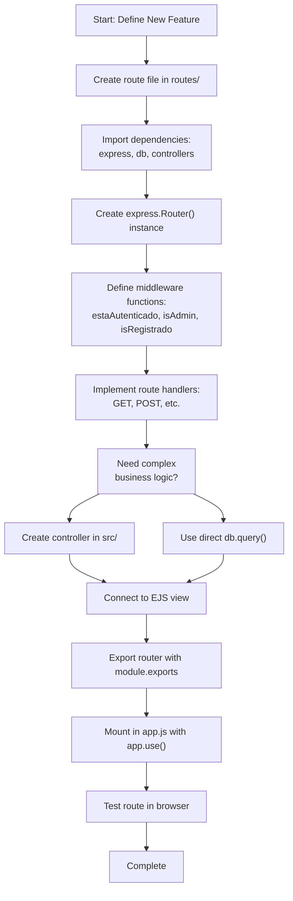
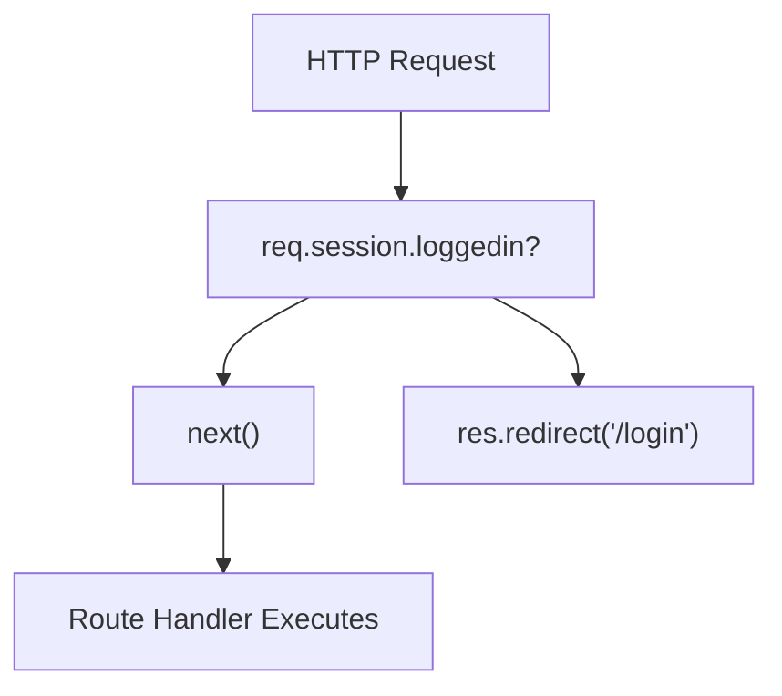
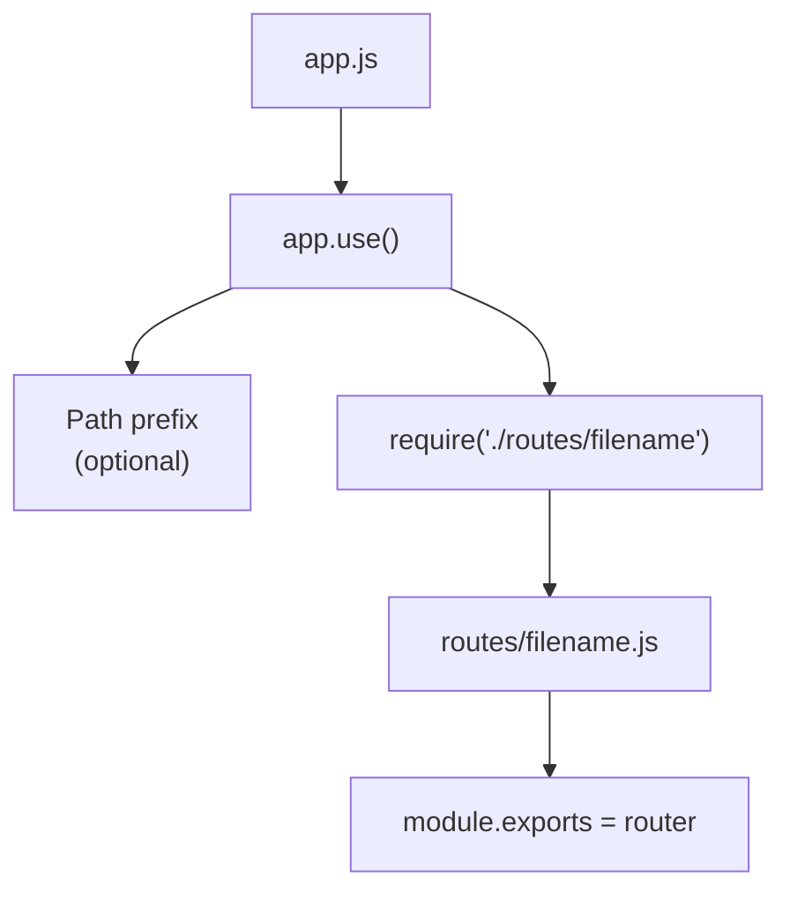

# Adding New Routes

> **Relevant source files**
> * [app.js](https://github.com/Lourdes12587/Week06/blob/ce0c3bcd/app.js)
> * [routes/courses.js](https://github.com/Lourdes12587/Week06/blob/ce0c3bcd/routes/courses.js)
> * [src/controller.js](https://github.com/Lourdes12587/Week06/blob/ce0c3bcd/src/controller.js)

This document provides a step-by-step guide for extending the application with new routes. It covers route file creation, middleware application, controller integration, view rendering, and router mounting in the Express application.

For information about existing route endpoints and their specifications, see [API Reference](/Lourdes12587/Week06/8-api-reference). For database operation patterns used in route handlers, see [Database Operations](/Lourdes12587/Week06/9.3-database-operations). For security considerations when implementing routes, see [Security Considerations](/Lourdes12587/Week06/9.4-security-considerations).

---

## Purpose and Scope

This page covers the technical process of adding new HTTP endpoints to the application. You will learn how to create route modules, apply authentication/authorization middleware, integrate database operations through controllers, and properly mount routes in the Express server. The examples reference the existing routing patterns found in `routes/courses.js` and `routes/auth.js`.

Sources: [routes/courses.js L1-L187](https://github.com/Lourdes12587/Week06/blob/ce0c3bcd/routes/courses.js#L1-L187)

 [app.js L1-L41](https://github.com/Lourdes12587/Week06/blob/ce0c3bcd/app.js#L1-L41)

---

## Route Creation Workflow

The following diagram illustrates the complete workflow for adding a new route to the system:



**Workflow Stages**:

1. **File Creation**: Create a new `.js` file in the `routes/` directory
2. **Dependency Setup**: Import required modules (`express`, database connection, controllers)
3. **Router Initialization**: Create an Express router instance
4. **Middleware Definition**: Implement or reuse authentication/authorization functions
5. **Route Implementation**: Define HTTP method handlers with appropriate logic
6. **Controller Integration**: Create separate controller functions for complex operations
7. **View Connection**: Link routes to EJS templates for rendering
8. **Router Mounting**: Register the router in `app.js`

Sources: [routes/courses.js L1-L187](https://github.com/Lourdes12587/Week06/blob/ce0c3bcd/routes/courses.js#L1-L187)

 [app.js L28-L31](https://github.com/Lourdes12587/Week06/blob/ce0c3bcd/app.js#L28-L31)

---

## Step 1: Create a Route File

All route modules are stored in the `routes/` directory. Create a new file following this basic structure:

### Route File Template Structure

```

```

### Key Components

| Component | Purpose | Example |
| --- | --- | --- |
| `express.Router()` | Creates isolated routing instance | `const router = express.Router();` |
| `db` import | Provides database connection | `const db = require("../config/db");` |
| Controller import | Accesses business logic functions | `const controller = require("../src/controller");` |
| Middleware functions | Implements access control | `estaAutenticado`, `isAdmin`, `isRegistrado` |
| Route handlers | Defines endpoint behavior | `router.get()`, `router.post()` |
| Module export | Makes router available to app | `module.exports = router;` |

Sources: [routes/courses.js L1-L7](https://github.com/Lourdes12587/Week06/blob/ce0c3bcd/routes/courses.js#L1-L7)

 [routes/courses.js L187](https://github.com/Lourdes12587/Week06/blob/ce0c3bcd/routes/courses.js#L187-L187)

---

## Step 2: Define Middleware Functions

The system uses middleware functions for authentication and authorization. These can be defined locally in your route file or extracted to a shared middleware module.

### Authentication Middleware Pattern



**estaAutenticado Middleware**: Verifies user is logged in

Implementation pattern from [routes/courses.js L8-L14](https://github.com/Lourdes12587/Week06/blob/ce0c3bcd/routes/courses.js#L8-L14)

:

* Checks `req.session.loggedin` property
* Calls `next()` if authenticated
* Redirects to `/login` if not authenticated

**isAdmin Middleware**: Restricts access to administrators

Implementation pattern from [routes/courses.js L16-L24](https://github.com/Lourdes12587/Week06/blob/ce0c3bcd/routes/courses.js#L16-L24)

:

* Verifies `req.session.loggedin` is true
* Checks `req.session.rol === 'admin'`
* Redirects to `/login` if unauthorized

**isRegistrado Middleware**: Restricts access to registered users

Implementation pattern from [routes/courses.js L26-L33](https://github.com/Lourdes12587/Week06/blob/ce0c3bcd/routes/courses.js#L26-L33)

:

* Verifies `req.session.loggedin` is true
* Checks `req.session.rol === 'registrado'`
* Redirects to `/login` if unauthorized

### Middleware Chain Application

Middleware functions are applied as arguments before the route handler:

```

```

The middleware chain executes left-to-right. Each must call `next()` for the chain to continue.

Sources: [routes/courses.js L8-L33](https://github.com/Lourdes12587/Week06/blob/ce0c3bcd/routes/courses.js#L8-L33)

 [routes/courses.js L64](https://github.com/Lourdes12587/Week06/blob/ce0c3bcd/routes/courses.js#L64-L64)

 [routes/courses.js L70](https://github.com/Lourdes12587/Week06/blob/ce0c3bcd/routes/courses.js#L70-L70)

---

## Step 3: Implement Route Handlers

Route handlers process HTTP requests and generate responses. The system uses two primary patterns: inline handlers and controller functions.

### Inline Handler Pattern

Used for simple operations like rendering views or straightforward database queries:

```

```

Example from [routes/courses.js L73-L84](https://github.com/Lourdes12587/Week06/blob/ce0c3bcd/routes/courses.js#L73-L84)

**Key aspects**:

* Route parameters accessed via `req.params`
* Query parameters via `req.query`
* Request body via `req.body`
* Database queries use parameterized statements (`?` placeholders)
* Views rendered with `res.render(viewName, dataObject)`

### Controller Function Pattern

Used for complex business logic or reusable operations:

```

```

Examples from [routes/courses.js L70](https://github.com/Lourdes12587/Week06/blob/ce0c3bcd/routes/courses.js#L70-L70)

 [routes/courses.js L103](https://github.com/Lourdes12587/Week06/blob/ce0c3bcd/routes/courses.js#L103-L103)

 [src/controller.js L4-L25](https://github.com/Lourdes12587/Week06/blob/ce0c3bcd/src/controller.js#L4-L25)

### Route Handler Response Types

| Response Method | Usage | Example |
| --- | --- | --- |
| `res.render()` | Render EJS template | `res.render('courses', { cursos: results })` |
| `res.redirect()` | Redirect to another route | `res.redirect('/courses')` |
| `res.json()` | Send JSON response | `res.json({ success: true })` |
| `res.status().send()` | Send status with message | `res.status(403).send('Access denied')` |

Sources: [routes/courses.js L35-L62](https://github.com/Lourdes12587/Week06/blob/ce0c3bcd/routes/courses.js#L35-L62)

 [routes/courses.js L87-L98](https://github.com/Lourdes12587/Week06/blob/ce0c3bcd/routes/courses.js#L87-L98)

 [src/controller.js L1-L53](https://github.com/Lourdes12587/Week06/blob/ce0c3bcd/src/controller.js#L1-L53)

---

## Step 4: Mount Router in app.js

After creating your route file, register it with the Express application in `app.js`.

### Router Mounting Syntax



**Current Route Mounting**: [app.js L28-L31](https://github.com/Lourdes12587/Week06/blob/ce0c3bcd/app.js#L28-L31)

```

```

### Adding a New Router

To add a new route module:

1. Place it in the `routes/` directory: `routes/newfeature.js`
2. Add mounting statement in `app.js` after middleware setup but before server starts:

```

```

### Path Prefix Considerations

The first argument to `app.use()` defines a base path:

| Mount Pattern | Route in File | Final URL |
| --- | --- | --- |
| `app.use("/", router)` | `router.get('/courses')` | `/courses` |
| `app.use("/api", router)` | `router.get('/courses')` | `/api/courses` |
| `app.use("/admin", router)` | `router.get('/dashboard')` | `/admin/dashboard` |

All routes in the current system use the root prefix `"/"` as shown in [app.js L29-L31](https://github.com/Lourdes12587/Week06/blob/ce0c3bcd/app.js#L29-L31)

Sources: [app.js L28-L31](https://github.com/Lourdes12587/Week06/blob/ce0c3bcd/app.js#L28-L31)

---

## Step 5: Connect Views

Route handlers typically render EJS templates located in the `views/` directory. The connection between routes and views follows specific patterns.

### View Rendering Data Flow

```

```

### Rendering Pattern Examples

**List View with Data**:

```

```

From [routes/courses.js L35-L62](https://github.com/Lourdes12587/Week06/blob/ce0c3bcd/routes/courses.js#L35-L62)

**Form View with Pre-populated Data**:

```

```

From [routes/courses.js L73-L84](https://github.com/Lourdes12587/Week06/blob/ce0c3bcd/routes/courses.js#L73-L84)

**Simple View Render**:

```

```

From [routes/courses.js L64-L66](https://github.com/Lourdes12587/Week06/blob/ce0c3bcd/routes/courses.js#L64-L66)

### Common Data Passed to Views

| Variable | Purpose | Source | Example |
| --- | --- | --- | --- |
| `login` | Authentication status | `req.session.loggedin` | `true` or `false` |
| `rol` | User role | `req.session.rol` | `'publico'`, `'registrado'`, `'admin'` |
| `usuario` | User object | `req.session.usuario` | `{ id, nombre, email }` |
| Data arrays | Database results | Query results | `cursos: results` |
| Single records | Specific entity | Query result | `curso: results[0]` |

Sources: [routes/courses.js L44-L61](https://github.com/Lourdes12587/Week06/blob/ce0c3bcd/routes/courses.js#L44-L61)

 [routes/courses.js L73-L84](https://github.com/Lourdes12587/Week06/blob/ce0c3bcd/routes/courses.js#L73-L84)

 [routes/courses.js L152-L169](https://github.com/Lourdes12587/Week06/blob/ce0c3bcd/routes/courses.js#L152-L169)

---

## Route Types and Patterns

The system implements several distinct route patterns based on functionality.

### Pattern 1: Read Operations (GET Routes)

```

```

**Characteristics**:

* Use `router.get()`
* Query database for information
* Render EJS templates
* Pass data to views

**Examples**: [routes/courses.js L35-L62](https://github.com/Lourdes12587/Week06/blob/ce0c3bcd/routes/courses.js#L35-L62)

 [routes/courses.js L73-L84](https://github.com/Lourdes12587/Week06/blob/ce0c3bcd/routes/courses.js#L73-L84)

 [routes/courses.js L106-L114](https://github.com/Lourdes12587/Week06/blob/ce0c3bcd/routes/courses.js#L106-L114)

### Pattern 2: Write Operations (POST Routes)

```

```

**Characteristics**:

* Use `router.post()`
* Extract data from `req.body`
* Perform database modifications
* Redirect after success (Post-Redirect-Get pattern)

**Examples**: [routes/courses.js L70](https://github.com/Lourdes12587/Week06/blob/ce0c3bcd/routes/courses.js#L70-L70)

 [routes/courses.js L103](https://github.com/Lourdes12587/Week06/blob/ce0c3bcd/routes/courses.js#L103-L103)

 [routes/courses.js L117-L149](https://github.com/Lourdes12587/Week06/blob/ce0c3bcd/routes/courses.js#L117-L149)

### Pattern 3: Two-Step Confirmation

Used for critical operations requiring user confirmation:

```

```

From [routes/courses.js L106-L149](https://github.com/Lourdes12587/Week06/blob/ce0c3bcd/routes/courses.js#L106-L149)

### Pattern 4: Delete Operations

Simple GET routes for deletions with immediate redirection:

```

```

From [routes/courses.js L87-L98](https://github.com/Lourdes12587/Week06/blob/ce0c3bcd/routes/courses.js#L87-L98)

Sources: [routes/courses.js L35-L187](https://github.com/Lourdes12587/Week06/blob/ce0c3bcd/routes/courses.js#L35-L187)

---

## Best Practices from Codebase

### 1. Always Use Parameterized Queries

**Correct** (prevents SQL injection):

```

```

From [routes/courses.js L77](https://github.com/Lourdes12587/Week06/blob/ce0c3bcd/routes/courses.js#L77-L77)

 [src/controller.js L10](https://github.com/Lourdes12587/Week06/blob/ce0c3bcd/src/controller.js#L10-L10)

### 2. Apply Middleware in Correct Order

```

```

The `estaAutenticado` middleware must execute before role-checking middleware because role-checking depends on session data.

### 3. Handle Database Errors

```

```

From [routes/courses.js L44-L54](https://github.com/Lourdes12587/Week06/blob/ce0c3bcd/routes/courses.js#L44-L54)

 [routes/courses.js L77-L83](https://github.com/Lourdes12587/Week06/blob/ce0c3bcd/routes/courses.js#L77-L83)

### 4. Use Post-Redirect-Get Pattern

After POST requests that modify data, redirect to a GET route:

```

```

From [src/controller.js L16-L23](https://github.com/Lourdes12587/Week06/blob/ce0c3bcd/src/controller.js#L16-L23)

### 5. Extract Complex Logic to Controllers

If a route handler exceeds 20 lines or contains reusable logic, move it to a controller:

**In route file**:

```

```

**In controller file**:

```

```

From [routes/courses.js L70](https://github.com/Lourdes12587/Week06/blob/ce0c3bcd/routes/courses.js#L70-L70)

 [src/controller.js L4-L25](https://github.com/Lourdes12587/Week06/blob/ce0c3bcd/src/controller.js#L4-L25)

### 6. Consistent Session Data Access

```

```

From [routes/courses.js L36](https://github.com/Lourdes12587/Week06/blob/ce0c3bcd/routes/courses.js#L36-L36)

 [routes/courses.js L49-L51](https://github.com/Lourdes12587/Week06/blob/ce0c3bcd/routes/courses.js#L49-L51)

Sources: [routes/courses.js L1-L187](https://github.com/Lourdes12587/Week06/blob/ce0c3bcd/routes/courses.js#L1-L187)

 [src/controller.js L1-L53](https://github.com/Lourdes12587/Week06/blob/ce0c3bcd/src/controller.js#L1-L53)

---

## Complete Example: Adding a New Feature

This example demonstrates adding a "comments" feature to the system.

### Step-by-Step Implementation

**1. Create route file**: `routes/comments.js`

```

```

**2. Mount in app.js**:

```

```

**3. Create view**: `views/comentarios.ejs`

The view would display comments and include a form for authenticated users.

### Implementation Checklist

| Step | Verification |
| --- | --- |
| ✓ Route file created in `routes/` | File exists with proper structure |
| ✓ Dependencies imported | `express`, `db`, controllers |
| ✓ Router instance created | `const router = express.Router()` |
| ✓ Middleware defined | Authentication/authorization functions |
| ✓ Routes implemented | GET and POST handlers |
| ✓ Database queries use `?` placeholders | SQL injection protection |
| ✓ Error handling included | Check for errors in callbacks |
| ✓ Router exported | `module.exports = router` |
| ✓ Mounted in app.js | `app.use()` statement added |
| ✓ Views created | EJS templates in `views/` |
| ✓ Routes tested | Manual browser testing |

Sources: [routes/courses.js L1-L187](https://github.com/Lourdes12587/Week06/blob/ce0c3bcd/routes/courses.js#L1-L187)

 [app.js L28-L31](https://github.com/Lourdes12587/Week06/blob/ce0c3bcd/app.js#L28-L31)

---

## Related Pages

* [Routing System](/Lourdes12587/Week06/3.4-routing-system) - Overview of the modular routing architecture
* [API Reference](/Lourdes12587/Week06/8-api-reference) - Complete endpoint documentation
* [Database Operations](/Lourdes12587/Week06/9.3-database-operations) - Database query patterns and best practices
* [Security Considerations](/Lourdes12587/Week06/9.4-security-considerations) - Authentication and input validation
* [Frontend Architecture](/Lourdes12587/Week06/7-frontend-architecture) - Creating and connecting EJS views