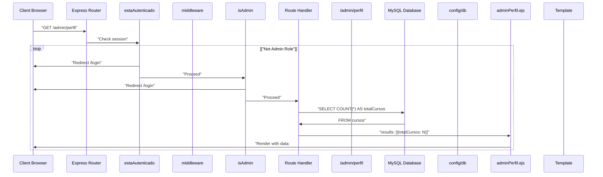
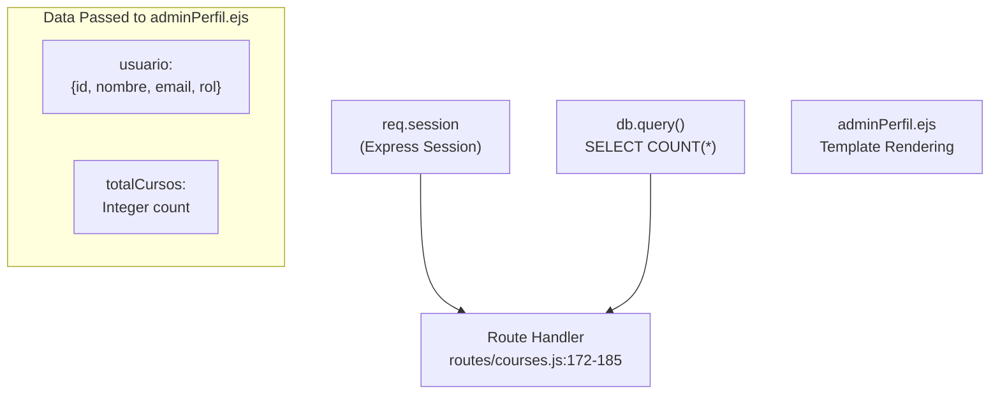
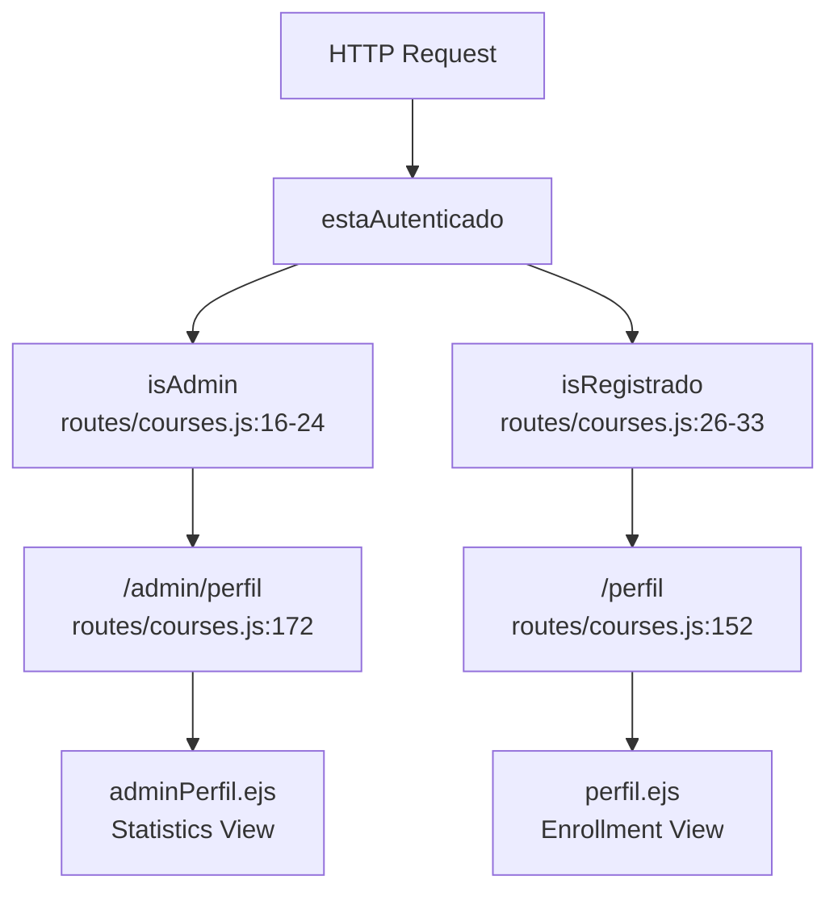
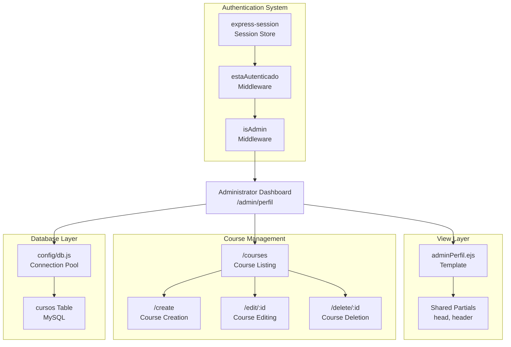

# Administrator Dashboard

> **Relevant source files**
> * [routes/courses.js](https://github.com/Lourdes12587/Week06/blob/ce0c3bcd/routes/courses.js)
> * [views/adminperfil.ejs](https://github.com/Lourdes12587/Week06/blob/ce0c3bcd/views/adminperfil.ejs)

## Purpose and Scope

This document details the administrator dashboard, a specialized profile page exclusive to users with the `admin` role. The dashboard provides system-wide statistics and quick navigation to course management functions.

For information about the regular user profile page, see [User Profile Page](/Lourdes12587/Week06/6.1-user-profile-page). For details on role-based access control implementation, see [Role-Based Access Control](/Lourdes12587/Week06/4.3-role-based-access-control).

**Sources:** [routes/courses.js L172-L185](https://github.com/Lourdes12587/Week06/blob/ce0c3bcd/routes/courses.js#L172-L185)

 [views/adminperfil.ejs L1-L29](https://github.com/Lourdes12587/Week06/blob/ce0c3bcd/views/adminperfil.ejs#L1-L29)

---

## Route Definition and Access Control

The administrator dashboard is accessible at the `/admin/perfil` endpoint and is protected by a two-layer authentication middleware stack.

### Endpoint Specification

| Property | Value |
| --- | --- |
| HTTP Method | GET |
| Route Path | `/admin/perfil` |
| Middleware Chain | `estaAutenticado`, `isAdmin` |
| Controller Function | Inline handler |
| View Template | `adminPerfil.ejs` |

### Middleware Stack

The route employs two authentication middleware functions executed in sequence:

1. **`estaAutenticado`** [routes/courses.js L8-L14](https://github.com/Lourdes12587/Week06/blob/ce0c3bcd/routes/courses.js#L8-L14)  - Verifies that a user session exists and the user is logged in. Redirects to `/login` if authentication fails.
2. **`isAdmin`** [routes/courses.js L16-L24](https://github.com/Lourdes12587/Week06/blob/ce0c3bcd/routes/courses.js#L16-L24)  - Validates that the authenticated user has the `admin` role. Redirects to `/login` if the user does not have administrator privileges.

**Sources:** [routes/courses.js L172](https://github.com/Lourdes12587/Week06/blob/ce0c3bcd/routes/courses.js#L172-L172)

 [routes/courses.js L8-L24](https://github.com/Lourdes12587/Week06/blob/ce0c3bcd/routes/courses.js#L8-L24)

---

## Request Processing Flow

The following diagram illustrates the complete request flow from client browser to rendered dashboard, including middleware checks and database queries.

### Diagram: Administrator Dashboard Request Flow



**Sources:** [routes/courses.js L172-L185](https://github.com/Lourdes12587/Week06/blob/ce0c3bcd/routes/courses.js#L172-L185)

 [routes/courses.js L8-L24](https://github.com/Lourdes12587/Week06/blob/ce0c3bcd/routes/courses.js#L8-L24)

---

## Statistics Retrieval

The dashboard executes a database query to retrieve system-wide course statistics for display to the administrator.

### Query Execution

The route handler executes the following SQL query:

```sql
SELECT COUNT(*) AS totalCursos FROM cursos
```

This query returns the total number of courses in the system, regardless of visibility status or enrollment count.

### Database Operation Details

| Aspect | Implementation |
| --- | --- |
| Query Type | `SELECT COUNT(*)` aggregate function |
| Table | `cursos` |
| Result Alias | `totalCursos` |
| Error Handling | Logs error to console, renders with `totalCursos: 0` as fallback |
| Connection | Uses connection pool from `config/db` module |

The query result is extracted from the first row of the results array: `results[0].totalCursos` [routes/courses.js L182](https://github.com/Lourdes12587/Week06/blob/ce0c3bcd/routes/courses.js#L182-L182)

**Sources:** [routes/courses.js L176-L182](https://github.com/Lourdes12587/Week06/blob/ce0c3bcd/routes/courses.js#L176-L182)

---

## View Rendering and Data Transfer

The dashboard view receives two data objects from the route handler.

### Data Flow Diagram



### Template Data Object

The `res.render()` call passes the following data structure:

```python
{
  usuario: req.session.usuario,  // User object from session
  totalCursos: results[0].totalCursos  // Course count from query
}
```

**Properties:**

* **`usuario`** - Contains the administrator's user object from the session, including `id`, `nombre`, `email`, and `rol` properties
* **`totalCursos`** - Integer representing the total number of courses in the database

**Sources:** [routes/courses.js L173-L183](https://github.com/Lourdes12587/Week06/blob/ce0c3bcd/routes/courses.js#L173-L183)

---

## User Interface Components

The dashboard template renders a simple administrative interface with system statistics and navigation controls.

### Template Structure

The template follows the standard application layout pattern:

1. **Partial Includes** [views/adminperfil.ejs L1-L3](https://github.com/Lourdes12587/Week06/blob/ce0c3bcd/views/adminperfil.ejs#L1-L3)  - Includes `partials/head` and `partials/header` for consistent page structure
2. **Welcome Section** [views/adminperfil.ejs L6](https://github.com/Lourdes12587/Week06/blob/ce0c3bcd/views/adminperfil.ejs#L6-L6)  - Personalized greeting with administrator name
3. **Statistics Display** [views/adminperfil.ejs L8](https://github.com/Lourdes12587/Week06/blob/ce0c3bcd/views/adminperfil.ejs#L8-L8)  - Course count metric
4. **Navigation Menu** [views/adminperfil.ejs L10-L21](https://github.com/Lourdes12587/Week06/blob/ce0c3bcd/views/adminperfil.ejs#L10-L21)  - Primary navigation controls

### UI Element Reference

| Element | Location | Description |
| --- | --- | --- |
| Page Title | Line 6 | Displays "Bienvenido, {nombre} (Administrador)" |
| Course Count | Line 8 | Shows "Total de cursos en el sistema: {totalCursos}" |
| Navigation Bar | Lines 10-21 | Contains logo and navigation links |
| Hamburger Menu | Lines 12-16 | Mobile-responsive menu toggle button |
| Course Management Link | Line 18 | Links to `/courses` for course administration |
| Home Link | Line 19 | Links to `/` for application home page |

### Responsive Navigation

The template includes JavaScript for mobile menu functionality [views/adminperfil.ejs L23-L27](https://github.com/Lourdes12587/Week06/blob/ce0c3bcd/views/adminperfil.ejs#L23-L27)

:

```javascript
function toggleMenu() {
  document.getElementById('navLinks').classList.toggle('active');
}
```

This function toggles the `active` class on the navigation links container, enabling responsive menu behavior on mobile devices.

**Sources:** [views/adminperfil.ejs L1-L29](https://github.com/Lourdes12587/Week06/blob/ce0c3bcd/views/adminperfil.ejs#L1-L29)

---

## Navigation and Administrative Actions

The dashboard serves as a central hub for administrative tasks, providing direct navigation to key management interfaces.

### Navigation Links

| Link Text | Target URL | Purpose |
| --- | --- | --- |
| Gestionar Cursos | `/courses` | Access course listing with admin privileges (create, edit, delete) |
| Inicio | `/` | Return to application landing page |

### Administrative Workflows

From the dashboard, administrators can navigate to the following management functions:

1. **Course Management** [routes/courses.js L35-L62](https://github.com/Lourdes12587/Week06/blob/ce0c3bcd/routes/courses.js#L35-L62)  - View all courses in the system
2. **Course Creation** [routes/courses.js L64-L70](https://github.com/Lourdes12587/Week06/blob/ce0c3bcd/routes/courses.js#L64-L70)  - Create new courses via `/create`
3. **Course Editing** [routes/courses.js L73-L84](https://github.com/Lourdes12587/Week06/blob/ce0c3bcd/routes/courses.js#L73-L84)  - Modify existing courses via `/edit/:id`
4. **Course Deletion** [routes/courses.js L87-L98](https://github.com/Lourdes12587/Week06/blob/ce0c3bcd/routes/courses.js#L87-L98)  - Remove courses via `/delete/:id`

All course management routes are protected by the same `estaAutenticado` and `isAdmin` middleware stack.

**Sources:** [views/adminperfil.ejs L18-L19](https://github.com/Lourdes12587/Week06/blob/ce0c3bcd/views/adminperfil.ejs#L18-L19)

 [routes/courses.js L64-L104](https://github.com/Lourdes12587/Week06/blob/ce0c3bcd/routes/courses.js#L64-L104)

---

## Comparison with Regular User Profile

The following table highlights the differences between the administrator dashboard and the regular user profile page:

| Feature | Administrator Dashboard | User Profile |
| --- | --- | --- |
| Route | `/admin/perfil` | `/perfil` |
| Role Requirement | `admin` | `registrado` |
| Middleware | `isAdmin` | `isRegistrado` |
| Primary Data | System statistics | Enrolled courses list |
| Database Query | `SELECT COUNT(*) FROM cursos` | `SELECT c.* FROM cursos c JOIN inscripciones...` |
| Navigation Links | Course management | Course enrollment |
| Purpose | System administration | Personal enrollment tracking |

### Route Middleware Comparison Diagram



**Sources:** [routes/courses.js L152-L185](https://github.com/Lourdes12587/Week06/blob/ce0c3bcd/routes/courses.js#L152-L185)

 [routes/courses.js L16-L33](https://github.com/Lourdes12587/Week06/blob/ce0c3bcd/routes/courses.js#L16-L33)

---

## Error Handling

The route implements basic error handling for database query failures.

### Error Flow

When the database query fails:

1. Error is logged to console: `console.error(err)` [routes/courses.js L178](https://github.com/Lourdes12587/Week06/blob/ce0c3bcd/routes/courses.js#L178-L178)
2. View is rendered with fallback data: `totalCursos: 0` [routes/courses.js L179](https://github.com/Lourdes12587/Week06/blob/ce0c3bcd/routes/courses.js#L179-L179)
3. User sees dashboard with zero course count instead of application crash

This graceful degradation ensures the administrator can still access the dashboard interface even if statistics cannot be retrieved.

**Sources:** [routes/courses.js L177-L180](https://github.com/Lourdes12587/Week06/blob/ce0c3bcd/routes/courses.js#L177-L180)

---

## Session Data Requirements

The dashboard relies on session data populated during the login process.

### Required Session Properties

The route handler expects the following session structure:

```yaml
req.session = {
  loggedin: true,
  rol: 'admin',
  usuario: {
    id: Number,
    nombre: String,
    email: String,
    rol: 'admin'
  }
}
```

These properties are set by the authentication system during login. See [User Login](/Lourdes12587/Week06/4.2-user-login) for session initialization details.

**Sources:** [routes/courses.js L173](https://github.com/Lourdes12587/Week06/blob/ce0c3bcd/routes/courses.js#L173-L173)

 [routes/courses.js L8-L24](https://github.com/Lourdes12587/Week06/blob/ce0c3bcd/routes/courses.js#L8-L24)

---

## Integration Points

The administrator dashboard integrates with the following system components:

### Component Integration Map



**Sources:** [routes/courses.js L172-L185](https://github.com/Lourdes12587/Week06/blob/ce0c3bcd/routes/courses.js#L172-L185)

 [views/adminperfil.ejs L1-L29](https://github.com/Lourdes12587/Week06/blob/ce0c3bcd/views/adminperfil.ejs#L1-L29)