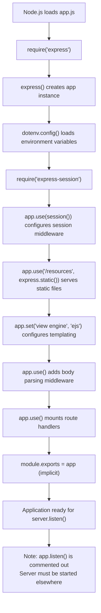
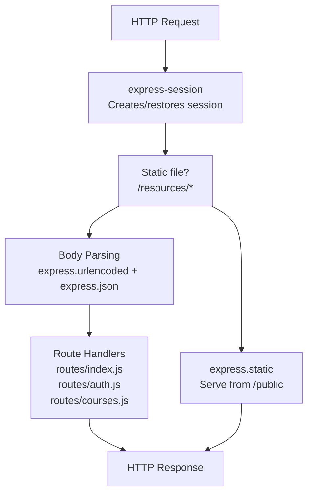
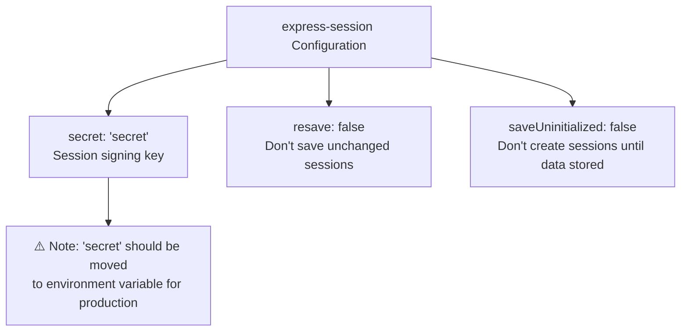
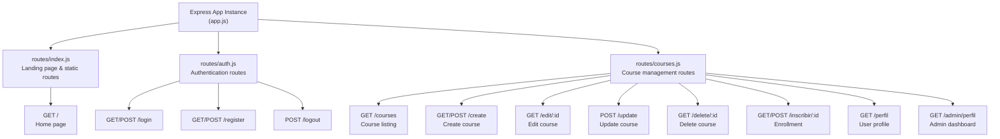
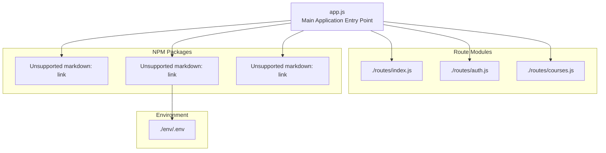
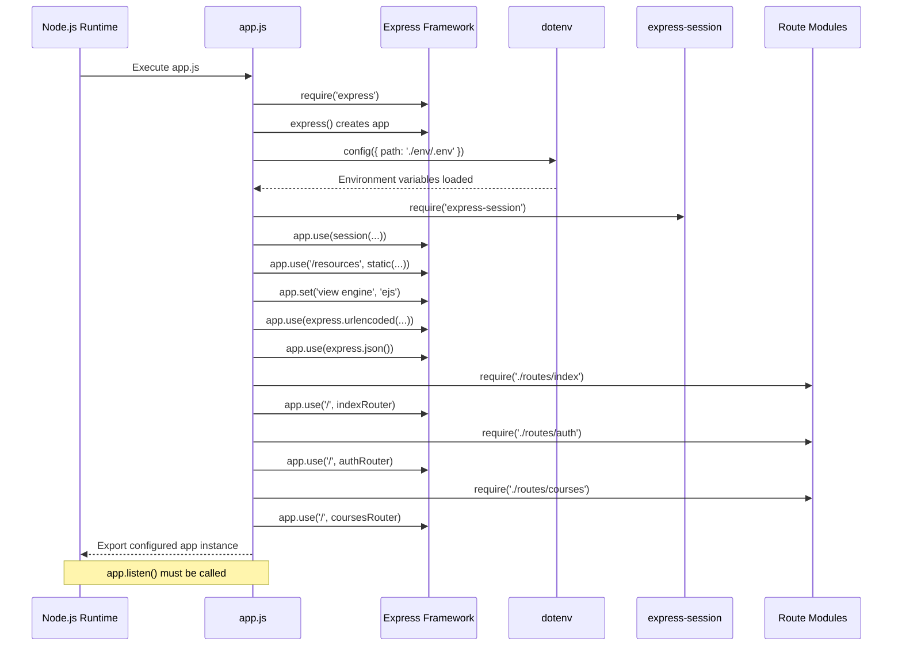

# Application Entry Point

> **Relevant source files**
> * [app.js](https://github.com/Lourdes12587/Week06/blob/ce0c3bcd/app.js)
> * [package.json](https://github.com/Lourdes12587/Week06/blob/ce0c3bcd/package.json)

## Purpose and Scope

This document describes `app.js`, the main entry point and server initialization file for the course management application. It covers the Express application configuration, middleware pipeline setup, session management initialization, static file serving, view engine configuration, and route mounting.

For detailed information about individual routes and their handlers, see [Routing System](/Lourdes12587/Week06/3.4-routing-system). For authentication middleware implementation, see [Authentication & Authorization](/Lourdes12587/Week06/4-authentication-and-authorization). For database connection setup, see [Database Architecture](/Lourdes12587/Week06/3.3-database-architecture).

---

## Overview

The `app.js` file serves as the central configuration hub for the Express.js application. It initializes the Express server, configures the middleware pipeline, establishes session management, sets up the view engine, and mounts all route handlers. However, it notably does **not** start the HTTP server itself (the `app.listen()` call is commented out at [app.js L15-L17](https://github.com/Lourdes12587/Week06/blob/ce0c3bcd/app.js#L15-L17)

).

**Sources:** [app.js L1-L41](https://github.com/Lourdes12587/Week06/blob/ce0c3bcd/app.js#L1-L41)

---

## Application Initialization Sequence

The following diagram illustrates the initialization sequence when `app.js` is loaded:



**Initialization Steps:**

1. **Express Framework Import** ([app.js L1-L2](https://github.com/Lourdes12587/Week06/blob/ce0c3bcd/app.js#L1-L2) ): Imports Express and instantiates the application object
2. **Environment Configuration** ([app.js L3](https://github.com/Lourdes12587/Week06/blob/ce0c3bcd/app.js#L3-L3) ): Loads environment variables from `./env/.env` using dotenv
3. **Session Middleware** ([app.js L4-L13](https://github.com/Lourdes12587/Week06/blob/ce0c3bcd/app.js#L4-L13) ): Configures express-session for user session management
4. **Static File Serving** ([app.js L19](https://github.com/Lourdes12587/Week06/blob/ce0c3bcd/app.js#L19-L19) ): Mounts static file middleware for the `/public` directory
5. **View Engine Setup** ([app.js L21](https://github.com/Lourdes12587/Week06/blob/ce0c3bcd/app.js#L21-L21) ): Configures EJS as the templating engine
6. **Body Parsing** ([app.js L25-L26](https://github.com/Lourdes12587/Week06/blob/ce0c3bcd/app.js#L25-L26) ): Enables URL-encoded and JSON body parsing
7. **Route Mounting** ([app.js L29-L31](https://github.com/Lourdes12587/Week06/blob/ce0c3bcd/app.js#L29-L31) ): Mounts three route handler modules

**Sources:** [app.js L1-L31](https://github.com/Lourdes12587/Week06/blob/ce0c3bcd/app.js#L1-L31)

 [package.json L5-L8](https://github.com/Lourdes12587/Week06/blob/ce0c3bcd/package.json#L5-L8)

---

## Middleware Pipeline

The middleware pipeline processes every incoming HTTP request in a specific order. The sequence is critical for proper application functionality:



### Middleware Configuration Details

| Middleware | Purpose | Configuration | Source |
| --- | --- | --- | --- |
| `express-session` | Session management | Secret: "secret"resave: falsesaveUninitialized: false | [app.js L6-L13](https://github.com/Lourdes12587/Week06/blob/ce0c3bcd/app.js#L6-L13) |
| `express.static` | Static file serving | Mount point: `/resources`Directory: `/public` | [app.js L19](https://github.com/Lourdes12587/Week06/blob/ce0c3bcd/app.js#L19-L19) |
| `express.urlencoded` | Parse URL-encoded bodies | extended: true | [app.js L25](https://github.com/Lourdes12587/Week06/blob/ce0c3bcd/app.js#L25-L25) |
| `express.json` | Parse JSON bodies | Default configuration | [app.js L26](https://github.com/Lourdes12587/Week06/blob/ce0c3bcd/app.js#L26-L26) |

**Sources:** [app.js L6-L26](https://github.com/Lourdes12587/Week06/blob/ce0c3bcd/app.js#L6-L26)

---

## Session Configuration

Session management is configured using `express-session` with the following settings:



**Configuration Properties:**

* **secret** ([app.js L8](https://github.com/Lourdes12587/Week06/blob/ce0c3bcd/app.js#L8-L8) ): Set to hardcoded string `"secret"`. This should ideally be loaded from environment variables for production security.
* **resave** ([app.js L9](https://github.com/Lourdes12587/Week06/blob/ce0c3bcd/app.js#L9-L9) ): Set to `false` to prevent unnecessary session saves when session data hasn't changed.
* **saveUninitialized** ([app.js L10](https://github.com/Lourdes12587/Week06/blob/ce0c3bcd/app.js#L10-L10) ): Set to `false` to prevent creating session cookies for unauthenticated users.

**Security Note:** The session secret is currently hardcoded. For production deployments, this should be moved to an environment variable (e.g., `process.env.SESSION_SECRET`).

**Sources:** [app.js L4-L13](https://github.com/Lourdes12587/Week06/blob/ce0c3bcd/app.js#L4-L13)

---

## Static File Serving

Static assets (CSS, images, JavaScript) are served through Express's built-in static file middleware:

```
app.use("/resources", express.static(__dirname + "/public"));
```

**Configuration Details:**

| Property | Value | Description |
| --- | --- | --- |
| **URL Path** | `/resources` | Client-side URL prefix for static files |
| **File System Path** | `__dirname + "/public"` | Server-side directory containing static files |
| **Example Mapping** | `/resources/css/style.css` → `/public/css/style.css` | URL to file system translation |

This means that a file at `/public/css/index.css` is accessible in the browser at `http://localhost:PORT/resources/css/index.css`.

**Sources:** [app.js L19](https://github.com/Lourdes12587/Week06/blob/ce0c3bcd/app.js#L19-L19)

---

## View Engine Configuration

The application uses EJS (Embedded JavaScript) as its templating engine:

```
app.set('view engine', 'ejs');
```

**EJS Configuration:**

* **Template Engine**: EJS version 3.1.10 (from [package.json L18](https://github.com/Lourdes12587/Week06/blob/ce0c3bcd/package.json#L18-L18) )
* **Views Directory**: Defaults to `./views/` (Express convention)
* **File Extension**: `.ejs` files are automatically recognized
* **Rendering**: Controllers call `res.render('templateName', data)` to render views

The commented-out line at [app.js L22](https://github.com/Lourdes12587/Week06/blob/ce0c3bcd/app.js#L22-L22)

 shows that the views directory was considered for explicit configuration, but the default is being used instead.

**Sources:** [app.js L21-L22](https://github.com/Lourdes12587/Week06/blob/ce0c3bcd/app.js#L21-L22)

 [package.json L18](https://github.com/Lourdes12587/Week06/blob/ce0c3bcd/package.json#L18-L18)

---

## Route Mounting

The application uses a modular routing architecture where route handlers are separated into distinct files and mounted onto the Express application:



**Route Mounting Code:**

```javascript
app.use("/", require("./routes/index"));     // Line 29
app.use("/", require("./routes/auth"));      // Line 30
app.use("/", require("./routes/courses"));   // Line 31
```

All three router modules are mounted at the root path (`"/"`). Each router module exports an Express Router instance that defines specific endpoints.

**Sources:** [app.js L29-L31](https://github.com/Lourdes12587/Week06/blob/ce0c3bcd/app.js#L29-L31)

---

## Commented Code Analysis

Several lines in `app.js` are commented out, indicating features that were considered or may be used in alternative configurations:

### Commented Server Listener

```javascript
// Lines 15-17 (commented)
//app.listen(4000, () => { 
//    console.log("Servidor corriendo en http://localhost:4000");
//});
```

**Analysis:** The HTTP server startup is commented out. This suggests either:

1. The server is started in a separate file (e.g., `server.js` or `index.js`)
2. The application is deployed using a process manager that handles server startup
3. The startup code was moved for testing purposes

### Commented Global Session Middleware

```javascript
// Lines 33-39 (commented)
//app.use((req, res, next) => {
//  res.locals.user = req.session?.usuario || null;
//  res.locals.rol = req.session?.rol || 'publico';
//  res.locals.login = !!req.session?.loggedin;
//  next();
//});
```

**Analysis:** This middleware would make session data globally available to all EJS templates via `res.locals`. It's currently disabled, which means:

* Views must explicitly receive session data through controller render calls
* Authentication state checking happens in individual route handlers
* Each route must manually pass user/role information to templates

**Sources:** [app.js L15-L17](https://github.com/Lourdes12587/Week06/blob/ce0c3bcd/app.js#L15-L17)

 [app.js L33-L39](https://github.com/Lourdes12587/Week06/blob/ce0c3bcd/app.js#L33-L39)

---

## Environment Variable Configuration

Environment variables are loaded using the `dotenv` package:

```javascript
require("dotenv").config({ path: "./env/.env" });
```

**Configuration Details:**

| Property | Value | Description |
| --- | --- | --- |
| **Package** | dotenv 17.2.1 | Environment variable loader |
| **Config Path** | `./env/.env` | Non-standard location (typically `.env` at root) |
| **Loading Time** | During app initialization | Before any middleware or routes are configured |

**Environment Variables Expected:**

* Database connection parameters (referenced in `config/db.js`)
* Potentially JWT secrets, API keys, etc.

The non-standard path `./env/.env` suggests the environment file is stored in a subdirectory rather than the project root.

**Sources:** [app.js L3](https://github.com/Lourdes12587/Week06/blob/ce0c3bcd/app.js#L3-L3)

 [package.json L17](https://github.com/Lourdes12587/Week06/blob/ce0c3bcd/package.json#L17-L17)

---

## Module Dependencies

The following diagram shows the direct dependencies imported by `app.js`:



**Direct Dependencies:**

1. **express** ([app.js L1](https://github.com/Lourdes12587/Week06/blob/ce0c3bcd/app.js#L1-L1) ): Core web framework
2. **dotenv** ([app.js L3](https://github.com/Lourdes12587/Week06/blob/ce0c3bcd/app.js#L3-L3) ): Environment configuration
3. **express-session** ([app.js L4](https://github.com/Lourdes12587/Week06/blob/ce0c3bcd/app.js#L4-L4) ): Session management
4. **./routes/index** ([app.js L29](https://github.com/Lourdes12587/Week06/blob/ce0c3bcd/app.js#L29-L29) ): Landing page routes
5. **./routes/auth** ([app.js L30](https://github.com/Lourdes12587/Week06/blob/ce0c3bcd/app.js#L30-L30) ): Authentication routes
6. **./routes/courses** ([app.js L31](https://github.com/Lourdes12587/Week06/blob/ce0c3bcd/app.js#L31-L31) ): Course management routes

**Indirect Dependencies** (used by route modules, not directly by `app.js`):

* bcryptjs (password hashing)
* jsonwebtoken (token generation)
* express-validator (input validation)
* mysql2 (database driver)

**Sources:** [app.js L1-L31](https://github.com/Lourdes12587/Week06/blob/ce0c3bcd/app.js#L1-L31)

 [package.json L13-L25](https://github.com/Lourdes12587/Week06/blob/ce0c3bcd/package.json#L13-L25)

---

## Execution Flow Summary

The complete execution flow when the application starts:



**Key Takeaways:**

1. **Synchronous Initialization**: All configuration is synchronous and completes during module load
2. **Middleware Order Matters**: Session management is configured before routes to ensure session availability
3. **Route Modularity**: Routes are separated into logical modules for maintainability
4. **No Server Start**: The configured app must be started by another module or script

**Sources:** [app.js L1-L41](https://github.com/Lourdes12587/Week06/blob/ce0c3bcd/app.js#L1-L41)

---

## Integration with Package.json

The `package.json` file defines `app.js` as the main entry point:

```json
{
  "main": "app.js",
  "scripts": {
    "start": "node app.js"
  }
}
```

This configuration means:

* Running `npm start` executes `node app.js`
* The application can be imported as a module if needed
* `app.js` is the conventional entry point for the application

**Sources:** [package.json L5-L8](https://github.com/Lourdes12587/Week06/blob/ce0c3bcd/package.json#L5-L8)