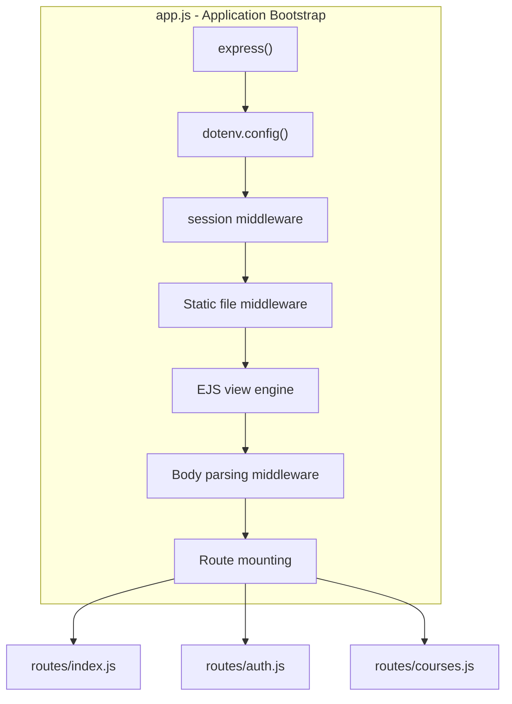
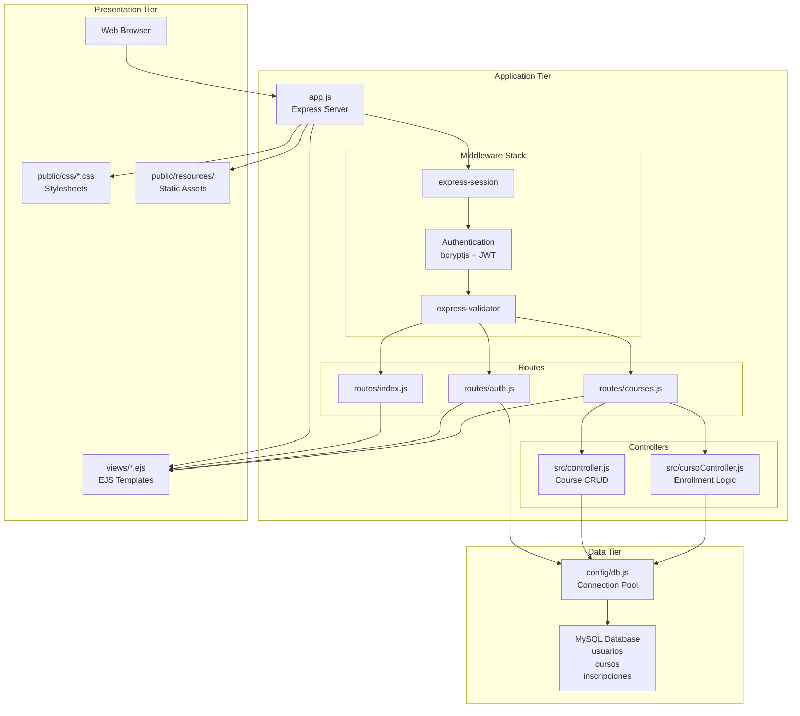
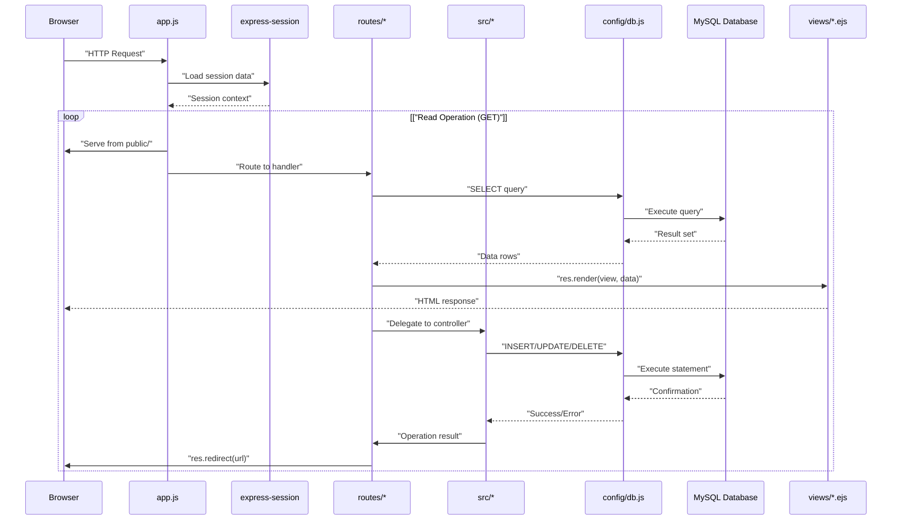
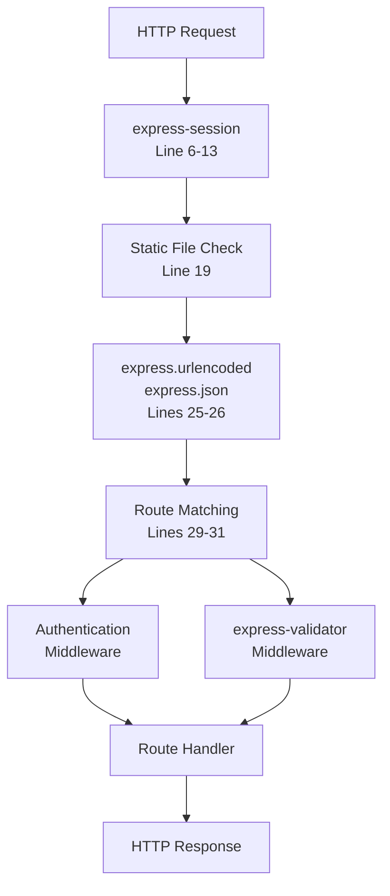
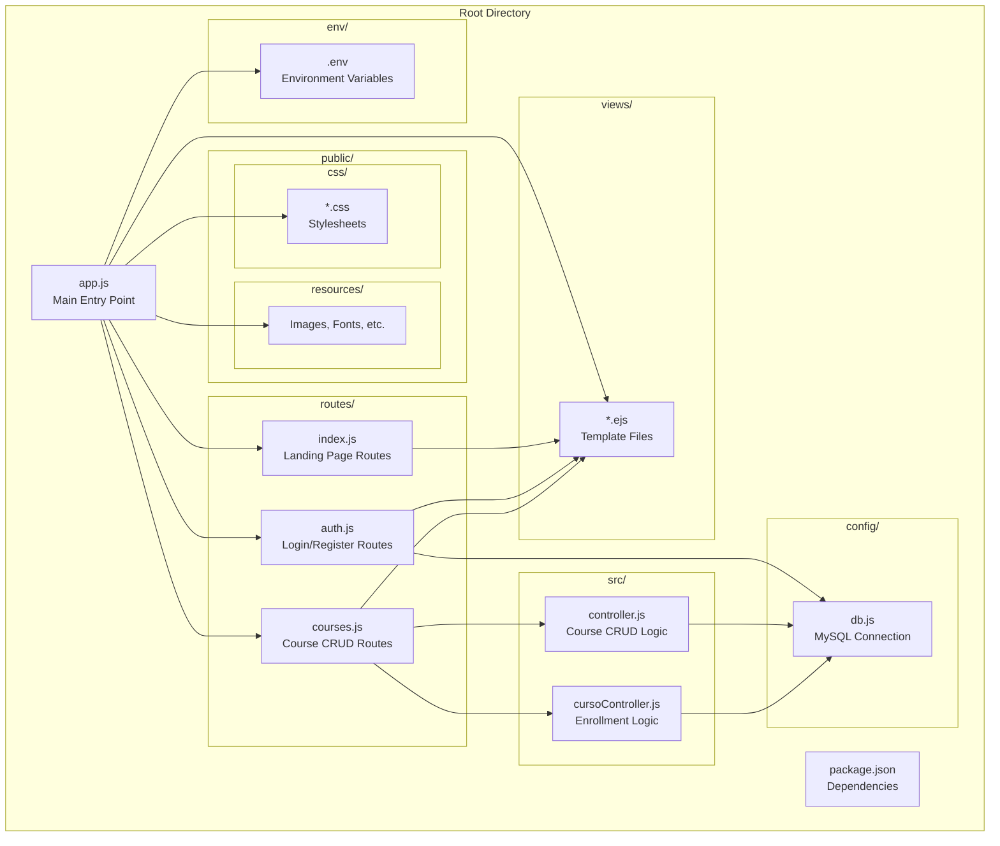
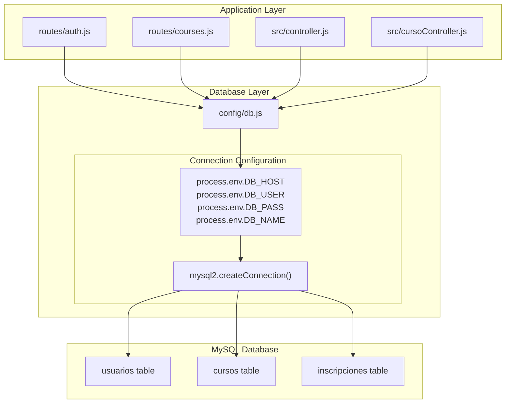

# Architecture Overview

> **Relevant source files**
> * [app.js](https://github.com/Lourdes12587/Week06/blob/ce0c3bcd/app.js)
> * [config/db.js](https://github.com/Lourdes12587/Week06/blob/ce0c3bcd/config/db.js)
> * [package.json](https://github.com/Lourdes12587/Week06/blob/ce0c3bcd/package.json)

## Purpose and Scope

This document provides a comprehensive overview of the system's architecture, explaining how the Express.js application is structured, how requests flow through the middleware pipeline, and how the three-tier design pattern organizes the codebase. This page focuses on the high-level architectural patterns and component interactions. For detailed information about specific subsystems, refer to:

* Technology stack and dependencies: [Technology Stack](/Lourdes12587/Week06/3.1-technology-stack)
* Main server configuration: [Application Entry Point](/Lourdes12587/Week06/3.2-application-entry-point)
* Database schema and connection management: [Database Architecture](/Lourdes12587/Week06/3.3-database-architecture)
* Route organization and middleware chains: [Routing System](/Lourdes12587/Week06/3.4-routing-system)

---

## Architectural Pattern

The application implements a **three-tier architecture** separating concerns into distinct layers:

| Layer | Responsibility | Key Components |
| --- | --- | --- |
| **Presentation Layer** | User interface rendering and static assets | EJS templates (`views/*.ejs`), CSS stylesheets (`public/css/*.css`), client-side resources (`public/resources/`) |
| **Application Layer** | Business logic, request handling, authentication | Express routes (`routes/*.js`), controllers (`src/*.js`), middleware stack |
| **Data Layer** | Data persistence and retrieval | MySQL database, connection module (`config/db.js`) |

This separation ensures maintainability by isolating UI concerns from business logic and data access logic.

**Sources:** High-level system architecture diagrams, [app.js L1-L41](https://github.com/Lourdes12587/Week06/blob/ce0c3bcd/app.js#L1-L41)

 [config/db.js L1-L19](https://github.com/Lourdes12587/Week06/blob/ce0c3bcd/config/db.js#L1-L19)

---

## Application Layer Structure

### Express Application Initialization

The Express application is initialized in `app.js`, which serves as the central orchestrator for all middleware, routes, and server configuration.

**Diagram: Express Application Bootstrap Sequence**

The initialization sequence in [app.js L1-L31](https://github.com/Lourdes12587/Week06/blob/ce0c3bcd/app.js#L1-L31)

 follows this order:

1. **Line 1-2**: Express framework initialization via `const app = express()`
2. **Line 3**: Environment configuration loading from `./env/.env` using `dotenv`
3. **Line 4-13**: Session middleware configuration with `express-session`
4. **Line 19**: Static resource serving from `/public` directory mounted at `/resources` endpoint
5. **Line 21**: EJS templating engine configuration via `app.set('view engine', 'ejs')`
6. **Line 25-26**: Request body parsing for URL-encoded forms and JSON payloads
7. **Line 29-31**: Route module mounting for index, authentication, and course management

**Sources:** [app.js L1-L31](https://github.com/Lourdes12587/Week06/blob/ce0c3bcd/app.js#L1-L31)

---

## Three-Tier Architecture Implementation

**Diagram: Three-Tier Architecture with Code Entities**

### Presentation Tier

The presentation tier handles all user-facing content:

* **Templates**: EJS files in `views/` directory render dynamic HTML based on server-side data
* **Stylesheets**: Page-specific CSS files in `public/css/` provide styling
* **Static Resources**: Images, fonts, and other assets served from `public/resources/`

### Application Tier

The application tier contains the core business logic:

* **Entry Point**: [app.js L1-L41](https://github.com/Lourdes12587/Week06/blob/ce0c3bcd/app.js#L1-L41)  initializes the Express server and configures middleware
* **Route Handlers**: Modular route files in `routes/` directory map HTTP endpoints to controller logic
* **Controllers**: Business logic modules in `src/` directory handle CRUD operations and enrollment logic
* **Middleware**: Authentication, validation, and session management protect routes and sanitize input

### Data Tier

The data tier manages persistence:

* **Connection Module**: [config/db.js L1-L19](https://github.com/Lourdes12587/Week06/blob/ce0c3bcd/config/db.js#L1-L19)  creates and exports a MySQL connection using `mysql2`
* **Database**: MySQL instance stores three tables (`usuarios`, `cursos`, `inscripciones`)

**Sources:** [app.js L1-L41](https://github.com/Lourdes12587/Week06/blob/ce0c3bcd/app.js#L1-L41)

 [config/db.js L1-L19](https://github.com/Lourdes12587/Week06/blob/ce0c3bcd/config/db.js#L1-L19)

 High-level system architecture diagrams

---

## Request Processing Flow

**Diagram: HTTP Request Processing Sequence**

### Request Lifecycle

1. **Browser to Express**: Client sends HTTP request to the server
2. **Session Loading**: [app.js L6-L13](https://github.com/Lourdes12587/Week06/blob/ce0c3bcd/app.js#L6-L13)  processes session data via `express-session` middleware
3. **Static vs Dynamic**: [app.js L19](https://github.com/Lourdes12587/Week06/blob/ce0c3bcd/app.js#L19-L19)  serves static files from `/resources/*` directly; dynamic routes proceed to handlers
4. **Route Matching**: [app.js L29-L31](https://github.com/Lourdes12587/Week06/blob/ce0c3bcd/app.js#L29-L31)  routes request to appropriate handler in `routes/index.js`, `routes/auth.js`, or `routes/courses.js`
5. **Database Operations**: Routes interact with database via [config/db.js](https://github.com/Lourdes12587/Week06/blob/ce0c3bcd/config/db.js)  connection
6. **Response Generation**: * GET requests render EJS templates with data * POST requests redirect after database modification (Post-Redirect-Get pattern)

**Sources:** [app.js L6-L31](https://github.com/Lourdes12587/Week06/blob/ce0c3bcd/app.js#L6-L31)

 [config/db.js L1-L19](https://github.com/Lourdes12587/Week06/blob/ce0c3bcd/config/db.js#L1-L19)

 HTTP request flow diagram

---

## Middleware Pipeline

**Diagram: Middleware Pipeline Execution Order**

### Core Middleware Configuration

The middleware stack in [app.js](https://github.com/Lourdes12587/Week06/blob/ce0c3bcd/app.js)

 processes every request in sequence:

| Order | Middleware | Configuration | Purpose |
| --- | --- | --- | --- |
| 1 | `express-session` | Lines 6-13 | Session management with secret key |
| 2 | `express.static` | Line 19 | Static file serving from `/public` directory at `/resources` path |
| 3 | `express.urlencoded` | Line 25 | Parse URL-encoded request bodies (form submissions) |
| 4 | `express.json` | Line 26 | Parse JSON request bodies (API requests) |
| 5 | Route handlers | Lines 29-31 | Mount modular route files |

### Session Configuration

The session middleware [app.js L6-L13](https://github.com/Lourdes12587/Week06/blob/ce0c3bcd/app.js#L6-L13)

 configures:

* **Secret**: `"secret"` used for signing session ID cookies
* **Resave**: `false` prevents unnecessary session saves
* **SaveUninitialized**: `false` prevents creating sessions for unauthenticated users

### Route-Specific Middleware

Individual route modules in `routes/` directory apply additional middleware:

* **Authentication middleware**: Verifies user login status before protected routes
* **Role-based middleware**: Checks user role (`admin`, `registrado`, `publico`) for authorization
* **Validation middleware**: Uses `express-validator` to sanitize and validate input

**Sources:** [app.js L6-L26](https://github.com/Lourdes12587/Week06/blob/ce0c3bcd/app.js#L6-L26)

 [package.json L14-L24](https://github.com/Lourdes12587/Week06/blob/ce0c3bcd/package.json#L14-L24)

---

## Module Organization

**Diagram: Directory Structure and Module Dependencies**

### Directory Structure

The application follows a modular organization pattern:

| Directory | Purpose | Key Files |
| --- | --- | --- |
| Root | Application entry and configuration | `app.js`, `package.json` |
| `env/` | Environment variables | `.env` (contains DB credentials, secrets) |
| `routes/` | HTTP endpoint definitions | `index.js`, `auth.js`, `courses.js` |
| `src/` | Business logic controllers | `controller.js`, `cursoController.js` |
| `config/` | Infrastructure configuration | `db.js` (MySQL connection) |
| `views/` | EJS template files | `*.ejs` files for rendering HTML |
| `public/css/` | Stylesheets | Page-specific CSS files |
| `public/resources/` | Static assets | Images, fonts, icons |

### Module Responsibilities

**Entry Point**: [app.js L1-L41](https://github.com/Lourdes12587/Week06/blob/ce0c3bcd/app.js#L1-L41)

* Initializes Express application
* Configures middleware stack
* Mounts route modules
* Sets view engine and static file paths

**Configuration**: [config/db.js L1-L19](https://github.com/Lourdes12587/Week06/blob/ce0c3bcd/config/db.js#L1-L19)

* Creates MySQL connection using `mysql2.createConnection()`
* Reads credentials from environment variables [db.js L4-L7](https://github.com/Lourdes12587/Week06/blob/ce0c3bcd/db.js#L4-L7)
* Exports connection for use by routes and controllers

**Route Handlers**: `routes/*.js`

* Define HTTP endpoint mappings
* Apply authentication and validation middleware
* Delegate business logic to controllers
* Render views or send redirects

**Controllers**: `src/*.js`

* Implement business logic for CRUD operations
* Handle database transactions
* Process enrollment requests
* Return success/error results to routes

**Views**: `views/*.ejs`

* Render dynamic HTML using EJS syntax
* Display data passed from route handlers
* Include shared partials for header/footer
* Integrate with CSS stylesheets

**Sources:** [app.js L1-L41](https://github.com/Lourdes12587/Week06/blob/ce0c3bcd/app.js#L1-L41)

 [config/db.js L1-L19](https://github.com/Lourdes12587/Week06/blob/ce0c3bcd/config/db.js#L1-L19)

 project structure diagrams

---

## Database Connection Architecture

**Diagram: Database Connection Module Architecture**

### Connection Module Design

The [config/db.js L1-L19](https://github.com/Lourdes12587/Week06/blob/ce0c3bcd/config/db.js#L1-L19)

 module implements a centralized database connection pattern:

1. **Line 1**: Import `mysql2` driver for MySQL connectivity
2. **Lines 3-9**: Create connection using environment variables: * `process.env.DB_HOST`: Database server hostname * `process.env.DB_USER`: MySQL username * `process.env.DB_PASS`: MySQL password * `process.env.DB_NAME`: Target database name
3. **Lines 11-17**: Establish connection with error handling
4. **Line 19**: Export connection object via `module.exports`

All route handlers and controllers import this single connection instance, ensuring consistent database access across the application. This centralized pattern simplifies connection management and environment configuration.

**Sources:** [config/db.js L1-L19](https://github.com/Lourdes12587/Week06/blob/ce0c3bcd/config/db.js#L1-L19)

 database architecture diagrams

---

## Design Patterns

The architecture implements several key design patterns:

### Separation of Concerns

* **Routes** handle HTTP request/response
* **Controllers** implement business logic
* **Database module** manages data access
* **Views** handle presentation

### Middleware Chain Pattern

Sequential middleware processing via [app.js L6-L26](https://github.com/Lourdes12587/Week06/blob/ce0c3bcd/app.js#L6-L26)

 ensures:

* Session establishment before route handling
* Body parsing before controller access
* Authentication checks before protected routes

### Module Pattern

Each functional area (auth, courses) exists as separate module in `routes/` directory, promoting:

* Code organization
* Independent testing
* Easier maintenance

### Dependency Injection

The database connection [config/db.js L19](https://github.com/Lourdes12587/Week06/blob/ce0c3bcd/config/db.js#L19-L19)

 is exported and imported by consumers, enabling:

* Centralized configuration
* Testability through mock injection
* Connection reuse

**Sources:** [app.js L1-L41](https://github.com/Lourdes12587/Week06/blob/ce0c3bcd/app.js#L1-L41)

 [config/db.js L1-L19](https://github.com/Lourdes12587/Week06/blob/ce0c3bcd/config/db.js#L1-L19)

 module dependency diagrams