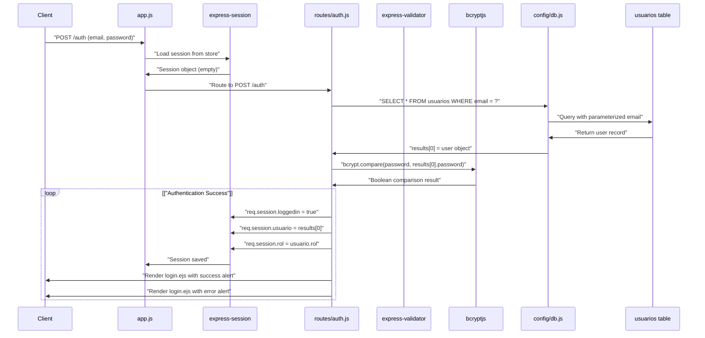
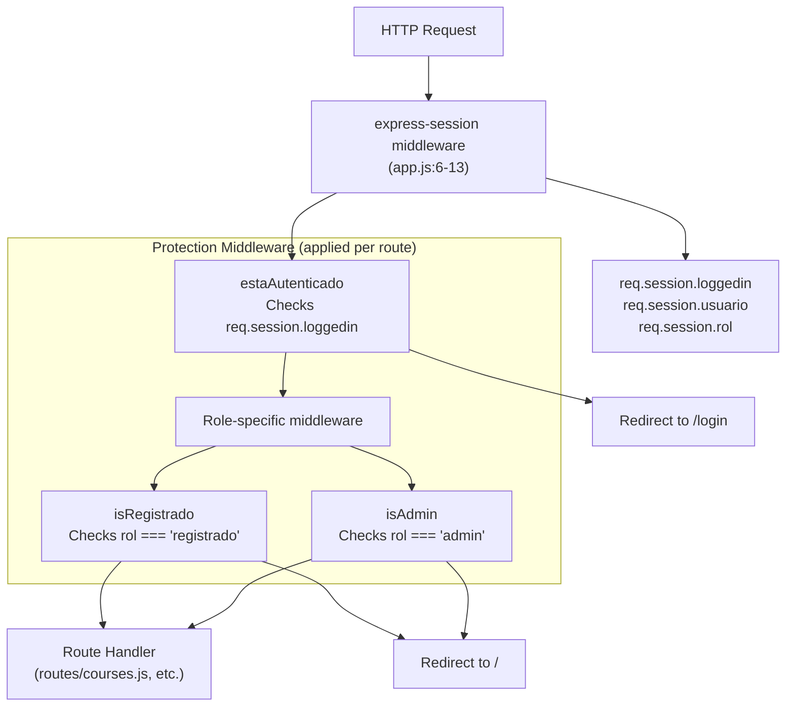
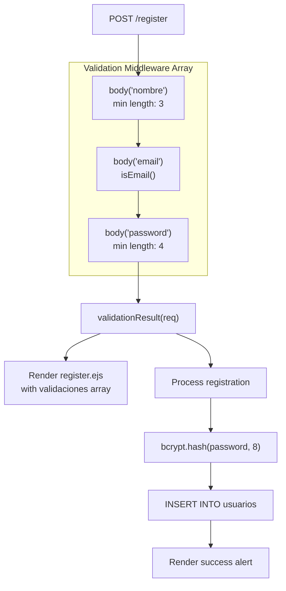
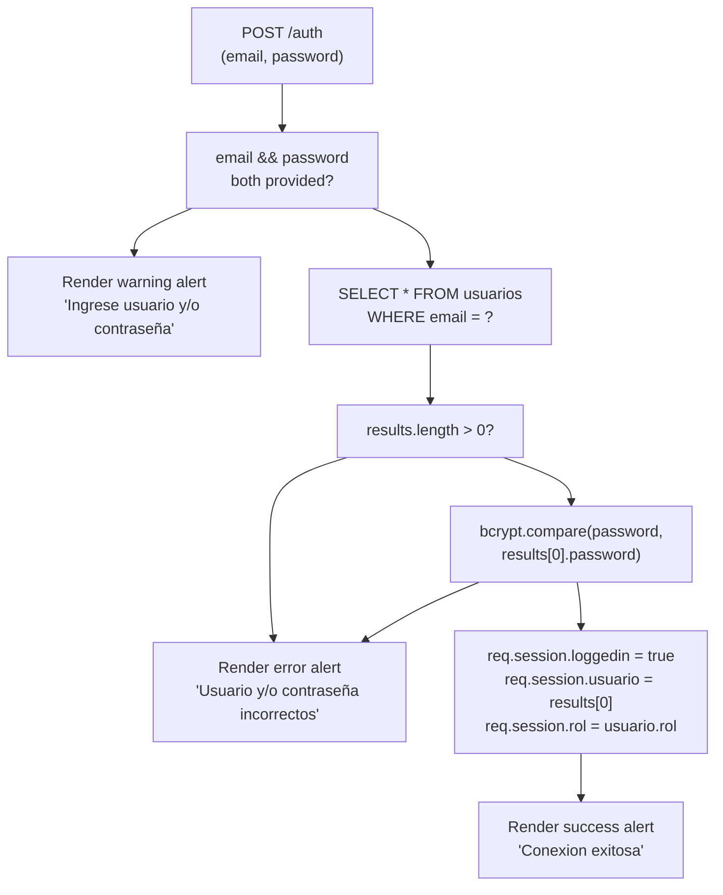

# Authentication & Authorization

> **Relevant source files**
> * [app.js](https://github.com/Lourdes12587/Week06/blob/ce0c3bcd/app.js)
> * [package.json](https://github.com/Lourdes12587/Week06/blob/ce0c3bcd/package.json)
> * [routes/auth.js](https://github.com/Lourdes12587/Week06/blob/ce0c3bcd/routes/auth.js)

## Purpose and Scope

This document provides comprehensive technical documentation of the authentication and authorization system in the course management application. It covers session-based authentication using `express-session`, password security with `bcryptjs`, input validation with `express-validator`, and role-based access control (RBAC) enforcing three distinct user privilege levels.

For specifics on the registration workflow, see [User Registration](/Lourdes12587/Week06/4.1-user-registration). For login process details, see [User Login](/Lourdes12587/Week06/4.2-user-login). For role-based middleware implementation, see [Role-Based Access Control](/Lourdes12587/Week06/4.3-role-based-access-control). For session lifecycle management, see [Session Management](/Lourdes12587/Week06/4.4-session-management).

## System Overview

The authentication system implements a session-based architecture where user credentials are validated against the `usuarios` table in the MySQL database. Upon successful authentication, user data is stored in server-side sessions managed by `express-session`. The system enforces a three-tier role hierarchy (`publico`, `registrado`, `admin`) with middleware guards protecting role-specific routes.

### Authentication Components

| Component | Technology | Purpose |
| --- | --- | --- |
| Session Store | `express-session` | Server-side session persistence |
| Password Hashing | `bcryptjs` | One-way password encryption with salt |
| Input Validation | `express-validator` | Request body sanitization and validation |
| Token Support | `jsonwebtoken` | JWT generation capability (configured but optional) |
| Database Layer | `mysql2` | User credential storage and retrieval |

**Sources:** [package.json L1-L26](https://github.com/Lourdes12587/Week06/blob/ce0c3bcd/package.json#L1-L26)

 [app.js L4-L13](https://github.com/Lourdes12587/Week06/blob/ce0c3bcd/app.js#L4-L13)

## Session Configuration

The Express application initializes session middleware globally before route handlers are mounted. The session configuration in [app.js L6-L13](https://github.com/Lourdes12587/Week06/blob/ce0c3bcd/app.js#L6-L13)

 establishes the session management parameters:

```sql
Session Middleware Configuration:
- secret: "secret" (session signing key)
- resave: false (don't save session if unmodified)
- saveUninitialized: false (don't create session until something stored)
```

The session object persists across requests for authenticated users and stores critical authentication state including `req.session.loggedin`, `req.session.usuario` (full user object from database), and `req.session.rol` (user's role string).

**Sources:** [app.js L6-L13](https://github.com/Lourdes12587/Week06/blob/ce0c3bcd/app.js#L6-L13)

## Password Security Architecture

### Bcrypt Hashing Strategy

The system uses `bcryptjs` version 3.0.2 for password security. During user registration at [routes/auth.js L44](https://github.com/Lourdes12587/Week06/blob/ce0c3bcd/routes/auth.js#L44-L44)

 passwords are hashed with a salt round of 8:

```javascript
const passwordHash = await bcrypt.hash(password, 8);
```

This generates a salted hash using the bcrypt algorithm, making rainbow table attacks infeasible. The salt round of 8 balances security and performance, requiring 2^8 (256) iterations of the hashing algorithm.

### Password Verification

Login authentication at [routes/auth.js L86](https://github.com/Lourdes12587/Week06/blob/ce0c3bcd/routes/auth.js#L86-L86)

 compares the plaintext password against the stored hash:

```
await bcrypt.compare(password, results[0].password)
```

The `compare()` function extracts the salt from the stored hash and applies the same hashing process to the provided password, then performs a constant-time comparison to prevent timing attacks.

**Sources:** [routes/auth.js L44](https://github.com/Lourdes12587/Week06/blob/ce0c3bcd/routes/auth.js#L44-L44)

 [routes/auth.js L86](https://github.com/Lourdes12587/Week06/blob/ce0c3bcd/routes/auth.js#L86-L86)

 [package.json L14](https://github.com/Lourdes12587/Week06/blob/ce0c3bcd/package.json#L14-L14)

## Authentication Flow Diagram

### Complete Authentication Request Cycle



**Sources:** [routes/auth.js L75-L131](https://github.com/Lourdes12587/Week06/blob/ce0c3bcd/routes/auth.js#L75-L131)

 [app.js L6-L13](https://github.com/Lourdes12587/Week06/blob/ce0c3bcd/app.js#L6-L13)

## Role-Based Authorization Model

### Role Hierarchy

The system defines three user roles stored in the `usuarios.rol` column:

| Role | Database Value | Access Level | Assignment |
| --- | --- | --- | --- |
| Public | `'publico'` | Unauthenticated access only | No database record |
| Registered User | `'registrado'` | Course browsing and enrollment | Default on registration [routes/auth.js L52](https://github.com/Lourdes12587/Week06/blob/ce0c3bcd/routes/auth.js#L52-L52) |
| Administrator | `'admin'` | Full CRUD on courses and analytics | Manual database assignment |

### Role Assignment Logic

During registration at [routes/auth.js L43-L52](https://github.com/Lourdes12587/Week06/blob/ce0c3bcd/routes/auth.js#L43-L52)

 the system assigns roles with fallback logic:

```yaml
rol: rol || 'registrado'
```

This assigns the `rol` field from the request body if present, otherwise defaults to `'registrado'`. In practice, the registration form does not expose role selection to users, so all registrations default to the registered user role. Administrator role assignment requires direct database manipulation or manual intervention.

**Sources:** [routes/auth.js L43-L52](https://github.com/Lourdes12587/Week06/blob/ce0c3bcd/routes/auth.js#L43-L52)

## Middleware Architecture

### Authentication Middleware Stack

While the core authentication routes exist in [routes/auth.js](https://github.com/Lourdes12587/Week06/blob/ce0c3bcd/routes/auth.js)

 the protection middleware functions (`estaAutenticado`, `isRegistrado`, `isAdmin`) are implemented in route-specific files and applied to protected endpoints. These middleware functions check session state before allowing route handlers to execute.



### Session State Structure

Authenticated sessions store the following structure in `req.session`:

```python
req.session = {
  loggedin: true,              // Boolean authentication flag
  usuario: {                   // Full user object from usuarios table
    id: <number>,
    nombre: <string>,
    email: <string>,
    password: <hashed_string>,
    rol: <string>
  },
  rol: <string>               // Duplicated for quick access
}
```

This structure is established at [routes/auth.js L102-L104](https://github.com/Lourdes12587/Week06/blob/ce0c3bcd/routes/auth.js#L102-L104)

 upon successful login.

**Sources:** [routes/auth.js L102-L104](https://github.com/Lourdes12587/Week06/blob/ce0c3bcd/routes/auth.js#L102-L104)

 [app.js L6-L13](https://github.com/Lourdes12587/Week06/blob/ce0c3bcd/app.js#L6-L13)

## Registration Implementation

### Input Validation Chain

The registration endpoint at [routes/auth.js L17-L72](https://github.com/Lourdes12587/Week06/blob/ce0c3bcd/routes/auth.js#L17-L72)

 implements a validation middleware chain using `express-validator`:



The validation rules defined at [routes/auth.js L18-L33](https://github.com/Lourdes12587/Week06/blob/ce0c3bcd/routes/auth.js#L18-L33)

 enforce:

* **nombre**: Minimum 3 characters
* **email**: Valid email format via `isEmail()` validator
* **password**: Minimum 4 characters

Validation errors are passed back to the view via the `validaciones` array at [routes/auth.js L37-L40](https://github.com/Lourdes12587/Week06/blob/ce0c3bcd/routes/auth.js#L37-L40)

 allowing the registration form to display field-specific error messages.

**Sources:** [routes/auth.js L17-L72](https://github.com/Lourdes12587/Week06/blob/ce0c3bcd/routes/auth.js#L17-L72)

### Database Insertion

Upon successful validation, the registration process at [routes/auth.js L46-L69](https://github.com/Lourdes12587/Week06/blob/ce0c3bcd/routes/auth.js#L46-L69)

 performs:

1. Password hashing: `await bcrypt.hash(password, 8)` at [routes/auth.js L44](https://github.com/Lourdes12587/Week06/blob/ce0c3bcd/routes/auth.js#L44-L44)
2. Database insertion: `INSERT INTO usuarios SET ?` with object notation at [routes/auth.js L47-L53](https://github.com/Lourdes12587/Week06/blob/ce0c3bcd/routes/auth.js#L47-L53)
3. Success response: Renders `register.ejs` with SweetAlert2 configuration at [routes/auth.js L58-L66](https://github.com/Lourdes12587/Week06/blob/ce0c3bcd/routes/auth.js#L58-L66)

The object notation for the INSERT query provides automatic escaping and prevents SQL injection:

```yaml
{
  nombre: nombre,
  email: email,
  password: passwordHash,
  rol: rol || 'registrado',
}
```

**Sources:** [routes/auth.js L44-L69](https://github.com/Lourdes12587/Week06/blob/ce0c3bcd/routes/auth.js#L44-L69)

## Login Implementation

### Credential Verification Process

The login endpoint `POST /auth` at [routes/auth.js L75-L131](https://github.com/Lourdes12587/Week06/blob/ce0c3bcd/routes/auth.js#L75-L131)

 implements a multi-stage verification:



The comparison at [routes/auth.js L85-L87](https://github.com/Lourdes12587/Week06/blob/ce0c3bcd/routes/auth.js#L85-L87)

 uses a compound condition:

```
if (results.length == 0 || !(await bcrypt.compare(password, results[0].password)))
```

This checks both user existence and password validity in a single conditional, deliberately providing the same error message for both cases to prevent username enumeration attacks.

**Sources:** [routes/auth.js L75-L131](https://github.com/Lourdes12587/Week06/blob/ce0c3bcd/routes/auth.js#L75-L131)

### Session Initialization

Upon successful authentication at [routes/auth.js L98-L104](https://github.com/Lourdes12587/Week06/blob/ce0c3bcd/routes/auth.js#L98-L104)

 the session object is populated:

```
req.session.loggedin = true;
req.session.usuario = results[0];
req.session.rol = usuario.rol;
```

The `usuario` object contains the complete database record including `id`, `nombre`, `email`, `password` (hashed), and `rol`. This data persists across requests via the express-session store configured in [app.js L6-L13](https://github.com/Lourdes12587/Week06/blob/ce0c3bcd/app.js#L6-L13)

**Sources:** [routes/auth.js L98-L104](https://github.com/Lourdes12587/Week06/blob/ce0c3bcd/routes/auth.js#L98-L104)

## Logout Mechanism

The logout endpoint `POST /logout` at [routes/auth.js L134-L136](https://github.com/Lourdes12587/Week06/blob/ce0c3bcd/routes/auth.js#L134-L136)

 implements session destruction:

```javascript
req.session.destroy(() => res.redirect('/'));
```

The `destroy()` method removes the session from the session store and clears the session cookie from the client. The callback redirects to the home route after session destruction completes. This is a POST route rather than GET to prevent CSRF attacks via simple link clicks.

**Sources:** [routes/auth.js L134-L136](https://github.com/Lourdes12587/Week06/blob/ce0c3bcd/routes/auth.js#L134-L136)

## Route Protection Pattern

### Public vs Protected Routes

Routes in the application follow this protection pattern:

| Route Pattern | Protection | File Location |
| --- | --- | --- |
| `GET /` | None (public) | [routes/index.js](https://github.com/Lourdes12587/Week06/blob/ce0c3bcd/routes/index.js) |
| `GET /login` | None (public) | [routes/auth.js L8-L10](https://github.com/Lourdes12587/Week06/blob/ce0c3bcd/routes/auth.js#L8-L10) |
| `GET /register` | None (public) | [routes/auth.js L12-L14](https://github.com/Lourdes12587/Week06/blob/ce0c3bcd/routes/auth.js#L12-L14) |
| `POST /auth` | None (validates credentials) | [routes/auth.js L75-L131](https://github.com/Lourdes12587/Week06/blob/ce0c3bcd/routes/auth.js#L75-L131) |
| `POST /register` | None (creates account) | [routes/auth.js L17-L72](https://github.com/Lourdes12587/Week06/blob/ce0c3bcd/routes/auth.js#L17-L72) |
| `POST /logout` | Requires active session | [routes/auth.js L134-L136](https://github.com/Lourdes12587/Week06/blob/ce0c3bcd/routes/auth.js#L134-L136) |
| `GET /courses` | Varies by role | [routes/courses.js](https://github.com/Lourdes12587/Week06/blob/ce0c3bcd/routes/courses.js) |
| `POST /inscribir/:id` | Requires `registrado` role | [routes/courses.js](https://github.com/Lourdes12587/Week06/blob/ce0c3bcd/routes/courses.js) |
| `GET /create` | Requires `admin` role | [routes/courses.js](https://github.com/Lourdes12587/Week06/blob/ce0c3bcd/routes/courses.js) |
| `POST /save` | Requires `admin` role | [routes/courses.js](https://github.com/Lourdes12587/Week06/blob/ce0c3bcd/routes/courses.js) |
| `GET /edit/:id` | Requires `admin` role | [routes/courses.js](https://github.com/Lourdes12587/Week06/blob/ce0c3bcd/routes/courses.js) |
| `POST /update` | Requires `admin` role | [routes/courses.js](https://github.com/Lourdes12587/Week06/blob/ce0c3bcd/routes/courses.js) |
| `GET /delete/:id` | Requires `admin` role | [routes/courses.js](https://github.com/Lourdes12587/Week06/blob/ce0c3bcd/routes/courses.js) |

The specific middleware implementations (`estaAutenticado`, `isRegistrado`, `isAdmin`) are applied in [routes/courses.js](https://github.com/Lourdes12587/Week06/blob/ce0c3bcd/routes/courses.js)

 and other protected route files, checking `req.session.loggedin` and `req.session.rol` before allowing access.

**Sources:** [routes/auth.js L1-L139](https://github.com/Lourdes12587/Week06/blob/ce0c3bcd/routes/auth.js#L1-L139)

## Security Considerations

### SQL Injection Prevention

All database queries use parameterized statements. The registration query at [routes/auth.js L47](https://github.com/Lourdes12587/Week06/blob/ce0c3bcd/routes/auth.js#L47-L47)

 uses object notation:

```sql
INSERT INTO usuarios SET ?
```

The login query at [routes/auth.js L82](https://github.com/Lourdes12587/Week06/blob/ce0c3bcd/routes/auth.js#L82-L82)

 uses array parameters:

```sql
SELECT * FROM usuarios WHERE email = ?
```

Both patterns prevent SQL injection by separating SQL structure from user data.

### Password Storage

Passwords are never stored in plaintext. The hashing at [routes/auth.js L44](https://github.com/Lourdes12587/Week06/blob/ce0c3bcd/routes/auth.js#L44-L44)

 with 8 salt rounds provides:

* Resistance to rainbow table attacks (unique salt per password)
* Computational cost making brute force attacks expensive
* One-way transformation (cannot reverse hash to plaintext)

### Session Security

The session configuration at [app.js L8](https://github.com/Lourdes12587/Week06/blob/ce0c3bcd/app.js#L8-L8)

 uses a secret key for signing session cookies. The production deployment should replace the hardcoded `"secret"` string with an environment variable containing a cryptographically random string.

The configuration `saveUninitialized: false` at [app.js L10](https://github.com/Lourdes12587/Week06/blob/ce0c3bcd/app.js#L10-L10)

 prevents session creation until authentication succeeds, reducing session store bloat and potential session fixation attacks.

**Sources:** [routes/auth.js L44](https://github.com/Lourdes12587/Week06/blob/ce0c3bcd/routes/auth.js#L44-L44)

 [routes/auth.js L47](https://github.com/Lourdes12587/Week06/blob/ce0c3bcd/routes/auth.js#L47-L47)

 [routes/auth.js L82](https://github.com/Lourdes12587/Week06/blob/ce0c3bcd/routes/auth.js#L82-L82)

 [app.js L6-L13](https://github.com/Lourdes12587/Week06/blob/ce0c3bcd/app.js#L6-L13)

## JWT Token Support

The `jsonwebtoken` package version 9.0.2 is included in dependencies at [package.json L22](https://github.com/Lourdes12587/Week06/blob/ce0c3bcd/package.json#L22-L22)

 but not actively used in the current authentication implementation. The system uses session-based authentication exclusively. JWT support could be implemented for stateless API endpoints or mobile client authentication in future iterations.

**Sources:** [package.json L22](https://github.com/Lourdes12587/Week06/blob/ce0c3bcd/package.json#L22-L22)