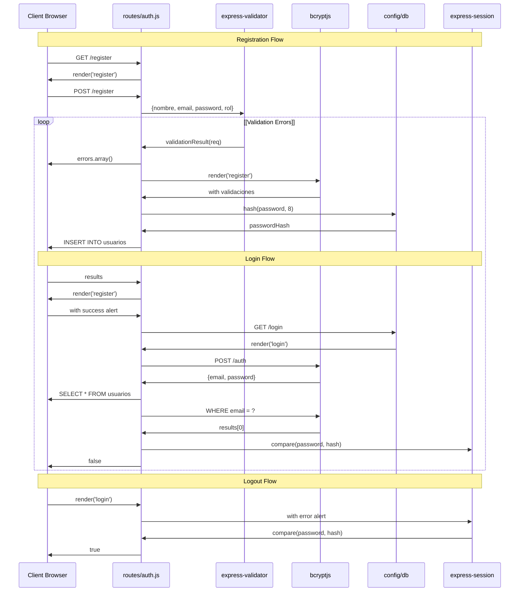

# Authentication Endpoints

> **Relevant source files**
> * [routes/auth.js](https://github.com/Lourdes12587/Week06/blob/ce0c3bcd/routes/auth.js)

## Purpose and Scope

This document provides a comprehensive reference for all authentication-related HTTP endpoints in the course management system. These endpoints handle user registration, login, and logout operations, including input validation, password hashing, session management, and error handling.

For information about the underlying authentication mechanisms and session management, see [Session Management](/Lourdes12587/Week06/4.4-session-management). For details on role-based access control middleware, see [Role-Based Access Control](/Lourdes12587/Week06/4.3-role-based-access-control).

**Sources:** [routes/auth.js L1-L139](https://github.com/Lourdes12587/Week06/blob/ce0c3bcd/routes/auth.js#L1-L139)

---

## Endpoint Overview

The authentication router (`routes/auth.js`) exposes five HTTP endpoints:

| HTTP Method | Path | Purpose | Authentication Required | Response Type |
| --- | --- | --- | --- | --- |
| GET | `/login` | Render login form | No | HTML view |
| GET | `/register` | Render registration form | No | HTML view |
| POST | `/register` | Process user registration | No | HTML view with alert |
| POST | `/auth` | Process login authentication | No | HTML view with alert |
| POST | `/logout` | Destroy user session | No | Redirect to `/` |

**Sources:** [routes/auth.js L8-L136](https://github.com/Lourdes12587/Week06/blob/ce0c3bcd/routes/auth.js#L8-L136)

---

## Authentication Flow Architecture



**Sources:** [routes/auth.js L8-L136](https://github.com/Lourdes12587/Week06/blob/ce0c3bcd/routes/auth.js#L8-L136)

---

## Registration Endpoints

### GET /register

Renders the registration form for new users.

**Route Definition:** [routes/auth.js L12-L14](https://github.com/Lourdes12587/Week06/blob/ce0c3bcd/routes/auth.js#L12-L14)

**Request Parameters:** None

**Response:**

* Renders the `register` EJS view
* Passes `{ register: true }` as template data

**Example Usage:**

```
GET /register
```

**Sources:** [routes/auth.js L12-L14](https://github.com/Lourdes12587/Week06/blob/ce0c3bcd/routes/auth.js#L12-L14)

---

### POST /register

Processes new user registration with input validation and password hashing.

**Route Definition:** [routes/auth.js L17-L72](https://github.com/Lourdes12587/Week06/blob/ce0c3bcd/routes/auth.js#L17-L72)

**Request Body:**

| Field | Type | Required | Validation Rules |
| --- | --- | --- | --- |
| `nombre` | String | Yes | Minimum 3 characters |
| `email` | String | Yes | Valid email format |
| `password` | String | Yes | Minimum 4 characters |
| `rol` | String | No | Defaults to `'registrado'` |

**Validation Middleware:**
The endpoint uses `express-validator` with three validation chains:

* [routes/auth.js L19-L22](https://github.com/Lourdes12587/Week06/blob/ce0c3bcd/routes/auth.js#L19-L22)  - Validates `nombre` field
* [routes/auth.js L24-L27](https://github.com/Lourdes12587/Week06/blob/ce0c3bcd/routes/auth.js#L24-L27)  - Validates `email` field
* [routes/auth.js L29-L32](https://github.com/Lourdes12587/Week06/blob/ce0c3bcd/routes/auth.js#L29-L32)  - Validates `password` field

**Processing Flow:**

```

```

**Sources:** [routes/auth.js L17-L72](https://github.com/Lourdes12587/Week06/blob/ce0c3bcd/routes/auth.js#L17-L72)

**Success Response:**
Renders the `register` view with SweetAlert2 configuration:

```

```

**Error Response:**
Renders the `register` view with validation errors:

```

```

**Database Operation:**

* Table: `usuarios`
* Operation: `INSERT INTO usuarios SET ?`
* Fields inserted: `nombre`, `email`, `password` (hashed), `rol` (default: `'registrado'`)

**Sources:** [routes/auth.js L34-L72](https://github.com/Lourdes12587/Week06/blob/ce0c3bcd/routes/auth.js#L34-L72)

---

## Login Endpoints

### GET /login

Renders the login form for existing users.

**Route Definition:** [routes/auth.js L8-L10](https://github.com/Lourdes12587/Week06/blob/ce0c3bcd/routes/auth.js#L8-L10)

**Request Parameters:** None

**Response:**

* Renders the `login` EJS view

**Example Usage:**

```
GET /login
```

**Sources:** [routes/auth.js L8-L10](https://github.com/Lourdes12587/Week06/blob/ce0c3bcd/routes/auth.js#L8-L10)

---

### POST /auth

Authenticates user credentials and establishes a session.

**Route Definition:** [routes/auth.js L75-L131](https://github.com/Lourdes12587/Week06/blob/ce0c3bcd/routes/auth.js#L75-L131)

**Request Body:**

| Field | Type | Required | Description |
| --- | --- | --- | --- |
| `email` | String | Yes | User's email address |
| `password` | String | Yes | User's plaintext password |

**Authentication Process:**

```

```

**Sources:** [routes/auth.js L75-L131](https://github.com/Lourdes12587/Week06/blob/ce0c3bcd/routes/auth.js#L75-L131)

**Session Data Structure:**
Upon successful authentication, the following session properties are set:

* [routes/auth.js L102](https://github.com/Lourdes12587/Week06/blob/ce0c3bcd/routes/auth.js#L102-L102)  - `req.session.loggedin = true`
* [routes/auth.js L103](https://github.com/Lourdes12587/Week06/blob/ce0c3bcd/routes/auth.js#L103-L103)  - `req.session.usuario = results[0]` (entire user object)
* [routes/auth.js L104](https://github.com/Lourdes12587/Week06/blob/ce0c3bcd/routes/auth.js#L104-L104)  - `req.session.rol = usuario.rol` (role string)

**Success Response:**
Renders the `login` view with SweetAlert2 configuration:

```

```

**Error Responses:**

| Scenario | Alert Configuration |
| --- | --- |
| Invalid credentials | `alertTitle: 'Error'``alertMessage: 'Usuario y/o contraseña incorrectos'``alertIcon: 'error'` |
| Missing email/password | `alertTitle: 'Advertencia'``alertMessage: 'Ingrese el usuario y/o contraseña'``alertIcon: 'error'` |

**Database Query:**

* Table: `usuarios`
* Query: `SELECT * FROM usuarios WHERE email = ?`
* Parameters: `[email]`

**Sources:** [routes/auth.js L75-L131](https://github.com/Lourdes12587/Week06/blob/ce0c3bcd/routes/auth.js#L75-L131)

---

## Logout Endpoint

### POST /logout

Destroys the user session and redirects to the homepage.

**Route Definition:** [routes/auth.js L134-L136](https://github.com/Lourdes12587/Week06/blob/ce0c3bcd/routes/auth.js#L134-L136)

**Request Parameters:** None

**Request Body:** None

**Response:**

* Calls `req.session.destroy()` to terminate the session
* Redirects to `/` (home page)

**Example Usage:**

```
POST /logout
```

**Implementation:**

```

```

The `destroy()` method accepts a callback that executes after session cleanup is complete. The redirect ensures users are sent to the home page after logout.

**Sources:** [routes/auth.js L134-L136](https://github.com/Lourdes12587/Week06/blob/ce0c3bcd/routes/auth.js#L134-L136)

---

## Validation Specifications

The registration endpoint implements three validation chains using `express-validator`:

### Nombre Validation

**Implementation:** [routes/auth.js L19-L22](https://github.com/Lourdes12587/Week06/blob/ce0c3bcd/routes/auth.js#L19-L22)

```

```

**Rules:**

* Field must exist in request body
* Minimum length: 3 characters
* Error message: "El nombre debe tener al menos 3 caracteres"

### Email Validation

**Implementation:** [routes/auth.js L24-L27](https://github.com/Lourdes12587/Week06/blob/ce0c3bcd/routes/auth.js#L24-L27)

```

```

**Rules:**

* Field must exist in request body
* Must match valid email format
* Error message: "El email debe ser válido"

### Password Validation

**Implementation:** [routes/auth.js L29-L32](https://github.com/Lourdes12587/Week06/blob/ce0c3bcd/routes/auth.js#L29-L32)

```

```

**Rules:**

* Field must exist in request body
* Minimum length: 4 characters
* Error message: "La contraseña debe tener al menos 4 caracteres"

**Validation Error Handling:**
When validation fails, the registration form is re-rendered with:

* `validaciones: errors.array()` - Array of validation error objects
* `valores: req.body` - Original form data for pre-population

**Sources:** [routes/auth.js L17-L40](https://github.com/Lourdes12587/Week06/blob/ce0c3bcd/routes/auth.js#L17-L40)

---

## Password Security

All password operations use `bcryptjs` for cryptographic hashing:

### Registration Password Hashing

**Implementation:** [routes/auth.js L44](https://github.com/Lourdes12587/Week06/blob/ce0c3bcd/routes/auth.js#L44-L44)

```

```

* **Algorithm:** bcrypt
* **Salt Rounds:** 8
* **Storage:** Hashed password is stored in the `password` column of the `usuarios` table

### Login Password Comparison

**Implementation:** [routes/auth.js L86](https://github.com/Lourdes12587/Week06/blob/ce0c3bcd/routes/auth.js#L86-L86)

```

```

* **Operation:** Constant-time comparison of plaintext password against stored hash
* **Returns:** Boolean indicating match status
* **Security:** Prevents timing attacks through constant-time comparison

**Sources:** [routes/auth.js L44](https://github.com/Lourdes12587/Week06/blob/ce0c3bcd/routes/auth.js#L44-L44)

 [routes/auth.js L86](https://github.com/Lourdes12587/Week06/blob/ce0c3bcd/routes/auth.js#L86-L86)

---

## Database Operations Reference

### Registration Database Insert

**Implementation:** [routes/auth.js L46-L69](https://github.com/Lourdes12587/Week06/blob/ce0c3bcd/routes/auth.js#L46-L69)

**Query:**

```

```

**Parameters Object:**

```

```

**Default Role Assignment:**
If no `rol` field is provided in the request body, the user is assigned the role `'registrado'` by default [routes/auth.js L52](https://github.com/Lourdes12587/Week06/blob/ce0c3bcd/routes/auth.js#L52-L52)

### Login Database Query

**Implementation:** [routes/auth.js L81-L118](https://github.com/Lourdes12587/Week06/blob/ce0c3bcd/routes/auth.js#L81-L118)

**Query:**

```

```

**Parameters:** `[email]`

**Result Handling:**

* `results.length == 0` indicates no user found
* `results[0]` contains the user object if found
* User object includes: `id`, `nombre`, `email`, `password` (hashed), `rol`

**Sources:** [routes/auth.js L46-L118](https://github.com/Lourdes12587/Week06/blob/ce0c3bcd/routes/auth.js#L46-L118)

---

## Response Patterns

All authentication endpoints follow a consistent response pattern using SweetAlert2 configuration objects:

### Alert Configuration Properties

| Property | Type | Purpose |
| --- | --- | --- |
| `alert` | Boolean | Triggers SweetAlert2 display |
| `alertTitle` | String | Alert modal title |
| `alertMessage` | String | Alert modal message text |
| `alertIcon` | String | Icon type: `'success'`, `'error'`, `'warning'` |
| `showConfirmButton` | Boolean | Whether to show confirm button |
| `timer` | Number/Boolean | Auto-close timer in milliseconds, or `false` |
| `ruta` | String | Redirect path after alert closes |

### Registration Success Response

**Implementation:** [routes/auth.js L58-L66](https://github.com/Lourdes12587/Week06/blob/ce0c3bcd/routes/auth.js#L58-L66)

```

```

### Login Success Response

**Implementation:** [routes/auth.js L106-L115](https://github.com/Lourdes12587/Week06/blob/ce0c3bcd/routes/auth.js#L106-L115)

```

```

### Login Error Response

**Implementation:** [routes/auth.js L88-L97](https://github.com/Lourdes12587/Week06/blob/ce0c3bcd/routes/auth.js#L88-L97)

```

```

**Sources:** [routes/auth.js L58-L129](https://github.com/Lourdes12587/Week06/blob/ce0c3bcd/routes/auth.js#L58-L129)

---

## Module Dependencies

The authentication router relies on the following imported modules:

| Module | Purpose | Import Statement |
| --- | --- | --- |
| `express` | Router creation | [routes/auth.js L1](https://github.com/Lourdes12587/Week06/blob/ce0c3bcd/routes/auth.js#L1-L1) |
| `bcryptjs` | Password hashing and comparison | [routes/auth.js L3](https://github.com/Lourdes12587/Week06/blob/ce0c3bcd/routes/auth.js#L3-L3) |
| `config/db` | Database connection | [routes/auth.js L4](https://github.com/Lourdes12587/Week06/blob/ce0c3bcd/routes/auth.js#L4-L4) |
| `express-validator` | Input validation | [routes/auth.js L5](https://github.com/Lourdes12587/Week06/blob/ce0c3bcd/routes/auth.js#L5-L5) |

**Router Export:**
The configured router is exported at [routes/auth.js L139](https://github.com/Lourdes12587/Week06/blob/ce0c3bcd/routes/auth.js#L139-L139)

 as:

```

```

**Sources:** [routes/auth.js L1-L5](https://github.com/Lourdes12587/Week06/blob/ce0c3bcd/routes/auth.js#L1-L5)

 [routes/auth.js L139](https://github.com/Lourdes12587/Week06/blob/ce0c3bcd/routes/auth.js#L139-L139)