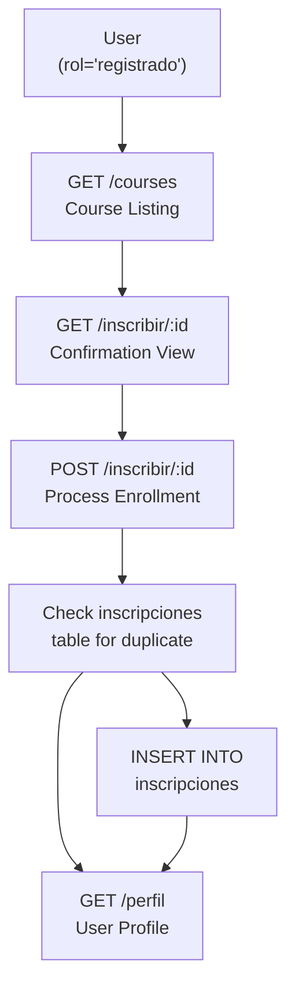
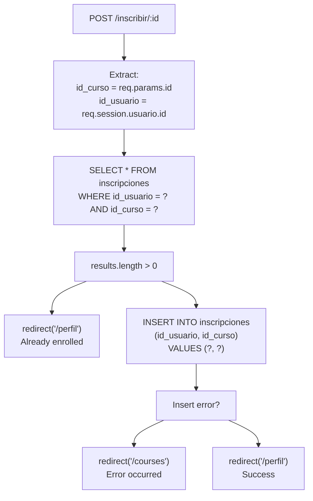
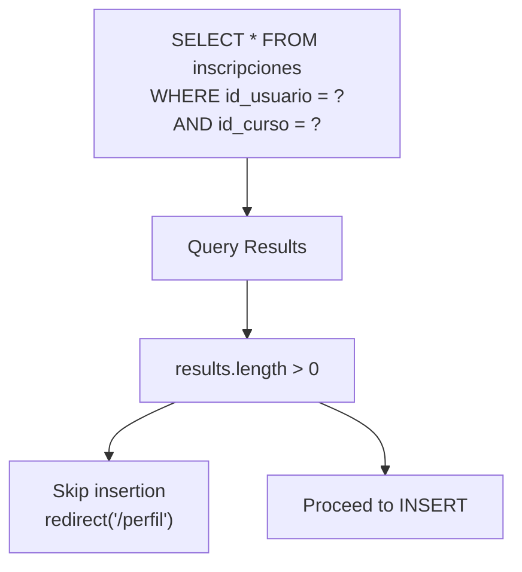
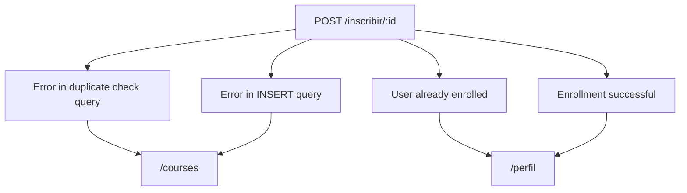
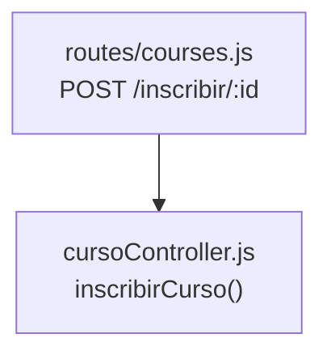

# Course Enrollment

> **Relevant source files**
> * [routes/courses.js](https://github.com/Lourdes12587/Week06/blob/ce0c3bcd/routes/courses.js)
> * [src/cursoController.js](https://github.com/Lourdes12587/Week06/blob/ce0c3bcd/src/cursoController.js)
> * [views/confirmInscripcion.ejs](https://github.com/Lourdes12587/Week06/blob/ce0c3bcd/views/confirmInscripcion.ejs)

## Purpose and Scope

This document describes the course enrollment functionality that allows registered users to enroll in courses. The system implements a two-step enrollment process: a confirmation page followed by database insertion. This page covers the enrollment routes, duplicate prevention logic, database transactions, and integration with user profiles.

For information about viewing enrolled courses, see [User Profile Page](/Lourdes12587/Week06/6.1-user-profile-page). For course listing and visibility rules, see [Course Listing & Visibility](/Lourdes12587/Week06/5.3-course-listing-and-visibility). For role-based access control that protects enrollment routes, see [Role-Based Access Control](/Lourdes12587/Week06/4.3-role-based-access-control).

---

## Enrollment System Overview

The enrollment system provides registered users (users with `rol === 'registrado'`) the ability to enroll in courses through a protected workflow. The system prevents duplicate enrollments and maintains enrollment records in the `inscripciones` database table.



**Sources:** [routes/courses.js L106-L149](https://github.com/Lourdes12587/Week06/blob/ce0c3bcd/routes/courses.js#L106-L149)

---

## Authentication Requirements

Both enrollment routes require two middleware layers:

| Middleware | Function | Role Requirement | Redirect on Failure |
| --- | --- | --- | --- |
| `estaAutenticado` | Verifies user is logged in | Session must exist | `/login` |
| `isRegistrado` | Verifies user has registered role | `req.session.rol === 'registrado'` | `/login` |

The middleware chain ensures that only authenticated users with the `registrado` role can access enrollment functionality. Users with `rol === 'admin'` or `rol === 'publico'` are redirected to the login page.

**Sources:** [routes/courses.js L8-L33](https://github.com/Lourdes12587/Week06/blob/ce0c3bcd/routes/courses.js#L8-L33)

 [routes/courses.js L106](https://github.com/Lourdes12587/Week06/blob/ce0c3bcd/routes/courses.js#L106-L106)

 [routes/courses.js L117](https://github.com/Lourdes12587/Week06/blob/ce0c3bcd/routes/courses.js#L117-L117)

---

## Two-Step Enrollment Workflow

### Step 1: Enrollment Confirmation (GET Request)

The first step displays a confirmation page showing course details before enrollment.

**Route Definition:**

```yaml
GET /courses/inscribir/:id
Middleware: estaAutenticado, isRegistrado
```

**Implementation Flow:**

```mermaid
sequenceDiagram
  participant User
  participant GET /inscribir/:id
  participant Database
  participant confirmInscripcion.ejs

  User->>GET /inscribir/:id: "GET /courses/inscribir/5"
  GET /inscribir/:id->>Database: "SELECT * FROM cursos WHERE id = ?"
  Database-->>GET /inscribir/:id: "Course record"
  loop [Course Found]
    GET /inscribir/:id->>confirmInscripcion.ejs: "render('confirmInscripcion', {curso, login, rol})"
    confirmInscripcion.ejs-->>User: "Confirmation page HTML"
    GET /inscribir/:id-->>User: "redirect('/courses')"
  end
```

The route queries the `cursos` table to retrieve course information and passes it to the `confirmInscripcion` view template along with session data.

**Sources:** [routes/courses.js L106-L114](https://github.com/Lourdes12587/Week06/blob/ce0c3bcd/routes/courses.js#L106-L114)

---

### Step 2: Process Enrollment (POST Request)

The second step processes the actual enrollment after user confirmation.

**Route Definition:**

```yaml
POST /courses/inscribir/:id
Middleware: estaAutenticado, isRegistrado
```

**Implementation Flow:**



**Sources:** [routes/courses.js L117-L149](https://github.com/Lourdes12587/Week06/blob/ce0c3bcd/routes/courses.js#L117-L149)

---

## Data Extraction and Session Usage

The enrollment process extracts two critical identifiers:

| Identifier | Source | Line Reference |
| --- | --- | --- |
| `id_curso` | Route parameter `req.params.id` | [routes/courses.js L118](https://github.com/Lourdes12587/Week06/blob/ce0c3bcd/routes/courses.js#L118-L118) |
| `id_usuario` | Session object `req.session.usuario.id` | [routes/courses.js L119](https://github.com/Lourdes12587/Week06/blob/ce0c3bcd/routes/courses.js#L119-L119) |

The user ID must exist in the session, which is established during login. The session structure includes:

* `req.session.loggedin` - Boolean indicating authentication status
* `req.session.usuario` - User object containing `id`, `nombre`, and `email`
* `req.session.rol` - String indicating user role

**Sources:** [routes/courses.js L118-L119](https://github.com/Lourdes12587/Week06/blob/ce0c3bcd/routes/courses.js#L118-L119)

---

## Duplicate Enrollment Prevention

The system implements duplicate prevention through a database query before insertion:



**Query Parameters:**

* `id_usuario` - Current user's ID from session
* `id_curso` - Course ID from route parameter

If a matching record exists in the `inscripciones` table, the user is silently redirected to their profile page without error messages. This prevents accidental duplicate enrollments but does not inform the user that they were already enrolled.

**Sources:** [routes/courses.js L121-L133](https://github.com/Lourdes12587/Week06/blob/ce0c3bcd/routes/courses.js#L121-L133)

---

## Database Operations

### Enrollment Table Structure

The `inscripciones` table serves as a junction table implementing the many-to-many relationship between users and courses:

| Column | Type | Description |
| --- | --- | --- |
| `id_usuario` | Foreign Key | References `usuarios.id` |
| `id_curso` | Foreign Key | References `cursos.id` |

### SQL Operations

**Duplicate Check Query:**

```sql
SELECT * FROM inscripciones 
WHERE id_usuario = ? AND id_curso = ?
```

[routes/courses.js L121-L124](https://github.com/Lourdes12587/Week06/blob/ce0c3bcd/routes/courses.js#L121-L124)

**Enrollment Insert Query:**

```sql
INSERT INTO inscripciones (id_usuario, id_curso) 
VALUES (?, ?)
```

[routes/courses.js L135-L137](https://github.com/Lourdes12587/Week06/blob/ce0c3bcd/routes/courses.js#L135-L137)

Both queries use parameterized statements to prevent SQL injection attacks.

**Sources:** [routes/courses.js L121-L146](https://github.com/Lourdes12587/Week06/blob/ce0c3bcd/routes/courses.js#L121-L146)

---

## Error Handling and Redirects

The enrollment process implements three redirect patterns:



| Scenario | Redirect Destination | Purpose |
| --- | --- | --- |
| Duplicate check error | `/courses` | Return to course listing |
| Already enrolled | `/perfil` | Show user their enrolled courses |
| Insert error | `/courses` | Return to course listing |
| Successful enrollment | `/perfil` | Show confirmation with updated enrollments |

All errors are logged to console but not displayed to users. The system uses the Post-Redirect-Get pattern to prevent form resubmission.

**Sources:** [routes/courses.js L125-L145](https://github.com/Lourdes12587/Week06/blob/ce0c3bcd/routes/courses.js#L125-L145)

---

## Confirmation View Template

The confirmation page is rendered using the `confirmInscripcion.ejs` template located at [views/confirmInscripcion.ejs L1-L14](https://github.com/Lourdes12587/Week06/blob/ce0c3bcd/views/confirmInscripcion.ejs#L1-L14)

### Template Data Structure

The route passes the following data object to the view:

```python
{
  curso: results[0],           // Course object from database
  login: req.session.loggedin, // Boolean authentication status
  rol: req.session.rol         // User role string
}
```

### Template Features

The confirmation page displays:

* Course title (`curso.titulo`)
* Course description (`curso.descripcion`)
* Submit button to confirm enrollment
* Cancel link returning to `/courses`

The form submits via POST to the same route path: `/courses/inscribir/<%= curso.id %>`.

**Sources:** [routes/courses.js L112](https://github.com/Lourdes12587/Week06/blob/ce0c3bcd/routes/courses.js#L112-L112)

 [views/confirmInscripcion.ejs L5-L13](https://github.com/Lourdes12587/Week06/blob/ce0c3bcd/views/confirmInscripcion.ejs#L5-L13)

---

## Integration with User Profile

After successful enrollment, users are redirected to `/perfil`, where enrolled courses are displayed. The profile route [routes/courses.js L152-L169](https://github.com/Lourdes12587/Week06/blob/ce0c3bcd/routes/courses.js#L152-L169)

 executes a JOIN query:

```sql
SELECT c.* 
FROM cursos c
JOIN inscripciones i ON c.id = i.id_curso
WHERE i.id_usuario = ?
```

This query retrieves all courses for which the user has enrollment records, providing immediate confirmation of the enrollment action.

**Sources:** [routes/courses.js L152-L169](https://github.com/Lourdes12587/Week06/blob/ce0c3bcd/routes/courses.js#L152-L169)

---

## Unused Controller Function

The codebase includes an unused enrollment controller at [src/cursoController.js L3-L25](https://github.com/Lourdes12587/Week06/blob/ce0c3bcd/src/cursoController.js#L3-L25)

 The `inscribirCurso` function implements similar logic to the route handler but is never invoked. The routes implement enrollment logic directly in the route handlers rather than delegating to this controller.



This represents technical debt where duplicate enrollment logic exists in two locations with the controller function being unused.

**Sources:** [src/cursoController.js L3-L25](https://github.com/Lourdes12587/Week06/blob/ce0c3bcd/src/cursoController.js#L3-L25)

 [routes/courses.js L117-L149](https://github.com/Lourdes12587/Week06/blob/ce0c3bcd/routes/courses.js#L117-L149)

---

## Route Summary

| Route | Method | Middleware | Purpose | Response |
| --- | --- | --- | --- | --- |
| `/courses/inscribir/:id` | GET | `estaAutenticado`, `isRegistrado` | Display confirmation page | Render `confirmInscripcion.ejs` |
| `/courses/inscribir/:id` | POST | `estaAutenticado`, `isRegistrado` | Process enrollment | Redirect to `/perfil` or `/courses` |

Both routes are defined in [routes/courses.js](https://github.com/Lourdes12587/Week06/blob/ce0c3bcd/routes/courses.js)

 and mounted at the `/courses` path in the main application, making the full paths `/courses/inscribir/:id`.

**Sources:** [routes/courses.js L106-L149](https://github.com/Lourdes12587/Week06/blob/ce0c3bcd/routes/courses.js#L106-L149)