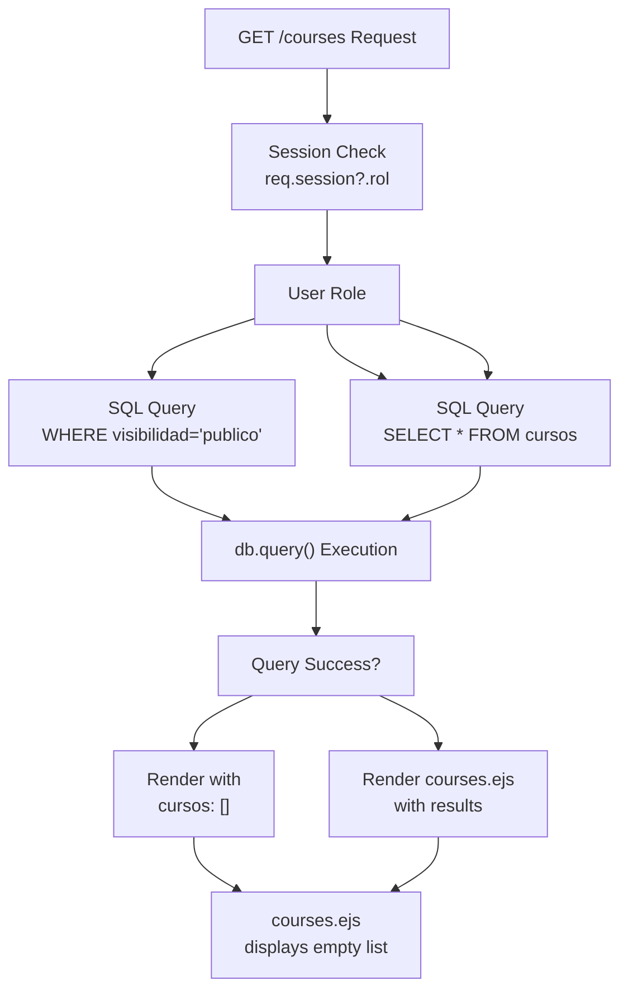
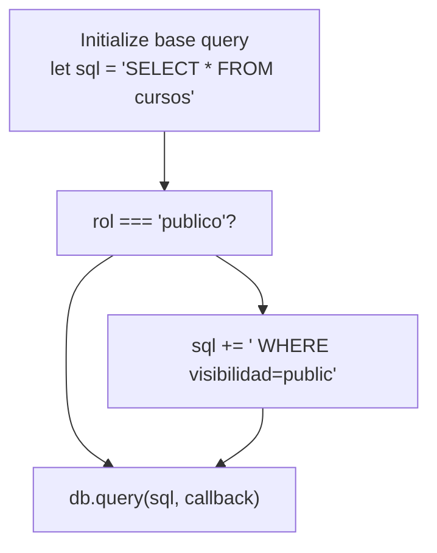
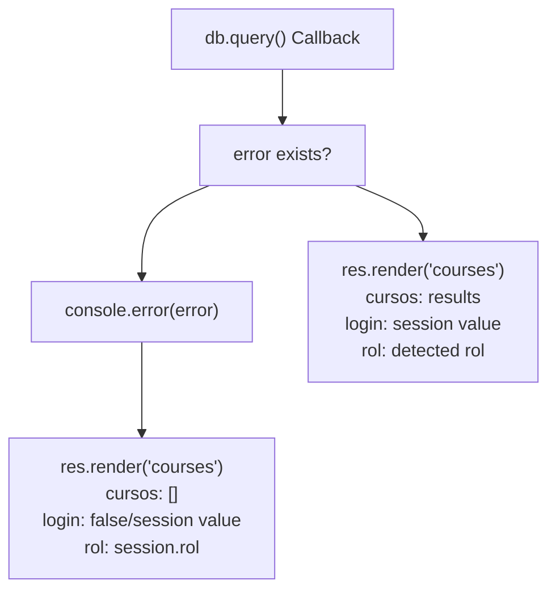
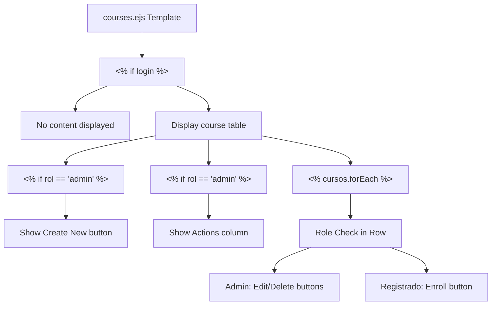

# Course Listing & Visibility

> **Relevant source files**
> * [routes/courses.js](https://github.com/Lourdes12587/Week06/blob/ce0c3bcd/routes/courses.js)
> * [views/courses.ejs](https://github.com/Lourdes12587/Week06/blob/ce0c3bcd/views/courses.ejs)

## Purpose and Scope

This document details the course listing system and its role-based visibility control mechanism. The system implements differential course display based on user authentication status and role, filtering which courses are visible to public users versus authenticated registered users and administrators.

For information about course enrollment functionality, see [Course Enrollment](/Lourdes12587/Week06/5.4-course-enrollment). For details about creating and managing course visibility settings, see [Creating Courses](/Lourdes12587/Week06/5.1-creating-courses) and [Editing & Deleting Courses](/Lourdes12587/Week06/5.2-editing-and-deleting-courses).

---

## Visibility Architecture Overview

The course listing system implements a two-tier visibility model where courses in the database have a `visibilidad` field that determines their accessibility. The system filters courses based on the requesting user's role before rendering the list.

**Visibility Control Flow Diagram**



Sources: [routes/courses.js L35-L62](https://github.com/Lourdes12587/Week06/blob/ce0c3bcd/routes/courses.js#L35-L62)

---

## Role Determination Logic

The `/courses` route handler begins by determining the user's role through session inspection. If no session exists or the user is not logged in, the role defaults to `'publico'`.

| Role | Session State | Query Filter |
| --- | --- | --- |
| `'publico'` | No session or not logged in | `WHERE visibilidad='publico'` |
| `'registrado'` | Logged in, `req.session.rol === 'registrado'` | No filter (all courses) |
| `'admin'` | Logged in, `req.session.rol === 'admin'` | No filter (all courses) |

The role detection occurs at [routes/courses.js L36](https://github.com/Lourdes12587/Week06/blob/ce0c3bcd/routes/courses.js#L36-L36)

 using the expression:

```javascript
const rol = req.session?.rol || 'publico';
```

This uses optional chaining to safely access the session and provides a default value of `'publico'` when the session is undefined or the `rol` property is absent.

Sources: [routes/courses.js L35-L42](https://github.com/Lourdes12587/Week06/blob/ce0c3bcd/routes/courses.js#L35-L42)

---

## Database Query Construction

The route constructs a dynamic SQL query based on the detected role. The base query selects all columns from the `cursos` table, and a conditional `WHERE` clause is appended for public users.

**Query Construction Logic Diagram**



The implementation at [routes/courses.js L38-L42](https://github.com/Lourdes12587/Week06/blob/ce0c3bcd/routes/courses.js#L38-L42)

 constructs the query as follows:

* Line 38: Initialize base SQL query string
* Lines 40-42: Conditional append of `WHERE visibilidad='publico'` filter for public users
* Line 44: Execute query with callback

This approach ensures that:

* Public users only see courses marked as `visibilidad='publico'` in the database
* Authenticated users (both `'registrado'` and `'admin'`) see all courses regardless of visibility setting

Sources: [routes/courses.js L38-L42](https://github.com/Lourdes12587/Week06/blob/ce0c3bcd/routes/courses.js#L38-L42)

---

## Error Handling and Results Processing

The database query execution includes error handling that ensures graceful degradation when database operations fail.



The error handling at [routes/courses.js L44-L61](https://github.com/Lourdes12587/Week06/blob/ce0c3bcd/routes/courses.js#L44-L61)

 follows this pattern:

1. **Error Path** [routes/courses.js L45-L54](https://github.com/Lourdes12587/Week06/blob/ce0c3bcd/routes/courses.js#L45-L54) : When a database error occurs, the error is logged to console, and the view is rendered with an empty array for courses. Session state is still passed to maintain UI consistency.
2. **Success Path** [routes/courses.js L56-L60](https://github.com/Lourdes12587/Week06/blob/ce0c3bcd/routes/courses.js#L56-L60) : When the query succeeds, the results array is passed directly to the view along with session state and the determined role.

The view receives three critical data points:

* `cursos`: Array of course objects (empty on error, query results on success)
* `login`: Boolean indicating if user has an active session (`req.session.loggedin`)
* `rol`: String indicating user's role (`'publico'`, `'registrado'`, or `'admin'`)

Sources: [routes/courses.js L44-L61](https://github.com/Lourdes12587/Week06/blob/ce0c3bcd/routes/courses.js#L44-L61)

---

## View Rendering and Conditional Display

The `courses.ejs` template adapts its display based on the `login` status and `rol` value passed from the route handler. The template uses EJS conditional tags to show or hide UI elements.

**Template Conditional Logic Structure**



### Display Logic Implementation

The template structure at [views/courses.ejs L8-L57](https://github.com/Lourdes12587/Week06/blob/ce0c3bcd/views/courses.ejs#L8-L57)

 implements the following visibility rules:

1. **Top-Level Authentication Gate** [views/courses.ejs L8](https://github.com/Lourdes12587/Week06/blob/ce0c3bcd/views/courses.ejs#L8-L8) : The entire course listing table is wrapped in `<% if (login) { %>`, preventing any course display for unauthenticated users or when login is false.
2. **Create Button Visibility** [views/courses.ejs L12-L14](https://github.com/Lourdes12587/Week06/blob/ce0c3bcd/views/courses.ejs#L12-L14) : The "Create New" button with link to `/create` appears only when `rol == "admin"`.
3. **Table Header Conditional Column** [views/courses.ejs L21-L23](https://github.com/Lourdes12587/Week06/blob/ce0c3bcd/views/courses.ejs#L21-L23) : An "Acciones" (Actions) header column is added to the table only for admin users.
4. **Row-Level Action Buttons** [views/courses.ejs L33-L51](https://github.com/Lourdes12587/Week06/blob/ce0c3bcd/views/courses.ejs#L33-L51) : Each course row contains conditional action buttons: * **Admin Actions** [views/courses.ejs L33-L42](https://github.com/Lourdes12587/Week06/blob/ce0c3bcd/views/courses.ejs#L33-L42) : Edit and delete buttons linking to `/edit/:id` and `/delete/:id` * **Registered User Actions** [views/courses.ejs L43-L51](https://github.com/Lourdes12587/Week06/blob/ce0c3bcd/views/courses.ejs#L43-L51) : Enroll button submitting POST to `/inscribir/:id`

### Table Structure

The table displays four core course fields for all authenticated users:

| Column | Data Source | Display |
| --- | --- | --- |
| id | `curso.id` | Course identifier |
| Titulo | `curso.titulo` | Course title |
| Descripcion | `curso.descripcion` | Course description |
| Categoria | `curso.categoria` | Course category |
| Acciones | Role-dependent | Admin: Edit/DeleteRegistrado: Enroll |

The iteration over courses occurs at [views/courses.ejs L27-L53](https://github.com/Lourdes12587/Week06/blob/ce0c3bcd/views/courses.ejs#L27-L53)

 using `<% cursos.forEach(curso => { %>`.

Sources: [views/courses.ejs L8-L57](https://github.com/Lourdes12587/Week06/blob/ce0c3bcd/views/courses.ejs#L8-L57)

---

## Role-to-View Mapping

The following table summarizes which UI elements are visible to each role when accessing `/courses`:

| UI Element | Publico | Registrado | Admin |
| --- | --- | --- | --- |
| Course listing page access | ✓ | ✓ | ✓ |
| Course table display | ✗ | ✓ | ✓ |
| Filtered courses (public only) | ✓ (but hidden) | ✗ | ✗ |
| All courses (regardless of visibility) | ✗ | ✓ | ✓ |
| "Create New" button | ✗ | ✗ | ✓ |
| Actions table column | ✗ | ✗ | ✓ |
| Edit button per course | ✗ | ✗ | ✓ |
| Delete button per course | ✗ | ✗ | ✓ |
| Enroll button per course | ✗ | ✓ | ✗ |

**Key Observation**: While public users can technically access the `/courses` endpoint, they see no content because the template requires `login` to be true. This creates a "soft" restriction where the route is accessible but displays nothing, effectively requiring authentication to view any courses.

Sources: [routes/courses.js L35-L62](https://github.com/Lourdes12587/Week06/blob/ce0c3bcd/routes/courses.js#L35-L62)

 [views/courses.ejs L8-L57](https://github.com/Lourdes12587/Week06/blob/ce0c3bcd/views/courses.ejs#L8-L57)

---

## Integration with Authentication Middleware

The `/courses` route at [routes/courses.js L35](https://github.com/Lourdes12587/Week06/blob/ce0c3bcd/routes/courses.js#L35-L35)

 notably does **not** use authentication middleware (`estaAutenticado`, `isAdmin`, or `isRegistrado`). This design decision allows the route to be accessible to all users, but the visibility filtering and template conditional logic enforce what each user type can actually see.

**Comparison with Protected Routes:**

```mermaid
flowchart TD

CreateRoute["GET /create"]
AuthMW["estaAutenticado"]
AdminMW["isAdmin"]
DirectAccess["Direct handler execution"]
CoursesRoute["GET /courses"]
NoMiddleware["No middleware"]
RoleDetection["Role detection in handler"]
ConditionalQuery["Conditional SQL query"]

subgraph subGraph1 ["Protected Route Pattern"]
    CreateRoute
    AuthMW
    AdminMW
    DirectAccess
    CreateRoute --> AuthMW
    AuthMW --> AdminMW
    AdminMW --> DirectAccess
end

subgraph subGraph0 ["Public Route Pattern"]
    CoursesRoute
    NoMiddleware
    RoleDetection
    ConditionalQuery
    CoursesRoute --> NoMiddleware
    NoMiddleware --> RoleDetection
    RoleDetection --> ConditionalQuery
end
```



This architectural choice means:

* The endpoint remains publicly accessible at the HTTP level
* Authorization is implicit through query filtering rather than explicit through middleware rejection
* Public users receive a response (albeit with filtered results and limited view rendering)
* The route handler must defensively handle the absence of session data

Sources: [routes/courses.js L8-L33](https://github.com/Lourdes12587/Week06/blob/ce0c3bcd/routes/courses.js#L8-L33)

 [routes/courses.js L35-L62](https://github.com/Lourdes12587/Week06/blob/ce0c3bcd/routes/courses.js#L35-L62)

---

## Visibility Field Database Integration

The `visibilidad` column in the `cursos` table determines which courses appear in the filtered public view. While the exact schema is defined in database initialization scripts, the query construction at [routes/courses.js L40-L42](https://github.com/Lourdes12587/Week06/blob/ce0c3bcd/routes/courses.js#L40-L42)

 reveals that:

* The field is named `visibilidad` (Spanish for "visibility")
* It accepts at least the value `'publico'` for publicly visible courses
* Courses without `visibilidad='publico'` are hidden from public users but remain visible to authenticated users

This creates a simple binary visibility model where administrators can mark courses as public or private when creating or editing them (see [Creating Courses](/Lourdes12587/Week06/5.1-creating-courses) and [Editing & Deleting Courses](/Lourdes12587/Week06/5.2-editing-and-deleting-courses) for course creation and modification workflows).

Sources: [routes/courses.js L38-L42](https://github.com/Lourdes12587/Week06/blob/ce0c3bcd/routes/courses.js#L38-L42)