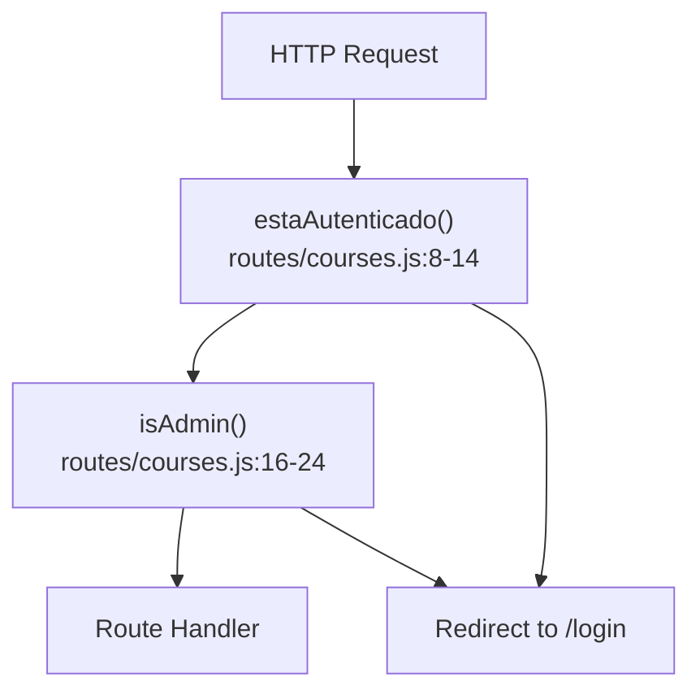
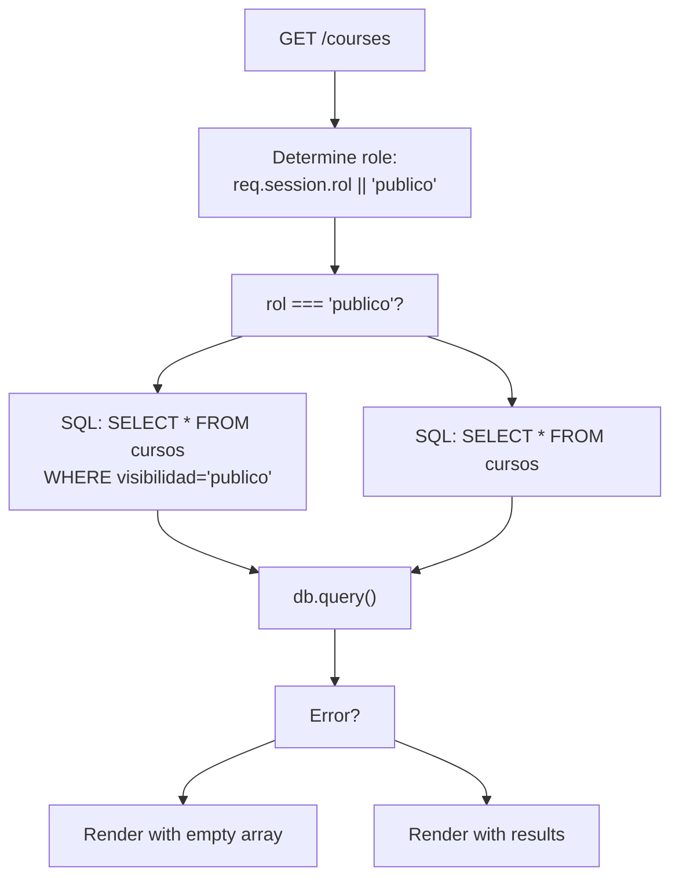
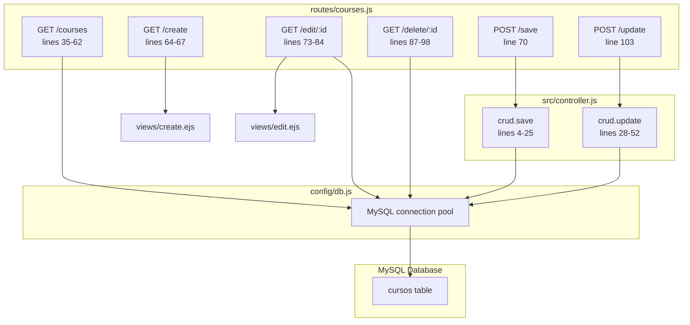

# Course Management Endpoints

> **Relevant source files**
> * [routes/courses.js](https://github.com/Lourdes12587/Week06/blob/ce0c3bcd/routes/courses.js)
> * [src/controller.js](https://github.com/Lourdes12587/Week06/blob/ce0c3bcd/src/controller.js)

## Purpose and Scope

This document provides a comprehensive reference for all course management HTTP endpoints in the system. These endpoints handle CRUD (Create, Read, Update, Delete) operations on courses and implement role-based access control to ensure only administrators can modify course data.

For enrollment-related endpoints, see [Enrollment Endpoints](/Lourdes12587/Week06/8.3-enrollment-endpoints). For user and admin profile endpoints, see [Profile Endpoints](/Lourdes12587/Week06/8.4-profile-endpoints). For authentication endpoints, see [Authentication Endpoints](/Lourdes12587/Week06/8.1-authentication-endpoints).

---

## Endpoint Summary

| Method | Path | Middleware | Role Required | Description |
| --- | --- | --- | --- | --- |
| `GET` | `/courses` | None | None (public) | List courses with role-based filtering |
| `GET` | `/create` | `estaAutenticado`, `isAdmin` | admin | Display course creation form |
| `POST` | `/save` | `estaAutenticado`, `isAdmin` | admin | Save new course to database |
| `GET` | `/edit/:id` | `estaAutenticado`, `isAdmin` | admin | Display edit form for existing course |
| `POST` | `/update` | `estaAutenticado`, `isAdmin` | admin | Update existing course in database |
| `GET` | `/delete/:id` | `estaAutenticado`, `isAdmin` | admin | Delete course from database |

**Sources:** [routes/courses.js L35-L103](https://github.com/Lourdes12587/Week06/blob/ce0c3bcd/routes/courses.js#L35-L103)

---

## Middleware Architecture

### Authentication and Authorization Flow



**Middleware Functions**

| Function | Purpose | Location | Validation Logic |
| --- | --- | --- | --- |
| `estaAutenticado` | Verify user is logged in | [routes/courses.js L8-L14](https://github.com/Lourdes12587/Week06/blob/ce0c3bcd/routes/courses.js#L8-L14) | Checks `req.session.loggedin` |
| `isAdmin` | Verify user has admin role | [routes/courses.js L16-L24](https://github.com/Lourdes12587/Week06/blob/ce0c3bcd/routes/courses.js#L16-L24) | Checks `req.session.rol === 'admin'` |
| `isRegistrado` | Verify user has registered role | [routes/courses.js L26-L33](https://github.com/Lourdes12587/Week06/blob/ce0c3bcd/routes/courses.js#L26-L33) | Checks `req.session.rol === 'registrado'` |

All course modification endpoints (create, update, delete) require both `estaAutenticado` and `isAdmin` middleware to execute.

**Sources:** [routes/courses.js L8-L33](https://github.com/Lourdes12587/Week06/blob/ce0c3bcd/routes/courses.js#L8-L33)

---

## GET /courses

### Description

Lists all courses available in the system. Implements role-based visibility filtering: public users see only courses marked with `visibilidad='publico'`, while authenticated users see all courses.

### Authentication

None required (publicly accessible)

### Request Parameters

None

### Response

Renders the `courses` EJS template with the following data:

| Property | Type | Description |
| --- | --- | --- |
| `cursos` | Array | Array of course objects from database |
| `login` | Boolean | Session login status (`req.session.loggedin`) |
| `rol` | String | User role (`publico`, `registrado`, or `admin`) |

### Implementation Logic



### Database Query

**For public users:**

```sql
SELECT * FROM cursos WHERE visibilidad='publico'
```

**For authenticated users:**

```sql
SELECT * FROM cursos
```

### Error Handling

If database query fails, the endpoint renders the `courses` template with an empty array and logs the error to console.

**Sources:** [routes/courses.js L35-L62](https://github.com/Lourdes12587/Week06/blob/ce0c3bcd/routes/courses.js#L35-L62)

---

## GET /create

### Description

Displays the course creation form interface. This endpoint is restricted to administrators only.

### Authentication

**Required:** User must be authenticated and have `admin` role

### Middleware Chain

1. `estaAutenticado` - Validates session exists
2. `isAdmin` - Validates admin role

### Request Parameters

None

### Response

Renders the `create` EJS template (course creation form)

### Authorization Behavior

* If user is not logged in → Redirect to `/login`
* If user lacks admin role → Redirect to `/login`
* If user is admin → Display course creation form

**Sources:** [routes/courses.js L64-L67](https://github.com/Lourdes12587/Week06/blob/ce0c3bcd/routes/courses.js#L64-L67)

---

## POST /save

### Description

Processes the submission of a new course and inserts it into the database. Delegates the actual database operation to the CRUD controller.

### Authentication

**Required:** User must be authenticated and have `admin` role

### Middleware Chain

1. `estaAutenticado` - Validates session exists
2. `isAdmin` - Validates admin role
3. `crud.save` - Controller function

### Request Parameters

**Body Parameters:**

| Field | Type | Required | Description |
| --- | --- | --- | --- |
| `titulo` | String | Yes | Course title |
| `descripcion` | String | Yes | Course description |
| `categoria` | String | Yes | Course category |

### Controller Implementation

The endpoint delegates to `crud.save` function which performs the following operation:

**Database Query:**

```sql
INSERT INTO cursos SET ?
```

With object containing: `titulo`, `descripcion`, `categoria`

### Response

Redirects to `/courses` regardless of success or failure

### Flow Diagram

```mermaid
sequenceDiagram
  participant Client
  participant POST /save
  participant routes/courses.js:70
  participant Middleware Chain
  participant crud.save
  participant src/controller.js:4-25
  participant MySQL cursos table

  Client->>POST /save: POST /save {titulo, descripcion, categoria}
  POST /save->>Middleware Chain: Check authentication & admin role
  Middleware Chain->>crud.save: Forward request
  crud.save->>crud.save: Extract body parameters
  crud.save->>MySQL cursos table: INSERT INTO cursos SET ?
  MySQL cursos table-->>crud.save: Result/Error
  crud.save-->>Client: Redirect to /courses
```

**Sources:** [routes/courses.js L70](https://github.com/Lourdes12587/Week06/blob/ce0c3bcd/routes/courses.js#L70-L70)

 [src/controller.js L4-L25](https://github.com/Lourdes12587/Week06/blob/ce0c3bcd/src/controller.js#L4-L25)

---

## GET /edit/:id

### Description

Displays the course edit form pre-populated with existing course data. Retrieves the course record from the database and passes it to the edit template.

### Authentication

**Required:** User must be authenticated and have `admin` role

### Middleware Chain

1. `estaAutenticado` - Validates session exists
2. `isAdmin` - Validates admin role

### Request Parameters

**URL Parameters:**

| Parameter | Type | Required | Description |
| --- | --- | --- | --- |
| `id` | Integer | Yes | Course ID to edit |

### Database Query

```sql
SELECT * FROM cursos WHERE id = ?
```

Uses parameterized query with `req.params.id` to prevent SQL injection.

### Response

Renders the `edit` EJS template with the following data:

| Property | Type | Description |
| --- | --- | --- |
| `curso` | Object | Course record from database (`results[0]`) |

### Error Handling

If database query fails, throws an error (no graceful handling implemented).

### Implementation Details

The endpoint directly queries the database within the route handler rather than delegating to a controller. The retrieved course object is passed to the edit template where form fields are pre-populated.

**Sources:** [routes/courses.js L73-L84](https://github.com/Lourdes12587/Week06/blob/ce0c3bcd/routes/courses.js#L73-L84)

---

## POST /update

### Description

Processes course update requests and modifies the existing course record in the database. Delegates to the CRUD controller for database operations.

### Authentication

**Required:** User must be authenticated and have `admin` role

### Middleware Chain

1. `estaAutenticado` - Validates session exists
2. `isAdmin` - Validates admin role
3. `crud.update` - Controller function

### Request Parameters

**Body Parameters:**

| Field | Type | Required | Description |
| --- | --- | --- | --- |
| `id` | Integer | Yes | Course ID to update |
| `titulo` | String | Yes | Updated course title |
| `descripcion` | String | Yes | Updated course description |
| `categoria` | String | Yes | Updated course category |

### Controller Implementation

The endpoint delegates to `crud.update` which executes:

**Database Query:**

```sql
UPDATE cursos SET ? WHERE id = ?
```

With parameters: `[{titulo, descripcion, categoria}, id]`

### Response

Redirects to `/courses` after update attempt

### Error Handling

Logs error to console if update fails, then redirects to `/courses`

**Sources:** [routes/courses.js L103](https://github.com/Lourdes12587/Week06/blob/ce0c3bcd/routes/courses.js#L103-L103)

 [src/controller.js L28-L52](https://github.com/Lourdes12587/Week06/blob/ce0c3bcd/src/controller.js#L28-L52)

---

## GET /delete/:id

### Description

Permanently deletes a course from the database. This is a destructive operation with no confirmation step at the API level (confirmation is handled in the frontend).

### Authentication

**Required:** User must be authenticated and have `admin` role

### Middleware Chain

1. `estaAutenticado` - Validates session exists
2. `isAdmin` - Validates admin role

### Request Parameters

**URL Parameters:**

| Parameter | Type | Required | Description |
| --- | --- | --- | --- |
| `id` | Integer | Yes | Course ID to delete |

### Database Query

```sql
DELETE FROM cursos WHERE id = ?
```

Uses parameterized query with `req.params.id` to prevent SQL injection.

### Response

Redirects to `/courses` after deletion

### Error Handling

If database query fails, throws an error (no graceful handling implemented).

### Cascading Effects

**Warning:** This operation does not handle foreign key constraints. If enrollments (`inscripciones` table) reference this course via `id_curso`, the database may reject the deletion depending on foreign key configuration.

**Sources:** [routes/courses.js L87-L98](https://github.com/Lourdes12587/Week06/blob/ce0c3bcd/routes/courses.js#L87-L98)

---

## Route-to-Controller Mapping

The following diagram maps HTTP routes to their implementation in the codebase:



**Sources:** [routes/courses.js L1-L187](https://github.com/Lourdes12587/Week06/blob/ce0c3bcd/routes/courses.js#L1-L187)

 [src/controller.js L1-L53](https://github.com/Lourdes12587/Week06/blob/ce0c3bcd/src/controller.js#L1-L53)

---

## Security Considerations

### Access Control Matrix

| Endpoint | Public | Registered | Admin |
| --- | --- | --- | --- |
| `GET /courses` | ✓ (filtered) | ✓ (all) | ✓ (all) |
| `GET /create` | ✗ | ✗ | ✓ |
| `POST /save` | ✗ | ✗ | ✓ |
| `GET /edit/:id` | ✗ | ✗ | ✓ |
| `POST /update` | ✗ | ✗ | ✓ |
| `GET /delete/:id` | ✗ | ✗ | ✓ |

### SQL Injection Prevention

All database queries use parameterized queries with placeholders (`?`) to prevent SQL injection attacks:

* Edit query: `<FileRef file-url="https://github.com/Lourdes12587/Week06/blob/ce0c3bcd/routes/courses.js#L77-L77" min=77  file-path="routes/courses.js">Hii</FileRef>` uses `[id]`
* Delete query: `<FileRef file-url="https://github.com/Lourdes12587/Week06/blob/ce0c3bcd/routes/courses.js#L91-L91" min=91  file-path="routes/courses.js">Hii</FileRef>` uses `[id]`
* Update query: `<FileRef file-url="https://github.com/Lourdes12587/Week06/blob/ce0c3bcd/src/controller.js#L36-L42" min=36 max=42 file-path="src/controller.js">Hii</FileRef>` uses `[{...}, id]`

### Session Validation

The `estaAutenticado` middleware validates session state before allowing access:

```
if (req.session && req.session.loggedin)
```

The `isAdmin` middleware further restricts access:

```
if (req.session?.loggedin && req.session?.rol === 'admin')
```

**Sources:** [routes/courses.js L8-L24](https://github.com/Lourdes12587/Week06/blob/ce0c3bcd/routes/courses.js#L8-L24)

---

## Common Response Patterns

### Success Responses

All modification endpoints (`save`, `update`, `delete`) follow the Post-Redirect-Get (PRG) pattern:

1. Process the request
2. Perform database operation
3. Redirect to `/courses`

This prevents duplicate submissions from browser refresh and provides a clean URL after operations.

### Unauthorized Access

Requests without proper authentication or authorization are redirected to `/login` by the middleware chain.

### Error Handling

Most endpoints implement minimal error handling:

* Database errors are logged to console
* Successful operations and errors both redirect to `/courses`
* The `GET /courses` endpoint provides graceful degradation by rendering with an empty course array

**Sources:** [routes/courses.js L35-L103](https://github.com/Lourdes12587/Week06/blob/ce0c3bcd/routes/courses.js#L35-L103)

 [src/controller.js L4-L52](https://github.com/Lourdes12587/Week06/blob/ce0c3bcd/src/controller.js#L4-L52)