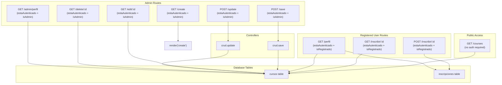
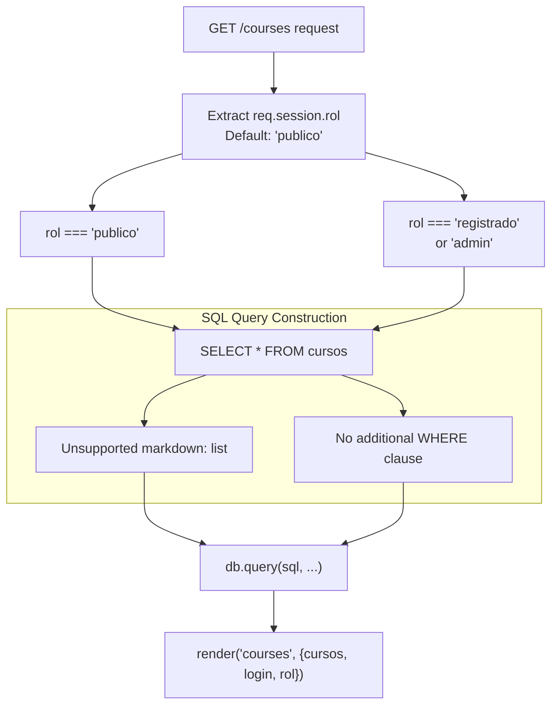
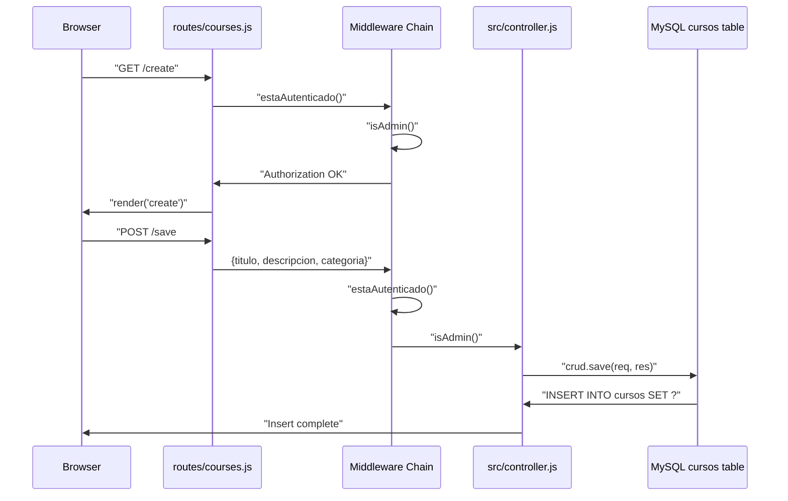
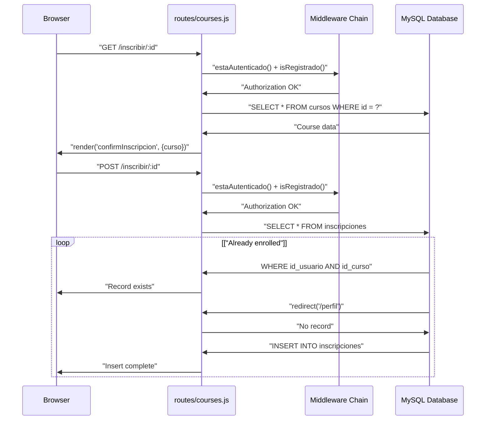

# Course Management System

> **Relevant source files**
> * [routes/courses.js](https://github.com/Lourdes12587/Week06/blob/ce0c3bcd/routes/courses.js)
> * [src/controller.js](https://github.com/Lourdes12587/Week06/blob/ce0c3bcd/src/controller.js)
> * [views/courses.ejs](https://github.com/Lourdes12587/Week06/blob/ce0c3bcd/views/courses.ejs)

## Purpose and Scope

This document provides an overview of the course management functionality within the application. It covers the CRUD operations for courses, role-based access control mechanisms, and the visibility system that determines which users can view and interact with courses. For detailed information on specific operations, see [Creating Courses](/Lourdes12587/Week06/5.1-creating-courses), [Editing & Deleting Courses](/Lourdes12587/Week06/5.2-editing-and-deleting-courses), [Course Listing & Visibility](/Lourdes12587/Week06/5.3-course-listing-and-visibility), and [Course Enrollment](/Lourdes12587/Week06/5.4-course-enrollment). For user authentication and role definitions, see [Authentication & Authorization](/Lourdes12587/Week06/4-authentication-and-authorization) and [Role-Based Access Control](/Lourdes12587/Week06/4.3-role-based-access-control).

The course management system is implemented primarily through `routes/courses.js`, which defines all course-related endpoints, and `src/controller.js`, which provides CRUD controller functions for database operations.

## System Overview

The course management system provides distinct capabilities based on user roles:

| Role | Capabilities |
| --- | --- |
| `publico` | View courses with `visibilidad='publico'` |
| `registrado` | View all visible courses, enroll in courses, view personal enrolled courses |
| `admin` | Full CRUD operations on courses, manage visibility, view statistics |

All course data is stored in the `cursos` table within the MySQL database. Course enrollment relationships are tracked in the `inscripciones` junction table, linking `id_usuario` to `id_curso`.

**Sources:** [routes/courses.js L1-L187](https://github.com/Lourdes12587/Week06/blob/ce0c3bcd/routes/courses.js#L1-L187)

## Route Architecture

The course management routes are organized within `routes/courses.js` and follow a consistent pattern of authentication and authorization checks before executing operations.

### Course Management Route Map



**Sources:** [routes/courses.js L35-L185](https://github.com/Lourdes12587/Week06/blob/ce0c3bcd/routes/courses.js#L35-L185)

## Middleware Chain

Three middleware functions enforce access control throughout the course management system:

### estaAutenticado

Verifies that a user has an active session before allowing access to protected routes.

```javascript
function estaAutenticado(req, res, next)
```

Checks `req.session.loggedin` and redirects to `/login` if false.

**Sources:** [routes/courses.js L8-L14](https://github.com/Lourdes12587/Week06/blob/ce0c3bcd/routes/courses.js#L8-L14)

### isAdmin

Ensures the authenticated user has the `admin` role.

```javascript
function isAdmin(req, res, next)
```

Verifies `req.session.rol === 'admin'` and redirects to `/login` if the condition is not met.

**Sources:** [routes/courses.js L16-L24](https://github.com/Lourdes12587/Week06/blob/ce0c3bcd/routes/courses.js#L16-L24)

### isRegistrado

Ensures the authenticated user has the `registrado` role.

```javascript
function isRegistrado(req, res, next)
```

Verifies `req.session.rol === 'registrado'` and redirects to `/login` if the condition is not met.

**Sources:** [routes/courses.js L26-L33](https://github.com/Lourdes12587/Week06/blob/ce0c3bcd/routes/courses.js#L26-L33)

## Course CRUD Operations

### Course Data Structure

The `cursos` table stores the following fields for each course:

| Field | Type | Description |
| --- | --- | --- |
| `id` | Primary Key | Unique course identifier |
| `titulo` | String | Course title |
| `descripcion` | String | Course description |
| `categoria` | String | Course category classification |
| `visibilidad` | Enum | Access control: `'publico'` or other values |

### CRUD Controller Functions

The `src/controller.js` module provides two core CRUD operations:

#### save

Inserts a new course record into the database.

**Request Body Parameters:**

* `titulo`: Course title
* `descripcion`: Course description
* `categoria`: Course category

**Database Operation:** `INSERT INTO cursos SET ?`

**Response:** Redirects to `/courses`

**Sources:** [src/controller.js L4-L25](https://github.com/Lourdes12587/Week06/blob/ce0c3bcd/src/controller.js#L4-L25)

#### update

Modifies an existing course record.

**Request Body Parameters:**

* `id`: Course identifier
* `titulo`: Updated title
* `descripcion`: Updated description
* `categoria`: Updated category

**Database Operation:** `UPDATE cursos SET ? WHERE id = ?`

**Response:** Redirects to `/courses`

**Sources:** [src/controller.js L28-L52](https://github.com/Lourdes12587/Week06/blob/ce0c3bcd/src/controller.js#L28-L52)

## Visibility Control System

The course listing implements visibility filtering based on user role:



**Logic:**

* Public users (`rol === 'publico'`) see only courses where `visibilidad='publico'`
* Registered users and admins see all courses regardless of visibility

**Implementation:** [routes/courses.js L35-L62](https://github.com/Lourdes12587/Week06/blob/ce0c3bcd/routes/courses.js#L35-L62)

**Sources:** [routes/courses.js L35-L62](https://github.com/Lourdes12587/Week06/blob/ce0c3bcd/routes/courses.js#L35-L62)

## Request-Response Flow

### Admin Course Creation Flow



**Sources:** [routes/courses.js L64-L70](https://github.com/Lourdes12587/Week06/blob/ce0c3bcd/routes/courses.js#L64-L70)

 [src/controller.js L4-L25](https://github.com/Lourdes12587/Week06/blob/ce0c3bcd/src/controller.js#L4-L25)

### User Enrollment Flow



**Sources:** [routes/courses.js L106-L149](https://github.com/Lourdes12587/Week06/blob/ce0c3bcd/routes/courses.js#L106-L149)

## View Integration

The course listing view (`views/courses.ejs`) adapts its interface based on the user's role:

### Conditional UI Elements

| User Role | UI Elements Displayed |
| --- | --- |
| Not logged in | Read-only course table |
| `registrado` | Course table + "Inscribirse" buttons per course |
| `admin` | Course table + "Crear Nuevo" button + "Edit" and "Delete" actions per course |

**Key Template Logic:**

* Line 8: `<% if (login) { %>` - Shows table only for authenticated users
* Line 12: `<% if (rol == "admin") { %>` - Shows create button for admins
* Line 21: `<% if (rol == "admin") { %>` - Adds "Acciones" column header for admins
* Line 33: Admin-specific edit/delete action buttons
* Line 43: `<% if (rol === "registrado") { %>` - Shows enrollment button for registered users

**Sources:** [views/courses.ejs L1-L58](https://github.com/Lourdes12587/Week06/blob/ce0c3bcd/views/courses.ejs#L1-L58)

## Course Operations Summary

### Read Operations

| Route | Middleware | Description | View Rendered |
| --- | --- | --- | --- |
| `GET /courses` | None | List courses (filtered by role) | `courses.ejs` |
| `GET /edit/:id` | `estaAutenticado + isAdmin` | Retrieve course for editing | `edit.ejs` |
| `GET /inscribir/:id` | `estaAutenticado + isRegistrado` | Show enrollment confirmation | `confirmInscripcion.ejs` |
| `GET /perfil` | `estaAutenticado + isRegistrado` | Show user's enrolled courses | `perfil.ejs` |
| `GET /admin/perfil` | `estaAutenticado + isAdmin` | Show admin dashboard with stats | `adminPerfil.ejs` |

### Write Operations

| Route | Middleware | Controller | Database Operation | Redirect Target |
| --- | --- | --- | --- | --- |
| `POST /save` | `estaAutenticado + isAdmin` | `crud.save` | `INSERT INTO cursos` | `/courses` |
| `POST /update` | `estaAutenticado + isAdmin` | `crud.update` | `UPDATE cursos` | `/courses` |
| `GET /delete/:id` | `estaAutenticado + isAdmin` | Inline | `DELETE FROM cursos` | `/courses` |
| `POST /inscribir/:id` | `estaAutenticado + isRegistrado` | Inline | `INSERT INTO inscripciones` | `/perfil` |

**Sources:** [routes/courses.js L35-L185](https://github.com/Lourdes12587/Week06/blob/ce0c3bcd/routes/courses.js#L35-L185)

## Database Query Patterns

The course management system uses parameterized queries to prevent SQL injection:

**Parameterized SELECT:**

```sql
SELECT * FROM cursos WHERE id = ?
```

Parameters: `[id]`

**Parameterized INSERT:**

```sql
INSERT INTO cursos SET ?
```

Parameters: `{titulo, descripcion, categoria}`

**Parameterized UPDATE:**

```sql
UPDATE cursos SET ? WHERE id = ?
```

Parameters: `[{titulo, descripcion, categoria}, id]`

**Parameterized DELETE:**

```sql
DELETE FROM cursos WHERE id = ?
```

Parameters: `[id]`

**Join Query for User Enrollments:**

```sql
SELECT c.* 
FROM cursos c
JOIN inscripciones i ON c.id = i.id_curso
WHERE i.id_usuario = ?
```

Parameters: `[idUsuario]`

**Sources:** [routes/courses.js L38-L161](https://github.com/Lourdes12587/Week06/blob/ce0c3bcd/routes/courses.js#L38-L161)

 [src/controller.js L9-L50](https://github.com/Lourdes12587/Week06/blob/ce0c3bcd/src/controller.js#L9-L50)

## Error Handling

Error handling in the course management system follows consistent patterns:

1. **Database Query Errors:** Log to console and redirect to safe routes
2. **Missing Records:** Return empty results or redirect to course listing
3. **Authorization Failures:** Redirect to `/login`

Example from enrollment check:

* If course not found: Redirect to `/courses` [routes/courses.js L110](https://github.com/Lourdes12587/Week06/blob/ce0c3bcd/routes/courses.js#L110-L110)
* If database error during enrollment check: Log and redirect to `/courses` [routes/courses.js L125-L128](https://github.com/Lourdes12587/Week06/blob/ce0c3bcd/routes/courses.js#L125-L128)

**Sources:** [routes/courses.js L44-L54](https://github.com/Lourdes12587/Week06/blob/ce0c3bcd/routes/courses.js#L44-L54)

 [routes/courses.js L77-L83](https://github.com/Lourdes12587/Week06/blob/ce0c3bcd/routes/courses.js#L77-L83)

 [src/controller.js L16-L23](https://github.com/Lourdes12587/Week06/blob/ce0c3bcd/src/controller.js#L16-L23)