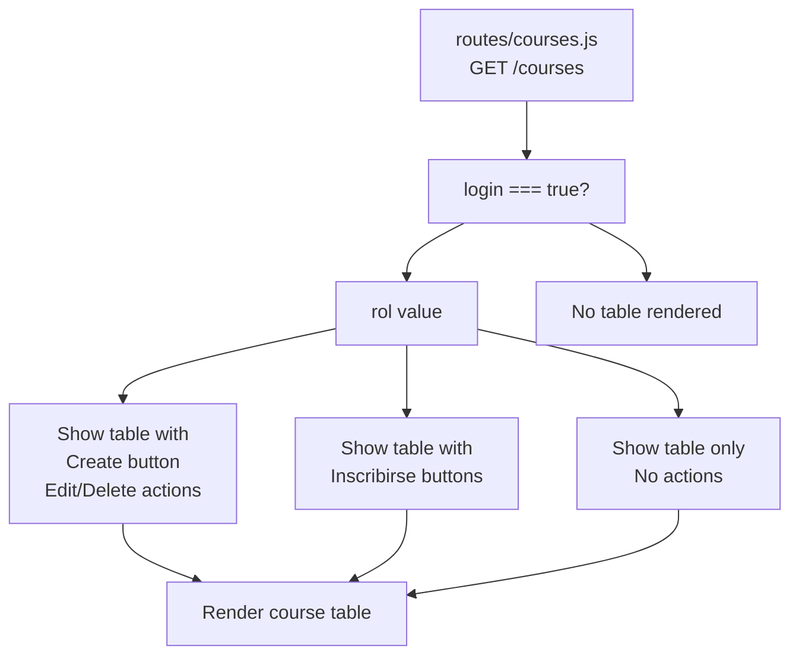
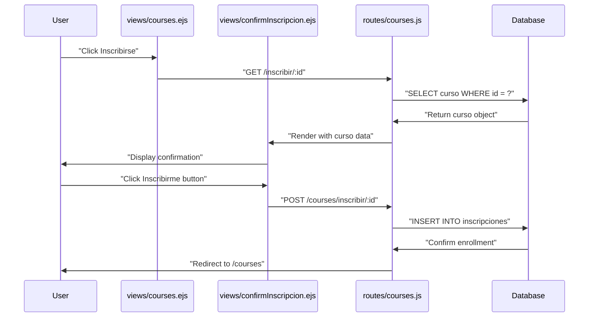
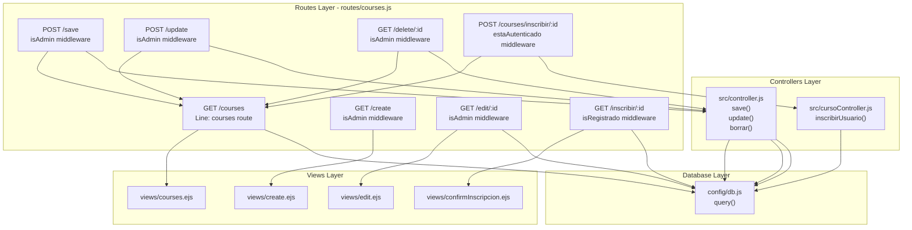
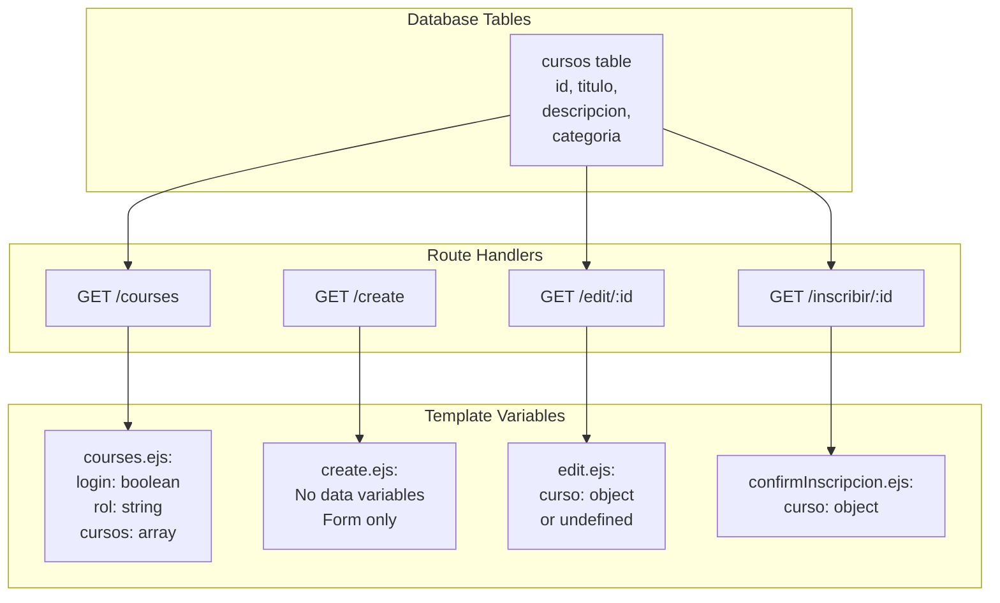

# Course Views

> **Relevant source files**
> * [views/confirmInscripcion.ejs](https://github.com/Lourdes12587/Week06/blob/ce0c3bcd/views/confirmInscripcion.ejs)
> * [views/courses.ejs](https://github.com/Lourdes12587/Week06/blob/ce0c3bcd/views/courses.ejs)
> * [views/create.ejs](https://github.com/Lourdes12587/Week06/blob/ce0c3bcd/views/create.ejs)
> * [views/edit.ejs](https://github.com/Lourdes12587/Week06/blob/ce0c3bcd/views/edit.ejs)

## Purpose and Scope

This document details the EJS template views that render course-related user interfaces in the system. These views handle course listing, creation, editing, and enrollment confirmation. Each view adapts its interface based on the authenticated user's role (admin, registrado, or publico).

For information about the authentication-related views (login and registration forms), see [Authentication Views](/Lourdes12587/Week06/7.3-authentication-views). For details about the template system structure and shared partials, see [Template System & Partials](/Lourdes12587/Week06/7.1-template-system-and-partials). For backend route handlers and controllers that serve these views, see [Course Management System](/Lourdes12587/Week06/5-course-management-system) and [API Reference](/Lourdes12587/Week06/8-api-reference).

## Overview of Course Views

The system provides four primary course-related views, each serving a distinct purpose in the course management workflow:

| View File | Route | Primary Users | Purpose |
| --- | --- | --- | --- |
| `views/courses.ejs` | `GET /courses` | All authenticated users | Display all available courses with role-specific actions |
| `views/create.ejs` | `GET /create` | Admin only | Form to create new courses |
| `views/edit.ejs` | `GET /edit/:id` | Admin only | Form to edit existing course details |
| `views/confirmInscripcion.ejs` | `GET /inscribir/:id` | Registered users only | Confirmation page before enrollment |

**Sources:** [views/courses.ejs L1-L58](https://github.com/Lourdes12587/Week06/blob/ce0c3bcd/views/courses.ejs#L1-L58)

 [views/create.ejs L1-L29](https://github.com/Lourdes12587/Week06/blob/ce0c3bcd/views/create.ejs#L1-L29)

 [views/edit.ejs L1-L35](https://github.com/Lourdes12587/Week06/blob/ce0c3bcd/views/edit.ejs#L1-L35)

 [views/confirmInscripcion.ejs L1-L14](https://github.com/Lourdes12587/Week06/blob/ce0c3bcd/views/confirmInscripcion.ejs#L1-L14)

## Course Listing View

### File Structure and Includes

The course listing view (`views/courses.ejs`) serves as the primary interface for browsing available courses. The view begins by including standard partials and loading external resources:

```
<%- include('partials/head') %>
<link href='https://cdn.boxicons.com/fonts/basic/boxicons.min.css' rel='stylesheet'>
<link rel="stylesheet" href="/resources/css/admin.css">
<%- include('partials/header') %>
```

The view loads Boxicons for action icons and a custom admin stylesheet for enhanced styling.

**Sources:** [views/courses.ejs L1-L6](https://github.com/Lourdes12587/Week06/blob/ce0c3bcd/views/courses.ejs#L1-L6)

### Role-Based Rendering Logic

The entire course listing is conditionally rendered based on the `login` status. The view receives three critical variables from the route handler: `login` (boolean), `rol` (string), and `cursos` (array).



**Sources:** [views/courses.ejs L8-L57](https://github.com/Lourdes12587/Week06/blob/ce0c3bcd/views/courses.ejs#L8-L57)

### Admin Features

Administrators see enhanced functionality including a course creation button and action columns for each course:

| Feature | Implementation | Location |
| --- | --- | --- |
| Create New Button | `<a href="/create" class="btn btn-outline-primary">` with Boxicons plus icon | [views/courses.ejs L13](https://github.com/Lourdes12587/Week06/blob/ce0c3bcd/views/courses.ejs#L13-L13) |
| Edit Action | `<a href="/edit/<%= curso.id %>" class="btn btn-outline-warning">` with edit icon | [views/courses.ejs L35-L37](https://github.com/Lourdes12587/Week06/blob/ce0c3bcd/views/courses.ejs#L35-L37) |
| Delete Action | `<a href="/delete/<%= curso.id %>" class="btn btn-outline-danger">` with trash icon | [views/courses.ejs L38-L40](https://github.com/Lourdes12587/Week06/blob/ce0c3bcd/views/courses.ejs#L38-L40) |

The action column header is conditionally rendered only for admin users:

```xml
<% if (rol == "admin") { %>       
  <th scope="col">Acciones</th>
<% } %>
```

**Sources:** [views/courses.ejs L12-L14](https://github.com/Lourdes12587/Week06/blob/ce0c3bcd/views/courses.ejs#L12-L14)

 [views/courses.ejs L21-L23](https://github.com/Lourdes12587/Week06/blob/ce0c3bcd/views/courses.ejs#L21-L23)

 [views/courses.ejs L33-L42](https://github.com/Lourdes12587/Week06/blob/ce0c3bcd/views/courses.ejs#L33-L42)

### Registered User Features

Registered users (with `rol === "registrado"`) see an enrollment button for each course instead of edit/delete actions. The implementation uses a POST form with an inline submit button:

```xml
<% if (rol === "registrado") { %>
  <td>
    <form action="/inscribir/<%= curso.id %>" method="POST" style="display:inline;">
      <button type="submit" class="btn btn-outline-success btn-sm">
        <i class="bx bxs-bookmark-plus"></i> Inscribirse
      </button>
    </form>
  </td>
<% } %>
```

Note: This form implementation has been superseded by the two-step enrollment process using `views/confirmInscripcion.ejs`. The route `GET /inscribir/:id` now displays the confirmation page before processing the enrollment.

**Sources:** [views/courses.ejs L43-L51](https://github.com/Lourdes12587/Week06/blob/ce0c3bcd/views/courses.ejs#L43-L51)

### Course Table Structure

The course listing displays a Bootstrap-styled table with the following columns:

| Column | Data Source | Always Visible |
| --- | --- | --- |
| id | `curso.id` | Yes |
| Titulo | `curso.titulo` | Yes |
| Descripcion | `curso.descripcion` | Yes |
| Categoria | `curso.categoria` | Yes |
| Acciones | Dynamic actions based on role | Conditional |

The table header uses Bootstrap's `bg-primary text-white` classes for styling:

**Sources:** [views/courses.ejs L10-L55](https://github.com/Lourdes12587/Week06/blob/ce0c3bcd/views/courses.ejs#L10-L55)

## Course Creation View

### Form Layout

The course creation view (`views/create.ejs`) provides a simple form interface for administrators to add new courses. The form uses Bootstrap's card component for visual structure:

```html
<div class="container mt-4 w-25">
  <div class="card border-secundary">
    <div class="card-header">FORMULARIO PARA CREAR CURSO</div>
    <div class="card-body">
      <form action="/save" method="post">
        ...
      </form>
    </div>
  </div>
</div>
```

The container is constrained to 25% width (`w-25`) and includes top margin (`mt-4`) for spacing.

**Sources:** [views/create.ejs L5-L29](https://github.com/Lourdes12587/Week06/blob/ce0c3bcd/views/create.ejs#L5-L29)

### Input Fields

The form collects three fields for course creation:

| Field Name | Input Type | Bootstrap Class | Required |
| --- | --- | --- | --- |
| `titulo` | text | `form-control` | Server-side validated |
| `descripcion` | text | `form-control` | Server-side validated |
| `categoria` | text | `form-control` | Server-side validated |

Each field follows the same structure with label and input wrapped in `mb-3` (margin-bottom) divs:

```html
<div class="mb-3">
  <label for="titulo" class="form-label">Titulo: </label>
  <input type="text" class="form-control" id="titulo" name="titulo"/>
</div>
```

**Sources:** [views/create.ejs L11-L22](https://github.com/Lourdes12587/Week06/blob/ce0c3bcd/views/create.ejs#L11-L22)

### Form Submission

The form submits to `POST /save` with two action buttons:

* **Guardar (Save)**: Primary button that submits the form
* **Cancelar (Cancel)**: Secondary link-styled as button that redirects to `/courses`

```xml
<button type="submit" class="btn btn-primary">Guardar</button>
<a href="/courses" class="btn btn-danger">Cancelar</a>
```

**Sources:** [views/create.ejs L10](https://github.com/Lourdes12587/Week06/blob/ce0c3bcd/views/create.ejs#L10-L10)

 [views/create.ejs L24-L25](https://github.com/Lourdes12587/Week06/blob/ce0c3bcd/views/create.ejs#L24-L25)

## Course Edit View

### Pre-Population Logic

The edit view (`views/edit.ejs`) conditionally renders based on whether a `curso` object was found. If the course exists, the form is pre-populated with current values; otherwise, an error message displays:

```xml
<% if(curso){ %>
  <!-- Edit form -->
<% } else { %>
  <h1> CURSOS NO ENCONTRADO</h1>
<% } %>
```

**Sources:** [views/edit.ejs L5](https://github.com/Lourdes12587/Week06/blob/ce0c3bcd/views/edit.ejs#L5-L5)

 [views/edit.ejs L32-L34](https://github.com/Lourdes12587/Week06/blob/ce0c3bcd/views/edit.ejs#L32-L34)

### Hidden ID Field

The edit form includes a hidden `id` field to identify which course to update. This field is placed at the beginning of the form and is not displayed to the user:

```sql
<form action="/update" method="post">
  <input type="text" name="id" id="id" value="<%= curso.id%>"/>
  ...
</form>
```

Note: The `id` field should use `type="hidden"` instead of `type="text"` for proper form semantics, though it functions correctly as-is.

**Sources:** [views/edit.ejs L10-L11](https://github.com/Lourdes12587/Week06/blob/ce0c3bcd/views/edit.ejs#L10-L11)

### Value Pre-Population

Each input field is pre-filled with the current course data using the `value` attribute:

```
<input type="text" class="form-control" id="titulo" 
       name="titulo" value="<%= curso.titulo %>" />

<input type="text" class="form-control" id="descripcion" 
       name="descripcion" value="<%= curso.descripcion %>" />

<input type="text" class="form-control" id="categoria" 
       name="categoria" value="<%= curso.categoria%>"/>
```

The form structure mirrors the creation form but includes pre-populated values and posts to `POST /update` instead of `/save`.

**Sources:** [views/edit.ejs L13-L24](https://github.com/Lourdes12587/Week06/blob/ce0c3bcd/views/edit.ejs#L13-L24)

## Enrollment Confirmation View

### Confirmation Flow

The enrollment confirmation view (`views/confirmInscripcion.ejs`) implements a two-step enrollment process to prevent accidental enrollments. The view displays course details and requires explicit user confirmation:



**Sources:** [views/confirmInscripcion.ejs L1-L14](https://github.com/Lourdes12587/Week06/blob/ce0c3bcd/views/confirmInscripcion.ejs#L1-L14)

### Course Information Display

The confirmation page displays two key pieces of course information:

```html
<h3>Confirmar inscripción</h3>
<p>Curso: <strong><%= curso.titulo %></strong></p>
<p>Descripción: <%= curso.descripcion %></p>
```

The course title is emphasized with `<strong>` tags to draw attention to the course being enrolled in.

**Sources:** [views/confirmInscripcion.ejs L6-L8](https://github.com/Lourdes12587/Week06/blob/ce0c3bcd/views/confirmInscripcion.ejs#L6-L8)

### Confirmation Actions

The form provides two buttons for user decision:

| Button | Type | Action | CSS Class |
| --- | --- | --- | --- |
| Inscribirme | submit | Posts to `/courses/inscribir/<%= curso.id %>` | `btn btn-success` |
| Cancelar | link | Redirects to `/courses` | `btn btn-secondary` |

```xml
<form action="/courses/inscribir/<%= curso.id %>" method="POST">
  <button type="submit" class="btn btn-success">Inscribirme</button>
  <a href="/courses" class="btn btn-secondary">Cancelar</a>
</form>
```

**Sources:** [views/confirmInscripcion.ejs L10-L13](https://github.com/Lourdes12587/Week06/blob/ce0c3bcd/views/confirmInscripcion.ejs#L10-L13)

## View-Route-Controller Mapping

The following diagram illustrates how each course view connects to its corresponding route handler, middleware, and database operations:



**Sources:** [views/courses.ejs L1-L58](https://github.com/Lourdes12587/Week06/blob/ce0c3bcd/views/courses.ejs#L1-L58)

 [views/create.ejs L1-L29](https://github.com/Lourdes12587/Week06/blob/ce0c3bcd/views/create.ejs#L1-L29)

 [views/edit.ejs L1-L35](https://github.com/Lourdes12587/Week06/blob/ce0c3bcd/views/edit.ejs#L1-L35)

 [views/confirmInscripcion.ejs L1-L14](https://github.com/Lourdes12587/Week06/blob/ce0c3bcd/views/confirmInscripcion.ejs#L1-L14)

## Conditional Rendering Patterns

The course views extensively use EJS conditional rendering to adapt the UI based on user authentication and role. The following table summarizes the conditional logic patterns:

| View | Condition | Rendered Content | Purpose |
| --- | --- | --- | --- |
| courses.ejs | `if (login)` | Entire course table | Prevent unauthorized access |
| courses.ejs | `if (rol == "admin")` | "Crear Nuevo" button | Admin-only course creation |
| courses.ejs | `if (rol == "admin")` | "Acciones" table header | Admin-only action column |
| courses.ejs | `if (rol == "admin")` | Edit/Delete buttons | Admin-only course management |
| courses.ejs | `if (rol === "registrado")` | "Inscribirse" button | Registered user enrollment |
| edit.ejs | `if(curso)` | Edit form | Handle missing course |
| edit.ejs | `else` | "CURSOS NO ENCONTRADO" | Error state |

### EJS Conditional Syntax

The views use standard EJS scriptlet tags for conditional logic:

```
<% if (condition) { %>
  <!-- Content when condition is true -->
<% } %>

<% if (condition) { %>
  <!-- Content when condition is true -->
<% } else { %>
  <!-- Content when condition is false -->
<% } %>
```

**Sources:** [views/courses.ejs L8](https://github.com/Lourdes12587/Week06/blob/ce0c3bcd/views/courses.ejs#L8-L8)

 [views/courses.ejs L12-L14](https://github.com/Lourdes12587/Week06/blob/ce0c3bcd/views/courses.ejs#L12-L14)

 [views/courses.ejs L21-L23](https://github.com/Lourdes12587/Week06/blob/ce0c3bcd/views/courses.ejs#L21-L23)

 [views/courses.ejs L33-L42](https://github.com/Lourdes12587/Week06/blob/ce0c3bcd/views/courses.ejs#L33-L42)

 [views/courses.ejs L43-L51](https://github.com/Lourdes12587/Week06/blob/ce0c3bcd/views/courses.ejs#L43-L51)

 [views/edit.ejs L5](https://github.com/Lourdes12587/Week06/blob/ce0c3bcd/views/edit.ejs#L5-L5)

 [views/edit.ejs L32-L34](https://github.com/Lourdes12587/Week06/blob/ce0c3bcd/views/edit.ejs#L32-L34)

## Data Flow and Template Variables

Each course view receives specific data from its route handler. The following diagram maps the data flow from database queries through route handlers to template rendering:



### Expected Variable Types

| View | Variable | Type | Source | Nullable |
| --- | --- | --- | --- | --- |
| courses.ejs | `login` | boolean | Session/middleware | No |
| courses.ejs | `rol` | string | Session (`req.session.rol`) | No |
| courses.ejs | `cursos` | array | Database query result | No (can be empty) |
| edit.ejs | `curso` | object | Database query result | Yes |
| confirmInscripcion.ejs | `curso` | object | Database query result | No |

**Sources:** [views/courses.ejs L8](https://github.com/Lourdes12587/Week06/blob/ce0c3bcd/views/courses.ejs#L8-L8)

 [views/courses.ejs L12](https://github.com/Lourdes12587/Week06/blob/ce0c3bcd/views/courses.ejs#L12-L12)

 [views/courses.ejs L21](https://github.com/Lourdes12587/Week06/blob/ce0c3bcd/views/courses.ejs#L21-L21)

 [views/courses.ejs L27](https://github.com/Lourdes12587/Week06/blob/ce0c3bcd/views/courses.ejs#L27-L27)

 [views/edit.ejs L5](https://github.com/Lourdes12587/Week06/blob/ce0c3bcd/views/edit.ejs#L5-L5)

 [views/confirmInscripcion.ejs L7-L8](https://github.com/Lourdes12587/Week06/blob/ce0c3bcd/views/confirmInscripcion.ejs#L7-L8)