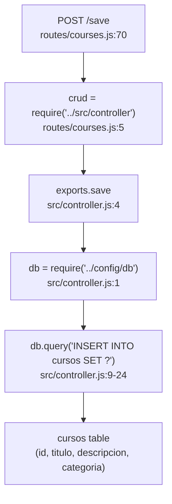
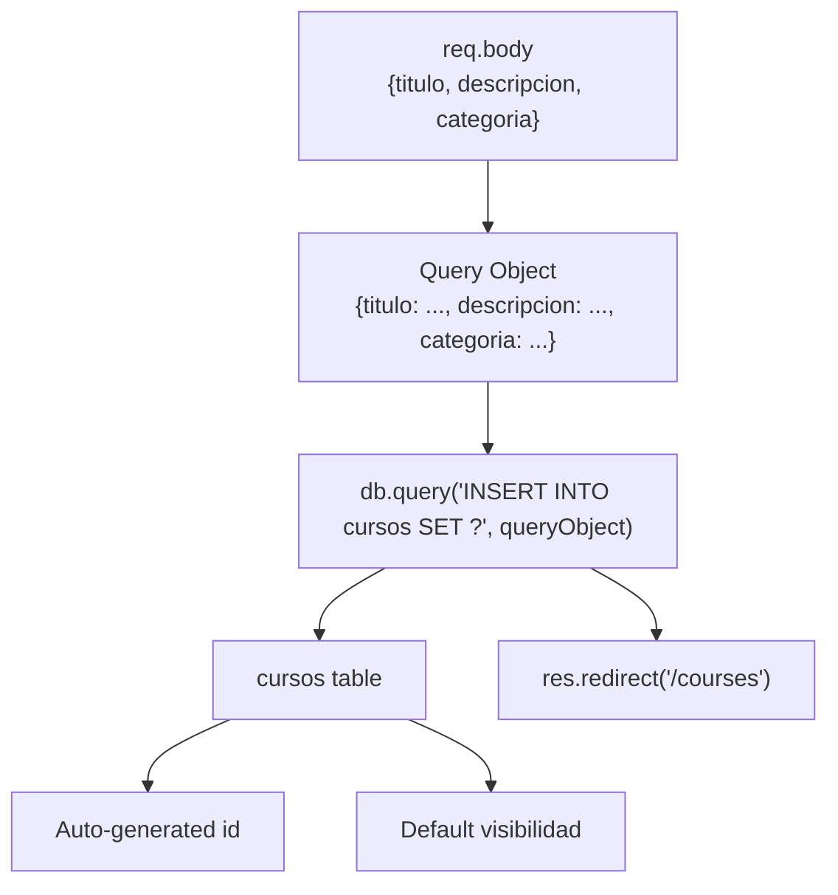

# Creating Courses

> **Relevant source files**
> * [routes/courses.js](https://github.com/Lourdes12587/Week06/blob/ce0c3bcd/routes/courses.js)
> * [src/controller.js](https://github.com/Lourdes12587/Week06/blob/ce0c3bcd/src/controller.js)
> * [views/create.ejs](https://github.com/Lourdes12587/Week06/blob/ce0c3bcd/views/create.ejs)

## Purpose and Scope

This page documents the course creation workflow available exclusively to administrators. It covers the form interface, authorization requirements, database insertion logic, and the complete request flow from displaying the creation form to persisting a new course record.

For modifying or removing existing courses, see [Editing & Deleting Courses](/Lourdes12587/Week06/5.2-editing-and-deleting-courses). For information about how courses are displayed to different user roles, see [Course Listing & Visibility](/Lourdes12587/Week06/5.3-course-listing-and-visibility).

---

## Authorization Requirements

Course creation is protected by a two-stage authorization chain that enforces both authentication and role-based access control.

| Middleware Function | Purpose | Implementation |
| --- | --- | --- |
| `estaAutenticado` | Verifies active session | Checks `req.session.loggedin` |
| `isAdmin` | Enforces admin role | Requires `req.session.rol === 'admin'` |

Both middleware functions redirect unauthorized users to `/login` if authorization fails. The middleware chain executes sequentially before any course creation logic runs.

**Sources:** [routes/courses.js L8-L24](https://github.com/Lourdes12587/Week06/blob/ce0c3bcd/routes/courses.js#L8-L24)

---

## Course Creation Request Flow

The following diagram illustrates the complete flow from initial form request through database persistence.

### Request Flow Diagram

```mermaid
sequenceDiagram
  participant Browser
  participant Express Router
  participant routes/courses.js
  participant estaAutenticado
  participant middleware
  participant isAdmin
  participant create.ejs
  participant template
  participant controller.save
  participant src/controller.js
  participant MySQL Database
  participant cursos table

  note over Browser,cursos table: GET /create - Display Form
  Browser->>Express Router: "GET /create"
  Express Router->>estaAutenticado: "Check session"
  estaAutenticado->>isAdmin: "Session valid"
  isAdmin->>create.ejs: "Admin role confirmed"
  create.ejs->>Browser: "Render creation form"
  note over Browser,cursos table: POST /save - Submit Form
  Browser->>Express Router: "POST /save
  Express Router->>estaAutenticado: {titulo, descripcion, categoria}"
  estaAutenticado->>isAdmin: "Check session"
  isAdmin->>controller.save: "Session valid"
  controller.save->>MySQL Database: "Call save(req, res)"
  MySQL Database->>controller.save: "INSERT INTO cursos"
  controller.save->>Browser: "Confirm insertion"
```

**Sources:** [routes/courses.js L64-L70](https://github.com/Lourdes12587/Week06/blob/ce0c3bcd/routes/courses.js#L64-L70)

 [src/controller.js L4-L24](https://github.com/Lourdes12587/Week06/blob/ce0c3bcd/src/controller.js#L4-L24)

---

## Route Definitions

### GET /create Route

Displays the course creation form to authenticated administrators.

```javascript
router.get('/create', estaAutenticado, isAdmin, (req, res) => {
    res.render('create');
});
```

**Location:** [routes/courses.js L64-L66](https://github.com/Lourdes12587/Week06/blob/ce0c3bcd/routes/courses.js#L64-L66)

**Middleware Chain:**

1. `estaAutenticado` - Validates session existence
2. `isAdmin` - Validates `rol === 'admin'`

**Response:** Renders the `create.ejs` template with no additional data passed to the view.

### POST /save Route

Processes the submitted form data and persists the new course to the database.

```
router.post('/save', estaAutenticado, isAdmin, crud.save);
```

**Location:** [routes/courses.js L70](https://github.com/Lourdes12587/Week06/blob/ce0c3bcd/routes/courses.js#L70-L70)

**Middleware Chain:** Same authorization requirements as GET /create

**Handler:** Delegates to `crud.save` function from `src/controller.js`

**Sources:** [routes/courses.js L64-L70](https://github.com/Lourdes12587/Week06/blob/ce0c3bcd/routes/courses.js#L64-L70)

---

## Controller Logic

The `save` function in the CRUD controller handles the database insertion logic.

### Code Entity Mapping



**Sources:** [routes/courses.js L5-L70](https://github.com/Lourdes12587/Week06/blob/ce0c3bcd/routes/courses.js#L5-L70)

 [src/controller.js L1-L24](https://github.com/Lourdes12587/Week06/blob/ce0c3bcd/src/controller.js#L1-L24)

### Function Implementation

The `save` function extracts form data from `req.body` and constructs an INSERT query:

**Function Signature:** `exports.save = (req, res) => { ... }`

**Input Parameters (from req.body):**

* `titulo` - Course title string
* `descripcion` - Course description string
* `categoria` - Course category string

**Database Operation:**

```sql
INSERT INTO cursos SET ?
```

The `?` placeholder is replaced with an object containing the three fields. The MySQL driver automatically converts the object to a SET clause.

**Success Behavior:** Redirects to `/courses` (the course listing page)

**Error Behavior:** Logs error to console and still redirects to `/courses`

**Location:** [src/controller.js L4-L24](https://github.com/Lourdes12587/Week06/blob/ce0c3bcd/src/controller.js#L4-L24)

**Sources:** [src/controller.js L4-L24](https://github.com/Lourdes12587/Week06/blob/ce0c3bcd/src/controller.js#L4-L24)

---

## Form Interface

The course creation form is rendered by the `create.ejs` template.

### Form Structure

```mermaid
flowchart TD

Form[""]
TituloField["Input: titulo<br>type='text'<br>required field"]
DescField["Input: descripcion<br>type='text'<br>required field"]
CatField["Input: categoria<br>type='text'<br>required field"]
SubmitBtn["Submit Button<br>'Guardar'"]
CancelBtn["Cancel Link<br>href='/courses'"]

Form --> TituloField
Form --> DescField
Form --> CatField
Form --> SubmitBtn
Form --> CancelBtn
```

**Sources:** [views/create.ejs L10-L26](https://github.com/Lourdes12587/Week06/blob/ce0c3bcd/views/create.ejs#L10-L26)

### Template Implementation

The form uses Bootstrap styling classes and submits to the `/save` endpoint:

| Field | HTML ID | Name Attribute | Label |
| --- | --- | --- | --- |
| Title | `titulo` | `titulo` | "Titulo:" |
| Description | `descripcion` | `descripcion` | "Descripcion:" |
| Category | `categoria` | `categoria` | "Categoria:" |

**Form Action:** `/save` (POST method)

**Buttons:**

* **Guardar** - Primary button (blue) that submits the form
* **Cancelar** - Danger button (red) that links back to `/courses`

**Template Structure:**

* Includes `partials/head` for common HTML head elements
* Includes `partials/header` for navigation
* Contains a centered card (`w-25` width class) with the form

**Location:** [views/create.ejs L1-L29](https://github.com/Lourdes12587/Week06/blob/ce0c3bcd/views/create.ejs#L1-L29)

**Sources:** [views/create.ejs L1-L29](https://github.com/Lourdes12587/Week06/blob/ce0c3bcd/views/create.ejs#L1-L29)

---

## Database Insertion

### Query Execution Flow



**Sources:** [src/controller.js L4-L24](https://github.com/Lourdes12587/Week06/blob/ce0c3bcd/src/controller.js#L4-L24)

### Database Table Schema

Based on the INSERT operation, the `cursos` table accepts the following fields:

| Column | Provided by Form | Source |
| --- | --- | --- |
| `id` | No (auto-increment) | Database default |
| `titulo` | Yes | Form input |
| `descripcion` | Yes | Form input |
| `categoria` | Yes | Form input |
| `visibilidad` | No (default value) | Database default |

The form does not provide values for `id` (primary key) or `visibilidad` (visibility control), which suggests these fields have database-level defaults.

**Sources:** [src/controller.js L9-L14](https://github.com/Lourdes12587/Week06/blob/ce0c3bcd/src/controller.js#L9-L14)

 [routes/courses.js L38-L42](https://github.com/Lourdes12587/Week06/blob/ce0c3bcd/routes/courses.js#L38-L42)

---

## Validation and Error Handling

### Current Implementation

The current implementation has minimal validation:

**Client-Side Validation:** None implemented in the form

**Server-Side Validation:** None implemented before database insertion

**Error Handling:**

* Database errors are logged to console via `console.log(error)` [src/controller.js L18](https://github.com/Lourdes12587/Week06/blob/ce0c3bcd/src/controller.js#L18-L18)
* Both success and error cases redirect to `/courses` [src/controller.js L19-L21](https://github.com/Lourdes12587/Week06/blob/ce0c3bcd/src/controller.js#L19-L21)
* No error messages are displayed to the user

### Error Scenarios

| Scenario | Current Behavior |
| --- | --- |
| Empty fields | Accepted (no validation) |
| Database connection failure | Logged, redirects to `/courses` |
| Duplicate course title | Accepted (no uniqueness constraint) |
| Invalid data types | MySQL type coercion or error |

**Implications:**

* Empty courses can be created
* Users receive no feedback about success or failure
* Database constraints (if any) are the only validation layer

**Sources:** [src/controller.js L16-L22](https://github.com/Lourdes12587/Week06/blob/ce0c3bcd/src/controller.js#L16-L22)

 [views/create.ejs L10-L26](https://github.com/Lourdes12587/Week06/blob/ce0c3bcd/views/create.ejs#L10-L26)

---

## Integration with Course Listing

After successful course creation, the user is redirected to `/courses`, where the new course appears in the listing. Since no `visibilidad` value is specified, the course inherits the database default value, which controls whether it appears to public users.

For details on how courses are queried and displayed, see [Course Listing & Visibility](/Lourdes12587/Week06/5.3-course-listing-and-visibility).

**Sources:** [src/controller.js L21](https://github.com/Lourdes12587/Week06/blob/ce0c3bcd/src/controller.js#L21-L21)