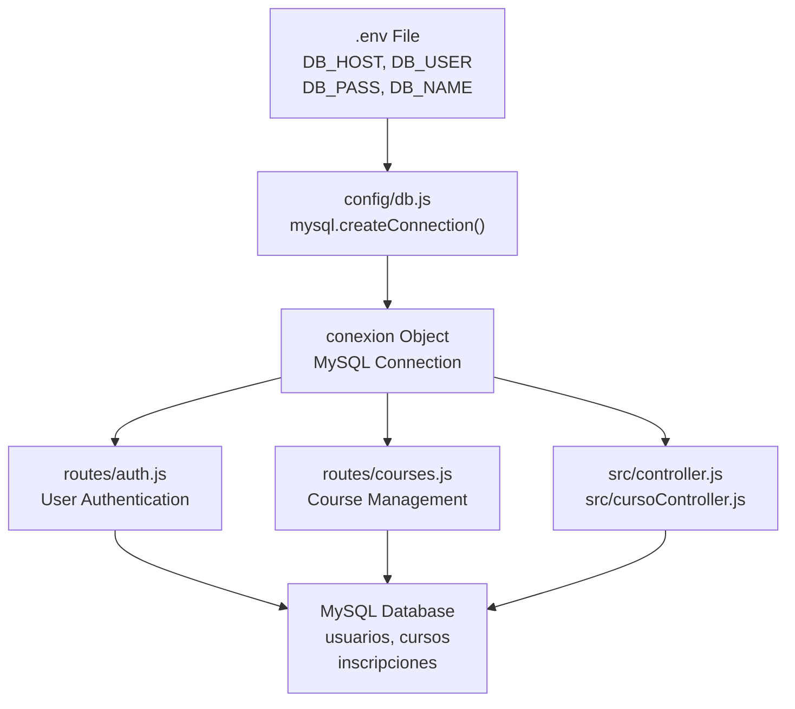
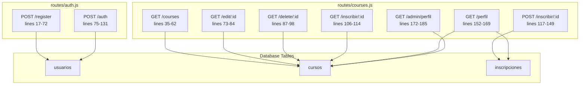
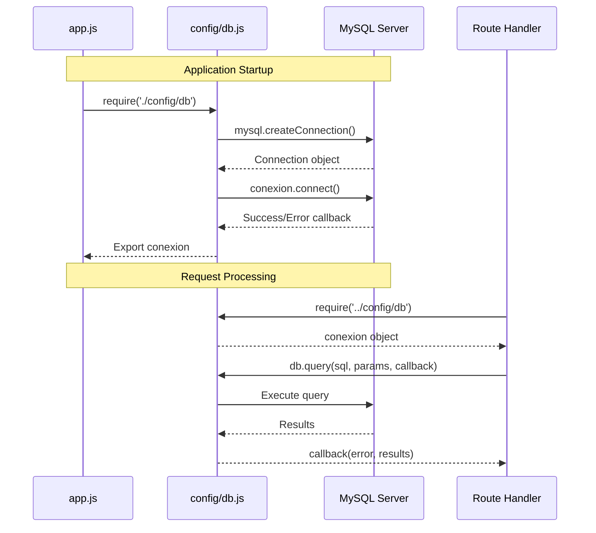

# Database Architecture

> **Relevant source files**
> * [config/db.js](https://github.com/Lourdes12587/Week06/blob/ce0c3bcd/config/db.js)
> * [routes/auth.js](https://github.com/Lourdes12587/Week06/blob/ce0c3bcd/routes/auth.js)
> * [routes/courses.js](https://github.com/Lourdes12587/Week06/blob/ce0c3bcd/routes/courses.js)

## Purpose and Scope

This document describes the MySQL database architecture for the course management system. It covers the database schema with three core tables (`usuarios`, `cursos`, `inscripciones`), the connection pooling implementation, entity relationships, and common query patterns. For information about database operations and best practices, see [Database Operations](/Lourdes12587/Week06/9.3-database-operations). For details on how the authentication system uses the `usuarios` table, see [Authentication & Authorization](/Lourdes12587/Week06/4-authentication-and-authorization).

---

## Connection Management

The database connection is established through a centralized module at [config/db.js L1-L19](https://github.com/Lourdes12587/Week06/blob/ce0c3bcd/config/db.js#L1-L19)

 using the `mysql2` driver. The connection is configured via environment variables and exported as a singleton instance.

### Connection Configuration

```yaml
Database Driver: mysql2
Connection Type: Single connection (not pooled)
Configuration Source: Environment variables (.env)
Export: CommonJS module.exports
```

[config/db.js L3-L9](https://github.com/Lourdes12587/Week06/blob/ce0c3bcd/config/db.js#L3-L9)

 creates a MySQL connection object with credentials loaded from environment variables:

| Environment Variable | Purpose |
| --- | --- |
| `DB_HOST` | Database server hostname |
| `DB_USER` | Database username |
| `DB_PASS` | Database password |
| `DB_NAME` | Database name |

The connection is established synchronously at [config/db.js L11-L17](https://github.com/Lourdes12587/Week06/blob/ce0c3bcd/config/db.js#L11-L17)

 logging success or error messages to the console. This `conexion` object is imported throughout the application for executing queries.

**Database Connection Module Structure**



**Sources:** [config/db.js L1-L19](https://github.com/Lourdes12587/Week06/blob/ce0c3bcd/config/db.js#L1-L19)

 [routes/auth.js L4](https://github.com/Lourdes12587/Week06/blob/ce0c3bcd/routes/auth.js#L4-L4)

 [routes/courses.js L4](https://github.com/Lourdes12587/Week06/blob/ce0c3bcd/routes/courses.js#L4-L4)

---

## Database Schema

The system uses three tables to manage users, courses, and enrollment relationships. All tables are accessed through direct SQL queries using the exported `conexion` object.

### Table: usuarios

The `usuarios` table stores user accounts with authentication credentials and role information.

**Schema Inference from Queries**

| Column | Type | Constraints | Purpose |
| --- | --- | --- | --- |
| `id` | INT | PRIMARY KEY, AUTO_INCREMENT | Unique user identifier |
| `nombre` | VARCHAR | NOT NULL | User's full name |
| `email` | VARCHAR | UNIQUE, NOT NULL | Login credential and identifier |
| `password` | VARCHAR(255) | NOT NULL | bcrypt hashed password |
| `rol` | ENUM | DEFAULT 'registrado' | User role: 'publico', 'registrado', 'admin' |

The schema is used in [routes/auth.js L46-L52](https://github.com/Lourdes12587/Week06/blob/ce0c3bcd/routes/auth.js#L46-L52)

 for user registration:

```sql
INSERT INTO usuarios SET ?
-- Fields: nombre, email, password (hashed), rol
```

And in [routes/auth.js L82-L86](https://github.com/Lourdes12587/Week06/blob/ce0c3bcd/routes/auth.js#L82-L86)

 for authentication:

```sql
SELECT * FROM usuarios WHERE email = ?
```

**Sources:** [routes/auth.js L46-L69](https://github.com/Lourdes12587/Week06/blob/ce0c3bcd/routes/auth.js#L46-L69)

 [routes/auth.js L82-L98](https://github.com/Lourdes12587/Week06/blob/ce0c3bcd/routes/auth.js#L82-L98)

### Table: cursos

The `cursos` table contains course information and visibility settings.

**Schema Inference from Queries**

| Column | Type | Constraints | Purpose |
| --- | --- | --- | --- |
| `id` | INT | PRIMARY KEY, AUTO_INCREMENT | Unique course identifier |
| `titulo` | VARCHAR | NOT NULL | Course title |
| `descripcion` | TEXT | NULL | Course description |
| `categoria` | VARCHAR | NULL | Course category |
| `visibilidad` | ENUM | NULL | 'publico' or 'privado' visibility flag |

The table is queried in [routes/courses.js L38-L42](https://github.com/Lourdes12587/Week06/blob/ce0c3bcd/routes/courses.js#L38-L42)

 with conditional filtering based on user role:

```sql
SELECT * FROM cursos
-- WHERE visibilidad='publico' (for public users only)
```

Individual course retrieval occurs at [routes/courses.js L77-L81](https://github.com/Lourdes12587/Week06/blob/ce0c3bcd/routes/courses.js#L77-L81)

 for editing:

```sql
SELECT * FROM cursos WHERE id = ?
```

And deletion at [routes/courses.js L91-L96](https://github.com/Lourdes12587/Week06/blob/ce0c3bcd/routes/courses.js#L91-L96)

:

```sql
DELETE FROM cursos WHERE id = ?
```

**Sources:** [routes/courses.js L35-L62](https://github.com/Lourdes12587/Week06/blob/ce0c3bcd/routes/courses.js#L35-L62)

 [routes/courses.js L73-L84](https://github.com/Lourdes12587/Week06/blob/ce0c3bcd/routes/courses.js#L73-L84)

 [routes/courses.js L87-L98](https://github.com/Lourdes12587/Week06/blob/ce0c3bcd/routes/courses.js#L87-L98)

 [routes/courses.js L109-L113](https://github.com/Lourdes12587/Week06/blob/ce0c3bcd/routes/courses.js#L109-L113)

### Table: inscripciones

The `inscripciones` table is a junction table implementing a many-to-many relationship between users and courses.

**Schema Inference from Queries**

| Column | Type | Constraints | Purpose |
| --- | --- | --- | --- |
| `id_usuario` | INT | FOREIGN KEY → usuarios(id) | References enrolled user |
| `id_curso` | INT | FOREIGN KEY → cursos(id) | References enrolled course |

The composite primary key is (`id_usuario`, `id_curso`), preventing duplicate enrollments.

Enrollment duplicate check at [routes/courses.js L121-L128](https://github.com/Lourdes12587/Week06/blob/ce0c3bcd/routes/courses.js#L121-L128)

:

```sql
SELECT * FROM inscripciones 
WHERE id_usuario = ? AND id_curso = ?
```

Enrollment insertion at [routes/courses.js L135-L142](https://github.com/Lourdes12587/Week06/blob/ce0c3bcd/routes/courses.js#L135-L142)

:

```sql
INSERT INTO inscripciones (id_usuario, id_curso) 
VALUES (?, ?)
```

User's enrolled courses are retrieved at [routes/courses.js L155-L160](https://github.com/Lourdes12587/Week06/blob/ce0c3bcd/routes/courses.js#L155-L160)

 via JOIN:

```sql
SELECT c.* 
FROM cursos c
JOIN inscripciones i ON c.id = i.id_curso
WHERE i.id_usuario = ?
```

**Sources:** [routes/courses.js L106-L149](https://github.com/Lourdes12587/Week06/blob/ce0c3bcd/routes/courses.js#L106-L149)

 [routes/courses.js L152-L169](https://github.com/Lourdes12587/Week06/blob/ce0c3bcd/routes/courses.js#L152-L169)

---

## Entity Relationship Model

**Database Entity Relationship Diagram**

```css
#mermaid-14dybqwosbwo{font-family:ui-sans-serif,-apple-system,system-ui,Segoe UI,Helvetica;font-size:16px;fill:#333;}@keyframes edge-animation-frame{from{stroke-dashoffset:0;}}@keyframes dash{to{stroke-dashoffset:0;}}#mermaid-14dybqwosbwo .edge-animation-slow{stroke-dasharray:9,5!important;stroke-dashoffset:900;animation:dash 50s linear infinite;stroke-linecap:round;}#mermaid-14dybqwosbwo .edge-animation-fast{stroke-dasharray:9,5!important;stroke-dashoffset:900;animation:dash 20s linear infinite;stroke-linecap:round;}#mermaid-14dybqwosbwo .error-icon{fill:#dddddd;}#mermaid-14dybqwosbwo .error-text{fill:#222222;stroke:#222222;}#mermaid-14dybqwosbwo .edge-thickness-normal{stroke-width:1px;}#mermaid-14dybqwosbwo .edge-thickness-thick{stroke-width:3.5px;}#mermaid-14dybqwosbwo .edge-pattern-solid{stroke-dasharray:0;}#mermaid-14dybqwosbwo .edge-thickness-invisible{stroke-width:0;fill:none;}#mermaid-14dybqwosbwo .edge-pattern-dashed{stroke-dasharray:3;}#mermaid-14dybqwosbwo .edge-pattern-dotted{stroke-dasharray:2;}#mermaid-14dybqwosbwo .marker{fill:#999;stroke:#999;}#mermaid-14dybqwosbwo .marker.cross{stroke:#999;}#mermaid-14dybqwosbwo svg{font-family:ui-sans-serif,-apple-system,system-ui,Segoe UI,Helvetica;font-size:16px;}#mermaid-14dybqwosbwo p{margin:0;}#mermaid-14dybqwosbwo .entityBox{fill:#ffffff;stroke:#dddddd;}#mermaid-14dybqwosbwo .relationshipLabelBox{fill:#dddddd;opacity:0.7;background-color:#dddddd;}#mermaid-14dybqwosbwo .relationshipLabelBox rect{opacity:0.5;}#mermaid-14dybqwosbwo .labelBkg{background-color:rgba(221, 221, 221, 0.5);}#mermaid-14dybqwosbwo .edgeLabel .label{fill:#dddddd;font-size:14px;}#mermaid-14dybqwosbwo .label{font-family:ui-sans-serif,-apple-system,system-ui,Segoe UI,Helvetica;color:#333;}#mermaid-14dybqwosbwo .edge-pattern-dashed{stroke-dasharray:8,8;}#mermaid-14dybqwosbwo .node rect,#mermaid-14dybqwosbwo .node circle,#mermaid-14dybqwosbwo .node ellipse,#mermaid-14dybqwosbwo .node polygon{fill:#ffffff;stroke:#dddddd;stroke-width:1px;}#mermaid-14dybqwosbwo .relationshipLine{stroke:#999;stroke-width:1;fill:none;}#mermaid-14dybqwosbwo .marker{fill:none!important;stroke:#999!important;stroke-width:1;}#mermaid-14dybqwosbwo :root{--mermaid-font-family:"trebuchet ms",verdana,arial,sans-serif;}enrolls_inhas_enrollmentusuariosintidPKvarcharnombrevarcharemailUKvarcharpasswordenumrolinscripcionesintid_usuarioFKintid_cursoFKcursosintidPKvarchartitulotextdescripcionvarcharcategoriaenumvisibilidad
```

**Relationship Characteristics:**

* **usuarios ↔ inscripciones**: One-to-Many * One user can enroll in multiple courses * Enforced by `id_usuario` foreign key
* **cursos ↔ inscripciones**: One-to-Many * One course can have multiple enrolled users * Enforced by `id_curso` foreign key
* **usuarios ↔ cursos**: Many-to-Many (via inscripciones) * Junction table pattern * Composite key prevents duplicates

**Sources:** [routes/courses.js L121-L148](https://github.com/Lourdes12587/Week06/blob/ce0c3bcd/routes/courses.js#L121-L148)

 [routes/courses.js L155-L160](https://github.com/Lourdes12587/Week06/blob/ce0c3bcd/routes/courses.js#L155-L160)

---

## Query Patterns by Module

The following diagram maps code modules to their database operations.

**Module-to-Table Query Matrix**



**Sources:** [routes/auth.js L17-L131](https://github.com/Lourdes12587/Week06/blob/ce0c3bcd/routes/auth.js#L17-L131)

 [routes/courses.js L35-L185](https://github.com/Lourdes12587/Week06/blob/ce0c3bcd/routes/courses.js#L35-L185)

---

## Query Operation Summary

### INSERT Operations

| Location | Table | Purpose |
| --- | --- | --- |
| [routes/auth.js L46-L52](https://github.com/Lourdes12587/Week06/blob/ce0c3bcd/routes/auth.js#L46-L52) | `usuarios` | Register new user account |
| [routes/courses.js L135-L142](https://github.com/Lourdes12587/Week06/blob/ce0c3bcd/routes/courses.js#L135-L142) | `inscripciones` | Enroll user in course |

### SELECT Operations

| Location | Table(s) | Purpose |
| --- | --- | --- |
| [routes/auth.js L82-L86](https://github.com/Lourdes12587/Week06/blob/ce0c3bcd/routes/auth.js#L82-L86) | `usuarios` | Authenticate user by email |
| [routes/courses.js L38-L42](https://github.com/Lourdes12587/Week06/blob/ce0c3bcd/routes/courses.js#L38-L42) | `cursos` | List courses (with visibility filter) |
| [routes/courses.js L77](https://github.com/Lourdes12587/Week06/blob/ce0c3bcd/routes/courses.js#L77-L77) | `cursos` | Fetch single course for editing |
| [routes/courses.js L109](https://github.com/Lourdes12587/Week06/blob/ce0c3bcd/routes/courses.js#L109-L109) | `cursos` | Fetch course for enrollment confirmation |
| [routes/courses.js L121-L123](https://github.com/Lourdes12587/Week06/blob/ce0c3bcd/routes/courses.js#L121-L123) | `inscripciones` | Check duplicate enrollment |
| [routes/courses.js L155-L160](https://github.com/Lourdes12587/Week06/blob/ce0c3bcd/routes/courses.js#L155-L160) | `cursos`, `inscripciones` | Fetch user's enrolled courses (JOIN) |
| [routes/courses.js L176](https://github.com/Lourdes12587/Week06/blob/ce0c3bcd/routes/courses.js#L176-L176) | `cursos` | Count total courses for admin stats |

### UPDATE Operations

No direct UPDATE queries are visible in the provided files. The `crud.update` controller at [routes/courses.js L103](https://github.com/Lourdes12587/Week06/blob/ce0c3bcd/routes/courses.js#L103-L103)

 likely handles course updates.

### DELETE Operations

| Location | Table | Purpose |
| --- | --- | --- |
| [routes/courses.js L91](https://github.com/Lourdes12587/Week06/blob/ce0c3bcd/routes/courses.js#L91-L91) | `cursos` | Delete course by ID |

**Sources:** [routes/auth.js L46-L86](https://github.com/Lourdes12587/Week06/blob/ce0c3bcd/routes/auth.js#L46-L86)

 [routes/courses.js L38-L176](https://github.com/Lourdes12587/Week06/blob/ce0c3bcd/routes/courses.js#L38-L176)

---

## SQL Injection Prevention

All queries use parameterized statements to prevent SQL injection attacks. The codebase consistently follows this pattern:

**Parameterized Query Examples:**

```sql
// Safe: Using placeholder (?)
db.query("SELECT * FROM usuarios WHERE email = ?", [email], ...)

// Safe: Using object syntax
db.query("INSERT INTO usuarios SET ?", { nombre, email, password, rol }, ...)

// Safe: Using multiple placeholders
db.query("INSERT INTO inscripciones (id_usuario, id_curso) VALUES (?, ?)", 
         [id_usuario, id_curso], ...)
```

The `mysql2` driver automatically escapes all values passed through the placeholder array, preventing malicious SQL from being executed.

**Sources:** [routes/auth.js L46-L86](https://github.com/Lourdes12587/Week06/blob/ce0c3bcd/routes/auth.js#L46-L86)

 [routes/courses.js L77-L142](https://github.com/Lourdes12587/Week06/blob/ce0c3bcd/routes/courses.js#L77-L142)

---

## Connection Lifecycle

**Database Connection Flow**



The connection remains open for the lifetime of the Node.js process. The module does not implement connection pooling; instead, it maintains a single persistent connection reused across all requests.

**Sources:** [config/db.js L1-L19](https://github.com/Lourdes12587/Week06/blob/ce0c3bcd/config/db.js#L1-L19)

---

## Table Access Patterns by Role

Different user roles interact with different database tables based on their authorization level:

| User Role | usuarios | cursos | inscripciones |
| --- | --- | --- | --- |
| **publico** | READ (login) | READ (limited) | - |
| **registrado** | READ (login) | READ (all visible) | READ, INSERT |
| **admin** | READ (login) | READ, INSERT, UPDATE, DELETE | READ (stats) |

This access control is enforced by middleware at the route level [routes/courses.js L8-L33](https://github.com/Lourdes12587/Week06/blob/ce0c3bcd/routes/courses.js#L8-L33)

 not at the database level. For details on role-based access control implementation, see [Role-Based Access Control](/Lourdes12587/Week06/4.3-role-based-access-control).

**Sources:** [routes/courses.js L8-L33](https://github.com/Lourdes12587/Week06/blob/ce0c3bcd/routes/courses.js#L8-L33)

 [routes/courses.js L35-L185](https://github.com/Lourdes12587/Week06/blob/ce0c3bcd/routes/courses.js#L35-L185)