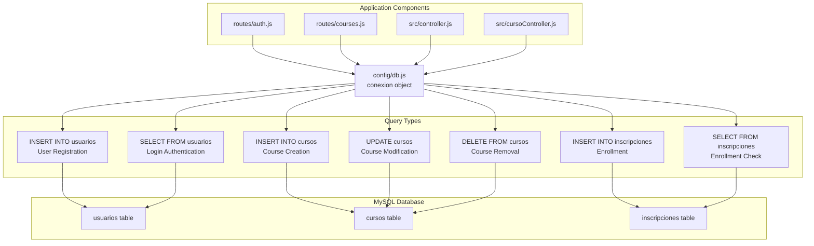
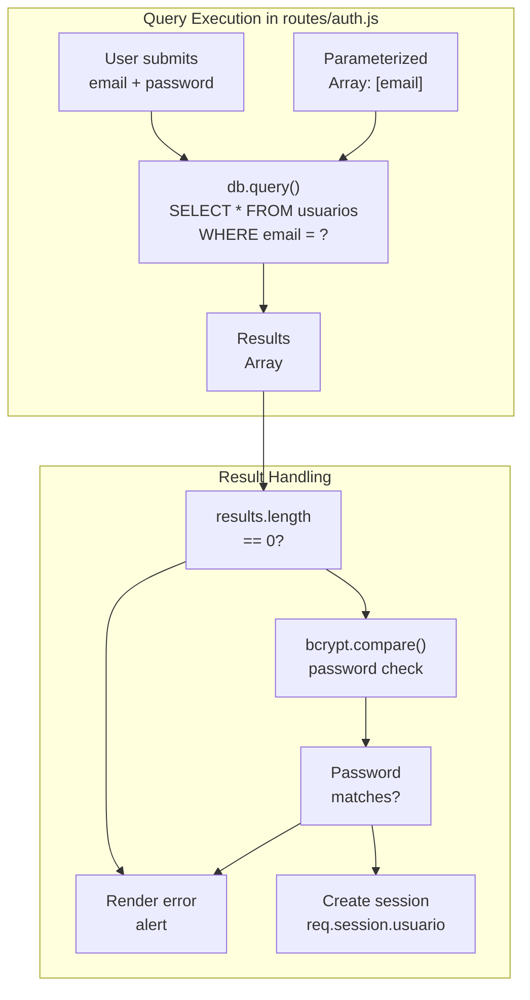
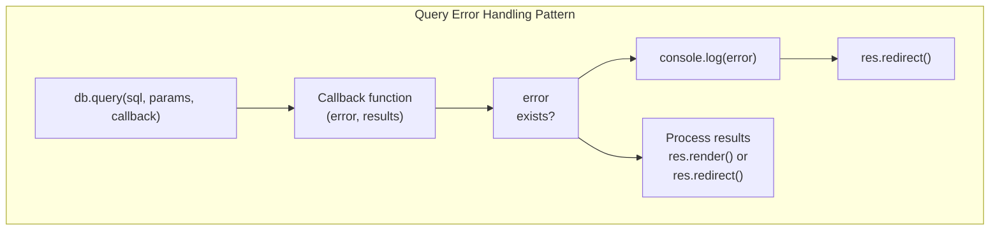
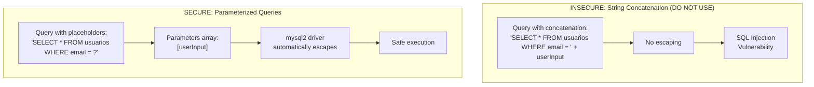
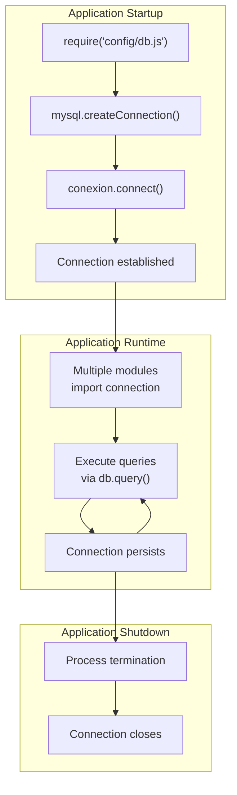

# Database Operations

> **Relevant source files**
> * [config/db.js](https://github.com/Lourdes12587/Week06/blob/ce0c3bcd/config/db.js)
> * [routes/auth.js](https://github.com/Lourdes12587/Week06/blob/ce0c3bcd/routes/auth.js)
> * [src/controller.js](https://github.com/Lourdes12587/Week06/blob/ce0c3bcd/src/controller.js)

## Purpose and Scope

This page documents best practices and patterns for performing database operations within the course management system. It covers the database connection setup, query execution patterns, parameterized query usage for SQL injection prevention, error handling strategies, and connection management.

For information about the database schema and table relationships, see [Database Architecture](/Lourdes12587/Week06/3.3-database-architecture). For security-specific considerations including input validation, see [Security Considerations](/Lourdes12587/Week06/9.4-security-considerations).

---

## Database Connection Configuration

The system uses a centralized database connection module that all other components import and use for executing queries.

### Connection Setup

The database connection is established in [config/db.js L1-L20](https://github.com/Lourdes12587/Week06/blob/ce0c3bcd/config/db.js#L1-L20)

 using the `mysql2` driver. The connection is configured with environment variables for flexibility across different deployment environments:

| Configuration Parameter | Environment Variable | Purpose |
| --- | --- | --- |
| `host` | `DB_HOST` | MySQL server hostname or IP address |
| `user` | `DB_USER` | Database user account |
| `password` | `DB_PASS` | Database user password |
| `database` | `DB_NAME` | Target database name |

The connection is created as a singleton and exported for reuse throughout the application [config/db.js L3-L9](https://github.com/Lourdes12587/Week06/blob/ce0c3bcd/config/db.js#L3-L9)

:

```javascript
const conexion = mysql.createConnection({
    host: process.env.DB_HOST, 
    user: process.env.DB_USER,
    password: process.env.DB_PASS,
    database: process.env.DB_NAME,
});
```

Connection verification occurs immediately upon creation [config/db.js L11-L17](https://github.com/Lourdes12587/Week06/blob/ce0c3bcd/config/db.js#L11-L17)

 logging success or failure to the console.

### Importing the Connection

All modules that need database access import the connection object:

```javascript
const db = require("../config/db");
```

This pattern is used in:

* [routes/auth.js L4](https://github.com/Lourdes12587/Week06/blob/ce0c3bcd/routes/auth.js#L4-L4)
* [src/controller.js L1](https://github.com/Lourdes12587/Week06/blob/ce0c3bcd/src/controller.js#L1-L1)
* All other modules requiring database operations

**Sources:** [config/db.js L1-L20](https://github.com/Lourdes12587/Week06/blob/ce0c3bcd/config/db.js#L1-L20)

---

## Query Execution Patterns

### Query Pattern Overview

The following diagram illustrates how different components use the database connection to execute queries:



**Sources:** [config/db.js L1-L20](https://github.com/Lourdes12587/Week06/blob/ce0c3bcd/config/db.js#L1-L20)

 [routes/auth.js L46-L69](https://github.com/Lourdes12587/Week06/blob/ce0c3bcd/routes/auth.js#L46-L69)

 [src/controller.js L1-L53](https://github.com/Lourdes12587/Week06/blob/ce0c3bcd/src/controller.js#L1-L53)

---

## INSERT Operations

### Object-Based INSERT

The system uses object notation for INSERT operations, which automatically escapes values and prevents SQL injection:

```javascript
db.query(
    "INSERT INTO table_name SET ?",
    { field1: value1, field2: value2 },
    (error, results) => { /* handle response */ }
);
```

**User Registration Example** [routes/auth.js L46-L69](https://github.com/Lourdes12587/Week06/blob/ce0c3bcd/routes/auth.js#L46-L69)

:

* Query: `"INSERT INTO usuarios SET ?"`
* Data object contains: `nombre`, `email`, `password` (hashed), `rol`
* Password is hashed with bcrypt before insertion [routes/auth.js L44](https://github.com/Lourdes12587/Week06/blob/ce0c3bcd/routes/auth.js#L44-L44)
* Default role of `'registrado'` is assigned if not provided [routes/auth.js L52](https://github.com/Lourdes12587/Week06/blob/ce0c3bcd/routes/auth.js#L52-L52)

**Course Creation Example** [src/controller.js L9-L24](https://github.com/Lourdes12587/Week06/blob/ce0c3bcd/src/controller.js#L9-L24)

:

* Query: `"INSERT INTO cursos SET ?"`
* Data object contains: `titulo`, `descripcion`, `categoria`
* Values extracted from request body [src/controller.js L5-L7](https://github.com/Lourdes12587/Week06/blob/ce0c3bcd/src/controller.js#L5-L7)

### INSERT Operation Flow

```mermaid
sequenceDiagram
  participant Route Handler
  participant Input Validation
  participant bcrypt (if password)
  participant db.query()
  participant MySQL Database
  participant Response Handler

  Route Handler->>Input Validation: "Validate input data"
  loop [Query Error]
    Input Validation->>Response Handler: "Render form with errors"
    Input Validation->>bcrypt (if password): "Hash sensitive data"
    bcrypt (if password)->>db.query(): "db.query('INSERT INTO table SET ?', data)"
    db.query()->>MySQL Database: "Execute parameterized query"
    MySQL Database->>db.query(): "error object"
    db.query()->>Response Handler: "Handle error, redirect"
    MySQL Database->>db.query(): "results object"
    db.query()->>Response Handler: "Success alert, redirect"
  end
```

**Sources:** [routes/auth.js L17-L72](https://github.com/Lourdes12587/Week06/blob/ce0c3bcd/routes/auth.js#L17-L72)

 [src/controller.js L4-L25](https://github.com/Lourdes12587/Week06/blob/ce0c3bcd/src/controller.js#L4-L25)

---

## SELECT Operations

### Parameterized SELECT Queries

SELECT operations use parameterized queries with placeholder syntax to prevent SQL injection:

```javascript
db.query(
    "SELECT * FROM table_name WHERE field = ?",
    [value],
    (error, results) => { /* handle response */ }
);
```

**User Authentication Example** [routes/auth.js L81-L118](https://github.com/Lourdes12587/Week06/blob/ce0c3bcd/routes/auth.js#L81-L118)

:

| Query Component | Implementation |
| --- | --- |
| SQL Statement | `"SELECT * FROM usuarios WHERE email = ?"` |
| Parameters | `[email]` - User-provided email address |
| Parameter Position | `<FileRef file-url="https://github.com/Lourdes12587/Week06/blob/ce0c3bcd/routes/auth.js#L83-L83" min=83  file-path="routes/auth.js">Hii</FileRef>` |
| Results Check | `results.length == 0` validates user exists |
| Password Verification | `bcrypt.compare(password, results[0].password)` |
| Session Storage | User data stored in `req.session.usuario` [routes/auth.js L103](https://github.com/Lourdes12587/Week06/blob/ce0c3bcd/routes/auth.js#L103-L103) |

### SELECT Query Pattern



**Sources:** [routes/auth.js L75-L131](https://github.com/Lourdes12587/Week06/blob/ce0c3bcd/routes/auth.js#L75-L131)

---

## UPDATE Operations

### Parameterized UPDATE Queries

UPDATE operations follow a similar pattern with parameterized values to prevent SQL injection:

**Course Update Example** [src/controller.js L28-L52](https://github.com/Lourdes12587/Week06/blob/ce0c3bcd/src/controller.js#L28-L52)

:

```javascript
db.query(
    "UPDATE cursos SET ? WHERE id = ?",
    [{ titulo: titulo, descripcion: descripcion, categoria: categoria }, id],
    (error, results) => { /* handle response */ }
);
```

| Component | Description |
| --- | --- |
| SQL Statement | `"UPDATE cursos SET ? WHERE id = ?"` |
| First Parameter | Object containing fields to update |
| Second Parameter | Course ID from request body [src/controller.js L30](https://github.com/Lourdes12587/Week06/blob/ce0c3bcd/src/controller.js#L30-L30) |
| Parameter Array | `[{updateObject}, id]` [src/controller.js L36-L42](https://github.com/Lourdes12587/Week06/blob/ce0c3bcd/src/controller.js#L36-L42) |
| Error Handling | Logs error to console [src/controller.js L45-L46](https://github.com/Lourdes12587/Week06/blob/ce0c3bcd/src/controller.js#L45-L46) |
| Success Response | Redirects to `/courses` [src/controller.js L48](https://github.com/Lourdes12587/Week06/blob/ce0c3bcd/src/controller.js#L48-L48) |

**Sources:** [src/controller.js L28-L52](https://github.com/Lourdes12587/Week06/blob/ce0c3bcd/src/controller.js#L28-L52)

---

## DELETE Operations

DELETE operations are typically handled through route handlers that construct parameterized queries:

```javascript
db.query(
    "DELETE FROM table_name WHERE id = ?",
    [id],
    (error, results) => { /* handle response */ }
);
```

While not shown in the provided controller files, DELETE operations for courses follow this pattern based on the routing structure documented in [API Reference](/Lourdes12587/Week06/8-api-reference).

**Sources:** [src/controller.js L1-L53](https://github.com/Lourdes12587/Week06/blob/ce0c3bcd/src/controller.js#L1-L53)

---

## Error Handling Patterns

### Connection Error Handling

Connection errors are handled immediately upon establishing the connection [config/db.js L11-L17](https://github.com/Lourdes12587/Week06/blob/ce0c3bcd/config/db.js#L11-L17)

:

```javascript
conexion.connect((error) => {
    if (error) {
        console.log(error);
    } else {
        console.log("Conectado a la base de datos");
    }
});
```

### Query Error Handling

All query operations follow a consistent error handling pattern:



**Common Error Handling Implementations:**

| Location | Error Action | Success Action |
| --- | --- | --- |
| [routes/auth.js L55-L67](https://github.com/Lourdes12587/Week06/blob/ce0c3bcd/routes/auth.js#L55-L67) | Log error with `console.log()` | Render success alert with redirect |
| [src/controller.js L17-L22](https://github.com/Lourdes12587/Week06/blob/ce0c3bcd/src/controller.js#L17-L22) | Log error, redirect to `/courses` | Redirect to `/courses` |
| [src/controller.js L45-L49](https://github.com/Lourdes12587/Week06/blob/ce0c3bcd/src/controller.js#L45-L49) | Log error only | Redirect to `/courses` |

### Error Response Strategy

The system uses two primary strategies for error responses:

1. **Silent Failure with Logging** [src/controller.js L17-L19](https://github.com/Lourdes12587/Week06/blob/ce0c3bcd/src/controller.js#L17-L19) : Errors are logged but users are redirected normally
2. **User-Facing Alerts** [routes/auth.js L88-L97](https://github.com/Lourdes12587/Week06/blob/ce0c3bcd/routes/auth.js#L88-L97) : Authentication failures render alerts using SweetAlert2 integration

**Sources:** [config/db.js L11-L17](https://github.com/Lourdes12587/Week06/blob/ce0c3bcd/config/db.js#L11-L17)

 [routes/auth.js L54-L67](https://github.com/Lourdes12587/Week06/blob/ce0c3bcd/routes/auth.js#L54-L67)

 [routes/auth.js L84-L97](https://github.com/Lourdes12587/Week06/blob/ce0c3bcd/routes/auth.js#L84-L97)

 [src/controller.js L16-L22](https://github.com/Lourdes12587/Week06/blob/ce0c3bcd/src/controller.js#L16-L22)

 [src/controller.js L44-L49](https://github.com/Lourdes12587/Week06/blob/ce0c3bcd/src/controller.js#L44-L49)

---

## SQL Injection Prevention

### Parameterized Query Requirements

All database queries in this system **must** use parameterized queries with placeholder syntax. This prevents SQL injection attacks by ensuring user input is never directly concatenated into SQL statements.

### Parameterization Patterns



### Parameterization Examples by Query Type

| Query Type | Secure Pattern | Implementation |
| --- | --- | --- |
| **INSERT with object** | `"INSERT INTO usuarios SET ?"` with object parameter | [routes/auth.js L46-L53](https://github.com/Lourdes12587/Week06/blob/ce0c3bcd/routes/auth.js#L46-L53) |
| **SELECT with condition** | `"SELECT * FROM usuarios WHERE email = ?"` with array parameter | [routes/auth.js L82-L83](https://github.com/Lourdes12587/Week06/blob/ce0c3bcd/routes/auth.js#L82-L83) |
| **UPDATE with ID** | `"UPDATE cursos SET ? WHERE id = ?"` with array of object and ID | [src/controller.js L35-L42](https://github.com/Lourdes12587/Week06/blob/ce0c3bcd/src/controller.js#L35-L42) |

### Input Validation Before Queries

While parameterization prevents SQL injection, input validation adds an additional security layer:

1. **express-validator** validates input format [routes/auth.js L5](https://github.com/Lourdes12587/Week06/blob/ce0c3bcd/routes/auth.js#L5-L5)
2. **Validation chains** check length, type, and format [routes/auth.js L19-L32](https://github.com/Lourdes12587/Week06/blob/ce0c3bcd/routes/auth.js#L19-L32)
3. **Validation errors** prevent query execution [routes/auth.js L35-L40](https://github.com/Lourdes12587/Week06/blob/ce0c3bcd/routes/auth.js#L35-L40)

**Sources:** [routes/auth.js L46-L53](https://github.com/Lourdes12587/Week06/blob/ce0c3bcd/routes/auth.js#L46-L53)

 [routes/auth.js L81-L83](https://github.com/Lourdes12587/Week06/blob/ce0c3bcd/routes/auth.js#L81-L83)

 [src/controller.js L35-L42](https://github.com/Lourdes12587/Week06/blob/ce0c3bcd/src/controller.js#L35-L42)

 [routes/auth.js L17-L40](https://github.com/Lourdes12587/Week06/blob/ce0c3bcd/routes/auth.js#L17-L40)

---

## Connection Management Best Practices

### Single Connection Pattern

The current implementation uses a single persistent connection [config/db.js L3-L9](https://github.com/Lourdes12587/Week06/blob/ce0c3bcd/config/db.js#L3-L9)

 rather than a connection pool. This pattern is suitable for development and low-traffic applications.

### Connection Lifecycle



### Recommendations for Production

For production environments with higher traffic, consider these improvements:

1. **Connection Pooling**: Replace `mysql.createConnection()` with `mysql.createPool()` for better concurrency handling
2. **Error Recovery**: Implement automatic reconnection logic for database connection failures
3. **Query Timeouts**: Add timeout configurations to prevent hanging queries
4. **Connection Limits**: Configure pool size based on expected concurrent users

### Current Connection Usage

All database operations use the same connection instance:

| Module | Import Statement | Usage Pattern |
| --- | --- | --- |
| [routes/auth.js L4](https://github.com/Lourdes12587/Week06/blob/ce0c3bcd/routes/auth.js#L4-L4) | `const db = require("../config/db")` | User authentication queries |
| [src/controller.js L1](https://github.com/Lourdes12587/Week06/blob/ce0c3bcd/src/controller.js#L1-L1) | `const db = require("../config/db")` | Course CRUD operations |
| All route handlers | Same import pattern | All database interactions |

**Sources:** [config/db.js L1-L20](https://github.com/Lourdes12587/Week06/blob/ce0c3bcd/config/db.js#L1-L20)

---

## Callback Pattern and Asynchronous Queries

### Query Callback Structure

All `db.query()` calls use a standard callback pattern:

```javascript
db.query(sql, params, (error, results) => {
    // error: Error object if query failed
    // results: Query results if successful
});
```

### Callback Parameter Details

| Parameter | Type | Description | Example Usage |
| --- | --- | --- | --- |
| `error` | Error object or null | Contains error information if query fails | `if (error) { console.log(error) }` [src/controller.js L17](https://github.com/Lourdes12587/Week06/blob/ce0c3bcd/src/controller.js#L17-L17) |
| `results` | Array or object | Query results or metadata | `results.length == 0` [routes/auth.js L85](https://github.com/Lourdes12587/Week06/blob/ce0c3bcd/routes/auth.js#L85-L85) |

### Async/Await Pattern for Password Operations

The authentication route uses `async/await` for password hashing operations while maintaining callback-based database queries [routes/auth.js L34](https://github.com/Lourdes12587/Week06/blob/ce0c3bcd/routes/auth.js#L34-L34)

 [routes/auth.js L75](https://github.com/Lourdes12587/Week06/blob/ce0c3bcd/routes/auth.js#L75-L75)

:

```javascript
async (req, res) => {
    const passwordHash = await bcrypt.hash(password, 8);
    db.query(/* callback-based query */);
}
```

This hybrid approach allows synchronous-style password operations while keeping the callback pattern for database queries.

**Sources:** [routes/auth.js L34-L72](https://github.com/Lourdes12587/Week06/blob/ce0c3bcd/routes/auth.js#L34-L72)

 [routes/auth.js L75-L131](https://github.com/Lourdes12587/Week06/blob/ce0c3bcd/routes/auth.js#L75-L131)

 [src/controller.js L4-L52](https://github.com/Lourdes12587/Week06/blob/ce0c3bcd/src/controller.js#L4-L52)

---

## Query Result Processing

### Results Array Structure

SELECT queries return an array of objects:

```javascript
db.query("SELECT * FROM usuarios WHERE email = ?", [email], (error, results) => {
    // results[0] = first matching row
    // results.length = number of rows returned
});
```

### Common Result Processing Patterns

| Pattern | Purpose | Implementation |
| --- | --- | --- |
| **Empty Check** | Verify record exists | `results.length == 0` [routes/auth.js L85](https://github.com/Lourdes12587/Week06/blob/ce0c3bcd/routes/auth.js#L85-L85) |
| **First Record Access** | Get single result | `results[0]` [routes/auth.js L100](https://github.com/Lourdes12587/Week06/blob/ce0c3bcd/routes/auth.js#L100-L100) |
| **Field Extraction** | Access specific column | `results[0].password` [routes/auth.js L86](https://github.com/Lourdes12587/Week06/blob/ce0c3bcd/routes/auth.js#L86-L86) |
| **Session Storage** | Save user data | `req.session.usuario = results[0]` [routes/auth.js L103](https://github.com/Lourdes12587/Week06/blob/ce0c3bcd/routes/auth.js#L103-L103) |

### INSERT/UPDATE Result Metadata

INSERT and UPDATE operations return metadata rather than row data:

```sql
{
    affectedRows: number,  // Rows modified
    insertId: number,      // Auto-increment ID (INSERT only)
    // ... other metadata
}
```

**Sources:** [routes/auth.js L81-L118](https://github.com/Lourdes12587/Week06/blob/ce0c3bcd/routes/auth.js#L81-L118)

 [routes/auth.js L100-L104](https://github.com/Lourdes12587/Week06/blob/ce0c3bcd/routes/auth.js#L100-L104)

---

## Summary of Best Practices

### Essential Practices

1. **Always use parameterized queries** with `?` placeholders
2. **Import centralized connection** via `require("../config/db")`
3. **Handle both error and success cases** in query callbacks
4. **Validate input** before executing queries (see [Security Considerations](/Lourdes12587/Week06/9.4-security-considerations))
5. **Hash passwords** with bcrypt before storage (see [User Registration](/Lourdes12587/Week06/4.1-user-registration))
6. **Log errors** for debugging while handling failures gracefully
7. **Never expose database errors** directly to end users

### Query Template

```javascript
const db = require("../config/db");

db.query(
    "SQL STATEMENT WITH ? PLACEHOLDERS",
    [parameter1, parameter2],
    (error, results) => {
        if (error) {
            console.log(error);
            // Handle error appropriately
        } else {
            // Process results
        }
    }
);
```

**Sources:** [config/db.js L1-L20](https://github.com/Lourdes12587/Week06/blob/ce0c3bcd/config/db.js#L1-L20)

 [routes/auth.js L1-L139](https://github.com/Lourdes12587/Week06/blob/ce0c3bcd/routes/auth.js#L1-L139)

 [src/controller.js L1-L53](https://github.com/Lourdes12587/Week06/blob/ce0c3bcd/src/controller.js#L1-L53)