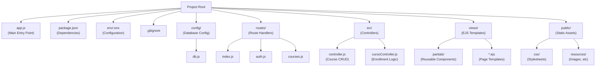
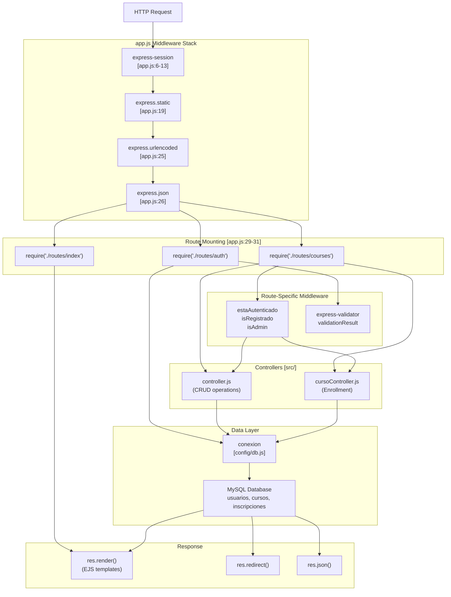
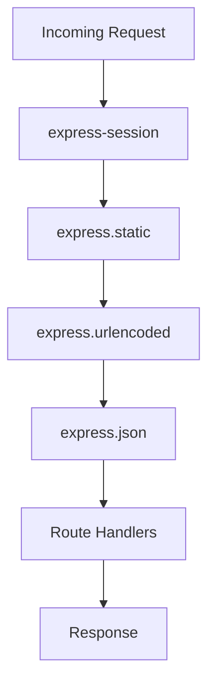
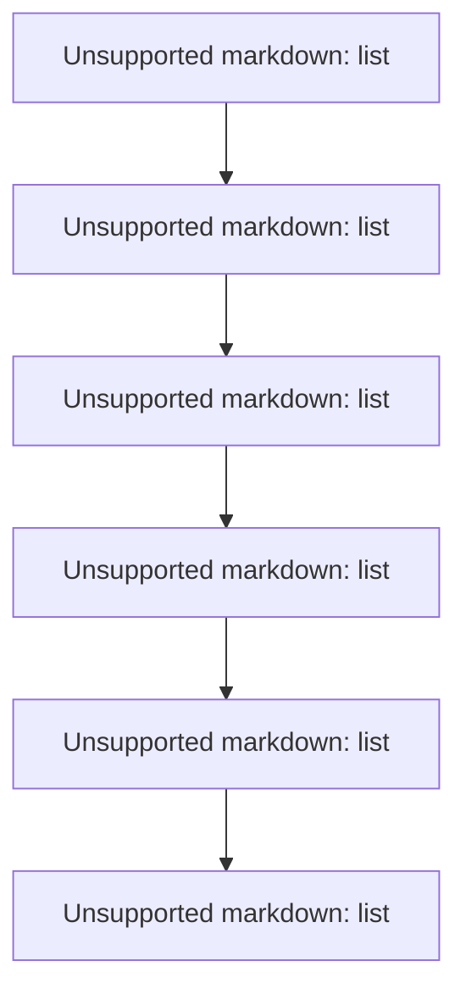

# Development Guide

> **Relevant source files**
> * [.gitignore](https://github.com/Lourdes12587/Week06/blob/ce0c3bcd/.gitignore)
> * [app.js](https://github.com/Lourdes12587/Week06/blob/ce0c3bcd/app.js)
> * [config/db.js](https://github.com/Lourdes12587/Week06/blob/ce0c3bcd/config/db.js)
> * [package.json](https://github.com/Lourdes12587/Week06/blob/ce0c3bcd/package.json)

## Purpose and Scope

This document provides guidance for developers working on the course management system codebase. It covers the project organization, development patterns, and conventions used throughout the application. This guide explains how components interact and provides practical instructions for extending the system with new features.

For initial setup and installation instructions, see [Getting Started](/Lourdes12587/Week06/2-getting-started). For detailed API endpoint specifications, see [API Reference](/Lourdes12587/Week06/8-api-reference). For security implementation details, see [Authentication & Authorization](/Lourdes12587/Week06/4-authentication-and-authorization).

**Sources:** app.js, config/db.js, package.json

---

## Development Environment Setup

### Prerequisites

The application requires Node.js runtime and a MySQL database server. The project uses npm for dependency management.

### Installation Steps

1. Clone the repository and navigate to the project directory
2. Install dependencies: `npm install`
3. Create environment configuration file at `env/.env`
4. Initialize the MySQL database with the schema (usuarios, cursos, inscripciones tables)
5. Start the development server: `npm start`

### Environment Configuration

Environment variables are loaded from `env/.env` using the dotenv package [app.js L3](https://github.com/Lourdes12587/Week06/blob/ce0c3bcd/app.js#L3-L3)

 The following variables must be configured:

| Variable | Purpose | Example |
| --- | --- | --- |
| `DB_HOST` | MySQL server hostname | `localhost` |
| `DB_USER` | Database username | `root` |
| `DB_PASS` | Database password | `password` |
| `DB_NAME` | Database name | `course_db` |

**Sources:** app.js:3, config/db.js:4-7, package.json:17

---

## Project Organization

### Directory Structure

The codebase follows a modular organization pattern separating concerns across multiple directories:



### Core Files

| File | Responsibility |
| --- | --- |
| `app.js` | Express server initialization, middleware configuration, route mounting |
| `config/db.js` | MySQL connection pool creation and export |
| `routes/*.js` | HTTP endpoint definitions and request handling |
| `src/*.js` | Business logic controllers for CRUD operations |
| `views/*.ejs` | EJS templates for server-side rendering |
| `public/css/*.css` | Page-specific stylesheets |

**Sources:** app.js, config/db.js, package.json:5

---

## Application Architecture

### Request Processing Flow

The following diagram shows how HTTP requests flow through the application components, using actual middleware functions and file references:



**Sources:** app.js:1-41, config/db.js

---

## Development Patterns

### Middleware Configuration

Middleware is configured globally in `app.js` before route mounting. The order is critical:

1. **Session middleware** [app.js L6-L13](https://github.com/Lourdes12587/Week06/blob/ce0c3bcd/app.js#L6-L13)  - Must be first to establish session context
2. **Static file serving** [app.js L19](https://github.com/Lourdes12587/Week06/blob/ce0c3bcd/app.js#L19-L19)  - Serves files from `/public` directory
3. **Body parsers** [app.js L25-L26](https://github.com/Lourdes12587/Week06/blob/ce0c3bcd/app.js#L25-L26)  - Parse URL-encoded and JSON request bodies
4. **Route handlers** [app.js L29-L31](https://github.com/Lourdes12587/Week06/blob/ce0c3bcd/app.js#L29-L31)  - Mounted after all middleware



### Database Connection Pattern

The application uses a single shared connection instance exported from `config/db.js`. This connection is imported wherever database access is needed:

```javascript
// In config/db.js
const conexion = mysql.createConnection({ ... });
conexion.connect((error) => { ... });
module.exports = conexion;

// In route handlers or controllers
const conexion = require('../config/db');
conexion.query('SELECT ...', (error, results) => { ... });
```

The connection uses environment variables [config/db.js L4-L7](https://github.com/Lourdes12587/Week06/blob/ce0c3bcd/config/db.js#L4-L7)

 loaded via dotenv [app.js L3](https://github.com/Lourdes12587/Week06/blob/ce0c3bcd/app.js#L3-L3)

**Sources:** config/db.js:1-19, app.js:3

### Route Handler Pattern

Routes follow a consistent structure:

1. Import dependencies (Express router, database connection, middleware)
2. Create router instance: `const router = express.Router()`
3. Define routes with appropriate HTTP methods
4. Apply middleware functions for authentication and authorization
5. Execute business logic or delegate to controllers
6. Render views or send responses
7. Export router: `module.exports = router`

Routes are mounted in `app.js` [app.js L29-L31](https://github.com/Lourdes12587/Week06/blob/ce0c3bcd/app.js#L29-L31)

 using the pattern:

```javascript
app.use("/", require("./routes/index"));
app.use("/", require("./routes/auth"));
app.use("/", require("./routes/courses"));
```

### Controller Pattern

Controllers in the `src/` directory encapsulate business logic and database operations:

* `src/controller.js` - Course CRUD operations (create, read, update, delete)
* `src/cursoController.js` - Enrollment-specific logic

Controllers receive request data as parameters and return results via callbacks or promises. They are imported and invoked from route handlers.

**Sources:** app.js:29-31

---

## Adding New Features

### Creating a New Route Module

To add a new feature area, follow these steps:

1. **Create route file** in `routes/` directory (e.g., `routes/newfeature.js`)
2. **Mount router** in `app.js`: ```javascript app.use("/", require("./routes/newfeature")); ```
3. **Define endpoints** using `router.get()`, `router.post()`, etc.
4. **Apply middleware** for authentication/authorization if needed
5. **Create controller** in `src/` if complex business logic is required
6. **Create EJS templates** in `views/` for any UI components
7. **Add stylesheets** in `public/css/` if custom styling is needed

### Example: Adding a New Protected Route



**Sources:** app.js:29-31

### Database Query Pattern

When adding database operations:

1. **Import connection**: `const conexion = require('../config/db')`
2. **Use parameterized queries** to prevent SQL injection: ```javascript conexion.query('SELECT * FROM table WHERE id = ?', [id], (error, results) => {     if (error) throw error;     // Process results }); ```
3. **Handle errors** appropriately
4. **Close operations** within the callback

**Sources:** config/db.js:1-19

### Session Access Pattern

Session data is available via `req.session` after session middleware initialization [app.js L6-L13](https://github.com/Lourdes12587/Week06/blob/ce0c3bcd/app.js#L6-L13)

:

| Session Property | Usage |
| --- | --- |
| `req.session.loggedin` | Boolean indicating authentication status |
| `req.session.usuario` | User object with name, email |
| `req.session.rol` | User role: 'publico', 'registrado', or 'admin' |

Use these properties to:

* Check authentication status
* Personalize views with user data
* Enforce role-based access control

**Sources:** app.js:6-13

---

## Code Style and Conventions

### File Naming

* Route files: lowercase, descriptive (e.g., `auth.js`, `courses.js`)
* Controller files: camelCase with "Controller" suffix (e.g., `cursoController.js`)
* View files: lowercase with `.ejs` extension
* CSS files: match corresponding view names

### Ignored Files

The `.gitignore` [.gitignore L1-L2](https://github.com/Lourdes12587/Week06/blob/ce0c3bcd/.gitignore#L1-L2)

 excludes:

* `node_modules/` - Third-party dependencies (reinstall via `npm install`)
* `env/` - Environment configuration files (contains sensitive data)

Never commit sensitive configuration or credentials to version control.

**Sources:** .gitignore:1-2

### Dependency Management

Dependencies are declared in `package.json` [package.json L13-L25](https://github.com/Lourdes12587/Week06/blob/ce0c3bcd/package.json#L13-L25)

 Key dependencies include:

| Package | Version | Purpose |
| --- | --- | --- |
| `express` | ^5.1.0 | Web framework |
| `ejs` | ^3.1.10 | Template engine |
| `mysql2` | ^3.14.3 | MySQL driver |
| `express-session` | ^1.18.2 | Session management |
| `bcryptjs` | ^3.0.2 | Password hashing |
| `express-validator` | ^7.2.1 | Input validation |
| `jsonwebtoken` | ^9.0.2 | JWT token generation |

To add new dependencies:

```
npm install package-name --save
```

**Sources:** package.json:13-25

---

## Testing and Debugging

### Starting the Application

The application entry point is `app.js` [package.json L5](https://github.com/Lourdes12587/Week06/blob/ce0c3bcd/package.json#L5-L5)

 Start the server using:

```
npm start
```

This executes `node app.js` [package.json L8](https://github.com/Lourdes12587/Week06/blob/ce0c3bcd/package.json#L8-L8)

### Database Connection Verification

The database connection logs status on application start [config/db.js L11-L17](https://github.com/Lourdes12587/Week06/blob/ce0c3bcd/config/db.js#L11-L17)

:

* Success: "Conectado a la base de datos"
* Failure: Error object logged to console

Verify connection before testing features that require database access.

### Common Issues

| Issue | Solution |
| --- | --- |
| Database connection fails | Verify environment variables in `env/.env` |
| Sessions not persisting | Check session middleware configuration |
| Static files not loading | Verify path mapping in `app.use("/resources", ...)` |
| Routes not responding | Check route mounting order in `app.js` |

**Sources:** app.js:1-41, config/db.js:11-17, package.json:5-8

---

## Extension Points

### Adding Middleware

Custom middleware functions can be added:

1. **Globally** - Add before route mounting in `app.js`: ```javascript app.use((req, res, next) => {     // Custom logic     next(); }); ```
2. **Per-route** - Add to specific route definitions: ```javascript router.get('/path', customMiddleware, (req, res) => { ... }); ```
3. **Per-router** - Add to router instance before route definitions

### Template Variables

Make data available to all views by setting `res.locals` in middleware. The commented example [app.js L33-L39](https://github.com/Lourdes12587/Week06/blob/ce0c3bcd/app.js#L33-L39)

 shows the pattern:

```javascript
app.use((req, res, next) => {
    res.locals.user = req.session?.usuario || null;
    res.locals.rol = req.session?.rol || 'publico';
    res.locals.login = !!req.session?.loggedin;
    next();
});
```

**Sources:** app.js:33-39

### Adding New User Roles

To add additional roles beyond 'publico', 'registrado', and 'admin':

1. Update database schema for `usuarios.rol` column
2. Create new middleware function (similar to `isRegistrado`, `isAdmin`)
3. Apply middleware to appropriate routes
4. Update role checks in views for conditional rendering

### Static Asset Management

Static files are served from the `/public` directory and accessible via the `/resources` URL path [app.js L19](https://github.com/Lourdes12587/Week06/blob/ce0c3bcd/app.js#L19-L19)

:

```
/public/css/style.css → http://localhost:4000/resources/css/style.css
/public/resources/logo.png → http://localhost:4000/resources/resources/logo.png
```

Add new static assets by placing them in the appropriate `/public` subdirectory.

**Sources:** app.js:19