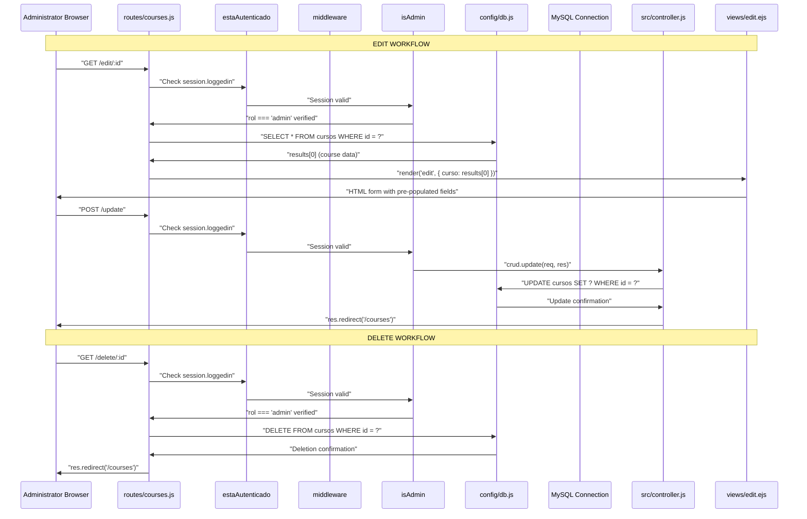
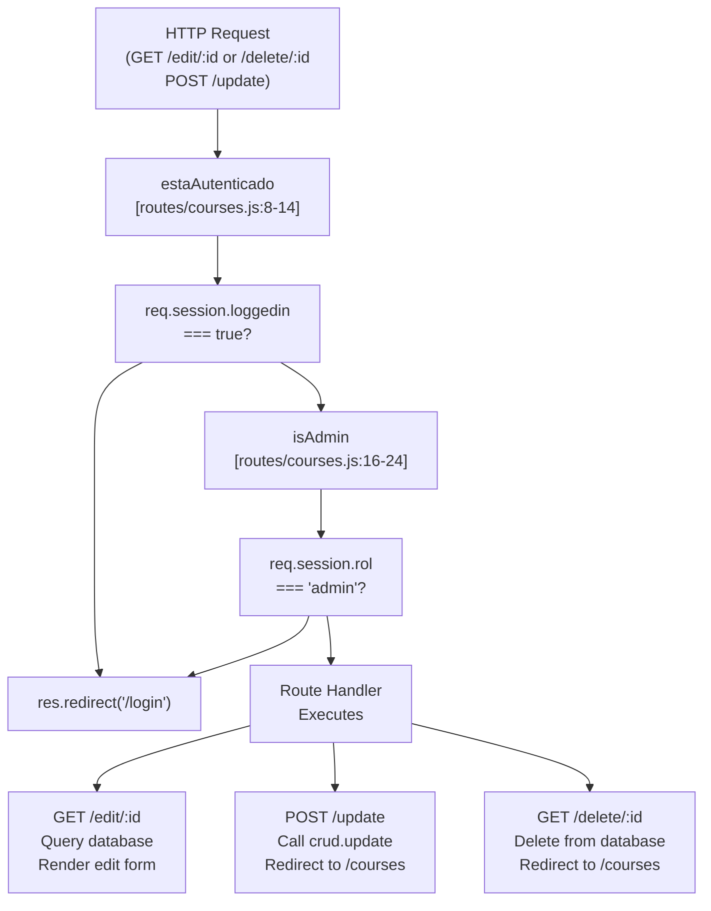
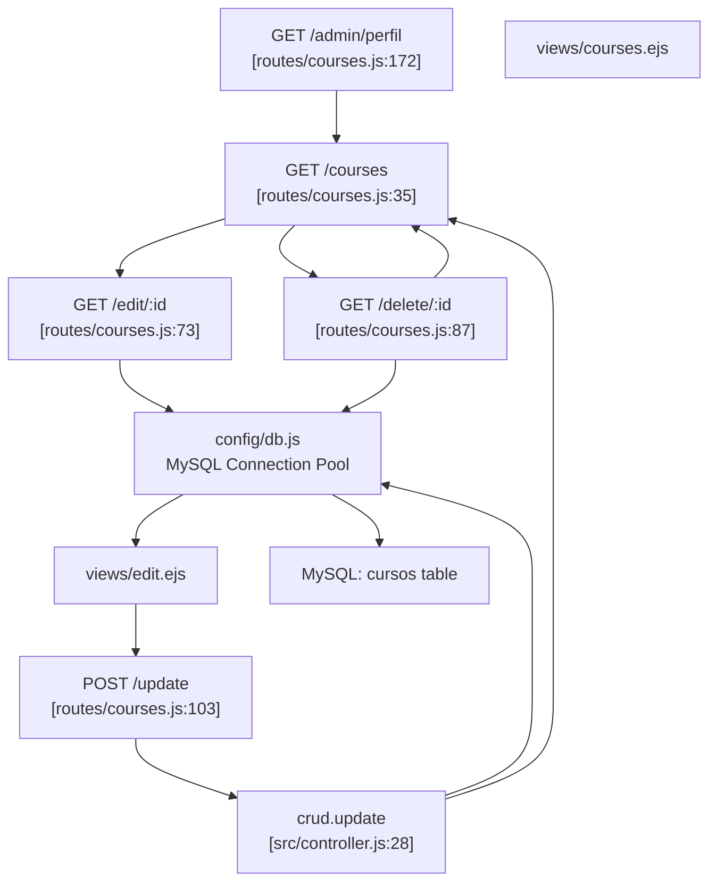

# Editing & Deleting Courses

> **Relevant source files**
> * [routes/courses.js](https://github.com/Lourdes12587/Week06/blob/ce0c3bcd/routes/courses.js)
> * [src/controller.js](https://github.com/Lourdes12587/Week06/blob/ce0c3bcd/src/controller.js)
> * [views/edit.ejs](https://github.com/Lourdes12587/Week06/blob/ce0c3bcd/views/edit.ejs)

## Purpose and Scope

This document details the administrator-exclusive functionality for modifying and deleting courses in the system. It covers the edit workflow including form pre-population with existing data, the update processing logic, and the delete operation with database transaction handling. These operations are restricted to users with the `admin` role through middleware enforcement.

For information about creating new courses, see [Creating Courses](/Lourdes12587/Week06/5.1-creating-courses). For general course visibility and listing functionality, see [Course Listing & Visibility](/Lourdes12587/Week06/5.3-course-listing-and-visibility).

---

## Overview

The course editing and deletion features are implemented as protected routes that require both authentication and administrator privileges. The system provides a two-step edit workflow: first retrieving existing course data to pre-populate an edit form, then processing the submitted changes. Deletion operates as a single-step GET request that immediately removes the course record from the database.

**Key Components:**

| Component | File Path | Purpose |
| --- | --- | --- |
| Edit Route Handler | `routes/courses.js:73-84` | Retrieves course data and renders edit form |
| Update Route Handler | `routes/courses.js:103` | Delegates update processing to controller |
| Delete Route Handler | `routes/courses.js:87-98` | Executes course deletion directly |
| Update Controller | `src/controller.js:28-52` | Contains business logic for updating course fields |
| Edit View Template | `views/edit.ejs:1-35` | Renders pre-populated edit form with course data |

Sources: [routes/courses.js L1-L187](https://github.com/Lourdes12587/Week06/blob/ce0c3bcd/routes/courses.js#L1-L187)

 [src/controller.js L1-L53](https://github.com/Lourdes12587/Week06/blob/ce0c3bcd/src/controller.js#L1-L53)

 [views/edit.ejs L1-L35](https://github.com/Lourdes12587/Week06/blob/ce0c3bcd/views/edit.ejs#L1-L35)

---

## Request Flow Architecture

**Diagram: Edit and Delete Request Flow**



Sources: [routes/courses.js L73-L98](https://github.com/Lourdes12587/Week06/blob/ce0c3bcd/routes/courses.js#L73-L98)

 [routes/courses.js L103](https://github.com/Lourdes12587/Week06/blob/ce0c3bcd/routes/courses.js#L103-L103)

 [src/controller.js L28-L52](https://github.com/Lourdes12587/Week06/blob/ce0c3bcd/src/controller.js#L28-L52)

---

## Editing Courses

### Edit Route - GET /edit/:id

The edit route retrieves a specific course record from the database and renders a form pre-populated with the existing values. This enables administrators to modify course details while preserving unchanged fields.

**Route Definition:**

```javascript
router.get("/edit/:id", estaAutenticado, isAdmin, (req, res) => { ... }
```

**Middleware Chain:**

1. `estaAutenticado` - Verifies `req.session.loggedin` is true [routes/courses.js L8-L14](https://github.com/Lourdes12587/Week06/blob/ce0c3bcd/routes/courses.js#L8-L14)
2. `isAdmin` - Confirms `req.session.rol === 'admin'` [routes/courses.js L16-L24](https://github.com/Lourdes12587/Week06/blob/ce0c3bcd/routes/courses.js#L16-L24)

**Implementation Details:**

The route handler extracts the course ID from the URL parameters and executes a parameterized SQL query to fetch the course record. The query uses a placeholder (`?`) to prevent SQL injection:

```sql
SELECT * FROM cursos WHERE id = ?
```

The first result (`results[0]`) is passed to the `edit.ejs` template as the `curso` object. If an error occurs, it is thrown, which would trigger Express's default error handler.

Sources: [routes/courses.js L73-L84](https://github.com/Lourdes12587/Week06/blob/ce0c3bcd/routes/courses.js#L73-L84)

### Edit Form Template

The edit form is rendered by `views/edit.ejs`, which displays a Bootstrap-styled card interface. The form includes a hidden input field containing the course ID to ensure the correct record is updated during submission.

**Form Structure:**

| Field | Input Type | EJS Binding | Purpose |
| --- | --- | --- | --- |
| `id` | `text` (hidden) | `<%= curso.id %>` | Identifies which course to update |
| `titulo` | `text` | `<%= curso.titulo %>` | Course title field |
| `descripcion` | `text` | `<%= curso.descripcion %>` | Course description field |
| `categoria` | `text` | `<%= curso.categoria %>` | Course category field |

The form submits to `/update` via POST method [views/edit.ejs L10](https://github.com/Lourdes12587/Week06/blob/ce0c3bcd/views/edit.ejs#L10-L10)

 If no course data is available, the template displays an error message: "CURSOS NO ENCONTRADO" [views/edit.ejs L33](https://github.com/Lourdes12587/Week06/blob/ce0c3bcd/views/edit.ejs#L33-L33)

Sources: [views/edit.ejs L1-L35](https://github.com/Lourdes12587/Week06/blob/ce0c3bcd/views/edit.ejs#L1-L35)

### Update Route - POST /update

The update route delegates processing to the `crud.update` controller function. The route definition applies the same middleware protection as the edit route:

```sql
router.post('/update', estaAutenticado, isAdmin, crud.update);
```

Sources: [routes/courses.js L103](https://github.com/Lourdes12587/Week06/blob/ce0c3bcd/routes/courses.js#L103-L103)

### Update Controller Logic

The `exports.update` function in `src/controller.js` extracts form data from the request body and executes an UPDATE query. The function uses parameterized queries to safely update the database:

**Form Data Extraction:**

* `req.body.id` - Course identifier [src/controller.js L30](https://github.com/Lourdes12587/Week06/blob/ce0c3bcd/src/controller.js#L30-L30)
* `req.body.titulo` - Updated title [src/controller.js L31](https://github.com/Lourdes12587/Week06/blob/ce0c3bcd/src/controller.js#L31-L31)
* `req.body.descripcion` - Updated description [src/controller.js L32](https://github.com/Lourdes12587/Week06/blob/ce0c3bcd/src/controller.js#L32-L32)
* `req.body.categoria` - Updated category [src/controller.js L33](https://github.com/Lourdes12587/Week06/blob/ce0c3bcd/src/controller.js#L33-L33)

**SQL Query Structure:**

```sql
UPDATE cursos SET ? WHERE id = ?
```

The query uses two parameters: an object containing the fields to update, and the course ID. The object notation (`SET ?`) allows MySQL to automatically format the update fields [src/controller.js L36-L42](https://github.com/Lourdes12587/Week06/blob/ce0c3bcd/src/controller.js#L36-L42)

**Response Handling:**

* On success or error: redirects to `/courses` [src/controller.js L48](https://github.com/Lourdes12587/Week06/blob/ce0c3bcd/src/controller.js#L48-L48)
* Errors are logged to console but do not halt execution [src/controller.js L46](https://github.com/Lourdes12587/Week06/blob/ce0c3bcd/src/controller.js#L46-L46)

Sources: [src/controller.js L28-L52](https://github.com/Lourdes12587/Week06/blob/ce0c3bcd/src/controller.js#L28-L52)

---

## Deleting Courses

### Delete Route - GET /delete/:id

The delete operation is implemented as a single GET request that immediately removes the course from the database. This design choice prioritizes simplicity over the traditional two-step confirmation pattern, relying on client-side confirmation dialogs instead.

**Route Definition:**

```javascript
router.get("/delete/:id", estaAutenticado, isAdmin, (req, res) => { ... }
```

**Deletion Process:**

1. Extract course ID from URL parameter: `req.params.id` [routes/courses.js L89](https://github.com/Lourdes12587/Week06/blob/ce0c3bcd/routes/courses.js#L89-L89)
2. Execute DELETE query with parameterized ID
3. Redirect to course listing page on success [routes/courses.js L95](https://github.com/Lourdes12587/Week06/blob/ce0c3bcd/routes/courses.js#L95-L95)
4. Throw error if query fails [routes/courses.js L93](https://github.com/Lourdes12587/Week06/blob/ce0c3bcd/routes/courses.js#L93-L93)

**SQL Query:**

```sql
DELETE FROM cursos WHERE id = ?
```

The query uses a parameterized placeholder to safely delete the specified course record [routes/courses.js L91](https://github.com/Lourdes12587/Week06/blob/ce0c3bcd/routes/courses.js#L91-L91)

**Cascading Deletions:**

The system does not implement explicit cascading deletion logic in the application code. If foreign key constraints exist on the `inscripciones` table referencing `cursos.id`, the database engine would handle cascading behavior based on the constraint definition (e.g., `ON DELETE CASCADE`). Without such constraints, orphaned enrollment records would remain in the database.

Sources: [routes/courses.js L87-L98](https://github.com/Lourdes12587/Week06/blob/ce0c3bcd/routes/courses.js#L87-L98)

---

## Authorization and Security

**Diagram: Middleware Security Chain**



Sources: [routes/courses.js L8-L24](https://github.com/Lourdes12587/Week06/blob/ce0c3bcd/routes/courses.js#L8-L24)

 [routes/courses.js L73-L104](https://github.com/Lourdes12587/Week06/blob/ce0c3bcd/routes/courses.js#L73-L104)

### Authentication Middleware - estaAutenticado

This middleware function verifies that a user session exists and is authenticated. It checks for the presence of `req.session.loggedin` and calls `next()` if true, otherwise redirects to `/login`.

**Implementation:** [routes/courses.js L8-L14](https://github.com/Lourdes12587/Week06/blob/ce0c3bcd/routes/courses.js#L8-L14)

### Authorization Middleware - isAdmin

This middleware enforces role-based access control by verifying both session authentication and administrator role assignment. It checks:

* `req.session.loggedin` is truthy
* `req.session.rol === 'admin'`

If either condition fails, the request is redirected to `/login` [routes/courses.js L16-L24](https://github.com/Lourdes12587/Week06/blob/ce0c3bcd/routes/courses.js#L16-L24)

**Session Object Structure:**

```yaml
req.session = {
  loggedin: true,
  rol: 'admin',
  usuario: { id: ..., nombre: ..., email: ... }
}
```

Sources: [routes/courses.js L16-L24](https://github.com/Lourdes12587/Week06/blob/ce0c3bcd/routes/courses.js#L16-L24)

---

## Database Operations

**Table: Database Queries by Operation**

| Operation | Query Type | SQL Statement | Parameters | File Location |
| --- | --- | --- | --- | --- |
| Load Edit Form | SELECT | `SELECT * FROM cursos WHERE id = ?` | `[id]` | `routes/courses.js:77` |
| Update Course | UPDATE | `UPDATE cursos SET ? WHERE id = ?` | `[{titulo, descripcion, categoria}, id]` | `src/controller.js:36` |
| Delete Course | DELETE | `DELETE FROM cursos WHERE id = ?` | `[id]` | `routes/courses.js:91` |

### Query Parameterization

All database operations use parameterized queries (placeholders with `?`) to prevent SQL injection attacks. The `mysql2` driver automatically escapes parameter values before query execution.

**Example from Update Operation:**

```javascript
db.query(
    "UPDATE cursos SET ? WHERE id = ?", 
    [{
        titulo: titulo,
        descripcion: descripcion,
        categoria: categoria,
    }, id],
    (error, results) => { ... }
);
```

The first parameter (`?`) accepts an object where keys map to column names, and the second parameter (`?`) is the scalar course ID [src/controller.js L35-L43](https://github.com/Lourdes12587/Week06/blob/ce0c3bcd/src/controller.js#L35-L43)

Sources: [routes/courses.js L77](https://github.com/Lourdes12587/Week06/blob/ce0c3bcd/routes/courses.js#L77-L77)

 [routes/courses.js L91](https://github.com/Lourdes12587/Week06/blob/ce0c3bcd/routes/courses.js#L91-L91)

 [src/controller.js L35-L43](https://github.com/Lourdes12587/Week06/blob/ce0c3bcd/src/controller.js#L35-L43)

### Error Handling

**Edit Route:** Errors are thrown, delegating to Express's error handling middleware [routes/courses.js L79](https://github.com/Lourdes12587/Week06/blob/ce0c3bcd/routes/courses.js#L79-L79)

**Update Controller:** Errors are logged to console but execution continues, redirecting regardless of success [src/controller.js L45-L48](https://github.com/Lourdes12587/Week06/blob/ce0c3bcd/src/controller.js#L45-L48)

**Delete Route:** Errors are thrown, delegating to Express's error handling middleware [routes/courses.js L93](https://github.com/Lourdes12587/Week06/blob/ce0c3bcd/routes/courses.js#L93-L93)

This inconsistent error handling approach means that update failures may not be visible to administrators, as they are always redirected to `/courses` even when the database operation fails.

Sources: [routes/courses.js L79](https://github.com/Lourdes12587/Week06/blob/ce0c3bcd/routes/courses.js#L79-L79)

 [routes/courses.js L93](https://github.com/Lourdes12587/Week06/blob/ce0c3bcd/routes/courses.js#L93-L93)

 [src/controller.js L45-L48](https://github.com/Lourdes12587/Week06/blob/ce0c3bcd/src/controller.js#L45-L48)

---

## Complete Endpoint Reference

**Table: Edit and Delete Endpoints**

| Method | Path | Middleware | Handler | Request Data | Response |
| --- | --- | --- | --- | --- | --- |
| GET | `/edit/:id` | `estaAutenticado`, `isAdmin` | Inline function | URL param: `id` | Rendered `edit.ejs` with `curso` object |
| POST | `/update` | `estaAutenticado`, `isAdmin` | `crud.update` | Body: `id`, `titulo`, `descripcion`, `categoria` | Redirect to `/courses` |
| GET | `/delete/:id` | `estaAutenticado`, `isAdmin` | Inline function | URL param: `id` | Redirect to `/courses` |

**Response Patterns:**

* **Edit (GET):** Server-side rendered HTML form
* **Update (POST):** Post-Redirect-Get pattern to `/courses`
* **Delete (GET):** Immediate redirect to `/courses` after deletion

Sources: [routes/courses.js L73-L104](https://github.com/Lourdes12587/Week06/blob/ce0c3bcd/routes/courses.js#L73-L104)

---

## Integration Points

**Diagram: System Integration Map**



Sources: [routes/courses.js L35-L187](https://github.com/Lourdes12587/Week06/blob/ce0c3bcd/routes/courses.js#L35-L187)

 [src/controller.js L28-L52](https://github.com/Lourdes12587/Week06/blob/ce0c3bcd/src/controller.js#L28-L52)

 [views/edit.ejs L1-L35](https://github.com/Lourdes12587/Week06/blob/ce0c3bcd/views/edit.ejs#L1-L35)

The edit and delete functionality integrates with the broader course management system through the `/courses` listing page, which conditionally displays edit and delete action links to administrators. After any modification or deletion, the system redirects back to `/courses`, creating a circular workflow that allows administrators to perform multiple operations in sequence.