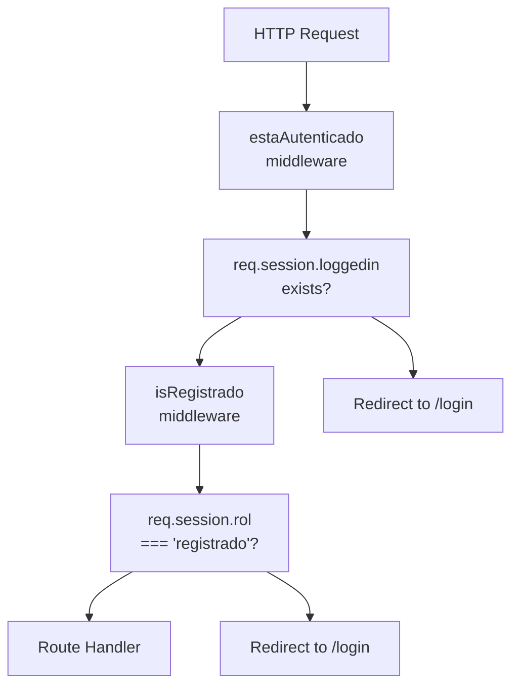
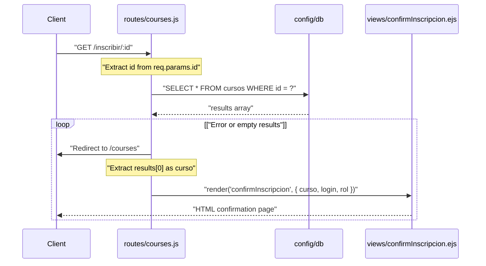
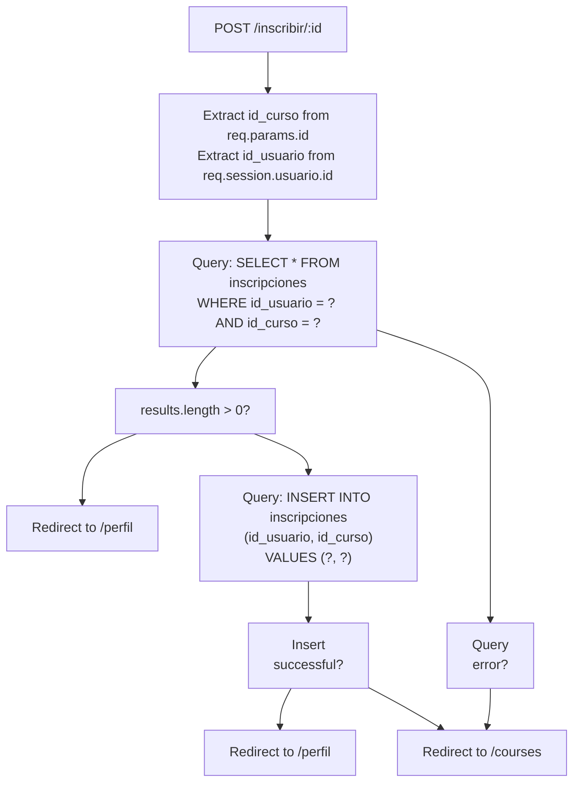
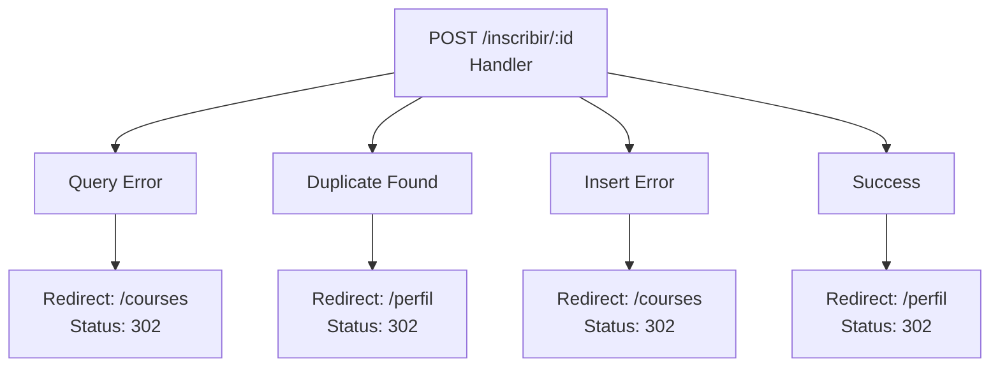

# Enrollment Endpoints

> **Relevant source files**
> * [routes/courses.js](https://github.com/Lourdes12587/Week06/blob/ce0c3bcd/routes/courses.js)
> * [src/cursoController.js](https://github.com/Lourdes12587/Week06/blob/ce0c3bcd/src/cursoController.js)

## Purpose and Scope

This document provides technical reference for the enrollment endpoints that handle course registration for authenticated users. These endpoints implement a two-step enrollment workflow with duplicate prevention and role-based access control.

The enrollment functionality is restricted to users with the `registrado` role. For information about course management by administrators, see [Course Management Endpoints](/Lourdes12587/Week06/8.2-course-management-endpoints). For information about user and admin profile pages where enrollments are displayed, see [Profile Endpoints](/Lourdes12587/Week06/8.4-profile-endpoints). For authentication middleware details, see [Role-Based Access Control](/Lourdes12587/Week06/4.3-role-based-access-control).

---

## Endpoints Overview

The enrollment system consists of two endpoints located in `routes/courses.js`:

| Endpoint | Method | Purpose | Middleware | Handler Location |
| --- | --- | --- | --- | --- |
| `/inscribir/:id` | GET | Display enrollment confirmation page | `estaAutenticado`, `isRegistrado` | [routes/courses.js L106-L114](https://github.com/Lourdes12587/Week06/blob/ce0c3bcd/routes/courses.js#L106-L114) |
| `/inscribir/:id` | POST | Process enrollment and insert record | `estaAutenticado`, `isRegistrado` | [routes/courses.js L117-L149](https://github.com/Lourdes12587/Week06/blob/ce0c3bcd/routes/courses.js#L117-L149) |

Both endpoints require authenticated users with the `registrado` role. The `:id` parameter represents the course ID (`id_curso`) from the `cursos` table.

**Sources:** [routes/courses.js L106-L149](https://github.com/Lourdes12587/Week06/blob/ce0c3bcd/routes/courses.js#L106-L149)

---

## Authentication and Authorization Requirements

### Middleware Chain

All enrollment endpoints pass through two middleware functions before reaching the route handler:



**Sources:** [routes/courses.js L8-L14](https://github.com/Lourdes12587/Week06/blob/ce0c3bcd/routes/courses.js#L8-L14)

 [routes/courses.js L26-L33](https://github.com/Lourdes12587/Week06/blob/ce0c3bcd/routes/courses.js#L26-L33)

 [routes/courses.js L106](https://github.com/Lourdes12587/Week06/blob/ce0c3bcd/routes/courses.js#L106-L106)

 [routes/courses.js L117](https://github.com/Lourdes12587/Week06/blob/ce0c3bcd/routes/courses.js#L117-L117)

### Access Control Functions

**`estaAutenticado` Middleware** [routes/courses.js L8-L14](https://github.com/Lourdes12587/Week06/blob/ce0c3bcd/routes/courses.js#L8-L14)

* Verifies `req.session.loggedin` is truthy
* Redirects to `/login` if not authenticated
* Required for all protected routes

**`isRegistrado` Middleware** [routes/courses.js L26-L33](https://github.com/Lourdes12587/Week06/blob/ce0c3bcd/routes/courses.js#L26-L33)

* Verifies `req.session.loggedin` exists
* Verifies `req.session.rol === 'registrado'`
* Redirects to `/login` if role check fails
* Prevents admin users from enrolling (admins have different workflows)

**Sources:** [routes/courses.js L8-L33](https://github.com/Lourdes12587/Week06/blob/ce0c3bcd/routes/courses.js#L8-L33)

---

## GET /inscribir/:id - Enrollment Confirmation Page

### Endpoint Specification

**Route:** `GET /inscribir/:id`
**Middleware:** `estaAutenticado`, `isRegistrado`
**Handler:** [routes/courses.js L106-L114](https://github.com/Lourdes12587/Week06/blob/ce0c3bcd/routes/courses.js#L106-L114)

### Request Parameters

| Parameter | Type | Location | Description |
| --- | --- | --- | --- |
| `id` | Integer | URL path | Course ID from `cursos` table |

### Handler Logic



**Sources:** [routes/courses.js L106-L114](https://github.com/Lourdes12587/Week06/blob/ce0c3bcd/routes/courses.js#L106-L114)

### Database Query

The endpoint executes a single SELECT query to retrieve course details:

```sql
SELECT * FROM cursos WHERE id = ?
```

* **Parameters:** `[idCurso]` from `req.params.id`
* **Expected Result:** Single course record or empty array

**Sources:** [routes/courses.js L109](https://github.com/Lourdes12587/Week06/blob/ce0c3bcd/routes/courses.js#L109-L109)

### Response Behavior

| Condition | Response | Status |
| --- | --- | --- |
| Course found | Render `confirmInscripcion` view with course data | 200 |
| Error or course not found | Redirect to `/courses` | 302 |

### View Data

The `confirmInscripcion` view receives the following data object:

```python
{
  curso: results[0],              // Course object from database
  login: req.session.loggedin,    // Boolean authentication status
  rol: req.session.rol            // User role string ('registrado')
}
```

**Sources:** [routes/courses.js L112](https://github.com/Lourdes12587/Week06/blob/ce0c3bcd/routes/courses.js#L112-L112)

---

## POST /inscribir/:id - Process Enrollment

### Endpoint Specification

**Route:** `POST /inscribir/:id`
**Middleware:** `estaAutenticado`, `isRegistrado`
**Handler:** [routes/courses.js L117-L149](https://github.com/Lourdes12587/Week06/blob/ce0c3bcd/routes/courses.js#L117-L149)

### Request Parameters

| Parameter | Type | Location | Description |
| --- | --- | --- | --- |
| `id` | Integer | URL path | Course ID to enroll in |
| `req.session.usuario.id` | Integer | Session | User ID from authenticated session |

### Enrollment Flow Diagram



**Sources:** [routes/courses.js L117-L149](https://github.com/Lourdes12587/Week06/blob/ce0c3bcd/routes/courses.js#L117-L149)

### Duplicate Prevention Logic

The endpoint implements duplicate enrollment prevention through a two-query transaction:

**Step 1: Check for Existing Enrollment** [routes/courses.js L121-L133](https://github.com/Lourdes12587/Week06/blob/ce0c3bcd/routes/courses.js#L121-L133)

```sql
SELECT * FROM inscripciones 
WHERE id_usuario = ? AND id_curso = ?
```

* **Parameters:** `[id_usuario, id_curso]`
* **Purpose:** Verify if enrollment already exists
* **Action if found:** Redirect to `/perfil` without inserting

**Step 2: Insert New Enrollment** [routes/courses.js L135-L146](https://github.com/Lourdes12587/Week06/blob/ce0c3bcd/routes/courses.js#L135-L146)

```sql
INSERT INTO inscripciones (id_usuario, id_curso) 
VALUES (?, ?)
```

* **Parameters:** `[id_usuario, id_curso]`
* **Purpose:** Create new enrollment record
* **Action on success:** Redirect to `/perfil`
* **Action on error:** Redirect to `/courses`

**Sources:** [routes/courses.js L121-L146](https://github.com/Lourdes12587/Week06/blob/ce0c3bcd/routes/courses.js#L121-L146)

### Database Schema Interaction

```css
#mermaid-77niozwrg1q{font-family:ui-sans-serif,-apple-system,system-ui,Segoe UI,Helvetica;font-size:16px;fill:#333;}@keyframes edge-animation-frame{from{stroke-dashoffset:0;}}@keyframes dash{to{stroke-dashoffset:0;}}#mermaid-77niozwrg1q .edge-animation-slow{stroke-dasharray:9,5!important;stroke-dashoffset:900;animation:dash 50s linear infinite;stroke-linecap:round;}#mermaid-77niozwrg1q .edge-animation-fast{stroke-dasharray:9,5!important;stroke-dashoffset:900;animation:dash 20s linear infinite;stroke-linecap:round;}#mermaid-77niozwrg1q .error-icon{fill:#dddddd;}#mermaid-77niozwrg1q .error-text{fill:#222222;stroke:#222222;}#mermaid-77niozwrg1q .edge-thickness-normal{stroke-width:1px;}#mermaid-77niozwrg1q .edge-thickness-thick{stroke-width:3.5px;}#mermaid-77niozwrg1q .edge-pattern-solid{stroke-dasharray:0;}#mermaid-77niozwrg1q .edge-thickness-invisible{stroke-width:0;fill:none;}#mermaid-77niozwrg1q .edge-pattern-dashed{stroke-dasharray:3;}#mermaid-77niozwrg1q .edge-pattern-dotted{stroke-dasharray:2;}#mermaid-77niozwrg1q .marker{fill:#999;stroke:#999;}#mermaid-77niozwrg1q .marker.cross{stroke:#999;}#mermaid-77niozwrg1q svg{font-family:ui-sans-serif,-apple-system,system-ui,Segoe UI,Helvetica;font-size:16px;}#mermaid-77niozwrg1q p{margin:0;}#mermaid-77niozwrg1q .entityBox{fill:#ffffff;stroke:#dddddd;}#mermaid-77niozwrg1q .relationshipLabelBox{fill:#dddddd;opacity:0.7;background-color:#dddddd;}#mermaid-77niozwrg1q .relationshipLabelBox rect{opacity:0.5;}#mermaid-77niozwrg1q .labelBkg{background-color:rgba(221, 221, 221, 0.5);}#mermaid-77niozwrg1q .edgeLabel .label{fill:#dddddd;font-size:14px;}#mermaid-77niozwrg1q .label{font-family:ui-sans-serif,-apple-system,system-ui,Segoe UI,Helvetica;color:#333;}#mermaid-77niozwrg1q .edge-pattern-dashed{stroke-dasharray:8,8;}#mermaid-77niozwrg1q .node rect,#mermaid-77niozwrg1q .node circle,#mermaid-77niozwrg1q .node ellipse,#mermaid-77niozwrg1q .node polygon{fill:#ffffff;stroke:#dddddd;stroke-width:1px;}#mermaid-77niozwrg1q .relationshipLine{stroke:#999;stroke-width:1;fill:none;}#mermaid-77niozwrg1q .marker{fill:none!important;stroke:#999!important;stroke-width:1;}#mermaid-77niozwrg1q :root{--mermaid-font-family:"trebuchet ms",verdana,arial,sans-serif;}id_usuarioid_cursousuariosintidPKstringnombrestringemailstringpasswordenumrolinscripcionesintid_usuarioFKintid_cursoFKcursosintidPKstringtitulostringdescripcionstringcategoriastringvisibilidad
```

The `inscripciones` table acts as a junction table establishing a many-to-many relationship between `usuarios` and `cursos`. The composite key `(id_usuario, id_curso)` should be unique to prevent duplicate enrollments at the database level.

**Sources:** [routes/courses.js L121-L146](https://github.com/Lourdes12587/Week06/blob/ce0c3bcd/routes/courses.js#L121-L146)

### Session Data Requirements

The POST handler retrieves the user ID from the session object:

```javascript
const id_usuario = req.session.usuario.id;
```

This requires that the session contains a `usuario` object with an `id` property, which is set during the login process (see [User Login](/Lourdes12587/Week06/4.2-user-login)).

**Sources:** [routes/courses.js L119](https://github.com/Lourdes12587/Week06/blob/ce0c3bcd/routes/courses.js#L119-L119)

### Response Patterns



**Sources:** [routes/courses.js L117-L149](https://github.com/Lourdes12587/Week06/blob/ce0c3bcd/routes/courses.js#L117-L149)

| Scenario | Response | Status Code | User Experience |
| --- | --- | --- | --- |
| Already enrolled | Redirect to `/perfil` | 302 | User sees existing enrollment in profile |
| New enrollment success | Redirect to `/perfil` | 302 | User sees newly added course in profile |
| Database query error | Redirect to `/courses` | 302 | User returns to course listing |
| Database insert error | Redirect to `/courses` | 302 | User returns to course listing |

All responses use the Post-Redirect-Get (PRG) pattern to prevent duplicate form submissions on browser refresh.

**Sources:** [routes/courses.js L127-L144](https://github.com/Lourdes12587/Week06/blob/ce0c3bcd/routes/courses.js#L127-L144)

---

## Error Handling

### Console Logging

The POST handler logs errors to the console for debugging:

```
if (err) {
  console.error(err);
  return res.redirect("/courses");
}
```

```
if (err2) {
  console.error(err2);
  return res.redirect("/courses");
}
```

**Sources:** [routes/courses.js L126](https://github.com/Lourdes12587/Week06/blob/ce0c3bcd/routes/courses.js#L126-L126)

 [routes/courses.js L140](https://github.com/Lourdes12587/Week06/blob/ce0c3bcd/routes/courses.js#L140-L140)

### Graceful Degradation

Both endpoints implement graceful error handling:

* **GET endpoint:** Returns empty results on error, redirects to `/courses` [routes/courses.js L110](https://github.com/Lourdes12587/Week06/blob/ce0c3bcd/routes/courses.js#L110-L110)
* **POST endpoint:** Redirects to `/courses` on any database error [routes/courses.js L127](https://github.com/Lourdes12587/Week06/blob/ce0c3bcd/routes/courses.js#L127-L127)  [routes/courses.js L141](https://github.com/Lourdes12587/Week06/blob/ce0c3bcd/routes/courses.js#L141-L141)

No error messages are displayed to the user; the system silently redirects to safe pages.

**Sources:** [routes/courses.js L106-L149](https://github.com/Lourdes12587/Week06/blob/ce0c3bcd/routes/courses.js#L106-L149)

---

## Alternative Implementation

The codebase includes an alternative enrollment controller at `src/cursoController.js` that implements identical logic to the POST handler:

```javascript
exports.inscribirCurso = (req, res) => { ... }
```

This function [src/cursoController.js L3-L25](https://github.com/Lourdes12587/Week06/blob/ce0c3bcd/src/cursoController.js#L3-L25)

 is not currently used by the routes but provides the same duplicate prevention and insertion logic. The active implementation is inline in [routes/courses.js L117-L149](https://github.com/Lourdes12587/Week06/blob/ce0c3bcd/routes/courses.js#L117-L149)

**Sources:** [src/cursoController.js L1-L25](https://github.com/Lourdes12587/Week06/blob/ce0c3bcd/src/cursoController.js#L1-L25)

 [routes/courses.js L117-L149](https://github.com/Lourdes12587/Week06/blob/ce0c3bcd/routes/courses.js#L117-L149)

---

## Integration with Profile System

Upon successful enrollment, users are redirected to `/perfil`, where enrolled courses are displayed through a JOIN query:

```sql
SELECT c.* 
FROM cursos c
JOIN inscripciones i ON c.id = i.id_curso
WHERE i.id_usuario = ?
```

This query is executed in the profile endpoint [routes/courses.js L155-L160](https://github.com/Lourdes12587/Week06/blob/ce0c3bcd/routes/courses.js#L155-L160)

 For complete profile documentation, see [User Profile Page](/Lourdes12587/Week06/6.1-user-profile-page).

**Sources:** [routes/courses.js L152-L169](https://github.com/Lourdes12587/Week06/blob/ce0c3bcd/routes/courses.js#L152-L169)

---

## Security Considerations

### Access Control

* Both endpoints enforce `isRegistrado` middleware, preventing public and admin users from enrolling
* Session-based authentication ensures only logged-in users can access endpoints
* Course ID comes from URL parameter, not user input, reducing injection risks

### Database Security

* All queries use parameterized statements with `?` placeholders
* User ID retrieved from server-side session, not client input
* No direct SQL concatenation prevents SQL injection

### Business Logic Security

* Duplicate check prevents multiple enrollments in same course
* Silent failure on errors prevents information leakage
* Redirect-based responses prevent CSRF on GET requests

**Sources:** [routes/courses.js L106-L149](https://github.com/Lourdes12587/Week06/blob/ce0c3bcd/routes/courses.js#L106-L149)