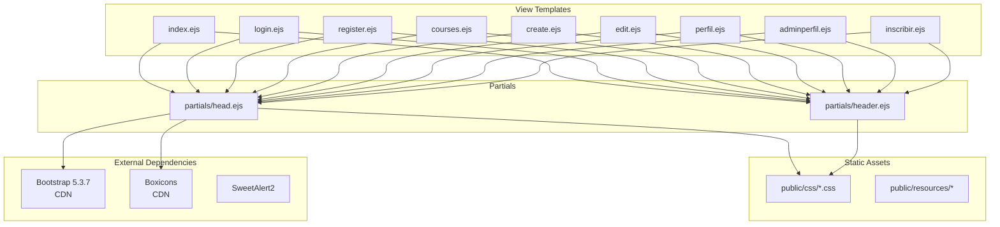
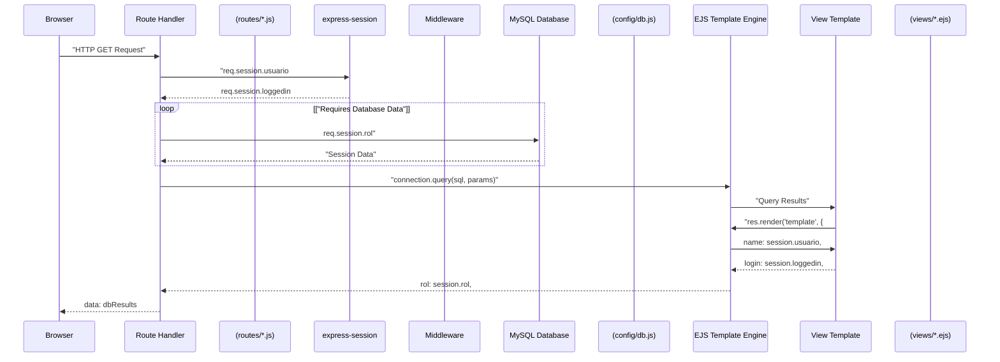
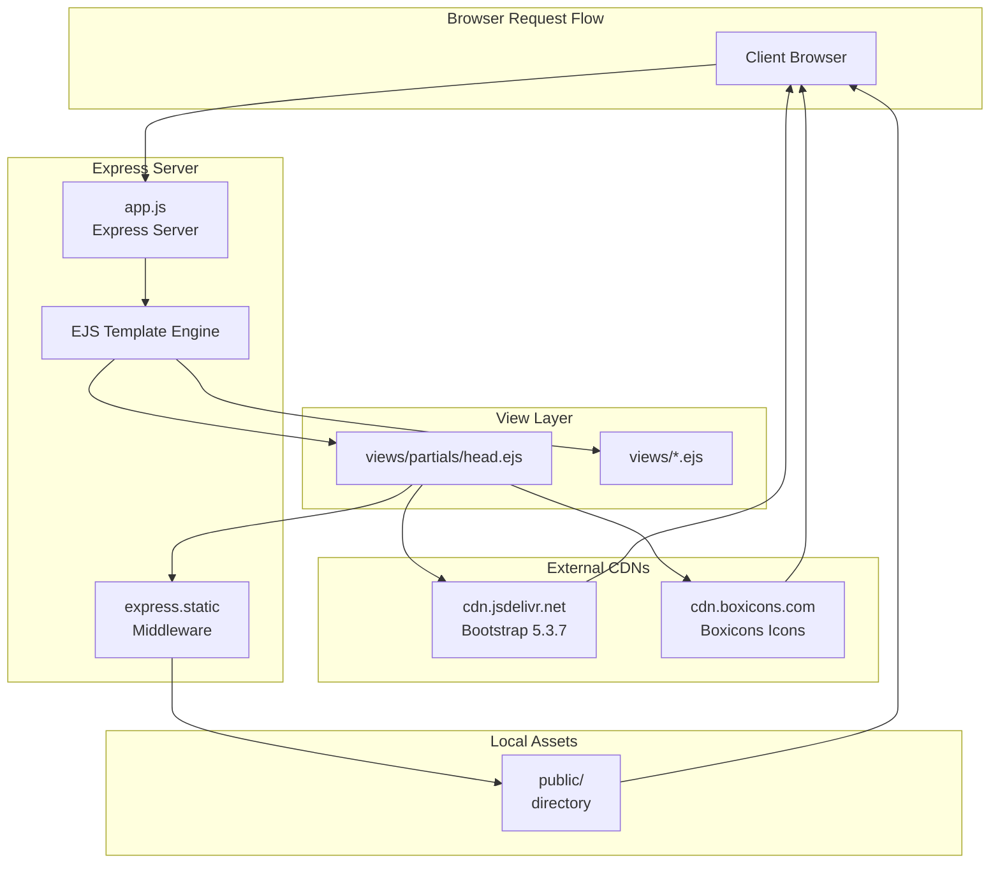

# Frontend Architecture

> **Relevant source files**
> * [app.js](https://github.com/Lourdes12587/Week06/blob/ce0c3bcd/app.js)
> * [views/index.ejs](https://github.com/Lourdes12587/Week06/blob/ce0c3bcd/views/index.ejs)
> * [views/partials/head.ejs](https://github.com/Lourdes12587/Week06/blob/ce0c3bcd/views/partials/head.ejs)
> * [views/partials/header.ejs](https://github.com/Lourdes12587/Week06/blob/ce0c3bcd/views/partials/header.ejs)

## Purpose and Scope

This document provides a comprehensive overview of the frontend architecture for the course management system. It covers the EJS templating system, reusable partial components, view rendering pipeline, static asset organization, and the consistent UI structure maintained across all pages.

For information about specific view implementations and their associated routes, see [API Reference](/Lourdes12587/Week06/8-api-reference). For styling patterns and CSS organization, see [Template System & Partials](/Lourdes12587/Week06/7.1-template-system-and-partials) and [Styling System](/Lourdes12587/Week06/7.5-styling-system). For the overall system architecture including backend integration, see [Architecture Overview](/Lourdes12587/Week06/3-architecture-overview).

---

## Template Rendering System

The application uses **EJS (Embedded JavaScript)** as its server-side templating engine. The engine is configured in the main application entry point and allows dynamic HTML generation with embedded JavaScript logic.

### EJS Configuration

The Express application is configured to use EJS for view rendering:

```
app.set('view engine', 'ejs');
```

**Sources:** [app.js L21](https://github.com/Lourdes12587/Week06/blob/ce0c3bcd/app.js#L21-L21)

This configuration enables automatic template resolution from the default `views/` directory. When route handlers call `res.render('templateName', data)`, Express automatically:

1. Locates the template file at `views/templateName.ejs`
2. Processes EJS syntax and embedded JavaScript
3. Injects provided data variables
4. Returns rendered HTML to the client

---

## View File Organization

The frontend follows a modular view structure with clear separation between full page templates and reusable partial components.

### Directory Structure

| Directory/File | Purpose |
| --- | --- |
| `views/*.ejs` | Full page templates (index, login, register, courses, etc.) |
| `views/partials/head.ejs` | Shared HTML head section with meta tags and external dependencies |
| `views/partials/header.ejs` | Shared navigation header component |
| `public/css/*.css` | Page-specific and component-specific stylesheets |
| `public/resources/` | Static assets (images, fonts, client-side scripts) |

**Diagram: Frontend File Structure and Relationships**



**Sources:** [views/index.ejs L1-L3](https://github.com/Lourdes12587/Week06/blob/ce0c3bcd/views/index.ejs#L1-L3)

 [views/partials/head.ejs L1-L9](https://github.com/Lourdes12587/Week06/blob/ce0c3bcd/views/partials/head.ejs#L1-L9)

 [views/partials/header.ejs L1-L19](https://github.com/Lourdes12587/Week06/blob/ce0c3bcd/views/partials/header.ejs#L1-L19)

---

## Partial Component System

The application implements a **partial reuse strategy** to maintain consistency and reduce code duplication across views. Partials are included using EJS's `include` directive.

### Head Partial

The `head.ejs` partial contains the common HTML document structure and external dependencies:

**Key Elements:**

* DOCTYPE and HTML structure initialization
* UTF-8 character encoding
* Viewport meta tag for responsive design
* Bootstrap 5.3.7 CSS framework via CDN
* Boxicons icon library via CDN
* Base stylesheet reference (`/resources/css/index.css`)
* Application title: "THOT"

**Sources:** [views/partials/head.ejs L1-L9](https://github.com/Lourdes12587/Week06/blob/ce0c3bcd/views/partials/head.ejs#L1-L9)

### Header Partial

The `header.ejs` partial provides the navigation menu structure and closes the HTML head section:

**Navigation Links:**

* Home (`/`)
* Login (`/login`)
* Register (`/register`)
* User Profile (`/perfil`)
* Admin Profile (`/admin/perfil`)
* Course Management (`/courses`)

The header includes a responsive hamburger menu toggle mechanism implemented with client-side JavaScript:

```javascript
function toggleMenu() {
  document.getElementById('navLinks').classList.toggle('active');
}
```

**Sources:** [views/partials/header.ejs L1-L26](https://github.com/Lourdes12587/Week06/blob/ce0c3bcd/views/partials/header.ejs#L1-L26)

### Including Partials in Views

Views include partials using the EJS `include` directive with relative paths:

```
<%- include('partials/head') %>
<link rel="stylesheet" href="/resources/css/header.css">
<%- include('partials/header') %>
```

The `<%-` syntax performs **unescaped interpolation**, which is necessary for including HTML partials. After including the header partial, individual views can add page-specific stylesheets.

**Sources:** [views/index.ejs L1-L3](https://github.com/Lourdes12587/Week06/blob/ce0c3bcd/views/index.ejs#L1-L3)

---

## Data Flow: Routes to Views

The frontend receives dynamic data through the route-to-view rendering pipeline. Understanding this flow is critical for extending the system with new views.

**Diagram: View Rendering Pipeline**



**Sources:** [app.js L4-L13](https://github.com/Lourdes12587/Week06/blob/ce0c3bcd/app.js#L4-L13)

 [views/index.ejs L6-L21](https://github.com/Lourdes12587/Week06/blob/ce0c3bcd/views/index.ejs#L6-L21)

### View Data Context

Route handlers pass data to views through the second parameter of `res.render()`. Common data variables include:

| Variable | Type | Description | Source |
| --- | --- | --- | --- |
| `name` | String | User's name or "Invitado" | `req.session.usuario` |
| `login` | Boolean | Whether user is authenticated | `req.session.loggedin` |
| `rol` | String | User role (publico/registrado/admin) | `req.session.rol` |
| `nombre` | String | Application/organization name | Hardcoded or config |
| `experiencia` | String | Tagline or description | Hardcoded or config |

**Dynamic View Rendering Example:**

The landing page demonstrates conditional rendering based on authentication state:

```xml
<% if (login) { %>
  <h3>Usuario Conectado: <strong><%= name %></strong></h3>
  <form action="/logout" method="POST">
    <button type="submit" class="btn btn-primary mt-3">Cerrar sesión</button>
  </form>
<% } else { %>
  <h3>Bienvenido, <strong><%= name || 'Invitado' %></strong></h3>
  <a href="/login" class="btn btn-primary mt-3">Iniciar Sesion</a>
<% } %>
```

**Sources:** [views/index.ejs L13-L21](https://github.com/Lourdes12587/Week06/blob/ce0c3bcd/views/index.ejs#L13-L21)

### EJS Syntax Summary

| Syntax | Purpose | Escaping |
| --- | --- | --- |
| `<% code %>` | Execute JavaScript logic (loops, conditionals) | N/A |
| `<%= variable %>` | Output escaped value (safe for user input) | Yes |
| `<%- html %>` | Output unescaped HTML (for partials, trusted content) | No |
| `<%# comment %>` | Template comments (not rendered) | N/A |

---

## Static Asset Serving

Static assets are served through Express's built-in `express.static` middleware, configured with a custom URL prefix.

### Static Middleware Configuration

```
app.use("/resources", express.static(__dirname + "/public"));
```

**Sources:** [app.js L19](https://github.com/Lourdes12587/Week06/blob/ce0c3bcd/app.js#L19-L19)

This configuration maps the `/resources` URL path to the `public/` directory. Assets are accessible via:

| File Location | URL Path |
| --- | --- |
| `public/css/index.css` | `/resources/css/index.css` |
| `public/css/header.css` | `/resources/css/header.css` |
| `public/images/logo.png` | `/resources/images/logo.png` |

### Asset References in Views

Views reference static assets using the `/resources` prefix:

```
<link rel="stylesheet" href="/resources/css/index.css">
<link rel="stylesheet" href="/resources/css/header.css">
```

**Sources:** [views/partials/head.ejs L6](https://github.com/Lourdes12587/Week06/blob/ce0c3bcd/views/partials/head.ejs#L6-L6)

 [views/index.ejs L2](https://github.com/Lourdes12587/Week06/blob/ce0c3bcd/views/index.ejs#L2-L2)

---

## External Dependencies and CDN Integration

The frontend leverages external CSS frameworks and libraries loaded via CDN for rapid UI development and consistent design patterns.

**Diagram: Frontend Dependency Resolution**



**Sources:** [app.js L19](https://github.com/Lourdes12587/Week06/blob/ce0c3bcd/app.js#L19-L19)

 [views/partials/head.ejs L7-L8](https://github.com/Lourdes12587/Week06/blob/ce0c3bcd/views/partials/head.ejs#L7-L8)

### Bootstrap 5.3.7

The application uses Bootstrap for responsive grid layout, component styling, and utility classes:

```
<link href="https://cdn.jsdelivr.net/npm/bootstrap@5.3.7/dist/css/bootstrap.min.css" 
      rel="stylesheet" 
      integrity="sha384-LN+7fdVzj6u52u30Kp6M/trliBMCMKTyK833zpbD+pXdCLuTusPj697FH4R/5mcr" 
      crossorigin="anonymous">
```

Common Bootstrap classes used:

* `btn btn-primary` - Primary action buttons
* `mt-3` - Margin-top utility (spacing)
* Form components, grid system, and responsive utilities

**Sources:** [views/partials/head.ejs L8](https://github.com/Lourdes12587/Week06/blob/ce0c3bcd/views/partials/head.ejs#L8-L8)

 [views/index.ejs L16-L20](https://github.com/Lourdes12587/Week06/blob/ce0c3bcd/views/index.ejs#L16-L20)

### Boxicons Icon Library

Boxicons provides vector icon sets for the UI:

```
<link href='https://cdn.boxicons.com/fonts/basic/boxicons.min.css' rel='stylesheet'>
```

**Sources:** [views/partials/head.ejs L7](https://github.com/Lourdes12587/Week06/blob/ce0c3bcd/views/partials/head.ejs#L7-L7)

---

## Responsive Navigation System

The header implements a mobile-responsive navigation menu with JavaScript-powered toggle functionality.

### Navigation Structure

The navigation consists of:

1. **Logo/Brand**: "THOT" brand text
2. **Menu Toggle Button**: Three-line hamburger icon for mobile
3. **Navigation Links**: Menu items with route paths

### Mobile Menu Toggle

The responsive behavior is controlled by JavaScript that toggles the `active` class:

```javascript
function toggleMenu() {
  document.getElementById('navLinks').classList.toggle('active');
}
```

This function is triggered by the hamburger menu button:

```html
<div class="menu-btn" onclick="toggleMenu()">
  <div></div>
  <div></div>
  <div></div>
</div>
```

The CSS (in `header.css`) handles the responsive display logic based on the `active` class state.

**Sources:** [views/partials/header.ejs L6-L25](https://github.com/Lourdes12587/Week06/blob/ce0c3bcd/views/partials/header.ejs#L6-L25)

---

## UI Consistency Patterns

The application maintains consistent UI patterns across all views through:

1. **Shared Partials**: Every view includes `head.ejs` and `header.ejs`
2. **Bootstrap Framework**: Uniform component styling and spacing
3. **Page-Specific Stylesheets**: Additional styles loaded after partials
4. **Consistent Navigation**: Same menu structure on every page
5. **Common Data Variables**: Standardized naming (login, name, rol)

### Template Inclusion Pattern

All full-page templates follow this structure:

```xml
<%- include('partials/head') %>
<!-- Optional: page-specific CSS -->
<link rel="stylesheet" href="/resources/css/page-specific.css">
<%- include('partials/header') %>

<!-- Page-specific content -->
<section>
  <!-- View content here -->
</section>

<!-- Optional: page-specific scripts -->
</body>
</html>
```

**Sources:** [views/index.ejs L1-L3](https://github.com/Lourdes12587/Week06/blob/ce0c3bcd/views/index.ejs#L1-L3)

---

## Session Integration in Views

Views have access to session data passed from route handlers, enabling personalized content rendering without client-side state management.

### Session-Aware Rendering

The index page demonstrates session-aware conditional rendering:

| Session State | View Behavior |
| --- | --- |
| `login: false` | Shows welcome message with "Invitado", displays login button |
| `login: true` | Shows connected user with name, displays logout form |
| `nombre` exists | Displays organization name and tagline |
| `nombre` absent | Omits organization header section |

**Sources:** [views/index.ejs L6-L21](https://github.com/Lourdes12587/Week06/blob/ce0c3bcd/views/index.ejs#L6-L21)

This pattern allows the same view template to serve different UI states without page reloads or client-side JavaScript frameworks.

---

## Summary

The frontend architecture implements a server-side rendering strategy using EJS templates with the following key characteristics:

* **Modular Design**: Reusable partials (`head.ejs`, `header.ejs`) reduce code duplication
* **Session-Driven UI**: Views adapt based on authentication state and user roles
* **External Dependencies**: Bootstrap and Boxicons via CDN for rapid UI development
* **Static Asset Management**: Express static middleware serves CSS and resources with `/resources` prefix
* **Responsive Navigation**: JavaScript-powered mobile menu toggle
* **Template Consistency**: All views follow the same inclusion pattern for uniform structure

This architecture supports rapid development of new views while maintaining UI consistency. New views can be added by creating an EJS file in `views/`, including the standard partials, and rendering from route handlers with appropriate data context.

**Primary Sources:**

* [app.js L19-L31](https://github.com/Lourdes12587/Week06/blob/ce0c3bcd/app.js#L19-L31)
* [views/index.ejs L1-L22](https://github.com/Lourdes12587/Week06/blob/ce0c3bcd/views/index.ejs#L1-L22)
* [views/partials/head.ejs L1-L9](https://github.com/Lourdes12587/Week06/blob/ce0c3bcd/views/partials/head.ejs#L1-L9)
* [views/partials/header.ejs L1-L26](https://github.com/Lourdes12587/Week06/blob/ce0c3bcd/views/partials/header.ejs#L1-L26)