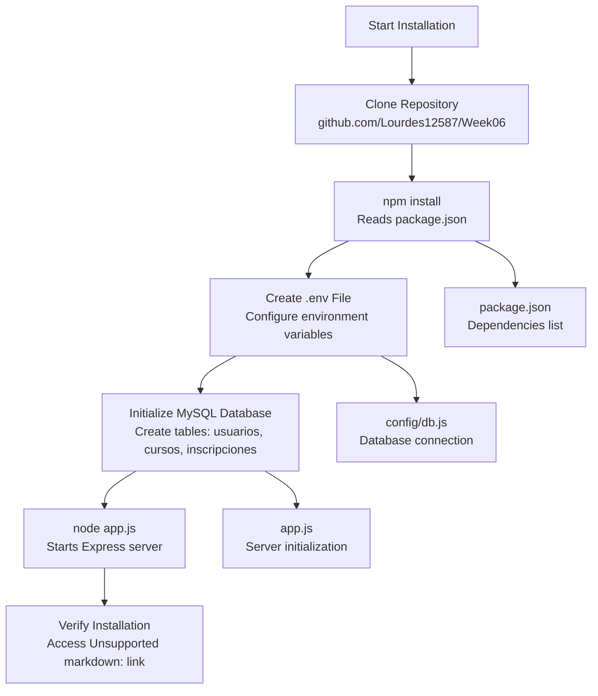
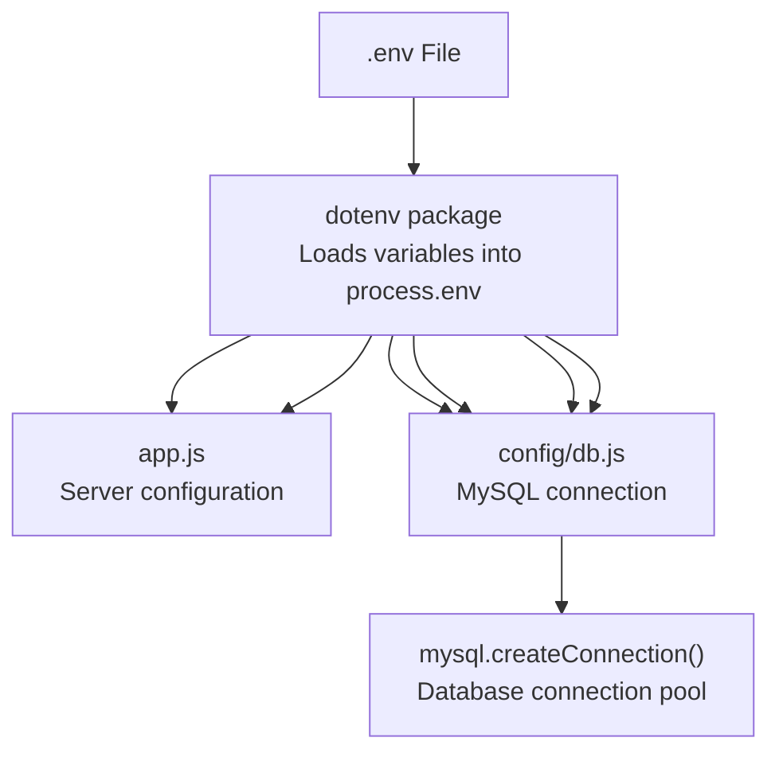
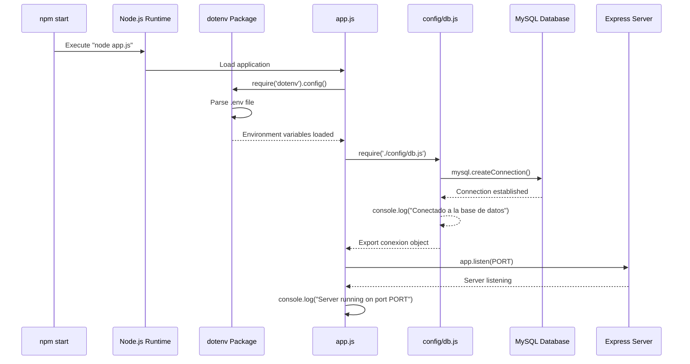
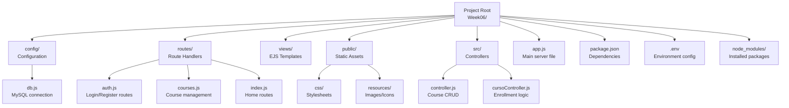

# Getting Started

> **Relevant source files**
> * [.gitignore](https://github.com/Lourdes12587/Week06/blob/ce0c3bcd/.gitignore)
> * [config/db.js](https://github.com/Lourdes12587/Week06/blob/ce0c3bcd/config/db.js)
> * [package-lock.json](https://github.com/Lourdes12587/Week06/blob/ce0c3bcd/package-lock.json)
> * [package.json](https://github.com/Lourdes12587/Week06/blob/ce0c3bcd/package.json)

This page provides step-by-step instructions for setting up the course management system on your local development environment. It covers installing dependencies, configuring environment variables, initializing the MySQL database, and starting the application server. For information about the system's architecture and features, see [Overview](/Lourdes12587/Week06/1-overview). For details about the authentication system, see [Authentication & Authorization](/Lourdes12587/Week06/4-authentication-and-authorization).

---

## Prerequisites

Before beginning the setup process, ensure your system has the following installed:

| Requirement | Minimum Version | Purpose |
| --- | --- | --- |
| Node.js | 18.0.0 | Runtime environment for executing the application |
| npm | 6.0.0 | Package manager for installing dependencies |
| MySQL | 5.7+ | Relational database management system |
| Git | Any recent version | Version control for cloning the repository |

---

## Installation Process

The following diagram illustrates the complete installation workflow, from cloning the repository to starting the server:



**Sources:** [package.json L1-L27](https://github.com/Lourdes12587/Week06/blob/ce0c3bcd/package.json#L1-L27)

 [config/db.js L1-L20](https://github.com/Lourdes12587/Week06/blob/ce0c3bcd/config/db.js#L1-L20)

---

## Step 1: Clone the Repository

Clone the project repository to your local machine:

```

```

---

## Step 2: Install Dependencies

Install all required npm packages by running:

```

```

This command reads [package.json L1-L27](https://github.com/Lourdes12587/Week06/blob/ce0c3bcd/package.json#L1-L27)

 and installs the following dependencies:

| Package | Version | Purpose |
| --- | --- | --- |
| `express` | 5.1.0 | Web application framework |
| `ejs` | 3.1.10 | Template engine for rendering views |
| `mysql2` | 3.14.3 | MySQL database driver |
| `bcryptjs` | 3.0.2 | Password hashing and verification |
| `jsonwebtoken` | 9.0.2 | JWT token generation and validation |
| `express-session` | 1.18.2 | Session middleware |
| `express-validator` | 7.2.1 | Input validation and sanitization |
| `dotenv` | 17.2.1 | Environment variable management |
| `cookie-parser` | 1.4.7 | Cookie parsing middleware |
| `socket.io` | 4.8.1 | WebSocket communication library |

The installation process creates a `node_modules` directory containing all dependencies. This directory is excluded from version control via [.gitignore L1-L2](https://github.com/Lourdes12587/Week06/blob/ce0c3bcd/.gitignore#L1-L2)

**Sources:** [package.json L13-L25](https://github.com/Lourdes12587/Week06/blob/ce0c3bcd/package.json#L13-L25)

 [package-lock.json L1-L1497](https://github.com/Lourdes12587/Week06/blob/ce0c3bcd/package-lock.json#L1-L1497)

 [.gitignore L1-L2](https://github.com/Lourdes12587/Week06/blob/ce0c3bcd/.gitignore#L1-L2)

---

## Step 3: Environment Configuration

Create a `.env` file in the project root directory to configure environment-specific settings. This file is excluded from version control per [.gitignore L1-L2](https://github.com/Lourdes12587/Week06/blob/ce0c3bcd/.gitignore#L1-L2)

 to protect sensitive information.

### Required Environment Variables

The following diagram shows how environment variables flow through the application:



**Sources:** [config/db.js L3-L9](https://github.com/Lourdes12587/Week06/blob/ce0c3bcd/config/db.js#L3-L9)

### .env File Template

Create a `.env` file with the following structure:

```

```

### Configuration Details

| Variable | Description | Example Value |
| --- | --- | --- |
| `PORT` | TCP port for Express server | `3000` |
| `SESSION_SECRET` | Secret key for session encryption | Generate a random string |
| `DB_HOST` | MySQL server hostname | `localhost` or `127.0.0.1` |
| `DB_USER` | MySQL username with database access | `root` |
| `DB_PASS` | MySQL user password | Your database password |
| `DB_NAME` | Name of the MySQL database | `curso_db` |

**Important:** The `SESSION_SECRET` should be a long, random string for production environments. Never commit the `.env` file to version control.

**Sources:** [config/db.js L3-L9](https://github.com/Lourdes12587/Week06/blob/ce0c3bcd/config/db.js#L3-L9)

 [.gitignore L2](https://github.com/Lourdes12587/Week06/blob/ce0c3bcd/.gitignore#L2-L2)

---

## Step 4: Database Initialization

### Create MySQL Database

Connect to your MySQL server and execute the following SQL commands to create the database and tables:

```

```

### Database Schema Relationships

```css
#mermaid-aify78p32qb{font-family:ui-sans-serif,-apple-system,system-ui,Segoe UI,Helvetica;font-size:16px;fill:#333;}@keyframes edge-animation-frame{from{stroke-dashoffset:0;}}@keyframes dash{to{stroke-dashoffset:0;}}#mermaid-aify78p32qb .edge-animation-slow{stroke-dasharray:9,5!important;stroke-dashoffset:900;animation:dash 50s linear infinite;stroke-linecap:round;}#mermaid-aify78p32qb .edge-animation-fast{stroke-dasharray:9,5!important;stroke-dashoffset:900;animation:dash 20s linear infinite;stroke-linecap:round;}#mermaid-aify78p32qb .error-icon{fill:#dddddd;}#mermaid-aify78p32qb .error-text{fill:#222222;stroke:#222222;}#mermaid-aify78p32qb .edge-thickness-normal{stroke-width:1px;}#mermaid-aify78p32qb .edge-thickness-thick{stroke-width:3.5px;}#mermaid-aify78p32qb .edge-pattern-solid{stroke-dasharray:0;}#mermaid-aify78p32qb .edge-thickness-invisible{stroke-width:0;fill:none;}#mermaid-aify78p32qb .edge-pattern-dashed{stroke-dasharray:3;}#mermaid-aify78p32qb .edge-pattern-dotted{stroke-dasharray:2;}#mermaid-aify78p32qb .marker{fill:#999;stroke:#999;}#mermaid-aify78p32qb .marker.cross{stroke:#999;}#mermaid-aify78p32qb svg{font-family:ui-sans-serif,-apple-system,system-ui,Segoe UI,Helvetica;font-size:16px;}#mermaid-aify78p32qb p{margin:0;}#mermaid-aify78p32qb .entityBox{fill:#ffffff;stroke:#dddddd;}#mermaid-aify78p32qb .relationshipLabelBox{fill:#dddddd;opacity:0.7;background-color:#dddddd;}#mermaid-aify78p32qb .relationshipLabelBox rect{opacity:0.5;}#mermaid-aify78p32qb .labelBkg{background-color:rgba(221, 221, 221, 0.5);}#mermaid-aify78p32qb .edgeLabel .label{fill:#dddddd;font-size:14px;}#mermaid-aify78p32qb .label{font-family:ui-sans-serif,-apple-system,system-ui,Segoe UI,Helvetica;color:#333;}#mermaid-aify78p32qb .edge-pattern-dashed{stroke-dasharray:8,8;}#mermaid-aify78p32qb .node rect,#mermaid-aify78p32qb .node circle,#mermaid-aify78p32qb .node ellipse,#mermaid-aify78p32qb .node polygon{fill:#ffffff;stroke:#dddddd;stroke-width:1px;}#mermaid-aify78p32qb .relationshipLine{stroke:#999;stroke-width:1;fill:none;}#mermaid-aify78p32qb .marker{fill:none!important;stroke:#999!important;stroke-width:1;}#mermaid-aify78p32qb :root{--mermaid-font-family:"trebuchet ms",verdana,arial,sans-serif;}enrolls inhas enrollmentsusuariosINTidPKVARCHARnombreVARCHARemailUKVARCHARpasswordENUMrolTIMESTAMPcreated_atinscripcionesINTid_usuarioFKINTid_cursoFKTIMESTAMPfecha_inscripcioncursosINTidPKVARCHARtituloTEXTdescripcionVARCHARcategoriaENUMvisibilidadTIMESTAMPcreated_at
```

### Database Connection Verification

The [config/db.js L1-L20](https://github.com/Lourdes12587/Week06/blob/ce0c3bcd/config/db.js#L1-L20)

 module establishes the MySQL connection. It performs the following operations:

1. **Line 3-9:** Creates a connection using `mysql.createConnection()` with environment variables
2. **Line 11-17:** Attempts to connect and logs success or error
3. **Line 19:** Exports the connection object for use throughout the application

The connection module uses these environment variables from `process.env`:

* `DB_HOST` - [config/db.js L4](https://github.com/Lourdes12587/Week06/blob/ce0c3bcd/config/db.js#L4-L4)
* `DB_USER` - [config/db.js L5](https://github.com/Lourdes12587/Week06/blob/ce0c3bcd/config/db.js#L5-L5)
* `DB_PASS` - [config/db.js L6](https://github.com/Lourdes12587/Week06/blob/ce0c3bcd/config/db.js#L6-L6)
* `DB_NAME` - [config/db.js L7](https://github.com/Lourdes12587/Week06/blob/ce0c3bcd/config/db.js#L7-L7)

**Sources:** [config/db.js L1-L20](https://github.com/Lourdes12587/Week06/blob/ce0c3bcd/config/db.js#L1-L20)

---

## Step 5: Start the Application

### Running the Server

Start the Express server using the npm start script defined in [package.json L8](https://github.com/Lourdes12587/Week06/blob/ce0c3bcd/package.json#L8-L8)

:

```

```

Alternatively, run directly with Node.js:

```

```

### Application Startup Sequence



### Expected Console Output

When the application starts successfully, you should see the following messages:

```
Conectado a la base de datos
Server running on port 3000
```

The first message confirms the database connection from [config/db.js L15](https://github.com/Lourdes12587/Week06/blob/ce0c3bcd/config/db.js#L15-L15)

 The second message indicates the Express server is listening on the configured port.

**Sources:** [package.json L6-L8](https://github.com/Lourdes12587/Week06/blob/ce0c3bcd/package.json#L6-L8)

 [config/db.js L11-L17](https://github.com/Lourdes12587/Week06/blob/ce0c3bcd/config/db.js#L11-L17)

---

## Step 6: Verify Installation

### Access the Application

Open your web browser and navigate to:

```yaml
http://localhost:3000
```

Replace `3000` with your configured `PORT` if different.

### Expected Landing Page

You should see the application's landing page with the following elements:

* Navigation header with application branding
* Login and registration links (if not authenticated)
* Public course listings

### Verification Checklist

| Component | Verification Method | Expected Result |
| --- | --- | --- |
| Server Running | Browser access to `http://localhost:PORT` | Landing page loads successfully |
| Database Connection | Check console output | "Conectado a la base de datos" message |
| Static Assets | Check browser network tab | CSS and images load from `/public` |
| Session Middleware | Login attempt | Session cookie created |
| Template Engine | View page source | Rendered HTML (not EJS syntax) |

### Troubleshooting Connection Issues

If you see "Cannot connect to database" in the console:

1. Verify MySQL server is running: `mysql -u root -p`
2. Confirm database exists: `SHOW DATABASES LIKE 'curso_db';`
3. Check `.env` file credentials match MySQL user
4. Ensure `DB_HOST` is correct (`localhost` or `127.0.0.1`)
5. Verify the user has privileges: `SHOW GRANTS FOR 'your_user'@'localhost';`

**Sources:** [config/db.js L11-L17](https://github.com/Lourdes12587/Week06/blob/ce0c3bcd/config/db.js#L11-L17)

---

## Directory Structure Overview

After successful installation, your project structure should look like this:



**Sources:** [package.json L1-L27](https://github.com/Lourdes12587/Week06/blob/ce0c3bcd/package.json#L1-L27)

 [config/db.js L1-L20](https://github.com/Lourdes12587/Week06/blob/ce0c3bcd/config/db.js#L1-L20)

 [.gitignore L1-L2](https://github.com/Lourdes12587/Week06/blob/ce0c3bcd/.gitignore#L1-L2)

---

## Next Steps

After completing the installation and verification:

1. **Create an Admin Account:** Use the default admin credentials or create a new admin user via SQL
2. **Explore the Architecture:** Review [Architecture Overview](/Lourdes12587/Week06/3-architecture-overview) to understand the system design
3. **Configure Authentication:** See [Authentication & Authorization](/Lourdes12587/Week06/4-authentication-and-authorization) for security details
4. **Add Courses:** Learn about course management in [Course Management System](/Lourdes12587/Week06/5-course-management-system)
5. **Customize Views:** Explore the template system in [Frontend Architecture](/Lourdes12587/Week06/7-frontend-architecture)

For development workflow and extending the system, see [Development Guide](/Lourdes12587/Week06/9-development-guide).

---

## Common Installation Issues

### npm install Fails

**Symptom:** Error messages during `npm install`

**Solutions:**

* Clear npm cache: `npm cache clean --force`
* Delete `node_modules` and `package-lock.json`, then reinstall
* Update npm: `npm install -g npm@latest`
* Check Node.js version meets requirement (≥18.0.0)

### Database Connection Errors

**Symptom:** "Cannot connect to database" or connection timeout

**Solutions:**

* Verify MySQL service is running
* Check firewall allows connections on MySQL port (default 3306)
* Confirm credentials in `.env` match MySQL user
* Test connection manually: `mysql -h localhost -u root -p`

### Port Already in Use

**Symptom:** "EADDRINUSE" error when starting server

**Solutions:**

* Change `PORT` in `.env` to an available port
* Identify process using port: `lsof -i :3000` (macOS/Linux) or `netstat -ano | findstr :3000` (Windows)
* Kill conflicting process or use different port

### Missing .env File

**Symptom:** Database connection fails with undefined variables

**Solutions:**

* Ensure `.env` file exists in project root
* Verify file is named exactly `.env` (not `.env.txt`)
* Check all required variables are defined
* Restart server after creating/modifying `.env`

**Sources:** [config/db.js L3-L9](https://github.com/Lourdes12587/Week06/blob/ce0c3bcd/config/db.js#L3-L9)

 [package.json L13-L25](https://github.com/Lourdes12587/Week06/blob/ce0c3bcd/package.json#L13-L25)