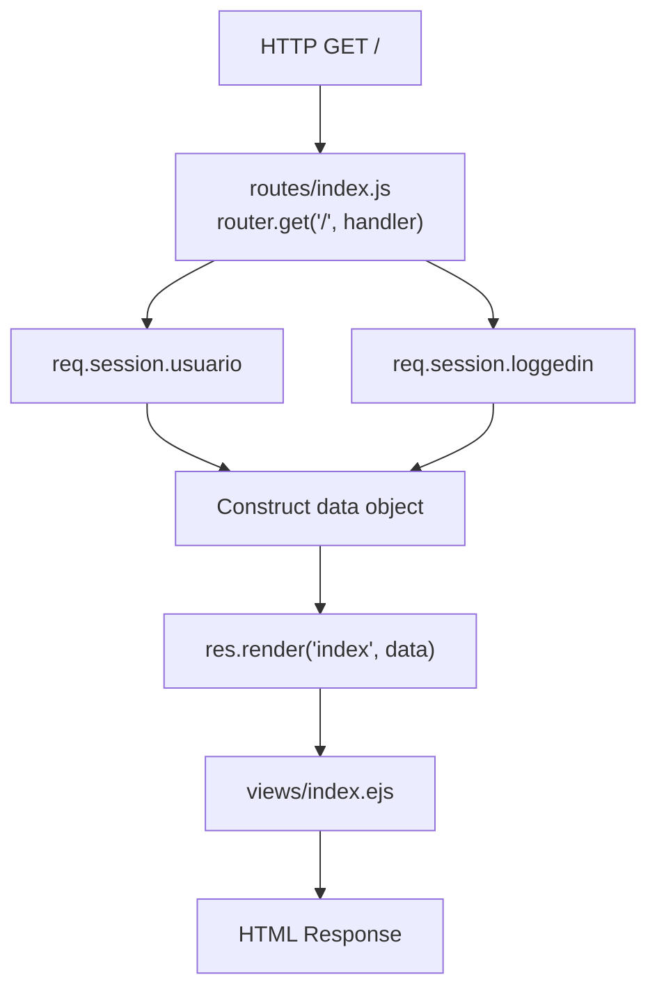
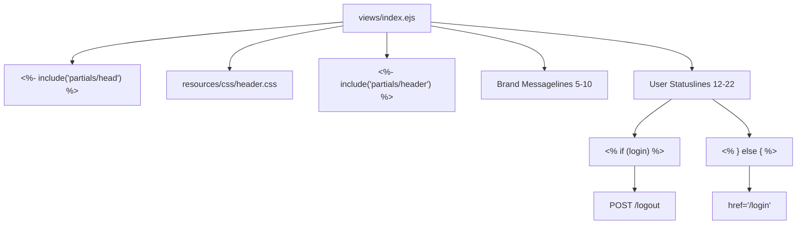
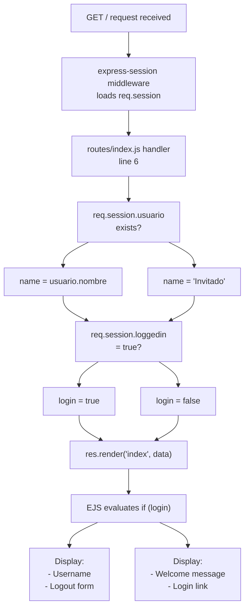
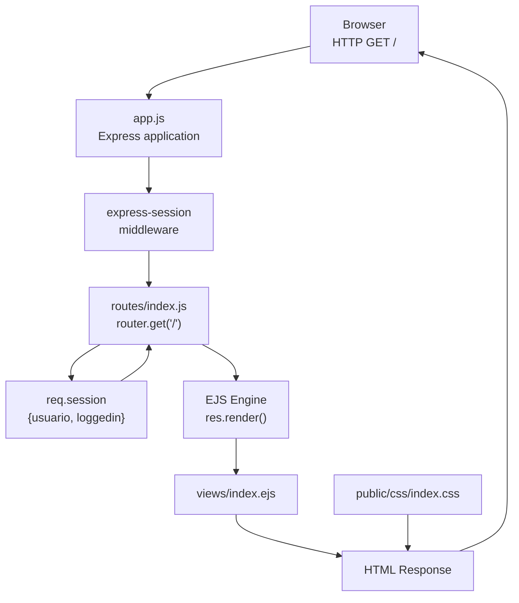

# Landing Page

> **Relevant source files**
> * [public/css/index.css](https://github.com/Lourdes12587/Week06/blob/ce0c3bcd/public/css/index.css)
> * [routes/index.js](https://github.com/Lourdes12587/Week06/blob/ce0c3bcd/routes/index.js)
> * [views/index.ejs](https://github.com/Lourdes12587/Week06/blob/ce0c3bcd/views/index.ejs)

## Purpose and Scope

This document covers the landing page implementation, which serves as the application's home route (`GET /`). The landing page adapts its display based on user authentication status, showing login prompts for unauthenticated visitors and personalized greetings with logout options for authenticated users.

For information about other frontend components, see:

* Login and registration forms: [Authentication Views](/Lourdes12587/Week06/7.3-authentication-views)
* Course listing and forms: [Course Views](/Lourdes12587/Week06/7.4-course-views)
* Template partials and EJS system: [Template System & Partials](/Lourdes12587/Week06/7.1-template-system-and-partials)

## Route Handler

The landing page is served by the root route handler located at [routes/index.js L6-L15](https://github.com/Lourdes12587/Week06/blob/ce0c3bcd/routes/index.js#L6-L15)

 The handler extracts session data and passes contextual information to the EJS template renderer.

### Request Processing Flow



**Sources:** [routes/index.js L6-L15](https://github.com/Lourdes12587/Week06/blob/ce0c3bcd/routes/index.js#L6-L15)

### Session Data Extraction

The route handler accesses the session object to determine authentication state:

| Session Property | Purpose | Default Value |
| --- | --- | --- |
| `req.session.usuario` | User object from database after login | `undefined` |
| `req.session.usuario.nombre` | User's display name | N/A |
| `req.session.loggedin` | Boolean authentication flag | `undefined` |

At [routes/index.js L7](https://github.com/Lourdes12587/Week06/blob/ce0c3bcd/routes/index.js#L7-L7)

 the handler extracts the user object:

```javascript
const usuario = req.session.usuario;
```

At [routes/index.js L9-L14](https://github.com/Lourdes12587/Week06/blob/ce0c3bcd/routes/index.js#L9-L14)

 the handler constructs the template data object:

```yaml
res.render("index", {
    nombre: "THOT",
    experiencia: "Los milagros llegan a tu lado cuando empieces a aprender",
    login: req.session.loggedin || false,
    name: usuario ? usuario.nombre : "Invitado"
});
```

The `name` property uses a ternary operator to provide a fallback value of `"Invitado"` when no user is logged in.

**Sources:** [routes/index.js L6-L15](https://github.com/Lourdes12587/Week06/blob/ce0c3bcd/routes/index.js#L6-L15)

## Template Structure

The landing page template at [views/index.ejs L1-L22](https://github.com/Lourdes12587/Week06/blob/ce0c3bcd/views/index.ejs#L1-L22)

 implements a two-section layout with conditional rendering based on authentication status.

### Template Component Architecture



**Sources:** [views/index.ejs L1-L22](https://github.com/Lourdes12587/Week06/blob/ce0c3bcd/views/index.ejs#L1-L22)

### Partial Includes

The template begins with two partial includes at [views/index.ejs L1-L3](https://github.com/Lourdes12587/Week06/blob/ce0c3bcd/views/index.ejs#L1-L3)

:

1. **Head partial**: `<%- include('partials/head') %>` - Contains HTML metadata, viewport settings, and Bootstrap CDN links
2. **Header CSS**: Custom stylesheet loaded at line 2
3. **Header partial**: `<%- include('partials/header') %>` - Provides navigation bar consistent across all pages

**Sources:** [views/index.ejs L1-L3](https://github.com/Lourdes12587/Week06/blob/ce0c3bcd/views/index.ejs#L1-L3)

### Section 1: Brand Display

The first section at [views/index.ejs L5-L10](https://github.com/Lourdes12587/Week06/blob/ce0c3bcd/views/index.ejs#L5-L10)

 displays static branding content:

```html
<% if (nombre) { %>
  <h1>SOMOS <%= nombre %></h1>
  <p>Es más que una experiencia, <%= experiencia %></p>
<% } %>
```

This section renders:

* Application name "THOT" in an `<h1>` heading
* Tagline from the `experiencia` variable in a `<p>` element
* Conditional wrapper ensures content only displays when data exists

**Sources:** [views/index.ejs L5-L10](https://github.com/Lourdes12587/Week06/blob/ce0c3bcd/views/index.ejs#L5-L10)

### Section 2: Authentication-Dependent Display

The second section at [views/index.ejs L12-L22](https://github.com/Lourdes12587/Week06/blob/ce0c3bcd/views/index.ejs#L12-L22)

 implements branching logic based on the `login` boolean flag.

#### Authenticated User View

When `login` is `true`, the template renders at [views/index.ejs L13-L17](https://github.com/Lourdes12587/Week06/blob/ce0c3bcd/views/index.ejs#L13-L17)

:

```xml
<h3>Usuario Conectado: <strong><%= name %></strong></h3>
<form action="/logout" method="POST">
  <button type="submit" class="btn btn-primary mt-3">Cerrar sesión</button>
</form>
```

Components:

* User's name displayed in `<strong>` tags
* POST form targeting `/logout` endpoint (handled by [routes/auth.js](https://github.com/Lourdes12587/Week06/blob/ce0c3bcd/routes/auth.js) )
* Bootstrap-styled button with `btn btn-primary mt-3` classes

#### Guest User View

When `login` is `false`, the template renders at [views/index.ejs L18-L21](https://github.com/Lourdes12587/Week06/blob/ce0c3bcd/views/index.ejs#L18-L21)

:

```xml
<h3>Bienvenido, <strong><%= name || 'Invitado' %></strong></h3>
<a href="/login" class="btn btn-primary mt-3">Iniciar Sesion</a>
```

Components:

* Welcome message with double fallback: `name || 'Invitado'`
* Hyperlink to `/login` route styled as Bootstrap button
* Same visual styling as authenticated view for consistency

**Sources:** [views/index.ejs L12-L22](https://github.com/Lourdes12587/Week06/blob/ce0c3bcd/views/index.ejs#L12-L22)

## Conditional Rendering Logic

The landing page implements state-dependent rendering:



**Sources:** [routes/index.js L6-L15](https://github.com/Lourdes12587/Week06/blob/ce0c3bcd/routes/index.js#L6-L15)

 [views/index.ejs L12-L22](https://github.com/Lourdes12587/Week06/blob/ce0c3bcd/views/index.ejs#L12-L22)

## Styling Architecture

The landing page CSS at [public/css/index.css L1-L129](https://github.com/Lourdes12587/Week06/blob/ce0c3bcd/public/css/index.css#L1-L129)

 implements a gradient-based design with interactive hover effects.

### Core Layout Styles

The body element at [public/css/index.css L9-L20](https://github.com/Lourdes12587/Week06/blob/ce0c3bcd/public/css/index.css#L9-L20)

 establishes the page foundation:

| Property | Value | Purpose |
| --- | --- | --- |
| `font-family` | 'Segoe UI', Tahoma, Geneva, Verdana, sans-serif | Cross-platform typography |
| `background` | linear-gradient(135deg, #1e3c72, #2a5298) | Blue gradient backdrop |
| `display` | flex | Flexbox layout |
| `flex-direction` | column | Vertical stacking |
| `align-items` | center | Horizontal centering |
| `justify-content` | center | Vertical centering |
| `min-height` | 100vh | Full viewport height |
| `animation` | fadeIn 1s ease-out | Entrance animation |

**Sources:** [public/css/index.css L9-L20](https://github.com/Lourdes12587/Week06/blob/ce0c3bcd/public/css/index.css#L9-L20)

### Heading Styles

The `<h2>` styling at [public/css/index.css L23-L33](https://github.com/Lourdes12587/Week06/blob/ce0c3bcd/public/css/index.css#L23-L33)

 includes:

```css
h2 {
  font-size: 3rem;
  margin-bottom: 10px;
  text-shadow: 2px 2px 5px rgba(0,0,0,0.3);
  transition: transform 0.3s;
}

h2:hover {
  transform: scale(1.1);
  color: #ffd700;
}
```

Interactive features:

* Scale transformation on hover (110% size)
* Color change to gold (#ffd700)
* Text shadow for depth perception

**Sources:** [public/css/index.css L23-L33](https://github.com/Lourdes12587/Week06/blob/ce0c3bcd/public/css/index.css#L23-L33)

### Paragraph Interactive Effects

Paragraph elements at [public/css/index.css L36-L50](https://github.com/Lourdes12587/Week06/blob/ce0c3bcd/public/css/index.css#L36-L50)

 implement hover overlays:

```css
p:hover {
  opacity: 1;
  background-color: rgba(255, 255, 255, 0.1);
  border-radius: 10px;
  padding: 10px;
}
```

This creates a semi-transparent white background when users hover over text content.

**Sources:** [public/css/index.css L36-L50](https://github.com/Lourdes12587/Week06/blob/ce0c3bcd/public/css/index.css#L36-L50)

### Navigation Bar

The fixed navbar at [public/css/index.css L53-L64](https://github.com/Lourdes12587/Week06/blob/ce0c3bcd/public/css/index.css#L53-L64)

 uses:

* `position: fixed` with `top: 0` for persistent visibility
* `z-index: 1000` to overlay page content
* Gradient background from #4f46e5 to #3b82f6
* Flexbox with `space-between` for logo and links separation

Navigation links at [public/css/index.css L77-L98](https://github.com/Lourdes12587/Week06/blob/ce0c3bcd/public/css/index.css#L77-L98)

 feature animated underlines using `::after` pseudo-elements:

```
.nav-links a::after {
  content: '';
  position: absolute;
  width: 0%;
  height: 2px;
  background: white;
  bottom: -4px;
  left: 0;
  transition: width 0.3s;
}

.nav-links a:hover::after {
  width: 100%;
}
```

**Sources:** [public/css/index.css L53-L99](https://github.com/Lourdes12587/Week06/blob/ce0c3bcd/public/css/index.css#L53-L99)

## Data Flow Mapping

The complete request-response cycle maps to specific code entities:



**Sources:** [routes/index.js L6-L15](https://github.com/Lourdes12587/Week06/blob/ce0c3bcd/routes/index.js#L6-L15)

 [views/index.ejs L1-L22](https://github.com/Lourdes12587/Week06/blob/ce0c3bcd/views/index.ejs#L1-L22)

 [public/css/index.css L1-L129](https://github.com/Lourdes12587/Week06/blob/ce0c3bcd/public/css/index.css#L1-L129)

## Template Variables Reference

All variables passed from [routes/index.js L9-L14](https://github.com/Lourdes12587/Week06/blob/ce0c3bcd/routes/index.js#L9-L14)

 to the EJS renderer:

| Variable Name | Data Type | Source Code | Default/Fallback | Usage in Template |
| --- | --- | --- | --- | --- |
| `nombre` | String | Hardcoded "THOT" | N/A | [views/index.ejs L7](https://github.com/Lourdes12587/Week06/blob/ce0c3bcd/views/index.ejs#L7-L7) <br>  in `<h1>` |
| `experiencia` | String | Hardcoded tagline | N/A | [views/index.ejs L8](https://github.com/Lourdes12587/Week06/blob/ce0c3bcd/views/index.ejs#L8-L8) <br>  in `<p>` |
| `login` | Boolean | `req.session.loggedin \|\| false` | `false` | [views/index.ejs L13](https://github.com/Lourdes12587/Week06/blob/ce0c3bcd/views/index.ejs#L13-L13) <br>  conditional |
| `name` | String | `usuario ? usuario.nombre : "Invitado"` | `"Invitado"` | [views/index.ejs L14-L19](https://github.com/Lourdes12587/Week06/blob/ce0c3bcd/views/index.ejs#L14-L19) <br>  display |

**Sources:** [routes/index.js L9-L14](https://github.com/Lourdes12587/Week06/blob/ce0c3bcd/routes/index.js#L9-L14)

 [views/index.ejs L6-L22](https://github.com/Lourdes12587/Week06/blob/ce0c3bcd/views/index.ejs#L6-L22)

## Integration Points

### Session System Dependency

The landing page requires `express-session` middleware configured in the main application. Session data must be populated by:

* [routes/auth.js](https://github.com/Lourdes12587/Week06/blob/ce0c3bcd/routes/auth.js)  during login (see [User Login](/Lourdes12587/Week06/4.2-user-login))
* Session middleware restoring cookies on subsequent requests (see [Session Management](/Lourdes12587/Week06/4.4-session-management))

### Authentication Endpoints

The template links to authentication routes:

| Element | Action | Target Route | HTTP Method | Handler Location |
| --- | --- | --- | --- | --- |
| Login link | Navigate | `/login` | GET | [routes/auth.js](https://github.com/Lourdes12587/Week06/blob/ce0c3bcd/routes/auth.js) |
| Logout form | Submit | `/logout` | POST | [routes/auth.js](https://github.com/Lourdes12587/Week06/blob/ce0c3bcd/routes/auth.js) |

**Sources:** [views/index.ejs L16-L20](https://github.com/Lourdes12587/Week06/blob/ce0c3bcd/views/index.ejs#L16-L20)

### Partial Templates

The landing page includes shared partials that provide consistent layout across the application:

1. `partials/head` - HTML metadata and Bootstrap CDN links
2. `partials/header` - Site-wide navigation bar

For complete documentation on the partial system, see [Template System & Partials](/Lourdes12587/Week06/7.1-template-system-and-partials).

**Sources:** [views/index.ejs L1-L3](https://github.com/Lourdes12587/Week06/blob/ce0c3bcd/views/index.ejs#L1-L3)

## Security Considerations

The landing page implements minimal security measures as it displays only non-sensitive public information:

1. **XSS Protection**: EJS `<%= %>` syntax auto-escapes HTML entities by default at [views/index.ejs L7-L19](https://github.com/Lourdes12587/Week06/blob/ce0c3bcd/views/index.ejs#L7-L19)
2. **No sensitive data exposure**: Only displays user's name, never passwords or email
3. **CSRF-safe**: Logout form at [views/index.ejs L15-L17](https://github.com/Lourdes12587/Week06/blob/ce0c3bcd/views/index.ejs#L15-L17)  should include CSRF token in production
4. **Session validation**: No database queries performed, only session data reading at [routes/index.js L7-L13](https://github.com/Lourdes12587/Week06/blob/ce0c3bcd/routes/index.js#L7-L13)

**Sources:** [routes/index.js L6-L15](https://github.com/Lourdes12587/Week06/blob/ce0c3bcd/routes/index.js#L6-L15)

 [views/index.ejs L1-L22](https://github.com/Lourdes12587/Week06/blob/ce0c3bcd/views/index.ejs#L1-L22)

## Usage Scenarios

### Scenario 1: First-Time Visitor

**Initial Request:**

```yaml
GET / HTTP/1.1
Host: localhost:3000
Cookie: (none)
```

**Session State:**

```yaml
req.session = {
  // Empty or new session
  loggedin: undefined,
  usuario: undefined
}
```

**Rendered Output:**

* Heading: "SOMOS THOT"
* Paragraph: "Es más que una experiencia, Los milagros llegan a tu lado cuando empieces a aprender"
* Status: "Bienvenido, **Invitado**"
* Action: Button styled link to `/login`

**Sources:** [routes/index.js L9-L14](https://github.com/Lourdes12587/Week06/blob/ce0c3bcd/routes/index.js#L9-L14)

 [views/index.ejs L18-L21](https://github.com/Lourdes12587/Week06/blob/ce0c3bcd/views/index.ejs#L18-L21)

### Scenario 2: Authenticated User

**Authenticated Request:**

```yaml
GET / HTTP/1.1
Host: localhost:3000
Cookie: connect.sid=s%3A...
```

**Session State:**

```yaml
req.session = {
  loggedin: true,
  usuario: {
    id: 5,
    nombre: "María García",
    email: "maria@example.com",
    rol: "registrado"
  }
}
```

**Rendered Output:**

* Heading: "SOMOS THOT"
* Paragraph: "Es más que una experiencia, Los milagros llegan a tu lado cuando empieces a aprender"
* Status: "Usuario Conectado: **María García**"
* Action: POST form with "Cerrar sesión" button

**Sources:** [routes/index.js L7-L14](https://github.com/Lourdes12587/Week06/blob/ce0c3bcd/routes/index.js#L7-L14)

 [views/index.ejs L13-L17](https://github.com/Lourdes12587/Week06/blob/ce0c3bcd/views/index.ejs#L13-L17)

## Extension Guidelines

To modify landing page behavior:

### Change Branding Content

Update static strings at [routes/index.js L10-L11](https://github.com/Lourdes12587/Week06/blob/ce0c3bcd/routes/index.js#L10-L11)

:

```yaml
nombre: "THOT",  // Change application name
experiencia: "Los milagros llegan a tu lado cuando empieces a aprender"  // Modify tagline
```

### Add Role-Specific Content

Extend conditional logic to differentiate admin vs registered users:

```javascript
// In routes/index.js
const usuario = req.session.usuario;
const isAdmin = usuario && usuario.rol === 'admin';

res.render("index", {
    // ... existing properties
    isAdmin: isAdmin
});
```

Then add conditional in [views/index.ejs](https://github.com/Lourdes12587/Week06/blob/ce0c3bcd/views/index.ejs)

:

```html
<% if (isAdmin) { %>
  <p>Admin features available</p>
<% } %>
```

### Modify Visual Design

Edit gradient colors at [public/css/index.css L11](https://github.com/Lourdes12587/Week06/blob/ce0c3bcd/public/css/index.css#L11-L11)

:

```
background: linear-gradient(135deg, #1e3c72, #2a5298);  // Modify color stops
```

**Sources:** [routes/index.js L6-L15](https://github.com/Lourdes12587/Week06/blob/ce0c3bcd/routes/index.js#L6-L15)

 [views/index.ejs L1-L22](https://github.com/Lourdes12587/Week06/blob/ce0c3bcd/views/index.ejs#L1-L22)

 [public/css/index.css L9-L20](https://github.com/Lourdes12587/Week06/blob/ce0c3bcd/public/css/index.css#L9-L20)