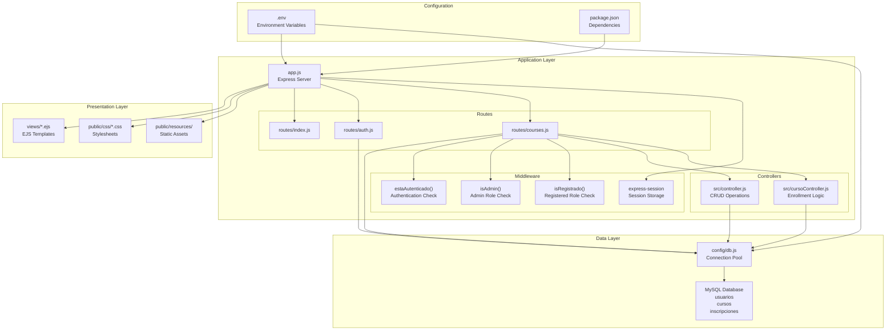

# Overview

> **Relevant source files**
> * [app.js](https://github.com/Lourdes12587/Week06/blob/ce0c3bcd/app.js)
> * [package.json](https://github.com/Lourdes12587/Week06/blob/ce0c3bcd/package.json)
> * [routes/courses.js](https://github.com/Lourdes12587/Week06/blob/ce0c3bcd/routes/courses.js)

## Purpose and Scope

This document provides a high-level introduction to the course management system located at [https://github.com/Lourdes12587/Week06](https://github.com/Lourdes12587/Week06). It explains the system's purpose, architecture, core features, and technology stack. For detailed setup instructions, see [Getting Started](/Lourdes12587/Week06/2-getting-started). For in-depth technical details about specific subsystems, refer to [Architecture Overview](/Lourdes12587/Week06/3-architecture-overview), [Authentication & Authorization](/Lourdes12587/Week06/4-authentication-and-authorization), [Course Management System](/Lourdes12587/Week06/5-course-management-system), and [Frontend Architecture](/Lourdes12587/Week06/7-frontend-architecture).

## System Purpose

The course management system is a **role-based web application** built with Node.js and Express that enables course creation, management, and enrollment. The system implements three distinct user roles with different capabilities:

| Role | Access Level | Key Capabilities |
| --- | --- | --- |
| `publico` | Guest | View public courses, register, login |
| `registrado` | Authenticated User | View all courses, enroll in courses, view personal profile |
| `admin` | Administrator | Full CRUD on courses, view statistics, manage visibility |

The application stores data in a **MySQL database** with three tables (`usuarios`, `cursos`, `inscripciones`) and implements comprehensive security through password hashing, session management, and role-based access control middleware.

**Sources:** [app.js L1-L41](https://github.com/Lourdes12587/Week06/blob/ce0c3bcd/app.js#L1-L41)

 [routes/courses.js L8-L33](https://github.com/Lourdes12587/Week06/blob/ce0c3bcd/routes/courses.js#L8-L33)

 [package.json L1-L26](https://github.com/Lourdes12587/Week06/blob/ce0c3bcd/package.json#L1-L26)

## High-Level Architecture

The system follows a **three-tier architecture** with clear separation of concerns:



**Application Flow:**

1. **Entry Point:** [app.js L1-L41](https://github.com/Lourdes12587/Week06/blob/ce0c3bcd/app.js#L1-L41)  initializes the Express server, configures middleware, and mounts route handlers
2. **Route Handlers:** Modular routers in `routes/` directory handle HTTP requests and apply middleware chains
3. **Middleware:** Functions like `estaAutenticado`, `isAdmin`, and `isRegistrado` enforce authentication and authorization
4. **Controllers:** Business logic in `src/controller.js` and `src/cursoController.js` process requests and interact with database
5. **Database:** [config/db.js](https://github.com/Lourdes12587/Week06/blob/ce0c3bcd/config/db.js)  manages MySQL connection pool and query execution
6. **Views:** EJS templates render dynamic HTML responses

**Sources:** [app.js L1-L41](https://github.com/Lourdes12587/Week06/blob/ce0c3bcd/app.js#L1-L41)

 [routes/courses.js L1-L187](https://github.com/Lourdes12587/Week06/blob/ce0c3bcd/routes/courses.js#L1-L187)

 [package.json L13-L25](https://github.com/Lourdes12587/Week06/blob/ce0c3bcd/package.json#L13-L25)

## Core Features by User Role

### Public Users (rol: 'publico')

Public users can interact with the system without authentication:

* View landing page at `/`
* Browse courses with `visibilidad='publico'` at `GET /courses`
* Register new account at `GET/POST /register`
* Login at `GET/POST /login`

The course visibility filter is applied at [routes/courses.js L40-L42](https://github.com/Lourdes12587/Week06/blob/ce0c3bcd/routes/courses.js#L40-L42)

:

```
if (rol === 'publico') {
  sql += " WHERE visibilidad='publico'";
}
```

### Registered Users (rol: 'registrado')

Protected by `estaAutenticado` and `isRegistrado` middleware:

* View all courses (no visibility restrictions)
* Enroll in courses via `GET/POST /inscribir/:id` [routes/courses.js L106-L149](https://github.com/Lourdes12587/Week06/blob/ce0c3bcd/routes/courses.js#L106-L149)
* View personal profile with enrolled courses at `GET /perfil` [routes/courses.js L152-L169](https://github.com/Lourdes12587/Week06/blob/ce0c3bcd/routes/courses.js#L152-L169)
* Duplicate enrollment prevention [routes/courses.js L121-L133](https://github.com/Lourdes12587/Week06/blob/ce0c3bcd/routes/courses.js#L121-L133)

### Administrators (rol: 'admin')

Protected by `estaAutenticado` and `isAdmin` middleware:

* Create courses: `GET /create` [routes/courses.js L64-L67](https://github.com/Lourdes12587/Week06/blob/ce0c3bcd/routes/courses.js#L64-L67)  `POST /save` [routes/courses.js L70](https://github.com/Lourdes12587/Week06/blob/ce0c3bcd/routes/courses.js#L70-L70)
* Edit courses: `GET /edit/:id` [routes/courses.js L73-L84](https://github.com/Lourdes12587/Week06/blob/ce0c3bcd/routes/courses.js#L73-L84)  `POST /update` [routes/courses.js L103](https://github.com/Lourdes12587/Week06/blob/ce0c3bcd/routes/courses.js#L103-L103)
* Delete courses: `GET /delete/:id` [routes/courses.js L87-L98](https://github.com/Lourdes12587/Week06/blob/ce0c3bcd/routes/courses.js#L87-L98)
* View admin dashboard with statistics at `GET /admin/perfil` [routes/courses.js L172-L185](https://github.com/Lourdes12587/Week06/blob/ce0c3bcd/routes/courses.js#L172-L185)

**Sources:** [routes/courses.js L8-L33](https://github.com/Lourdes12587/Week06/blob/ce0c3bcd/routes/courses.js#L8-L33)

 [routes/courses.js L35-L62](https://github.com/Lourdes12587/Week06/blob/ce0c3bcd/routes/courses.js#L35-L62)

 [routes/courses.js L64-L185](https://github.com/Lourdes12587/Week06/blob/ce0c3bcd/routes/courses.js#L64-L185)

## Technology Stack

| Category | Technology | Version | Purpose |
| --- | --- | --- | --- |
| **Runtime** | Node.js | - | JavaScript runtime environment |
| **Framework** | Express | 5.1.0 | Web application framework |
| **Template Engine** | EJS | 3.1.10 | Server-side HTML rendering |
| **Database** | MySQL | - | Relational data storage |
| **Database Driver** | mysql2 | 3.14.3 | MySQL client with connection pooling |
| **Authentication** | bcryptjs | 3.0.2 | Password hashing |
| **Authentication** | jsonwebtoken | 9.0.2 | JWT token generation |
| **Session Management** | express-session | 1.18.2 | Server-side session storage |
| **Validation** | express-validator | 7.2.1 | Input validation and sanitization |
| **Real-time** | socket.io | 4.8.1 | WebSocket support (future use) |
| **Configuration** | dotenv | 17.2.1 | Environment variable management |
| **Frontend** | Bootstrap | 5.3.7 | CSS framework (CDN) |
| **Icons** | Boxicons | - | Icon library (CDN) |
| **Alerts** | SweetAlert2 | - | User notification modals (CDN) |

**Sources:** [package.json L13-L25](https://github.com/Lourdes12587/Week06/blob/ce0c3bcd/package.json#L13-L25)

## Request Flow and Middleware Pipeline

The following diagram illustrates how HTTP requests flow through the middleware pipeline and route handlers:

```mermaid
sequenceDiagram
  participant Client Browser
  participant app.js
  participant Express Server
  participant express-session
  participant Middleware
  participant routes/courses.js
  participant Router
  participant estaAutenticado()
  participant isAdmin() / isRegistrado()
  participant src/controller.js
  participant Business Logic
  participant config/db.js
  participant MySQL Pool
  participant views/*.ejs
  participant Templates

  Client Browser->>app.js: "GET/POST Request"
  app.js->>express-session: "Check/Initialize Session"
  express-session->>app.js: "req.session populated"
  loop [Redirect Response]
    app.js->>Client Browser: "Serve from /public"
    app.js->>routes/courses.js: "Route to handler"
    routes/courses.js->>estaAutenticado(): "estaAutenticado()"
    estaAutenticado()->>Client Browser: "redirect('/login')"
    estaAutenticado()->>isAdmin() / isRegistrado(): "Check role"
    isAdmin() / isRegistrado()->>Client Browser: "redirect('/login')"
    isAdmin() / isRegistrado()->>src/controller.js: "Execute business logic"
    src/controller.js->>config/db.js: "db.query()"
    config/db.js->>src/controller.js: "Return results"
    src/controller.js->>Client Browser: "res.redirect()"
    src/controller.js->>views/*.ejs: "res.render()"
    views/*.ejs->>Client Browser: "HTML Response"
  end
```

**Middleware Functions:**

1. **`estaAutenticado(req, res, next)`** [routes/courses.js L8-L14](https://github.com/Lourdes12587/Week06/blob/ce0c3bcd/routes/courses.js#L8-L14)  - Verifies `req.session.loggedin` is `true`
2. **`isAdmin(req, res, next)`** [routes/courses.js L16-L24](https://github.com/Lourdes12587/Week06/blob/ce0c3bcd/routes/courses.js#L16-L24)  - Checks `req.session.rol === 'admin'`
3. **`isRegistrado(req, res, next)`** [routes/courses.js L26-L33](https://github.com/Lourdes12587/Week06/blob/ce0c3bcd/routes/courses.js#L26-L33)  - Checks `req.session.rol === 'registrado'`

All middleware functions redirect to `/login` on authorization failure.

**Sources:** [app.js L4-L13](https://github.com/Lourdes12587/Week06/blob/ce0c3bcd/app.js#L4-L13)

 [app.js L24-L31](https://github.com/Lourdes12587/Week06/blob/ce0c3bcd/app.js#L24-L31)

 [routes/courses.js L8-L33](https://github.com/Lourdes12587/Week06/blob/ce0c3bcd/routes/courses.js#L8-L33)

## Database Schema

The MySQL database consists of three tables implementing a many-to-many relationship between users and courses:

```css
#mermaid-7uww5hhnlmq{font-family:ui-sans-serif,-apple-system,system-ui,Segoe UI,Helvetica;font-size:16px;fill:#333;}@keyframes edge-animation-frame{from{stroke-dashoffset:0;}}@keyframes dash{to{stroke-dashoffset:0;}}#mermaid-7uww5hhnlmq .edge-animation-slow{stroke-dasharray:9,5!important;stroke-dashoffset:900;animation:dash 50s linear infinite;stroke-linecap:round;}#mermaid-7uww5hhnlmq .edge-animation-fast{stroke-dasharray:9,5!important;stroke-dashoffset:900;animation:dash 20s linear infinite;stroke-linecap:round;}#mermaid-7uww5hhnlmq .error-icon{fill:#dddddd;}#mermaid-7uww5hhnlmq .error-text{fill:#222222;stroke:#222222;}#mermaid-7uww5hhnlmq .edge-thickness-normal{stroke-width:1px;}#mermaid-7uww5hhnlmq .edge-thickness-thick{stroke-width:3.5px;}#mermaid-7uww5hhnlmq .edge-pattern-solid{stroke-dasharray:0;}#mermaid-7uww5hhnlmq .edge-thickness-invisible{stroke-width:0;fill:none;}#mermaid-7uww5hhnlmq .edge-pattern-dashed{stroke-dasharray:3;}#mermaid-7uww5hhnlmq .edge-pattern-dotted{stroke-dasharray:2;}#mermaid-7uww5hhnlmq .marker{fill:#999;stroke:#999;}#mermaid-7uww5hhnlmq .marker.cross{stroke:#999;}#mermaid-7uww5hhnlmq svg{font-family:ui-sans-serif,-apple-system,system-ui,Segoe UI,Helvetica;font-size:16px;}#mermaid-7uww5hhnlmq p{margin:0;}#mermaid-7uww5hhnlmq .entityBox{fill:#ffffff;stroke:#dddddd;}#mermaid-7uww5hhnlmq .relationshipLabelBox{fill:#dddddd;opacity:0.7;background-color:#dddddd;}#mermaid-7uww5hhnlmq .relationshipLabelBox rect{opacity:0.5;}#mermaid-7uww5hhnlmq .labelBkg{background-color:rgba(221, 221, 221, 0.5);}#mermaid-7uww5hhnlmq .edgeLabel .label{fill:#dddddd;font-size:14px;}#mermaid-7uww5hhnlmq .label{font-family:ui-sans-serif,-apple-system,system-ui,Segoe UI,Helvetica;color:#333;}#mermaid-7uww5hhnlmq .edge-pattern-dashed{stroke-dasharray:8,8;}#mermaid-7uww5hhnlmq .node rect,#mermaid-7uww5hhnlmq .node circle,#mermaid-7uww5hhnlmq .node ellipse,#mermaid-7uww5hhnlmq .node polygon{fill:#ffffff;stroke:#dddddd;stroke-width:1px;}#mermaid-7uww5hhnlmq .relationshipLine{stroke:#999;stroke-width:1;fill:none;}#mermaid-7uww5hhnlmq .marker{fill:none!important;stroke:#999!important;stroke-width:1;}#mermaid-7uww5hhnlmq :root{--mermaid-font-family:"trebuchet ms",verdana,arial,sans-serif;}enrollscontainsusuariosintidPKvarcharnombrevarcharemailvarcharpasswordenumrolinscripcionesintid_usuarioFKintid_cursoFKcursosintidPKvarchartitulotextdescripcionvarcharcategoriaenumvisibilidad
```

**Table Descriptions:**

| Table | Purpose | Key Fields |
| --- | --- | --- |
| `usuarios` | Stores user accounts | `id`, `nombre`, `email`, `password` (hashed), `rol` ('publico', 'registrado', 'admin') |
| `cursos` | Stores course information | `id`, `titulo`, `descripcion`, `categoria`, `visibilidad` ('publico', 'registrado') |
| `inscripciones` | Junction table for enrollments | `id_usuario` (FK), `id_curso` (FK) |

**Database Operations:**

* All queries use parameterized statements for SQL injection prevention
* Connection pooling managed by [config/db.js](https://github.com/Lourdes12587/Week06/blob/ce0c3bcd/config/db.js)
* Example query: [routes/courses.js L77](https://github.com/Lourdes12587/Week06/blob/ce0c3bcd/routes/courses.js#L77-L77)  - `SELECT * FROM cursos WHERE id = ?`

**Sources:** [routes/courses.js L77](https://github.com/Lourdes12587/Week06/blob/ce0c3bcd/routes/courses.js#L77-L77)

 [routes/courses.js L91](https://github.com/Lourdes12587/Week06/blob/ce0c3bcd/routes/courses.js#L91-L91)

 [routes/courses.js L109](https://github.com/Lourdes12587/Week06/blob/ce0c3bcd/routes/courses.js#L109-L109)

 [routes/courses.js L121-L137](https://github.com/Lourdes12587/Week06/blob/ce0c3bcd/routes/courses.js#L121-L137)

 [routes/courses.js L155-L160](https://github.com/Lourdes12587/Week06/blob/ce0c3bcd/routes/courses.js#L155-L160)

 [routes/courses.js L176](https://github.com/Lourdes12587/Week06/blob/ce0c3bcd/routes/courses.js#L176-L176)

## Session and Authentication Model

The application maintains user state through server-side sessions configured in [app.js L6-L13](https://github.com/Lourdes12587/Week06/blob/ce0c3bcd/app.js#L6-L13)

:

**Session Configuration:**

```yaml
session({
    secret: "secret", 
    resave: false, 
    saveUninitialized: false
})
```

**Session Variables:**

* `req.session.loggedin` - Boolean indicating authentication status
* `req.session.usuario` - User object with `id`, `nombre`, `email`
* `req.session.rol` - String: `'publico'`, `'registrado'`, or `'admin'`

These session variables are used throughout the application:

* [routes/courses.js L9](https://github.com/Lourdes12587/Week06/blob/ce0c3bcd/routes/courses.js#L9-L9)  - Authentication check
* [routes/courses.js L17](https://github.com/Lourdes12587/Week06/blob/ce0c3bcd/routes/courses.js#L17-L17)  - Admin role check
* [routes/courses.js L27](https://github.com/Lourdes12587/Week06/blob/ce0c3bcd/routes/courses.js#L27-L27)  - Registered role check
* [routes/courses.js L36](https://github.com/Lourdes12587/Week06/blob/ce0c3bcd/routes/courses.js#L36-L36)  - Visibility filtering
* [routes/courses.js L119](https://github.com/Lourdes12587/Week06/blob/ce0c3bcd/routes/courses.js#L119-L119)  - User identification for enrollment

**Sources:** [app.js L4-L13](https://github.com/Lourdes12587/Week06/blob/ce0c3bcd/app.js#L4-L13)

 [routes/courses.js L8-L33](https://github.com/Lourdes12587/Week06/blob/ce0c3bcd/routes/courses.js#L8-L33)

 [routes/courses.js L36](https://github.com/Lourdes12587/Week06/blob/ce0c3bcd/routes/courses.js#L36-L36)

 [routes/courses.js L49-L51](https://github.com/Lourdes12587/Week06/blob/ce0c3bcd/routes/courses.js#L49-L51)

 [routes/courses.js L119](https://github.com/Lourdes12587/Week06/blob/ce0c3bcd/routes/courses.js#L119-L119)

## Application Entry Point

The [app.js L1-L41](https://github.com/Lourdes12587/Week06/blob/ce0c3bcd/app.js#L1-L41)

 file serves as the application entry point and performs the following initialization:

1. **Express Server Setup:** [app.js L1-L2](https://github.com/Lourdes12587/Week06/blob/ce0c3bcd/app.js#L1-L2)
2. **Environment Configuration:** [app.js L3](https://github.com/Lourdes12587/Week06/blob/ce0c3bcd/app.js#L3-L3)  - Loads `.env` file from `./env/.env`
3. **Session Middleware:** [app.js L4-L13](https://github.com/Lourdes12587/Week06/blob/ce0c3bcd/app.js#L4-L13)  - Configures express-session
4. **Static Assets:** [app.js L19](https://github.com/Lourdes12587/Week06/blob/ce0c3bcd/app.js#L19-L19)  - Serves files from `/public` at `/resources` path
5. **View Engine:** [app.js L21](https://github.com/Lourdes12587/Week06/blob/ce0c3bcd/app.js#L21-L21)  - Sets EJS as template engine
6. **Body Parsing:** [app.js L25-L26](https://github.com/Lourdes12587/Week06/blob/ce0c3bcd/app.js#L25-L26)  - URL-encoded and JSON body parsing
7. **Route Mounting:** [app.js L29-L31](https://github.com/Lourdes12587/Week06/blob/ce0c3bcd/app.js#L29-L31)  - Mounts three routers: * `routes/index.js` - Landing page * `routes/auth.js` - Authentication endpoints * `routes/courses.js` - Course management and enrollment

**Sources:** [app.js L1-L41](https://github.com/Lourdes12587/Week06/blob/ce0c3bcd/app.js#L1-L41)

## Key Routes and Endpoints

### Public Endpoints

* `GET /` - Landing page ([routes/index.js](https://github.com/Lourdes12587/Week06/blob/ce0c3bcd/routes/index.js) )
* `GET /login` - Login form ([routes/auth.js](https://github.com/Lourdes12587/Week06/blob/ce0c3bcd/routes/auth.js) )
* `GET /register` - Registration form ([routes/auth.js](https://github.com/Lourdes12587/Week06/blob/ce0c3bcd/routes/auth.js) )
* `POST /auth` - Process login ([routes/auth.js](https://github.com/Lourdes12587/Week06/blob/ce0c3bcd/routes/auth.js) )
* `POST /register` - Process registration ([routes/auth.js](https://github.com/Lourdes12587/Week06/blob/ce0c3bcd/routes/auth.js) )
* `GET /courses` - Course listing with visibility filtering [routes/courses.js L35-L62](https://github.com/Lourdes12587/Week06/blob/ce0c3bcd/routes/courses.js#L35-L62)

### Protected Endpoints (Registered Users)

* `GET /inscribir/:id` - Enrollment confirmation [routes/courses.js L106-L114](https://github.com/Lourdes12587/Week06/blob/ce0c3bcd/routes/courses.js#L106-L114)
* `POST /inscribir/:id` - Process enrollment [routes/courses.js L117-L149](https://github.com/Lourdes12587/Week06/blob/ce0c3bcd/routes/courses.js#L117-L149)
* `GET /perfil` - User profile with enrolled courses [routes/courses.js L152-L169](https://github.com/Lourdes12587/Week06/blob/ce0c3bcd/routes/courses.js#L152-L169)

### Protected Endpoints (Administrators)

* `GET /create` - Course creation form [routes/courses.js L64-L67](https://github.com/Lourdes12587/Week06/blob/ce0c3bcd/routes/courses.js#L64-L67)
* `POST /save` - Save new course [routes/courses.js L70](https://github.com/Lourdes12587/Week06/blob/ce0c3bcd/routes/courses.js#L70-L70)
* `GET /edit/:id` - Course edit form [routes/courses.js L73-L84](https://github.com/Lourdes12587/Week06/blob/ce0c3bcd/routes/courses.js#L73-L84)
* `POST /update` - Update existing course [routes/courses.js L103](https://github.com/Lourdes12587/Week06/blob/ce0c3bcd/routes/courses.js#L103-L103)
* `GET /delete/:id` - Delete course [routes/courses.js L87-L98](https://github.com/Lourdes12587/Week06/blob/ce0c3bcd/routes/courses.js#L87-L98)
* `GET /admin/perfil` - Admin dashboard [routes/courses.js L172-L185](https://github.com/Lourdes12587/Week06/blob/ce0c3bcd/routes/courses.js#L172-L185)

**Sources:** [routes/courses.js L35-L187](https://github.com/Lourdes12587/Week06/blob/ce0c3bcd/routes/courses.js#L35-L187)

## Navigation to Related Documentation

This overview provides a foundation for understanding the system. For detailed information on specific subsystems:

* **[Getting Started](/Lourdes12587/Week06/2-getting-started)** - Installation, dependencies, database setup, and running the application
* **[Architecture Overview](/Lourdes12587/Week06/3-architecture-overview)** - Deep dive into system architecture, technology stack, and design patterns
* **[Authentication & Authorization](/Lourdes12587/Week06/4-authentication-and-authorization)** - User registration, login flow, password hashing, and role-based access control
* **[Course Management System](/Lourdes12587/Week06/5-course-management-system)** - CRUD operations, visibility control, and enrollment logic
* **[Frontend Architecture](/Lourdes12587/Week06/7-frontend-architecture)** - EJS templates, partials, styling system, and user interface
* **[API Reference](/Lourdes12587/Week06/8-api-reference)** - Complete endpoint documentation with request/response specifications
* **[Development Guide](/Lourdes12587/Week06/9-development-guide)** - Project structure, adding features, and best practices

**Sources:** [app.js L1-L41](https://github.com/Lourdes12587/Week06/blob/ce0c3bcd/app.js#L1-L41)

 [routes/courses.js L1-L187](https://github.com/Lourdes12587/Week06/blob/ce0c3bcd/routes/courses.js#L1-L187)

 [package.json L1-L26](https://github.com/Lourdes12587/Week06/blob/ce0c3bcd/package.json#L1-L26)