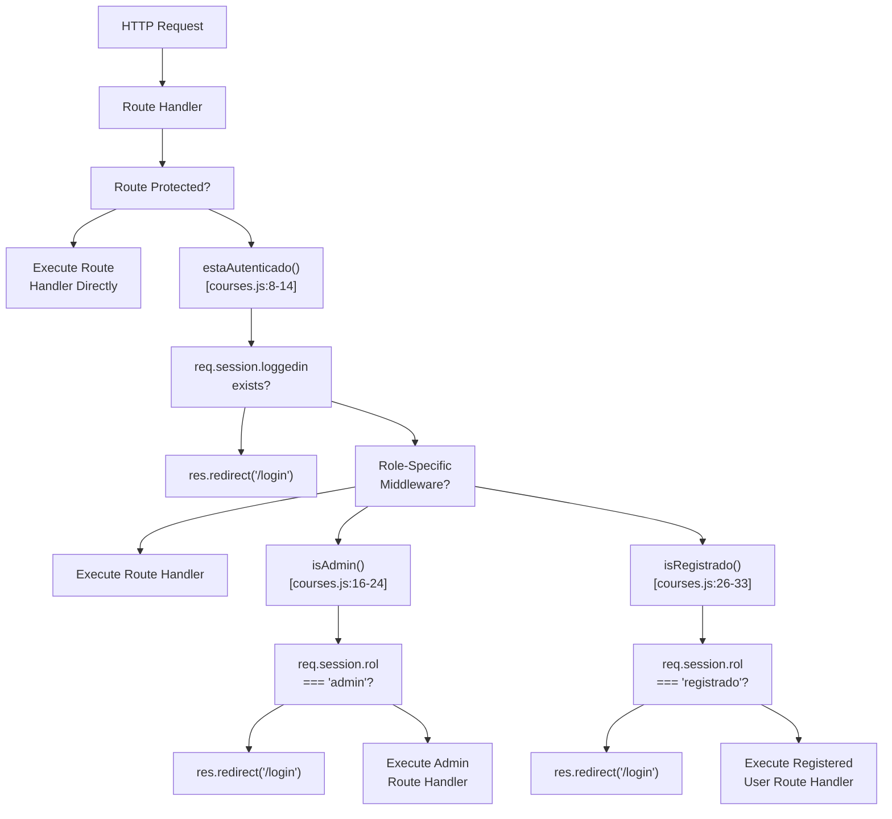
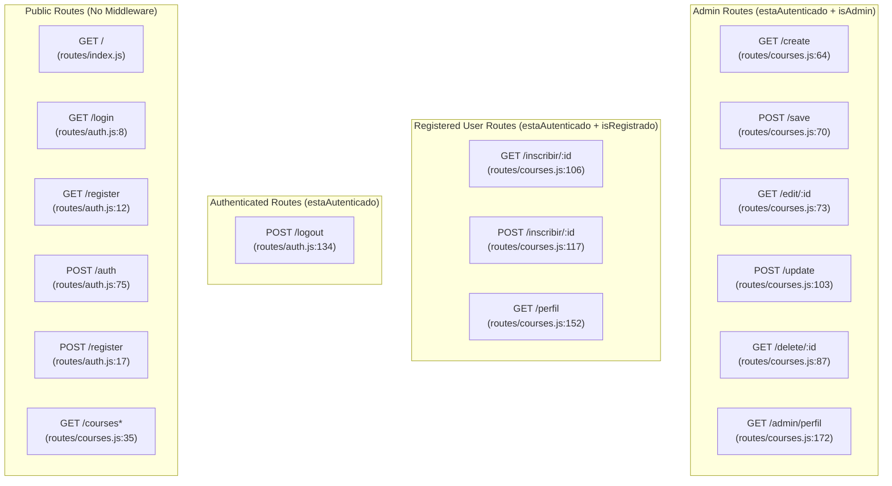
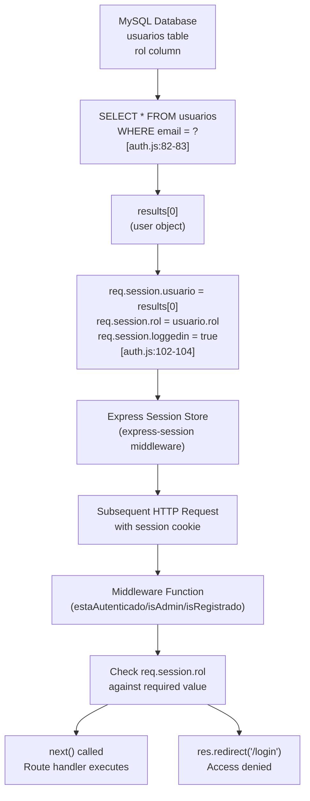

# Role-Based Access Control

> **Relevant source files**
> * [routes/auth.js](https://github.com/Lourdes12587/Week06/blob/ce0c3bcd/routes/auth.js)
> * [routes/courses.js](https://github.com/Lourdes12587/Week06/blob/ce0c3bcd/routes/courses.js)

## Purpose and Scope

This document describes the role-based access control (RBAC) system that governs user permissions throughout the application. The system defines three distinct user roles and implements middleware functions that restrict access to routes based on authentication status and assigned roles. This page focuses on the middleware implementation and role enforcement mechanisms. For information about the login and authentication process, see [User Login](/Lourdes12587/Week06/4.2-user-login). For session storage details, see [Session Management](/Lourdes12587/Week06/4.4-session-management).

---

## The Three User Roles

The application defines three user roles with escalating privileges:

| Role | Database Value | Description | Assignment Method |
| --- | --- | --- | --- |
| **Public** | `'publico'` | Unauthenticated visitors | Default for non-logged-in users |
| **Registered** | `'registrado'` | Authenticated regular users | Default role during registration |
| **Administrator** | `'admin'` | Authenticated administrators | Manual assignment in database or during registration |

The role is stored in the `usuarios` table as an enum field and is loaded into the session upon successful authentication [routes/auth.js L100-L104](https://github.com/Lourdes12587/Week06/blob/ce0c3bcd/routes/auth.js#L100-L104)

**Sources:** routes/auth.js, routes/courses.js

---

## Authentication Middleware Functions

The system implements three middleware functions in `routes/courses.js` that enforce access control at the route level:

### estaAutenticado Middleware

```javascript
function estaAutenticado(req, res, next)
```

This middleware verifies that a user is logged in by checking for an active session. It serves as the base authentication check for all protected routes.

**Implementation:** [routes/courses.js L8-L14](https://github.com/Lourdes12587/Week06/blob/ce0c3bcd/routes/courses.js#L8-L14)

**Logic:**

* Checks if `req.session.loggedin` is truthy
* If authenticated, calls `next()` to proceed to the next middleware or route handler
* If not authenticated, redirects to `/login`

**Usage:** Applied to all routes that require any level of authentication, including both registered user and admin routes.

---

### isAdmin Middleware

```javascript
function isAdmin(req, res, next)
```

This middleware enforces administrator-only access by verifying both authentication status and role.

**Implementation:** [routes/courses.js L16-L24](https://github.com/Lourdes12587/Week06/blob/ce0c3bcd/routes/courses.js#L16-L24)

**Logic:**

* Checks if `req.session.loggedin` is truthy AND `req.session.rol === 'admin'`
* If both conditions are met, calls `next()`
* If either condition fails, redirects to `/login`

**Usage:** Applied to all course management CRUD operations (create, edit, update, delete) and the admin profile route.

---

### isRegistrado Middleware

```javascript
function isRegistrado(req, res, next)
```

This middleware restricts access to registered users, excluding administrators from routes meant specifically for regular users.

**Implementation:** [routes/courses.js L26-L33](https://github.com/Lourdes12587/Week06/blob/ce0c3bcd/routes/courses.js#L26-L33)

**Logic:**

* Checks if `req.session.loggedin` is truthy AND `req.session.rol === 'registrado'`
* If both conditions are met, calls `next()`
* If either condition fails, redirects to `/login`

**Usage:** Applied to enrollment routes and the regular user profile page.

**Sources:** routes/courses.js:8-33

---

## Middleware Chain Diagram

**Diagram: Authentication Middleware Flow**



**Sources:** routes/courses.js:8-33

---

## Role Assignment Process

### During Registration

When a user registers, their role is assigned in the database insertion operation:

**Implementation:** [routes/auth.js L43-L52](https://github.com/Lourdes12587/Week06/blob/ce0c3bcd/routes/auth.js#L43-L52)

```yaml
rol: rol || 'registrado'
```

The system defaults to `'registrado'` if no role is explicitly provided in the registration form, though the standard registration form does not expose role selection to users.

---

### During Login

Upon successful authentication, the user's role is loaded from the database and stored in the session:

**Implementation:** [routes/auth.js L100-L104](https://github.com/Lourdes12587/Week06/blob/ce0c3bcd/routes/auth.js#L100-L104)

The session object is populated with:

* `req.session.loggedin = true`
* `req.session.usuario = results[0]` (full user object)
* `req.session.rol = usuario.rol` (extracted role value)

This role value persists throughout the user's session and is checked by middleware on each protected route request.

**Sources:** routes/auth.js:43-52, routes/auth.js:100-104

---

## Route Protection Patterns

**Diagram: Routes by Access Level**



**Sources:** routes/auth.js, routes/courses.js

---

## Detailed Route Protection Examples

### Public Access Example: Course Listing

The `/courses` route is publicly accessible but implements role-based content filtering:

**Implementation:** [routes/courses.js L35-L62](https://github.com/Lourdes12587/Week06/blob/ce0c3bcd/routes/courses.js#L35-L62)

```javascript
const rol = req.session?.rol || 'publico';
```

* Public users (`'publico'`): SQL query filtered with `WHERE visibilidad='publico'`
* Registered and admin users: No WHERE clause, all courses visible

---

### Registered User Access Example: Enrollment

The enrollment routes require both authentication and the `'registrado'` role:

**Implementation:** [routes/courses.js L106-L114](https://github.com/Lourdes12587/Week06/blob/ce0c3bcd/routes/courses.js#L106-L114)

 and [routes/courses.js L117-L149](https://github.com/Lourdes12587/Week06/blob/ce0c3bcd/routes/courses.js#L117-L149)

**Middleware Chain:**

```javascript
router.get("/inscribir/:id", estaAutenticado, isRegistrado, (req, res) => { ... })
router.post("/inscribir/:id", estaAutenticado, isRegistrado, (req, res) => { ... })
```

The middleware chain executes left to right:

1. `estaAutenticado` verifies session exists
2. `isRegistrado` verifies `req.session.rol === 'registrado'`
3. Route handler executes only if both checks pass

---

### Administrator Access Example: Course Creation

All CRUD operations require both authentication and the `'admin'` role:

**Implementation:** [routes/courses.js L64-L66](https://github.com/Lourdes12587/Week06/blob/ce0c3bcd/routes/courses.js#L64-L66)

 for the form, [routes/courses.js L70](https://github.com/Lourdes12587/Week06/blob/ce0c3bcd/routes/courses.js#L70-L70)

 for saving

**Middleware Chain:**

```javascript
router.get('/create', estaAutenticado, isAdmin, (req, res) => { ... })
router.post('/save', estaAutenticado, isAdmin, crud.save)
```

**Sources:** routes/courses.js:35-185

---

## Access Control Decision Table

The following table summarizes route accessibility by role:

| Route Pattern | Public | Registered | Admin | Middleware Applied |
| --- | --- | --- | --- | --- |
| `/`, `/login`, `/register` | ✓ | ✓ | ✓ | None |
| `POST /auth`, `POST /register` | ✓ | ✓ | ✓ | None |
| `GET /courses` | ✓ (filtered) | ✓ (all) | ✓ (all) | None |
| `POST /logout` | ✗ | ✓ | ✓ | `estaAutenticado` |
| `/inscribir/:id` (GET/POST) | ✗ | ✓ | ✗ | `estaAutenticado`, `isRegistrado` |
| `/perfil` | ✗ | ✓ | ✗ | `estaAutenticado`, `isRegistrado` |
| `/create`, `/save` | ✗ | ✗ | ✓ | `estaAutenticado`, `isAdmin` |
| `/edit/:id`, `/update` | ✗ | ✗ | ✓ | `estaAutenticado`, `isAdmin` |
| `/delete/:id` | ✗ | ✗ | ✓ | `estaAutenticado`, `isAdmin` |
| `/admin/perfil` | ✗ | ✗ | ✓ | `estaAutenticado`, `isAdmin` |

**Sources:** routes/auth.js, routes/courses.js

---

## Session-Based Role Storage

**Diagram: Role Data Flow from Database to Middleware**



**Sources:** routes/auth.js:82-104, routes/courses.js:8-33

---

## Security Considerations

### Middleware Ordering

Middleware functions must be applied in the correct order to ensure proper access control:

1. **Always apply `estaAutenticado` first** before role-specific middleware
2. **Apply role middleware second** (`isAdmin` or `isRegistrado`)
3. **Route handler executes last**

Incorrect ordering would allow unauthenticated users to bypass authentication checks.

---

### Role Exclusivity

The current implementation makes roles mutually exclusive in protected routes:

* Routes with `isRegistrado` **only allow** users with role `'registrado'`
* Routes with `isAdmin` **only allow** users with role `'admin'`
* An administrator cannot access `/inscribir/:id` or `/perfil` because these check for `rol === 'registrado'`

This design separates administrative and user workflows completely.

---

### Session Integrity

The role stored in `req.session.rol` is considered authoritative for the duration of the session. The system does not re-query the database to verify roles on each request, relying instead on session data integrity. If a user's role is changed in the database, they must log out and log back in for the change to take effect.

**Sources:** routes/courses.js:8-33, routes/auth.js:100-104

---

## Implementation Notes

### Optional Chaining for Safety

The middleware functions use optional chaining (`?.`) to safely access session properties:

```
req.session?.loggedin
req.session?.rol
```

This prevents runtime errors if the session object is undefined, though in practice the Express session middleware ensures `req.session` always exists.

**Implementation:** [routes/courses.js L17](https://github.com/Lourdes12587/Week06/blob/ce0c3bcd/routes/courses.js#L17-L17)

 [routes/courses.js L27](https://github.com/Lourdes12587/Week06/blob/ce0c3bcd/routes/courses.js#L27-L27)

---

### Default Role Assignment

The course listing route demonstrates defensive programming by defaulting to `'publico'` when no session exists:

```javascript
const rol = req.session?.rol || 'publico';
```

**Implementation:** [routes/courses.js L36](https://github.com/Lourdes12587/Week06/blob/ce0c3bcd/routes/courses.js#L36-L36)

This allows the route to handle both authenticated and unauthenticated users gracefully without requiring authentication middleware.

**Sources:** routes/courses.js:17-36