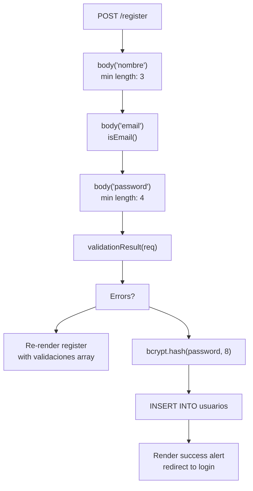
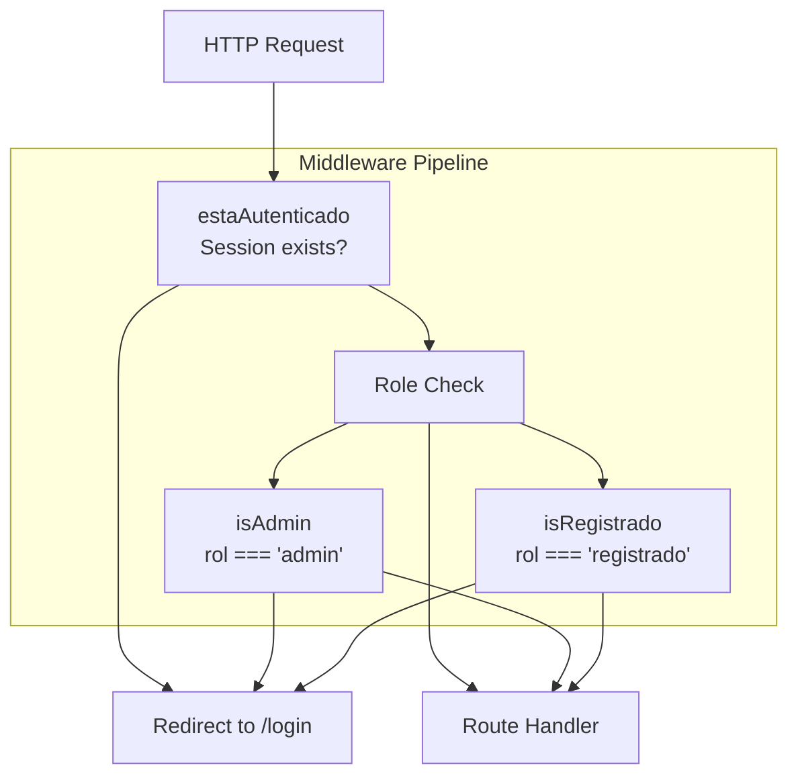
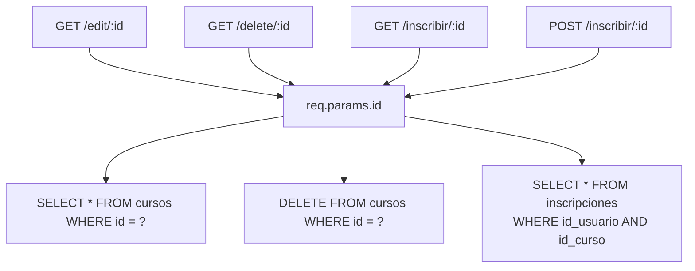
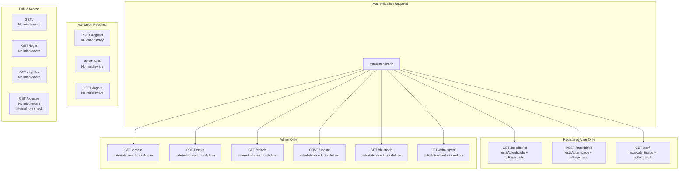
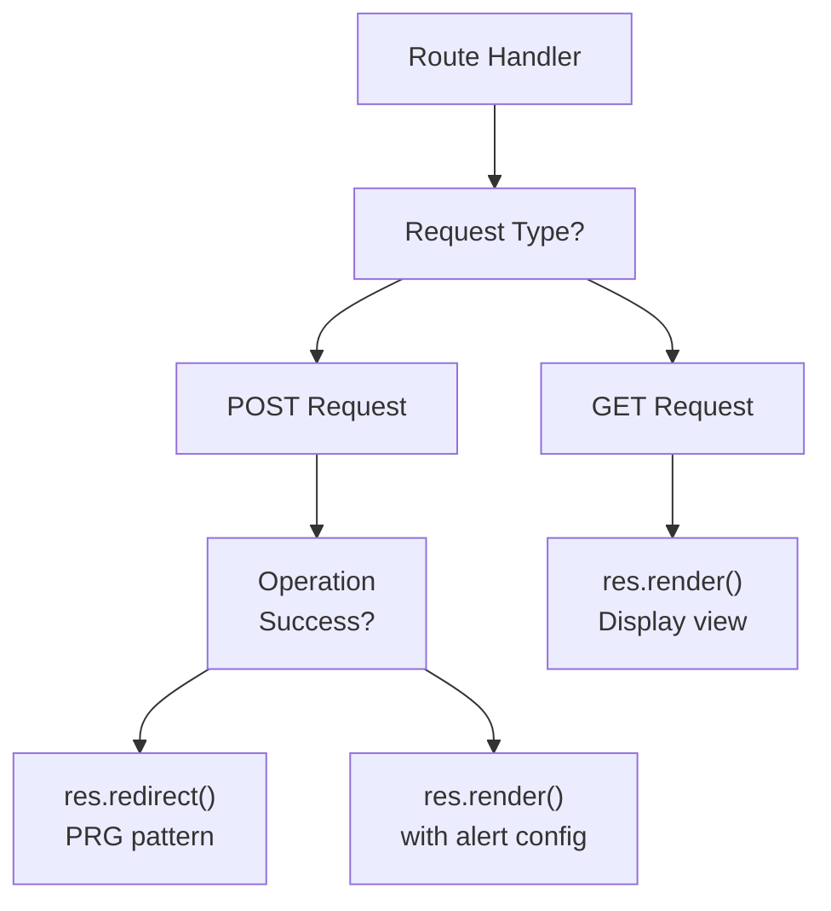

# Routing System

> **Relevant source files**
> * [app.js](https://github.com/Lourdes12587/Week06/blob/ce0c3bcd/app.js)
> * [routes/auth.js](https://github.com/Lourdes12587/Week06/blob/ce0c3bcd/routes/auth.js)
> * [routes/courses.js](https://github.com/Lourdes12587/Week06/blob/ce0c3bcd/routes/courses.js)
> * [routes/index.js](https://github.com/Lourdes12587/Week06/blob/ce0c3bcd/routes/index.js)

## Purpose and Scope

This document describes the modular routing architecture of the course management application. The routing system is organized into three separate router modules that handle different functional areas: static pages, authentication, and course management. Each router defines HTTP endpoints with associated middleware chains for authentication, authorization, and request handling.

For details on authentication middleware implementation, see [Authentication & Authorization](/Lourdes12587/Week06/4-authentication-and-authorization). For information on how routes integrate with database operations, see [Database Architecture](/Lourdes12587/Week06/3.3-database-architecture). For the application entry point where routers are mounted, see [Application Entry Point](/Lourdes12587/Week06/3.2-application-entry-point).

---

## Router Module Structure

The application uses Express Router to organize endpoints into three distinct modules, all mounted at the root path in [app.js L29-L31](https://github.com/Lourdes12587/Week06/blob/ce0c3bcd/app.js#L29-L31)

:

| Router Module | File Path | Mounted At | Purpose |
| --- | --- | --- | --- |
| Index Router | `routes/index.js` | `/` | Landing page and static content |
| Auth Router | `routes/auth.js` | `/` | User authentication and registration |
| Courses Router | `routes/courses.js` | `/` | Course CRUD operations and enrollment |

All three routers are mounted at the root path (`/`), meaning routes defined in each module are directly accessible without a prefix. This creates a flat URL structure where authentication routes like `/login` and course routes like `/courses` exist at the same hierarchy level.

**Router Mounting Diagram**

```mermaid
flowchart TD

AppJS["app.js<br>Express Application"]
IndexRouter["routes/index.js<br>Index Router"]
AuthRouter["routes/auth.js<br>Auth Router"]
CoursesRouter["routes/courses.js<br>Courses Router"]
R1["GET /<br>Landing Page"]
R2["GET /login<br>Login Form"]
R3["GET /register<br>Registration Form"]
R4["POST /register<br>Create Account"]
R5["POST /auth<br>Authenticate"]
R6["POST /logout<br>Destroy Session"]
R7["GET /courses<br>Course Listing"]
R8["GET /create<br>Course Form"]
R9["POST /save<br>Save Course"]
R10["GET /edit/:id<br>Edit Form"]
R11["POST /update<br>Update Course"]
R12["GET /delete/:id<br>Delete Course"]
R13["GET /inscribir/:id<br>Enrollment Confirm"]
R14["POST /inscribir/:id<br>Process Enrollment"]
R15["GET /perfil<br>User Profile"]
R16["GET /admin/perfil<br>Admin Dashboard"]

AppJS --> IndexRouter
AppJS --> AuthRouter
AppJS --> CoursesRouter
IndexRouter --> R1
AuthRouter --> R2
AuthRouter --> R3
AuthRouter --> R4
AuthRouter --> R5
AuthRouter --> R6
CoursesRouter --> R7
CoursesRouter --> R8
CoursesRouter --> R9
CoursesRouter --> R10
CoursesRouter --> R11
CoursesRouter --> R12
CoursesRouter --> R13
CoursesRouter --> R14
CoursesRouter --> R15
CoursesRouter --> R16

subgraph subGraph1 ["Route Definitions"]
    R1
    R2
    R3
    R4
    R5
    R6
    R7
    R8
    R9
    R10
    R11
    R12
    R13
    R14
    R15
    R16
end

subgraph subGraph0 ["Router Modules"]
    IndexRouter
    AuthRouter
    CoursesRouter
end
```



**Sources:** [app.js L29-L31](https://github.com/Lourdes12587/Week06/blob/ce0c3bcd/app.js#L29-L31)

 [routes/index.js L1-L18](https://github.com/Lourdes12587/Week06/blob/ce0c3bcd/routes/index.js#L1-L18)

 [routes/auth.js L1-L139](https://github.com/Lourdes12587/Week06/blob/ce0c3bcd/routes/auth.js#L1-L139)

 [routes/courses.js L1-L187](https://github.com/Lourdes12587/Week06/blob/ce0c3bcd/routes/courses.js#L1-L187)

---

## Index Router

The index router in [routes/index.js](https://github.com/Lourdes12587/Week06/blob/ce0c3bcd/routes/index.js)

 provides the application's landing page. This router has minimal complexity with a single route definition.

### Route Definition

| Method | Path | Handler | Purpose |
| --- | --- | --- | --- |
| GET | `/` | Anonymous function | Renders landing page with session context |

The root route [routes/index.js L6-L15](https://github.com/Lourdes12587/Week06/blob/ce0c3bcd/routes/index.js#L6-L15)

 accesses session data to personalize the view. It passes several variables to the `index.ejs` template:

* `login`: Boolean indicating if user is authenticated (`req.session.loggedin`)
* `name`: User's name from session or "Invitado" (Guest)
* Static content: `nombre` and `experiencia` strings

**Sources:** [routes/index.js L1-L18](https://github.com/Lourdes12587/Week06/blob/ce0c3bcd/routes/index.js#L1-L18)

---

## Authentication Router

The authentication router in [routes/auth.js](https://github.com/Lourdes12587/Week06/blob/ce0c3bcd/routes/auth.js)

 handles user account lifecycle operations including registration, login, and logout. This router integrates with `express-validator` for input validation and `bcryptjs` for password security.

### Route Definitions

| Method | Path | Middleware | Handler | Purpose |
| --- | --- | --- | --- | --- |
| GET | `/login` | None | [auth.js L8-L10](https://github.com/Lourdes12587/Week06/blob/ce0c3bcd/auth.js#L8-L10) | Display login form |
| GET | `/register` | None | [auth.js L12-L14](https://github.com/Lourdes12587/Week06/blob/ce0c3bcd/auth.js#L12-L14) | Display registration form |
| POST | `/register` | Validation chain | [auth.js L17-L72](https://github.com/Lourdes12587/Week06/blob/ce0c3bcd/auth.js#L17-L72) | Process new account creation |
| POST | `/auth` | None | [auth.js L75-L131](https://github.com/Lourdes12587/Week06/blob/ce0c3bcd/auth.js#L75-L131) | Authenticate user credentials |
| POST | `/logout` | None | [auth.js L134-L136](https://github.com/Lourdes12587/Week06/blob/ce0c3bcd/auth.js#L134-L136) | Destroy session and redirect |

### Registration Route with Validation

The registration route [routes/auth.js L17-L72](https://github.com/Lourdes12587/Week06/blob/ce0c3bcd/routes/auth.js#L17-L72)

 implements a multi-stage validation pipeline using `express-validator`:



The validation middleware array [routes/auth.js L18-L33](https://github.com/Lourdes12587/Week06/blob/ce0c3bcd/routes/auth.js#L18-L33)

 validates:

1. `nombre`: Minimum 3 characters
2. `email`: Valid email format
3. `password`: Minimum 4 characters

**Sources:** [routes/auth.js L1-L139](https://github.com/Lourdes12587/Week06/blob/ce0c3bcd/routes/auth.js#L1-L139)

### Login Authentication Flow

The login route [routes/auth.js L75-L131](https://github.com/Lourdes12587/Week06/blob/ce0c3bcd/routes/auth.js#L75-L131)

 implements password verification and session initialization:

1. Query database for user by email [auth.js L81-L84](https://github.com/Lourdes12587/Week06/blob/ce0c3bcd/auth.js#L81-L84)
2. Compare password with bcrypt [auth.js L86](https://github.com/Lourdes12587/Week06/blob/ce0c3bcd/auth.js#L86-L86)
3. On success: Set session variables [auth.js L102-L104](https://github.com/Lourdes12587/Week06/blob/ce0c3bcd/auth.js#L102-L104) * `req.session.loggedin = true` * `req.session.usuario = results[0]` (entire user object) * `req.session.rol = usuario.rol` (user's role)
4. Render login page with SweetAlert2 configuration [auth.js L106-L115](https://github.com/Lourdes12587/Week06/blob/ce0c3bcd/auth.js#L106-L115)

**Sources:** [routes/auth.js L75-L131](https://github.com/Lourdes12587/Week06/blob/ce0c3bcd/routes/auth.js#L75-L131)

---

## Courses Router

The courses router in [routes/courses.js](https://github.com/Lourdes12587/Week06/blob/ce0c3bcd/routes/courses.js)

 is the most complex router module, handling course CRUD operations, enrollment, and profile views. It defines three custom middleware functions for route protection.

### Middleware Functions

The courses router defines three middleware functions that implement authentication and role-based authorization:

| Middleware | Lines | Check | Redirect on Failure |
| --- | --- | --- | --- |
| `estaAutenticado` | [courses.js L8-L14](https://github.com/Lourdes12587/Week06/blob/ce0c3bcd/courses.js#L8-L14) | `req.session.loggedin` is truthy | `/login` |
| `isAdmin` | [courses.js L16-L24](https://github.com/Lourdes12587/Week06/blob/ce0c3bcd/courses.js#L16-L24) | `req.session.rol === 'admin'` | `/login` |
| `isRegistrado` | [courses.js L26-L33](https://github.com/Lourdes12587/Week06/blob/ce0c3bcd/courses.js#L26-L33) | `req.session.rol === 'registrado'` | `/login` |

These middleware functions use the `next()` callback to pass control to the next middleware or route handler when authorization succeeds.

**Middleware Chain Architecture**



**Sources:** [routes/courses.js L8-L33](https://github.com/Lourdes12587/Week06/blob/ce0c3bcd/routes/courses.js#L8-L33)

### Route Definitions by Access Level

#### Public Routes

| Method | Path | Middleware | Purpose |
| --- | --- | --- | --- |
| GET | `/courses` | None | Display courses filtered by user role [courses.js L35-L62](https://github.com/Lourdes12587/Week06/blob/ce0c3bcd/courses.js#L35-L62) |

The `/courses` route implements role-based content filtering. Public users (`rol === 'publico'`) only see courses with `visibilidad='publico'`, while authenticated users see all courses [courses.js L36-L42](https://github.com/Lourdes12587/Week06/blob/ce0c3bcd/courses.js#L36-L42)

#### Administrator Routes

All administrator routes use the middleware chain: `estaAutenticado, isAdmin`

| Method | Path | Handler Type | Purpose |
| --- | --- | --- | --- |
| GET | `/create` | Inline | Render course creation form [courses.js L64-L67](https://github.com/Lourdes12587/Week06/blob/ce0c3bcd/courses.js#L64-L67) |
| POST | `/save` | Controller | `crud.save` - Insert new course [courses.js L70](https://github.com/Lourdes12587/Week06/blob/ce0c3bcd/courses.js#L70-L70) |
| GET | `/edit/:id` | Inline | Load course data and render edit form [courses.js L73-L84](https://github.com/Lourdes12587/Week06/blob/ce0c3bcd/courses.js#L73-L84) |
| POST | `/update` | Controller | `crud.update` - Update course [courses.js L103](https://github.com/Lourdes12587/Week06/blob/ce0c3bcd/courses.js#L103-L103) |
| GET | `/delete/:id` | Inline | Delete course by ID [courses.js L87-L98](https://github.com/Lourdes12587/Week06/blob/ce0c3bcd/courses.js#L87-L98) |
| GET | `/admin/perfil` | Inline | Display admin dashboard with statistics [courses.js L172-L185](https://github.com/Lourdes12587/Week06/blob/ce0c3bcd/courses.js#L172-L185) |

#### Registered User Routes

All registered user routes use the middleware chain: `estaAutenticado, isRegistrado`

| Method | Path | Purpose |
| --- | --- | --- |
| GET | `/inscribir/:id` | Display enrollment confirmation page [courses.js L106-L114](https://github.com/Lourdes12587/Week06/blob/ce0c3bcd/courses.js#L106-L114) |
| POST | `/inscribir/:id` | Process enrollment with duplicate check [courses.js L117-L149](https://github.com/Lourdes12587/Week06/blob/ce0c3bcd/courses.js#L117-L149) |
| GET | `/perfil` | Display user profile with enrolled courses [courses.js L152-L169](https://github.com/Lourdes12587/Week06/blob/ce0c3bcd/courses.js#L152-L169) |

**Sources:** [routes/courses.js L35-L187](https://github.com/Lourdes12587/Week06/blob/ce0c3bcd/routes/courses.js#L35-L187)

### Parameter-Based Routing

Several routes use URL parameters (`:id`) to specify resources:



The parameter extraction uses `req.params.id` to access the route parameter, which is then used in parameterized SQL queries to prevent SQL injection attacks.

**Sources:** [routes/courses.js L73-L98](https://github.com/Lourdes12587/Week06/blob/ce0c3bcd/routes/courses.js#L73-L98)

 [routes/courses.js L106-L149](https://github.com/Lourdes12587/Week06/blob/ce0c3bcd/routes/courses.js#L106-L149)

### Controller Integration

Two routes delegate business logic to external controller modules:

| Route | Controller Function | Module |
| --- | --- | --- |
| POST `/save` | `crud.save` | `src/controller.js` [courses.js L70](https://github.com/Lourdes12587/Week06/blob/ce0c3bcd/courses.js#L70-L70) |
| POST `/update` | `crud.update` | `src/controller.js` [courses.js L103](https://github.com/Lourdes12587/Week06/blob/ce0c3bcd/courses.js#L103-L103) |

The courses router imports both controller modules at [courses.js L5-L6](https://github.com/Lourdes12587/Week06/blob/ce0c3bcd/courses.js#L5-L6)

:

* `crud` from `../src/controller`
* `cursoController` from `../src/cursoController`

However, only the `crud` controller is actively used in route definitions. The `cursoController` import appears unused in the current routing configuration.

**Sources:** [routes/courses.js L5-L6](https://github.com/Lourdes12587/Week06/blob/ce0c3bcd/routes/courses.js#L5-L6)

 [routes/courses.js L70](https://github.com/Lourdes12587/Week06/blob/ce0c3bcd/routes/courses.js#L70-L70)

 [routes/courses.js L103](https://github.com/Lourdes12587/Week06/blob/ce0c3bcd/routes/courses.js#L103-L103)

---

## Middleware Application Patterns

The routing system demonstrates three distinct patterns for applying middleware to routes:

### Pattern 1: No Middleware (Public Routes)

```javascript
router.get('/login', (req, res) => { ... })
```

Used for: Login form, registration form, course listing (with internal role filtering), landing page

### Pattern 2: Multiple Middleware Chain

```javascript
router.get('/create', estaAutenticado, isAdmin, (req, res) => { ... })
```

Middleware executes left-to-right. If any middleware doesn't call `next()`, the chain stops and subsequent handlers don't execute. This pattern is used for all protected admin and user routes.

### Pattern 3: Validation Middleware Array

```
router.post("/register", [body("nombre").exists().isLength({min: 3}), ...], handler)
```

The registration route uses an array of validation middleware from `express-validator`, which all execute before the handler function.

**Complete Middleware Application Map**



**Sources:** [routes/index.js L6-L15](https://github.com/Lourdes12587/Week06/blob/ce0c3bcd/routes/index.js#L6-L15)

 [routes/auth.js L8-L136](https://github.com/Lourdes12587/Week06/blob/ce0c3bcd/routes/auth.js#L8-L136)

 [routes/courses.js L35-L185](https://github.com/Lourdes12587/Week06/blob/ce0c3bcd/routes/courses.js#L35-L185)

---

## Route Handler Response Patterns

The routing system uses three distinct response patterns based on the nature of the operation:

### Render Response

Used for GET requests that display views:

```
res.render('viewName', { data: values })
```

Examples: `/login`, `/create`, `/edit/:id`, `/perfil`

### Redirect Response

Used after successful POST operations (Post-Redirect-Get pattern):

```
res.redirect('/targetPath')
```

Examples: After `/save`, `/update`, `/delete/:id`, `/inscribir/:id`, `/logout`

### Render with Alert Configuration

Used to display operation results via SweetAlert2:

```yaml
res.render('viewName', {
    alert: true,
    alertTitle: 'Title',
    alertMessage: 'Message',
    alertIcon: 'success',
    ruta: 'redirectPath'
})
```

This pattern is used in [routes/auth.js L58-L66](https://github.com/Lourdes12587/Week06/blob/ce0c3bcd/routes/auth.js#L58-L66)

 (successful registration) and [routes/auth.js L88-L97](https://github.com/Lourdes12587/Week06/blob/ce0c3bcd/routes/auth.js#L88-L97)

 (login errors).

**Response Type Decision Tree**



**Sources:** [routes/auth.js L8-L136](https://github.com/Lourdes12587/Week06/blob/ce0c3bcd/routes/auth.js#L8-L136)

 [routes/courses.js L35-L185](https://github.com/Lourdes12587/Week06/blob/ce0c3bcd/routes/courses.js#L35-L185)

---

## Database Query Patterns in Routes

Routes interact with the database in two ways:

### Direct Query Execution

Routes in the courses router execute SQL queries directly for simpler operations:

| Route | Query Type | Example |
| --- | --- | --- |
| `/courses` | SELECT with conditional WHERE | [courses.js L38-L42](https://github.com/Lourdes12587/Week06/blob/ce0c3bcd/courses.js#L38-L42) |
| `/edit/:id` | SELECT by ID | [courses.js L77](https://github.com/Lourdes12587/Week06/blob/ce0c3bcd/courses.js#L77-L77) |
| `/delete/:id` | DELETE by ID | [courses.js L91](https://github.com/Lourdes12587/Week06/blob/ce0c3bcd/courses.js#L91-L91) |
| `/inscribir/:id` (GET) | SELECT by ID | [courses.js L109](https://github.com/Lourdes12587/Week06/blob/ce0c3bcd/courses.js#L109-L109) |
| `/inscribir/:id` (POST) | SELECT + INSERT | [courses.js L121-L146](https://github.com/Lourdes12587/Week06/blob/ce0c3bcd/courses.js#L121-L146) |
| `/perfil` | SELECT with JOIN | [courses.js L155-L160](https://github.com/Lourdes12587/Week06/blob/ce0c3bcd/courses.js#L155-L160) |
| `/admin/perfil` | SELECT COUNT | [courses.js L176](https://github.com/Lourdes12587/Week06/blob/ce0c3bcd/courses.js#L176-L176) |

### Controller Delegation

POST routes for course CRUD delegate to controller functions:

| Route | Controller | Purpose |
| --- | --- | --- |
| POST `/save` | `crud.save` | Course creation logic |
| POST `/update` | `crud.update` | Course update logic |

This separation allows complex business logic and validation to be centralized in controller modules while keeping route handlers focused on request/response coordination.

**Sources:** [routes/courses.js L35-L187](https://github.com/Lourdes12587/Week06/blob/ce0c3bcd/routes/courses.js#L35-L187)

 [routes/courses.js L5-L6](https://github.com/Lourdes12587/Week06/blob/ce0c3bcd/routes/courses.js#L5-L6)

---

## Request Flow Example: Course Enrollment

The enrollment process demonstrates the complete routing system capabilities including parameter extraction, middleware chains, database interactions, and duplicate prevention:

```

```

The enrollment implementation at [routes/courses.js L117-L149](https://github.com/Lourdes12587/Week06/blob/ce0c3bcd/routes/courses.js#L117-L149)

 demonstrates:

1. Parameter extraction: `req.params.id` for course ID
2. Session access: `req.session.usuario.id` for user ID
3. Duplicate check: Query before insert to prevent re-enrollment
4. Post-Redirect-Get pattern: Redirects to `/perfil` after completion

**Sources:** [routes/courses.js L106-L169](https://github.com/Lourdes12587/Week06/blob/ce0c3bcd/routes/courses.js#L106-L169)

---

## Route-to-File Mapping Reference

This table maps all application endpoints to their implementation locations:

| Endpoint | Method | Router File | Lines | View Template |
| --- | --- | --- | --- | --- |
| `/` | GET | `routes/index.js` | 6-15 | `index.ejs` |
| `/login` | GET | `routes/auth.js` | 8-10 | `login.ejs` |
| `/register` | GET | `routes/auth.js` | 12-14 | `register.ejs` |
| `/register` | POST | `routes/auth.js` | 17-72 | `register.ejs` (with alert) |
| `/auth` | POST | `routes/auth.js` | 75-131 | `login.ejs` (with alert) |
| `/logout` | POST | `routes/auth.js` | 134-136 | - (redirect) |
| `/courses` | GET | `routes/courses.js` | 35-62 | `courses.ejs` |
| `/create` | GET | `routes/courses.js` | 64-67 | `create.ejs` |
| `/save` | POST | `routes/courses.js` | 70 | - (via controller) |
| `/edit/:id` | GET | `routes/courses.js` | 73-84 | `edit.ejs` |
| `/update` | POST | `routes/courses.js` | 103 | - (via controller) |
| `/delete/:id` | GET | `routes/courses.js` | 87-98 | - (redirect) |
| `/inscribir/:id` | GET | `routes/courses.js` | 106-114 | `confirmInscripcion.ejs` |
| `/inscribir/:id` | POST | `routes/courses.js` | 117-149 | - (redirect) |
| `/perfil` | GET | `routes/courses.js` | 152-169 | `perfil.ejs` |
| `/admin/perfil` | GET | `routes/courses.js` | 172-185 | `adminPerfil.ejs` |

**Sources:** [routes/index.js](https://github.com/Lourdes12587/Week06/blob/ce0c3bcd/routes/index.js)

 [routes/auth.js](https://github.com/Lourdes12587/Week06/blob/ce0c3bcd/routes/auth.js)

 [routes/courses.js](https://github.com/Lourdes12587/Week06/blob/ce0c3bcd/routes/courses.js)