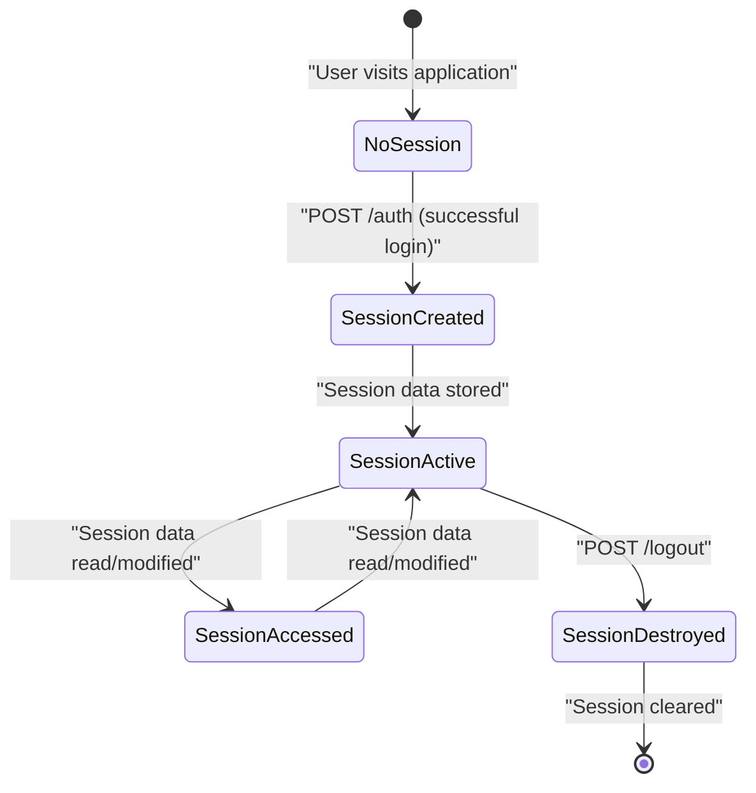
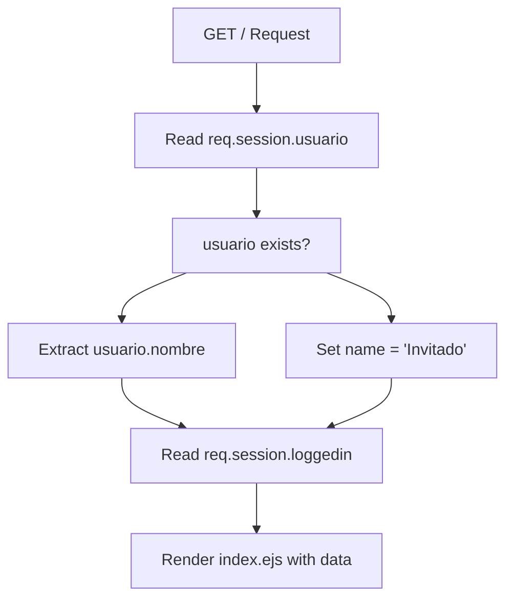
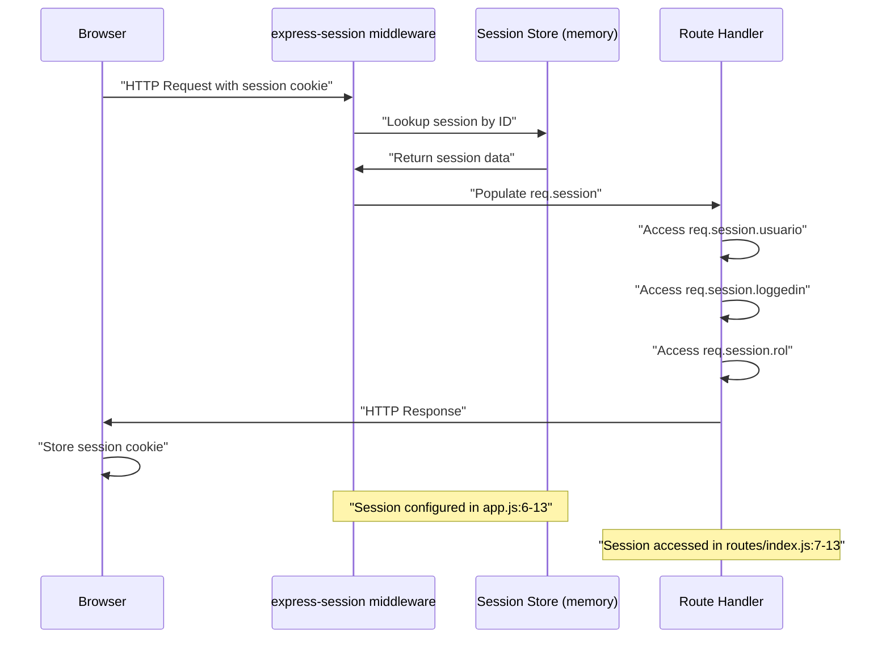
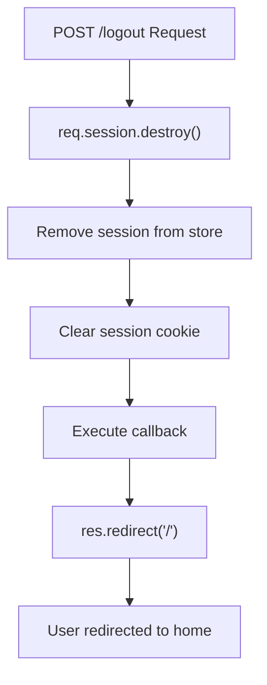
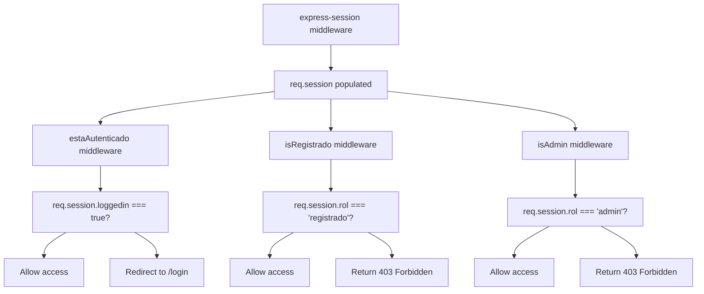

# Session Management

> **Relevant source files**
> * [app.js](https://github.com/Lourdes12587/Week06/blob/ce0c3bcd/app.js)
> * [routes/auth.js](https://github.com/Lourdes12587/Week06/blob/ce0c3bcd/routes/auth.js)
> * [routes/index.js](https://github.com/Lourdes12587/Week06/blob/ce0c3bcd/routes/index.js)

## Purpose and Scope

This document details the session management implementation in the course management system, explaining how user state is maintained across HTTP requests using the `express-session` middleware. This includes session configuration, storage, creation during authentication, access patterns in route handlers, and session destruction on logout.

For information about the authentication process that creates sessions, see [User Login](/Lourdes12587/Week06/4.2-user-login). For details on role-based access control using session data, see [Role-Based Access Control](/Lourdes12587/Week06/4.3-role-based-access-control).

---

## Session Configuration

The application configures session management in [app.js L4-L13](https://github.com/Lourdes12587/Week06/blob/ce0c3bcd/app.js#L4-L13)

 using the `express-session` middleware. This configuration establishes the foundation for maintaining user state throughout the application.

```
Key Configuration Parameters:
```

| Parameter | Value | Purpose |
| --- | --- | --- |
| `secret` | `"secret"` | Cryptographic key used to sign the session ID cookie |
| `resave` | `false` | Prevents session resaving if unmodified |
| `saveUninitialized` | `false` | Prevents storing empty sessions |

The `secret` parameter in [app.js L8](https://github.com/Lourdes12587/Week06/blob/ce0c3bcd/app.js#L8-L8)

 is used to sign the session ID cookie, preventing tampering. In production environments, this should be loaded from environment variables rather than hardcoded. The `resave: false` configuration in [app.js L9](https://github.com/Lourdes12587/Week06/blob/ce0c3bcd/app.js#L9-L9)

 prevents unnecessary writes to the session store when session data hasn't changed, improving performance. The `saveUninitialized: false` setting in [app.js L10](https://github.com/Lourdes12587/Week06/blob/ce0c3bcd/app.js#L10-L10)

 ensures that sessions are only created when data is actually stored, reducing storage overhead and complying with privacy regulations.

**Sources:** [app.js L4-L13](https://github.com/Lourdes12587/Week06/blob/ce0c3bcd/app.js#L4-L13)

---

## Session Lifecycle

The following diagram illustrates the complete lifecycle of a session from creation through destruction:

**Session Lifecycle Flow**



**Sources:** [routes/auth.js L75-L136](https://github.com/Lourdes12587/Week06/blob/ce0c3bcd/routes/auth.js#L75-L136)

 [routes/index.js L6-L14](https://github.com/Lourdes12587/Week06/blob/ce0c3bcd/routes/index.js#L6-L14)

---

## Session Creation During Authentication

Sessions are created when a user successfully authenticates through the `/auth` endpoint. The authentication handler in [routes/auth.js L75-L131](https://github.com/Lourdes12587/Week06/blob/ce0c3bcd/routes/auth.js#L75-L131)

 performs credential validation and establishes the session.

### Authentication Process

When a user submits login credentials via `POST /auth`, the following sequence occurs:

1. **Credential Extraction:** Email and password are extracted from `req.body` in [routes/auth.js L77-L78](https://github.com/Lourdes12587/Week06/blob/ce0c3bcd/routes/auth.js#L77-L78)
2. **Database Lookup:** User record is queried from the `usuarios` table in [routes/auth.js L81-L84](https://github.com/Lourdes12587/Week06/blob/ce0c3bcd/routes/auth.js#L81-L84)
3. **Password Verification:** The submitted password is compared against the stored hash using `bcrypt.compare()` in [routes/auth.js L86](https://github.com/Lourdes12587/Week06/blob/ce0c3bcd/routes/auth.js#L86-L86)
4. **Session Initialization:** Upon successful authentication, session properties are set in [routes/auth.js L102-L104](https://github.com/Lourdes12587/Week06/blob/ce0c3bcd/routes/auth.js#L102-L104)

### Session Data Storage

The session object stores three critical pieces of information:

```
Session Data Structure:
```

| Property | Type | Set At | Purpose |
| --- | --- | --- | --- |
| `req.session.loggedin` | `boolean` | [routes/auth.js L102](https://github.com/Lourdes12587/Week06/blob/ce0c3bcd/routes/auth.js#L102-L102) | Indicates active authentication status |
| `req.session.usuario` | `object` | [routes/auth.js L103](https://github.com/Lourdes12587/Week06/blob/ce0c3bcd/routes/auth.js#L103-L103) | Complete user record from database |
| `req.session.rol` | `string` | [routes/auth.js L104](https://github.com/Lourdes12587/Week06/blob/ce0c3bcd/routes/auth.js#L104-L104) | User role ('registrado' or 'admin') |

The `usuario` object stored in [routes/auth.js L103](https://github.com/Lourdes12587/Week06/blob/ce0c3bcd/routes/auth.js#L103-L103)

 contains all fields from the `usuarios` table including `id`, `nombre`, `email`, `password` (hashed), and `rol`. This allows routes to access user information without additional database queries.

**Sources:** [routes/auth.js L75-L116](https://github.com/Lourdes12587/Week06/blob/ce0c3bcd/routes/auth.js#L75-L116)

---

## Session Access Patterns

Once a session is established, route handlers access session data through the `req.session` object. This section documents common access patterns throughout the application.

### Basic Session Reading

The index route demonstrates simple session access in [routes/index.js L6-L14](https://github.com/Lourdes12587/Week06/blob/ce0c3bcd/routes/index.js#L6-L14)

:

**Session Access Flow in Index Route**



The pattern shown in [routes/index.js L7](https://github.com/Lourdes12587/Week06/blob/ce0c3bcd/routes/index.js#L7-L7)

 demonstrates safe session access using the optional chaining equivalent: `const usuario = req.session.usuario;`. The ternary operator in [routes/index.js L13](https://github.com/Lourdes12587/Week06/blob/ce0c3bcd/routes/index.js#L13-L13)

 provides a fallback value when no session exists: `name: usuario ? usuario.nombre : "Invitado"`.

### Session-Based Conditionals

Routes use session data to determine application behavior. The login status check in [routes/index.js L12](https://github.com/Lourdes12587/Week06/blob/ce0c3bcd/routes/index.js#L12-L12)

 uses the pattern `req.session.loggedin || false` to provide a default value when the session property is undefined.

**Sources:** [routes/index.js L6-L14](https://github.com/Lourdes12587/Week06/blob/ce0c3bcd/routes/index.js#L6-L14)

---

## Session Persistence Across Requests

The session middleware automatically handles cookie management and session persistence. Each HTTP request includes the session ID cookie, which the middleware uses to retrieve stored session data.

**Session Request Flow**



The middleware configured in [app.js L6-L13](https://github.com/Lourdes12587/Week06/blob/ce0c3bcd/app.js#L6-L13)

 intercepts every incoming request before it reaches route handlers. The session ID is extracted from the cookie, the corresponding session data is retrieved from the store, and the data is attached to `req.session`.

### Session Store

By default, `express-session` uses `MemoryStore`, which stores session data in application memory. This configuration is suitable for development but has limitations:

* Session data is lost when the server restarts
* Does not scale across multiple server instances
* Memory consumption grows with active sessions

For production deployments, a persistent session store (e.g., Redis, MongoDB) should be configured.

**Sources:** [app.js L4-L13](https://github.com/Lourdes12587/Week06/blob/ce0c3bcd/app.js#L4-L13)

---

## Session Destruction

Sessions are destroyed when users log out via the `POST /logout` endpoint defined in [routes/auth.js L134-L136](https://github.com/Lourdes12587/Week06/blob/ce0c3bcd/routes/auth.js#L134-L136)

### Logout Implementation

The logout handler uses a single method call to completely destroy the session:

```yaml
Method: req.session.destroy(callback)
```

The implementation in [routes/auth.js L135](https://github.com/Lourdes12587/Week06/blob/ce0c3bcd/routes/auth.js#L135-L135)

 calls `req.session.destroy()` with a callback that redirects the user to the home page: `req.session.destroy(() => res.redirect('/'))`.

**Logout Flow**



After `req.session.destroy()` executes:

* All session data is removed from the session store
* The session cookie is invalidated
* Subsequent requests will have an empty `req.session` object
* The user must authenticate again to create a new session

**Sources:** [routes/auth.js L134-L136](https://github.com/Lourdes12587/Week06/blob/ce0c3bcd/routes/auth.js#L134-L136)

---

## Session Data Structure Reference

The following table provides a comprehensive reference of all session properties used throughout the application:

| Property Path | Data Type | Possible Values | Set By | Used By |
| --- | --- | --- | --- | --- |
| `req.session.loggedin` | `boolean` | `true`, `undefined` | [routes/auth.js L102](https://github.com/Lourdes12587/Week06/blob/ce0c3bcd/routes/auth.js#L102-L102) | [routes/index.js L12](https://github.com/Lourdes12587/Week06/blob/ce0c3bcd/routes/index.js#L12-L12) |
| `req.session.usuario` | `object` | User record, `undefined` | [routes/auth.js L103](https://github.com/Lourdes12587/Week06/blob/ce0c3bcd/routes/auth.js#L103-L103) | [routes/index.js L7-L13](https://github.com/Lourdes12587/Week06/blob/ce0c3bcd/routes/index.js#L7-L13) |
| `req.session.usuario.id` | `number` | User ID | [routes/auth.js L103](https://github.com/Lourdes12587/Week06/blob/ce0c3bcd/routes/auth.js#L103-L103) | Role middleware |
| `req.session.usuario.nombre` | `string` | User's name | [routes/auth.js L103](https://github.com/Lourdes12587/Week06/blob/ce0c3bcd/routes/auth.js#L103-L103) | [routes/index.js L13](https://github.com/Lourdes12587/Week06/blob/ce0c3bcd/routes/index.js#L13-L13) |
| `req.session.usuario.email` | `string` | User's email | [routes/auth.js L103](https://github.com/Lourdes12587/Week06/blob/ce0c3bcd/routes/auth.js#L103-L103) | Various routes |
| `req.session.usuario.rol` | `string` | `'registrado'`, `'admin'` | [routes/auth.js L103](https://github.com/Lourdes12587/Week06/blob/ce0c3bcd/routes/auth.js#L103-L103) | Role middleware |
| `req.session.rol` | `string` | `'registrado'`, `'admin'`, `undefined` | [routes/auth.js L104](https://github.com/Lourdes12587/Week06/blob/ce0c3bcd/routes/auth.js#L104-L104) | Role middleware |

**Note:** The `req.session.usuario.rol` and `req.session.rol` properties are redundant, as both store the same role value. The latter is set explicitly in [routes/auth.js L104](https://github.com/Lourdes12587/Week06/blob/ce0c3bcd/routes/auth.js#L104-L104)

 for convenience.

**Sources:** [routes/auth.js L100-L104](https://github.com/Lourdes12587/Week06/blob/ce0c3bcd/routes/auth.js#L100-L104)

 [routes/index.js L7-L13](https://github.com/Lourdes12587/Week06/blob/ce0c3bcd/routes/index.js#L7-L13)

---

## Session Security Considerations

### Session Secret Management

The session secret in [app.js L8](https://github.com/Lourdes12587/Week06/blob/ce0c3bcd/app.js#L8-L8)

 is currently hardcoded as `"secret"`. In production environments, this should be:

* Generated using a cryptographically secure random number generator
* Stored in environment variables via the `.env` file
* Rotated periodically for enhanced security

### Cookie Security

The current session configuration does not specify cookie security options. Production deployments should configure:

* `cookie.secure: true` - Ensures cookies are only sent over HTTPS
* `cookie.httpOnly: true` - Prevents client-side JavaScript access to cookies
* `cookie.maxAge` - Sets cookie expiration time
* `cookie.sameSite: 'strict'` - Protects against CSRF attacks

### Session Fixation Prevention

The application does not regenerate session IDs after login. To prevent session fixation attacks, consider implementing `req.session.regenerate()` after successful authentication.

**Sources:** [app.js L6-L13](https://github.com/Lourdes12587/Week06/blob/ce0c3bcd/app.js#L6-L13)

---

## Integration with Middleware

Session data is consumed by authentication and authorization middleware throughout the application. These middleware functions check session properties to enforce access control.

**Middleware Session Dependencies**



For detailed information on how these middleware functions use session data for access control, see [Role-Based Access Control](/Lourdes12587/Week06/4.3-role-based-access-control).

**Sources:** [app.js L4-L13](https://github.com/Lourdes12587/Week06/blob/ce0c3bcd/app.js#L4-L13)

 [routes/auth.js L102-L104](https://github.com/Lourdes12587/Week06/blob/ce0c3bcd/routes/auth.js#L102-L104)