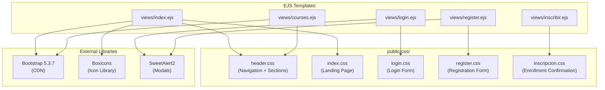
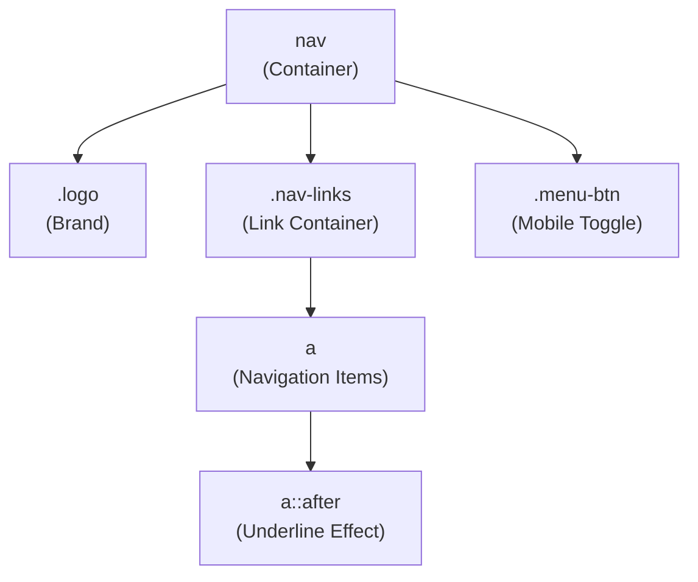
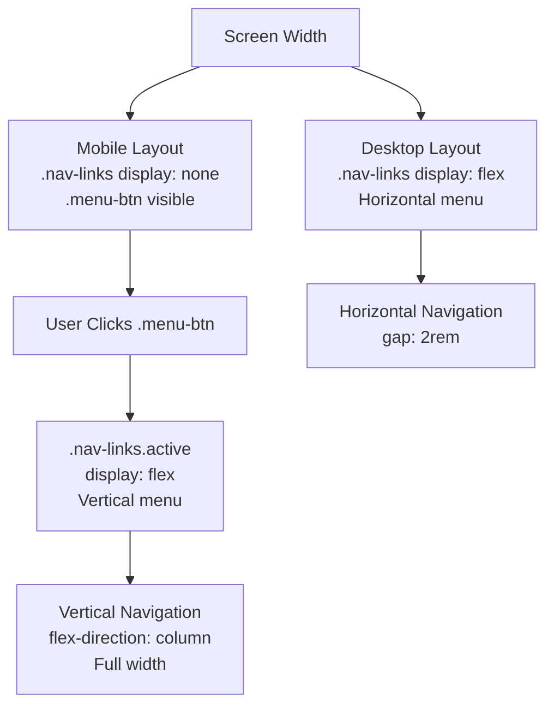
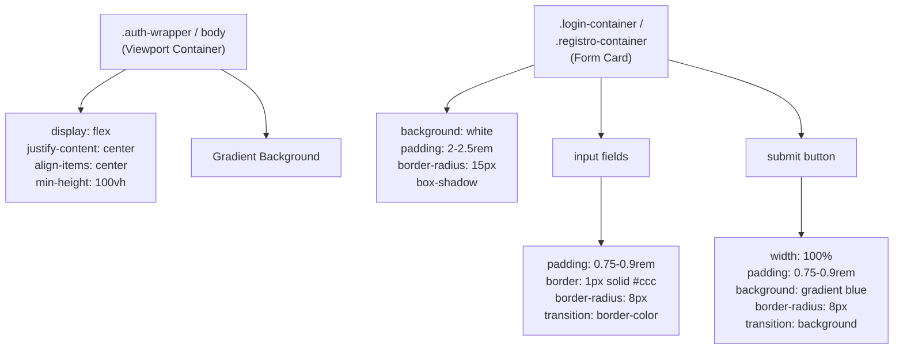
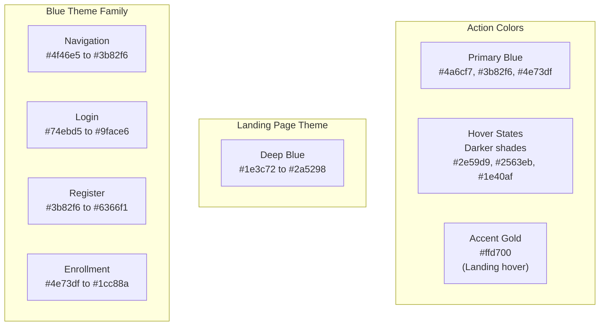
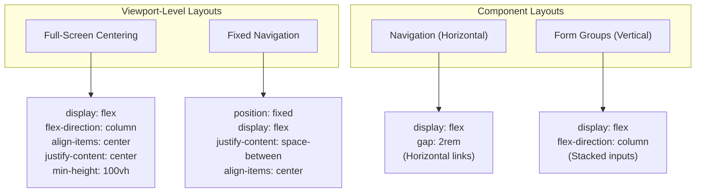
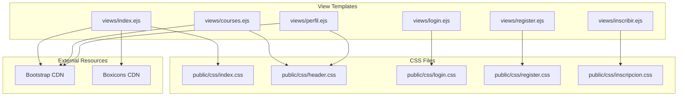

# Styling System

> **Relevant source files**
> * [public/css/header.css](https://github.com/Lourdes12587/Week06/blob/ce0c3bcd/public/css/header.css)
> * [public/css/index.css](https://github.com/Lourdes12587/Week06/blob/ce0c3bcd/public/css/index.css)
> * [public/css/inscripcion.css](https://github.com/Lourdes12587/Week06/blob/ce0c3bcd/public/css/inscripcion.css)
> * [public/css/login.css](https://github.com/Lourdes12587/Week06/blob/ce0c3bcd/public/css/login.css)
> * [public/css/register.css](https://github.com/Lourdes12587/Week06/blob/ce0c3bcd/public/css/register.css)

## Purpose and Scope

This document details the CSS architecture for the course management system, including the organization of stylesheets, styling patterns, responsive design implementation, and the integration with Bootstrap and Boxicons. The styling system uses page-specific CSS files with shared navigation components and consistent theming across the application.

For information about the EJS templates that these styles are applied to, see [Template System & Partials](/Lourdes12587/Week06/7.1-template-system-and-partials). For details on specific page layouts, see [Authentication Views](/Lourdes12587/Week06/7.3-authentication-views) and [Course Views](/Lourdes12587/Week06/7.4-course-views).

---

## CSS Architecture Overview

The styling system is organized around page-specific stylesheets with some shared styling patterns, particularly for navigation components. Each major view has its own CSS file in the `public/css/` directory.

### CSS File Structure Diagram



**Sources:** [public/css/header.css L1-L102](https://github.com/Lourdes12587/Week06/blob/ce0c3bcd/public/css/header.css#L1-L102)

 [public/css/index.css L1-L129](https://github.com/Lourdes12587/Week06/blob/ce0c3bcd/public/css/index.css#L1-L129)

 [public/css/login.css L1-L83](https://github.com/Lourdes12587/Week06/blob/ce0c3bcd/public/css/login.css#L1-L83)

 [public/css/register.css L1-L87](https://github.com/Lourdes12587/Week06/blob/ce0c3bcd/public/css/register.css#L1-L87)

 [public/css/inscripcion.css L1-L85](https://github.com/Lourdes12587/Week06/blob/ce0c3bcd/public/css/inscripcion.css#L1-L85)

---

## Page-Specific Stylesheet Organization

The system uses a one-stylesheet-per-page pattern for major views, allowing for isolated styling concerns without conflicts.

### Stylesheet Mapping Table

| CSS File | Purpose | Key Elements | Linked Views |
| --- | --- | --- | --- |
| `header.css` | Navigation bar and section layouts | `.logo`, `.nav-links`, `.menu-btn` | Multiple views |
| `index.css` | Landing page with gradient background | `body`, `h2`, `p`, `nav` | `views/index.ejs` |
| `login.css` | Login form styling | `.auth-wrapper`, `.login-container` | `views/login.ejs` |
| `register.css` | Registration form styling | `.registro-container`, `.form-group` | `views/register.ejs` |
| `inscripcion.css` | Enrollment confirmation page | `.auth-wrapper`, `.login-container`, `.register-link` | `views/inscribir.ejs` |

**Sources:** [public/css/header.css L1-L102](https://github.com/Lourdes12587/Week06/blob/ce0c3bcd/public/css/header.css#L1-L102)

 [public/css/index.css L1-L129](https://github.com/Lourdes12587/Week06/blob/ce0c3bcd/public/css/index.css#L1-L129)

 [public/css/login.css L1-L83](https://github.com/Lourdes12587/Week06/blob/ce0c3bcd/public/css/login.css#L1-L83)

 [public/css/register.css L1-L87](https://github.com/Lourdes12587/Week06/blob/ce0c3bcd/public/css/register.css#L1-L87)

 [public/css/inscripcion.css L1-L85](https://github.com/Lourdes12587/Week06/blob/ce0c3bcd/public/css/inscripcion.css#L1-L85)

---

## Navigation Styling System

The navigation bar styling appears in multiple CSS files with consistent patterns. The primary implementation uses a fixed-position gradient navigation bar with responsive behavior.

### Navigation Style Components



#### Navigation CSS Pattern

The navigation bar is styled with:

* **Fixed positioning** at the top of the viewport [public/css/index.css L56](https://github.com/Lourdes12587/Week06/blob/ce0c3bcd/public/css/index.css#L56-L56)
* **Gradient background** from `#4f46e5` to `#3b82f6` [public/css/index.css L54](https://github.com/Lourdes12587/Week06/blob/ce0c3bcd/public/css/index.css#L54-L54)
* **Flexbox layout** for horizontal alignment [public/css/index.css L60-L62](https://github.com/Lourdes12587/Week06/blob/ce0c3bcd/public/css/index.css#L60-L62)
* **Box shadow** for depth: `0 4px 6px rgba(0, 0, 0, 0.1)` [public/css/index.css L63](https://github.com/Lourdes12587/Week06/blob/ce0c3bcd/public/css/index.css#L63-L63)
* **z-index of 1000** to stay above content [public/css/index.css L59](https://github.com/Lourdes12587/Week06/blob/ce0c3bcd/public/css/index.css#L59-L59)

#### Navigation Link Hover Effect

Navigation links implement a custom underline animation using CSS pseudo-elements:

```
.nav-links a::after {
  content: '';
  position: absolute;
  width: 0%;
  height: 2px;
  background: white;
  bottom: -4px;
  left: 0;
  transition: width 0.3s;
}

.nav-links a:hover::after {
  width: 100%;
}
```

This creates a left-to-right underline that expands on hover.

**Sources:** [public/css/index.css L52-L98](https://github.com/Lourdes12587/Week06/blob/ce0c3bcd/public/css/index.css#L52-L98)

 [public/css/header.css L7-L52](https://github.com/Lourdes12587/Week06/blob/ce0c3bcd/public/css/header.css#L7-L52)

---

## Responsive Design Implementation

The styling system implements mobile-first responsive patterns using CSS media queries, particularly for navigation collapse.

### Responsive Navigation Diagram



#### Mobile Menu Implementation

At breakpoint `max-width: 768px`:

* **Navigation links hidden** by default [public/css/header.css L69-L70](https://github.com/Lourdes12587/Week06/blob/ce0c3bcd/public/css/header.css#L69-L70)
* **Menu button displayed** using flexbox [public/css/header.css L84-L86](https://github.com/Lourdes12587/Week06/blob/ce0c3bcd/public/css/header.css#L84-L86)
* **Vertical layout** when `.active` class is added [public/css/header.css L71-L77](https://github.com/Lourdes12587/Week06/blob/ce0c3bcd/public/css/header.css#L71-L77)
* **Full-width dropdown** positioned below header [public/css/header.css L74-L77](https://github.com/Lourdes12587/Week06/blob/ce0c3bcd/public/css/header.css#L74-L77)

The `.menu-btn` consists of three horizontal bars styled as:

```css
.menu-btn div {
  width: 25px;
  height: 3px;
  background: white;
  margin: 4px 0;
  transition: 0.3s;
}
```

**Sources:** [public/css/header.css L68-L87](https://github.com/Lourdes12587/Week06/blob/ce0c3bcd/public/css/header.css#L68-L87)

 [public/css/index.css L100-L114](https://github.com/Lourdes12587/Week06/blob/ce0c3bcd/public/css/index.css#L100-L114)

---

## Form Styling Patterns

Authentication forms (login, registration, enrollment) share consistent styling patterns with centered layouts and card-like containers.

### Form Container Pattern



#### Shared Form Styling Characteristics

| Element | Common Styles | Purpose |
| --- | --- | --- |
| Container | `background: white`, `border-radius: 15px`, `box-shadow` | Card-like appearance |
| Wrapper | `display: flex`, `min-height: 100vh`, `gradient background` | Full-screen centering |
| Inputs | `border-radius: 8px`, `transition: border-color 0.3s` | Rounded, interactive fields |
| Buttons | `width: 100%`, `border-radius: 8px`, `cursor: pointer` | Full-width CTAs |
| Focus states | `border-color` changes, `outline: none` | Visual feedback |

**Sources:** [public/css/login.css L11-L47](https://github.com/Lourdes12587/Week06/blob/ce0c3bcd/public/css/login.css#L11-L47)

 [public/css/register.css L16-L55](https://github.com/Lourdes12587/Week06/blob/ce0c3bcd/public/css/register.css#L16-L55)

 [public/css/inscripcion.css L2-L45](https://github.com/Lourdes12587/Week06/blob/ce0c3bcd/public/css/inscripcion.css#L2-L45)

---

## Color Schemes and Gradients

The application uses consistent color schemes across different pages, with gradient backgrounds being a dominant visual pattern.

### Color Palette Table

| Page | Background Gradient | Primary Action Color | Text Color |
| --- | --- | --- | --- |
| Landing (`index.css`) | `linear-gradient(135deg, #1e3c72, #2a5298)` | `#ffd700` (hover) | `#fff` |
| Login (`login.css`) | `linear-gradient(135deg, #74ebd5, #9face6)` | `#4a6cf7` | `#333` |
| Registration (`register.css`) | `linear-gradient(120deg, #3b82f6, #6366f1)` | `#3b82f6` | `#333` |
| Enrollment (`inscripcion.css`) | `linear-gradient(135deg, #4e73df, #1cc88a)` | `#4e73df` | `#333` |
| Navigation (all) | `linear-gradient(90deg, #4f46e5, #3b82f6)` | `white` | `white` |

### Color Theme Diagram



**Sources:** [public/css/index.css L11](https://github.com/Lourdes12587/Week06/blob/ce0c3bcd/public/css/index.css#L11-L11)

 [public/css/login.css L4](https://github.com/Lourdes12587/Week06/blob/ce0c3bcd/public/css/login.css#L4-L4)

 [public/css/register.css L8](https://github.com/Lourdes12587/Week06/blob/ce0c3bcd/public/css/register.css#L8-L8)

 [public/css/inscripcion.css L8](https://github.com/Lourdes12587/Week06/blob/ce0c3bcd/public/css/inscripcion.css#L8-L8)

---

## Animation and Transition Patterns

The styling system employs CSS transitions for smooth interactive feedback and one keyframe animation for page load effects.

### Transition Usage Table

| Element | Property | Duration | Purpose |
| --- | --- | --- | --- |
| `.nav-links a` | `color` | `0.3s ease` | Link color change |
| `.nav-links a::after` | `width` | `0.3s` | Underline expansion |
| Input focus | `border-color` | `0.3s ease` | Focus indicator |
| Buttons | `background-color` | `0.3s` | Hover state |
| `h2` (landing) | `transform` | `0.3s` | Scale on hover |
| `p` (landing) | `opacity` | `0.3s ease` | Opacity change |
| Menu button bars | `all` | `0.3s` | Hamburger animation |

### Landing Page Animation

The landing page body has a fade-in animation on load:

```
body {
  animation: fadeIn 1s ease-out;
}
```

This creates a smooth entrance effect when the page loads. The `fadeIn` animation is declared but not shown in the provided code snippets, suggesting it's either defined elsewhere or handled by external libraries.

**Interactive Elements Pattern:**

Most interactive elements follow this transition pattern:

1. Default state with `transition` property
2. Hover/focus state with property change
3. 0.3s timing for smooth feedback

Example from heading hover [public/css/index.css L27-L33](https://github.com/Lourdes12587/Week06/blob/ce0c3bcd/public/css/index.css#L27-L33)

:

```css
h2 {
  transition: transform 0.3s;
}

h2:hover {
  transform: scale(1.1);
  color: #ffd700;
}
```

**Sources:** [public/css/index.css L19](https://github.com/Lourdes12587/Week06/blob/ce0c3bcd/public/css/index.css#L19-L19)

 [public/css/index.css L27-L50](https://github.com/Lourdes12587/Week06/blob/ce0c3bcd/public/css/index.css#L27-L50)

 [public/css/login.css L41-L46](https://github.com/Lourdes12587/Week06/blob/ce0c3bcd/public/css/login.css#L41-L46)

 [public/css/register.css L49-L54](https://github.com/Lourdes12587/Week06/blob/ce0c3bcd/public/css/register.css#L49-L54)

---

## Layout Patterns

The system uses primarily Flexbox for layout management with consistent centering patterns across pages.

### Flexbox Layout Strategy Diagram



### Common Layout Classes

| Pattern | Implementation | Used In |
| --- | --- | --- |
| Viewport centering | `display: flex; align-items: center; justify-content: center; min-height: 100vh` | Login, Register, Enrollment |
| Fixed header | `position: fixed; top: 0; width: 100%; z-index: 1000` | Navigation |
| Horizontal navigation | `display: flex; gap: 2rem` | `.nav-links` |
| Vertical mobile menu | `flex-direction: column` | `.nav-links` (mobile) |
| Form container | `display: flex; flex-direction: column` | `.login-container` |

**Sources:** [public/css/index.css L13-L18](https://github.com/Lourdes12587/Week06/blob/ce0c3bcd/public/css/index.css#L13-L18)

 [public/css/login.css L6-L8](https://github.com/Lourdes12587/Week06/blob/ce0c3bcd/public/css/login.css#L6-L8)

 [public/css/register.css L10-L13](https://github.com/Lourdes12587/Week06/blob/ce0c3bcd/public/css/register.css#L10-L13)

 [public/css/header.css L14-L16](https://github.com/Lourdes12587/Week06/blob/ce0c3bcd/public/css/header.css#L14-L16)

---

## Section Styling Pattern

Multiple CSS files include section styling, particularly for the landing page with alternating background colors.

### Section Layout

Sections use consistent padding to account for the fixed navigation bar:

```css
section {
  padding: 100px 20px;
  text-align: center;
}
```

The `100px` top padding creates space below the fixed navigation [public/css/header.css L90-L93](https://github.com/Lourdes12587/Week06/blob/ce0c3bcd/public/css/header.css#L90-L93)

### Section Color Scheme

| Section ID | Background Color | Purpose |
| --- | --- | --- |
| `#inicio` | `#e0f2fe` (light blue) | Landing section |
| `#registro` | `#fff` (white) | Registration section |

This creates visual separation between different content areas on scrollable pages.

**Sources:** [public/css/header.css L89-L101](https://github.com/Lourdes12587/Week06/blob/ce0c3bcd/public/css/header.css#L89-L101)

 [public/css/index.css L115-L127](https://github.com/Lourdes12587/Week06/blob/ce0c3bcd/public/css/index.css#L115-L127)

---

## Reset and Base Styles

Some CSS files include CSS resets to ensure consistent rendering across browsers.

### Global Reset Pattern

```css
* {
  margin: 0;
  padding: 0;
  box-sizing: border-box;
}
```

This universal selector reset appears in:

* [public/css/index.css L1-L6](https://github.com/Lourdes12587/Week06/blob/ce0c3bcd/public/css/index.css#L1-L6)
* [public/css/register.css L1-L5](https://github.com/Lourdes12587/Week06/blob/ce0c3bcd/public/css/register.css#L1-L5)

### Base Body Styles

The body element typically includes:

* **Font family**: `'Segoe UI', Tahoma, Geneva, Verdana, sans-serif`
* **Background**: Gradient or solid color
* **Display**: Flexbox for centering
* **Min-height**: `100vh` for full viewport height

**Sources:** [public/css/index.css L1-L20](https://github.com/Lourdes12587/Week06/blob/ce0c3bcd/public/css/index.css#L1-L20)

 [public/css/register.css L1-L14](https://github.com/Lourdes12587/Week06/blob/ce0c3bcd/public/css/register.css#L1-L14)

---

## Style-to-View Integration

The following diagram shows how CSS files are linked to their respective EJS templates:



The CSS files are served as static assets through Express's `express.static` middleware configured in `app.js` to serve files from the `public/` directory.

**Sources:** [public/css/header.css L1-L102](https://github.com/Lourdes12587/Week06/blob/ce0c3bcd/public/css/header.css#L1-L102)

 [public/css/index.css L1-L129](https://github.com/Lourdes12587/Week06/blob/ce0c3bcd/public/css/index.css#L1-L129)

 [public/css/login.css L1-L83](https://github.com/Lourdes12587/Week06/blob/ce0c3bcd/public/css/login.css#L1-L83)

 [public/css/register.css L1-L87](https://github.com/Lourdes12587/Week06/blob/ce0c3bcd/public/css/register.css#L1-L87)

 [public/css/inscripcion.css L1-L85](https://github.com/Lourdes12587/Week06/blob/ce0c3bcd/public/css/inscripcion.css#L1-L85)

---

## Best Practices and Conventions

The styling system follows several consistent patterns:

### Naming Conventions

* **Container classes**: `.auth-wrapper`, `.login-container`, `.registro-container`
* **Component classes**: `.nav-links`, `.menu-btn`, `.form-group`
* **Action classes**: `.btn-registrarse`, `.register-link`
* **ID selectors**: `#inicio`, `#registro` (for sections)

### CSS Organization Within Files

1. **Reset/Base styles** at the top
2. **Main container styles** (body, wrappers)
3. **Component styles** (navigation, forms)
4. **Responsive rules** at the bottom (media queries)

### Sizing and Spacing Patterns

* **Padding**: Consistent use of `rem` units (0.75rem, 1rem, 2rem, 2.5rem)
* **Border radius**: Predominantly `8px` to `15px` for rounded corners
* **Font sizes**: `1rem` for body text, `1.3rem` to `3rem` for headings
* **Gaps**: `2rem` spacing in flexbox layouts

### Transition Timing

* **Standard duration**: `0.3s` for most interactive elements
* **Easing**: `ease` or `ease-out` for natural motion
* **Properties**: Usually single-property transitions for performance

**Sources:** [public/css/login.css L1-L83](https://github.com/Lourdes12587/Week06/blob/ce0c3bcd/public/css/login.css#L1-L83)

 [public/css/register.css L1-L87](https://github.com/Lourdes12587/Week06/blob/ce0c3bcd/public/css/register.css#L1-L87)

 [public/css/index.css L1-L129](https://github.com/Lourdes12587/Week06/blob/ce0c3bcd/public/css/index.css#L1-L129)