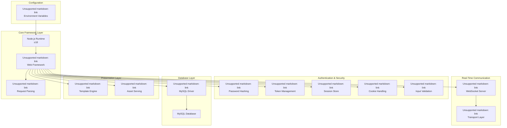
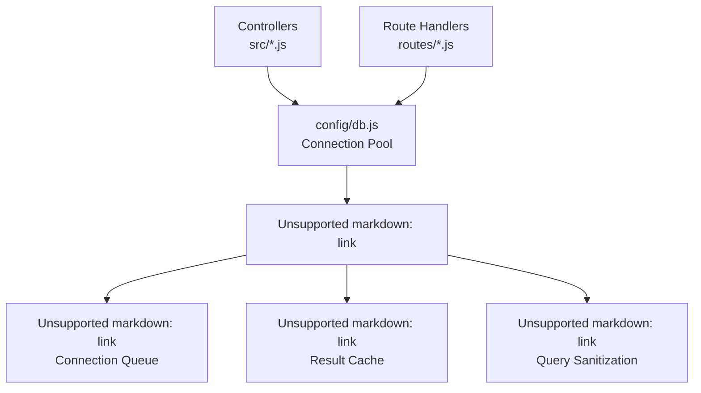
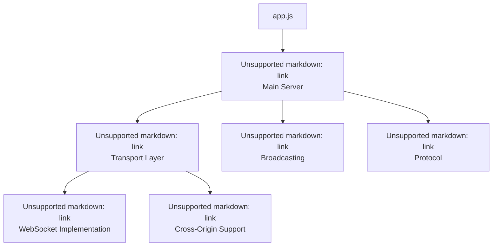
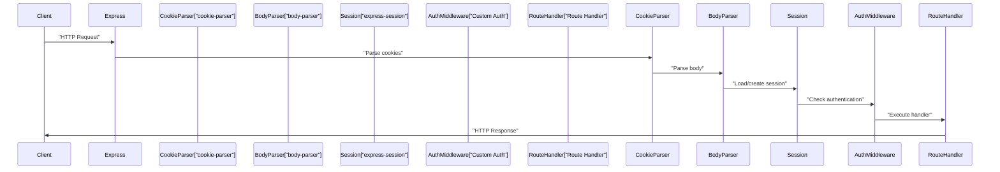

# Technology Stack

> **Relevant source files**
> * [package-lock.json](https://github.com/Lourdes12587/Week06/blob/ce0c3bcd/package-lock.json)
> * [package.json](https://github.com/Lourdes12587/Week06/blob/ce0c3bcd/package.json)

This document details the core technologies, frameworks, and libraries used in the course management application. It provides an overview of the dependency architecture, version specifications, and the role of each technology component in the system.

For information about how these technologies integrate in the application structure, see [Architecture Overview](/Lourdes12587/Week06/3-architecture-overview). For database-specific implementation details, see [Database Architecture](/Lourdes12587/Week06/3.3-database-architecture).

---

## Overview

The application is built on a modern Node.js stack with Express.js as the core web framework. The technology stack is organized into distinct functional layers: core framework, presentation layer, database connectivity, authentication/security, and real-time communication capabilities.



**Sources:** [package.json L1-L26](https://github.com/Lourdes12587/Week06/blob/ce0c3bcd/package.json#L1-L26)

 [package-lock.json L1-L1497](https://github.com/Lourdes12587/Week06/blob/ce0c3bcd/package-lock.json#L1-L1497)

---

## Core Framework Technologies

### Express.js 5.1.0

Express serves as the primary web application framework, handling HTTP routing, middleware processing, and request/response management. The application uses Express 5.1.0, which requires Node.js version 18 or higher.

**Key Dependencies:**

* `body-parser@2.2.0` - Parses incoming request bodies (JSON, URL-encoded)
* `cookie@0.7.2` - Cookie parsing and serialization
* `router@2.2.0` - Advanced routing capabilities
* `finalhandler@2.1.0` - Final request handler

**Express Configuration Points:**

* Route mounting in [app.js](https://github.com/Lourdes12587/Week06/blob/ce0c3bcd/app.js)
* Middleware chain setup
* Error handling configuration
* Static file serving

**Sources:** [package.json L19](https://github.com/Lourdes12587/Week06/blob/ce0c3bcd/package.json#L19-L19)

 [package-lock.json L470-L510](https://github.com/Lourdes12587/Week06/blob/ce0c3bcd/package-lock.json#L470-L510)

### EJS 3.1.10

Embedded JavaScript (EJS) provides server-side template rendering with support for partials and dynamic content injection.

**Template Locations:**

* Views directory: `views/*.ejs`
* Partial templates for reusable components
* Dynamic data binding from controllers

**EJS Dependencies:**

* `jake@10.9.4` - Build automation tool

**Sources:** [package.json L18](https://github.com/Lourdes12587/Week06/blob/ce0c3bcd/package.json#L18-L18)

 [package-lock.json L326-L339](https://github.com/Lourdes12587/Week06/blob/ce0c3bcd/package-lock.json#L326-L339)

---

## Database Technology

### MySQL2 Driver 3.14.3

The `mysql2` package provides MySQL database connectivity with Promise support, prepared statements, and connection pooling capabilities.

**MySQL2 Features Used:**

* Connection pooling for efficient resource management
* Parameterized queries for SQL injection prevention
* Async/await support for modern JavaScript patterns

**Core Dependencies:**

| Dependency | Version | Purpose |
| --- | --- | --- |
| `denque` | 2.1.0 | Queue data structure for connection pool |
| `iconv-lite` | 0.6.3 | Character encoding conversion |
| `named-placeholders` | 1.1.3 | Named parameter binding |
| `sqlstring` | 2.3.3 | SQL string escaping |
| `lru-cache` | 7.18.3 | Query result caching |

**Database Configuration:**

* Connection pool managed in [config/db.js](https://github.com/Lourdes12587/Week06/blob/ce0c3bcd/config/db.js)
* Environment variables loaded via `dotenv`



**Sources:** [package.json L23](https://github.com/Lourdes12587/Week06/blob/ce0c3bcd/package.json#L23-L23)

 [package-lock.json L936-L954](https://github.com/Lourdes12587/Week06/blob/ce0c3bcd/package-lock.json#L936-L954)

---

## Authentication & Security Stack

The application implements a multi-layered security architecture combining password hashing, session management, JWT tokens, and input validation.

### Security Technology Matrix

| Technology | Version | Security Function | Usage Context |
| --- | --- | --- | --- |
| `bcryptjs` | 3.0.2 | Password hashing with salt | User registration, login verification |
| `jsonwebtoken` | 9.0.2 | JWT generation/verification | Stateless authentication tokens |
| `express-session` | 1.18.2 | Server-side session storage | User session persistence |
| `cookie-parser` | 1.4.7 | Cookie extraction/parsing | Session cookie handling |
| `express-validator` | 7.2.1 | Input sanitization | Form validation, XSS prevention |
| `cookie-session` | 2.1.1 | Cookie-based sessions | Alternative session storage |

### bcryptjs 3.0.2

Implements bcrypt password hashing algorithm in pure JavaScript with no native dependencies.

**Key Features:**

* Automatic salt generation
* Configurable cost factor
* Synchronous and asynchronous API

**Implementation Points:**

* Password hashing during registration in [routes/auth.js](https://github.com/Lourdes12587/Week06/blob/ce0c3bcd/routes/auth.js)
* Password comparison during login
* No plaintext password storage

**Sources:** [package.json L14](https://github.com/Lourdes12587/Week06/blob/ce0c3bcd/package.json#L14-L14)

 [package-lock.json L84-L91](https://github.com/Lourdes12587/Week06/blob/ce0c3bcd/package-lock.json#L84-L91)

### jsonwebtoken 9.0.2

Provides JSON Web Token (JWT) implementation for stateless authentication.

**JWT Dependencies:**

* `jws@3.2.2` - JSON Web Signature implementation
* `jwa@1.4.2` - JSON Web Algorithms
* `semver@7.7.2` - Semantic versioning for token compatibility

**Token Structure:**

* Header: Algorithm and token type
* Payload: User claims (id, role)
* Signature: HMAC-SHA256 verification

**Sources:** [package.json L22](https://github.com/Lourdes12587/Week06/blob/ce0c3bcd/package.json#L22-L22)

 [package-lock.json L756-L776](https://github.com/Lourdes12587/Week06/blob/ce0c3bcd/package-lock.json#L756-L776)

### express-session 1.18.2

Manages server-side session storage with cookie-based session identification.

**Session Configuration:**

* Secret key from environment variables
* Cookie settings (httpOnly, secure, maxAge)
* Session store (memory-based by default)

**Session Dependencies:**

* `uid-safe@2.1.5` - Cryptographically secure session ID generation
* `cookie-signature@1.0.7` - Cookie signing for tamper detection

**Sources:** [package.json L20](https://github.com/Lourdes12587/Week06/blob/ce0c3bcd/package.json#L20-L20)

 [package-lock.json L511-L528](https://github.com/Lourdes12587/Week06/blob/ce0c3bcd/package-lock.json#L511-L528)

### express-validator 7.2.1

Provides middleware for validating and sanitizing request data.

**Validation Capabilities:**

* Email format validation
* String length constraints
* Custom validation rules
* Automatic error message generation

**Core Dependency:**

* `validator@13.12.0` - Validation and sanitization functions
* `lodash@4.17.21` - Utility functions

**Sources:** [package.json L21](https://github.com/Lourdes12587/Week06/blob/ce0c3bcd/package.json#L21-L21)

 [package-lock.json L547-L558](https://github.com/Lourdes12587/Week06/blob/ce0c3bcd/package-lock.json#L547-L558)

---

## Real-Time Communication Layer

### Socket.IO 4.8.1

Provides bidirectional, event-based communication between browser and server using WebSockets as the primary transport with fallback options.

**Socket.IO Architecture:**



**Transport Options:**

1. WebSocket (primary)
2. HTTP long-polling (fallback)

**Key Dependencies:**

| Package | Version | Purpose |
| --- | --- | --- |
| `engine.io` | 6.6.4 | Low-level transport abstraction |
| `socket.io-adapter` | 2.5.5 | Multi-server broadcasting |
| `socket.io-parser` | 4.2.4 | Message encoding/decoding |
| `ws` | 8.17.1 | WebSocket client/server |
| `cors` | 2.8.5 | CORS policy management |

**Sources:** [package.json L24](https://github.com/Lourdes12587/Week06/blob/ce0c3bcd/package.json#L24-L24)

 [package-lock.json L1260-L1276](https://github.com/Lourdes12587/Week06/blob/ce0c3bcd/package-lock.json#L1260-L1276)

---

## Configuration Management

### dotenv 17.2.1

Loads environment variables from `.env` file into `process.env`, separating configuration from code.

**Environment Variables Managed:**

* Database credentials (host, user, password, database)
* Server port configuration
* Session secret keys
* JWT secret keys
* Environment mode (development/production)

**Usage Pattern:**

```javascript
require('dotenv').config()
```

Called at application startup in [app.js](https://github.com/Lourdes12587/Week06/blob/ce0c3bcd/app.js)

 before any configuration-dependent code.

**Sources:** [package.json L17](https://github.com/Lourdes12587/Week06/blob/ce0c3bcd/package.json#L17-L17)

 [package-lock.json L289-L299](https://github.com/Lourdes12587/Week06/blob/ce0c3bcd/package-lock.json#L289-L299)

---

## Middleware Dependencies

The application relies on several middleware packages for request processing:

| Middleware | Version | Function | Position in Stack |
| --- | --- | --- | --- |
| `cookie-parser` | 1.4.7 | Parse Cookie header | Early middleware |
| `body-parser` | 2.2.0 | Parse request body | Early middleware |
| `express-session` | 1.18.2 | Session management | After cookie-parser |
| `express-validator` | 7.2.1 | Input validation | Route-specific |
| Custom auth middleware | N/A | Role-based access | Route-specific |



**Sources:** [package.json L13-L25](https://github.com/Lourdes12587/Week06/blob/ce0c3bcd/package.json#L13-L25)

 [package-lock.json L1-L1497](https://github.com/Lourdes12587/Week06/blob/ce0c3bcd/package-lock.json#L1-L1497)

---

## Version Compatibility Matrix

### Node.js Version Requirements

| Package | Minimum Node.js | Recommended | Notes |
| --- | --- | --- | --- |
| `express` | 18 | 18+ | Express 5.x requirement |
| `mysql2` | 8.0 | 12+ | Promise support from 8+ |
| `jsonwebtoken` | 12 | 14+ | Native crypto APIs |
| `socket.io` | 10.2.0 | 14+ | EventEmitter3 compatibility |
| `body-parser` | 18 | 18+ | Aligned with Express 5 |
| `express-validator` | 8.0.0 | 12+ | Async validation support |

**Application Requirement:** Node.js ≥18.0.0

**Sources:** [package-lock.json L470-L510](https://github.com/Lourdes12587/Week06/blob/ce0c3bcd/package-lock.json#L470-L510)

 [package-lock.json L936-L954](https://github.com/Lourdes12587/Week06/blob/ce0c3bcd/package-lock.json#L936-L954)

---

## Build and Runtime Dependencies

### Development vs Production

All dependencies in this project are production dependencies (listed in `dependencies`, not `devDependencies`). This includes:

**Runtime Required:**

* All framework and library packages
* Database drivers
* Authentication libraries
* Template engines

**Build-Time Utilities:**

* `jake@10.9.4` (bundled with EJS for template compilation)
* No separate build step required

**Sources:** [package.json L13-L25](https://github.com/Lourdes12587/Week06/blob/ce0c3bcd/package.json#L13-L25)

---

## Dependency Graph Overview

```mermaid
flowchart TD

App["app.js<br>Main Application"]
Express["Unsupported markdown: link"]
EJS["Unsupported markdown: link"]
MySQL2["Unsupported markdown: link"]
BCrypt["Unsupported markdown: link"]
JWT["Unsupported markdown: link"]
Session["Unsupported markdown: link"]
Validator["Unsupported markdown: link"]
SocketIO["Unsupported markdown: link"]
DotEnv["Unsupported markdown: link"]
CookieParser["Unsupported markdown: link"]
BodyParser["Unsupported markdown: link"]
Router["Unsupported markdown: link"]
ServeStatic["Unsupported markdown: link"]
CookieSig["Unsupported markdown: link"]
UIDSafe["Unsupported markdown: link"]
Denque["Unsupported markdown: link"]
SQLString["Unsupported markdown: link"]
JWS["Unsupported markdown: link"]
Semver["Unsupported markdown: link"]
EngineIO["Unsupported markdown: link"]
Adapter["Unsupported markdown: link"]
ValidatorLib["Unsupported markdown: link"]
Lodash["Unsupported markdown: link"]

App --> Express
App --> EJS
App --> MySQL2
App --> BCrypt
App --> JWT
App --> Session
App --> Validator
App --> SocketIO
App --> DotEnv
App --> CookieParser
Express --> BodyParser
Express --> Router
Express --> ServeStatic
Session --> CookieSig
Session --> UIDSafe
MySQL2 --> Denque
MySQL2 --> SQLString
JWT --> JWS
JWT --> Semver
SocketIO --> EngineIO
SocketIO --> Adapter
Validator --> ValidatorLib
Validator --> Lodash
```



**Sources:** [package.json L1-L26](https://github.com/Lourdes12587/Week06/blob/ce0c3bcd/package.json#L1-L26)

 [package-lock.json L1-L1497](https://github.com/Lourdes12587/Week06/blob/ce0c3bcd/package-lock.json#L1-L1497)

---

## Summary

The application leverages a comprehensive technology stack centered around Express.js 5.1.0, with specialized packages for each functional requirement:

* **Framework:** Express.js with EJS templating
* **Database:** MySQL via mysql2 driver with connection pooling
* **Security:** Multi-layer approach (bcryptjs, JWT, sessions, validation)
* **Real-Time:** Socket.IO with WebSocket transport
* **Configuration:** Environment-based via dotenv

All packages are production dependencies with no separate build process required. The minimum Node.js version is 18, aligned with Express 5.x requirements.