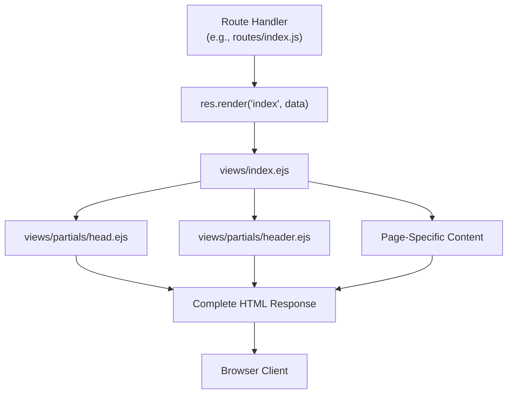

# Template System & Partials

> **Relevant source files**
> * [views/index.ejs](https://github.com/Lourdes12587/Week06/blob/ce0c3bcd/views/index.ejs)
> * [views/partials/head.ejs](https://github.com/Lourdes12587/Week06/blob/ce0c3bcd/views/partials/head.ejs)
> * [views/partials/header.ejs](https://github.com/Lourdes12587/Week06/blob/ce0c3bcd/views/partials/header.ejs)

## Purpose and Scope

This document explains the EJS templating system used throughout the application, focusing on the partial reuse strategy that ensures consistent UI structure across all pages. The system uses two shared partials (`head.ejs` and `header.ejs`) that are included in every view, providing consistent HTML structure, CSS dependencies, and navigation elements.

For information about specific page implementations that use these partials, see [Landing Page](/Lourdes12587/Week06/7.2-landing-page), [Authentication Views](/Lourdes12587/Week06/7.3-authentication-views), and [Course Views](/Lourdes12587/Week06/7.4-course-views). For the overall frontend architecture, see [Frontend Architecture](/Lourdes12587/Week06/7-frontend-architecture).

---

## EJS Templating Engine

The application uses **EJS (Embedded JavaScript)** version 3.1.10 as its templating engine. EJS is configured in the Express application at [app.js L11](https://github.com/Lourdes12587/Week06/blob/ce0c3bcd/app.js#L11-L11)

 where the view engine is set:

```
app.set('view engine', 'ejs')
```

EJS allows embedding JavaScript logic directly in HTML templates using special tags:

* `<% %>` - Control flow (conditionals, loops)
* `<%= %>` - Output escaped values
* `<%- %>` - Output unescaped values (used for including HTML partials)

**Sources:** app.js, package.json

---

## Partial System Overview

The application implements a modular template architecture using **two core partials** that are shared across all views:

| Partial File | Purpose | Location |
| --- | --- | --- |
| `head.ejs` | HTML document structure, meta tags, CSS dependencies | [views/partials/head.ejs L1-L9](https://github.com/Lourdes12587/Week06/blob/ce0c3bcd/views/partials/head.ejs#L1-L9) |
| `header.ejs` | Navigation menu, closing head tag, body tag | [views/partials/header.ejs L1-L26](https://github.com/Lourdes12587/Week06/blob/ce0c3bcd/views/partials/header.ejs#L1-L26) |

Every EJS template in the application follows this composition pattern:

```
<%- include('partials/head') %>
<!-- Optional page-specific CSS -->
<%- include('partials/header') %>
<!-- Page-specific content -->
```

This pattern ensures consistent styling, navigation, and HTML structure without code duplication.

**Sources:** views/index.ejs, views/partials/head.ejs, views/partials/header.ejs

---

## Template Composition Architecture

**Diagram: EJS Partial Inclusion Flow**



**Sources:** views/index.ejs, views/partials/head.ejs, views/partials/header.ejs

---

## The head.ejs Partial

The `head.ejs` partial provides the foundational HTML structure and external dependencies for all pages.

**Diagram: head.ejs Dependency Structure**

```mermaid
flowchart TD

HeadEJS["views/partials/head.ejs"]
DOCTYPE[""]
HTMLTag[""]
HeadTag[""]
Charset["UTF-8 charset"]
Viewport["Responsive viewport"]
IndexCSS["index.css<br>/resources/css/index.css"]
Boxicons["Boxicons CDN<br>Icon Library"]
Bootstrap["Bootstrap 5.3.7 CDN<br>CSS Framework"]
Title[""]

HeadEJS --> DOCTYPE
HeadEJS --> HTMLTag
HeadEJS --> HeadTag
HeadEJS --> Charset
HeadEJS --> Viewport
HeadEJS --> IndexCSS
HeadEJS --> Boxicons
HeadEJS --> Bootstrap
HeadEJS --> Title

subgraph subGraph0 ["CSS Dependencies"]
    IndexCSS
    Boxicons
    Bootstrap
end
```

**Structure breakdown:**

* **Document type and language:** [views/partials/head.ejs L1-L2](https://github.com/Lourdes12587/Week06/blob/ce0c3bcd/views/partials/head.ejs#L1-L2)  defines HTML5 doctype with Spanish language
* **Meta tags:** [views/partials/head.ejs L4-L5](https://github.com/Lourdes12587/Week06/blob/ce0c3bcd/views/partials/head.ejs#L4-L5)  sets UTF-8 encoding and responsive viewport
* **Base stylesheet:** [views/partials/head.ejs L6](https://github.com/Lourdes12587/Week06/blob/ce0c3bcd/views/partials/head.ejs#L6-L6)  links the global `index.css` stylesheet
* **Boxicons:** [views/partials/head.ejs L7](https://github.com/Lourdes12587/Week06/blob/ce0c3bcd/views/partials/head.ejs#L7-L7)  includes the Boxicons icon font library
* **Bootstrap:** [views/partials/head.ejs L8](https://github.com/Lourdes12587/Week06/blob/ce0c3bcd/views/partials/head.ejs#L8-L8)  imports Bootstrap 5.3.7 for responsive grid and components
* **Title:** [views/partials/head.ejs L9](https://github.com/Lourdes12587/Week06/blob/ce0c3bcd/views/partials/head.ejs#L9-L9)  sets the page title to "THOT"

Note that the `<head>` tag is **not closed** in this partial—it remains open to allow individual templates to inject page-specific CSS before the header partial closes it.

**Sources:** views/partials/head.ejs

---

## The header.ejs Partial

The `header.ejs` partial closes the head section and provides navigation.

**Structure:**

```python
</head>          ← Closes head tag from head.ejs
<body>           ← Opens body tag
  <nav>          ← Navigation bar
    ...
  </nav>
  <script>       ← Menu toggle script
```

### Navigation Menu

The navigation bar at [views/partials/header.ejs L4-L18](https://github.com/Lourdes12587/Week06/blob/ce0c3bcd/views/partials/header.ejs#L4-L18)

 contains:

| Link | Route | Purpose |
| --- | --- | --- |
| Inicio | `/` | Landing page |
| Iniciar sesion | `/login` | Login page |
| Registrate | `/register` | Registration page |
| Mi perfil | `/perfil` | User profile (registered users) |
| Mi perfil (Admin) | `/admin/perfil` | Admin dashboard |
| Gestión de Cursos | `/courses` | Course listing/management |

### Responsive Menu Toggle

A mobile-responsive hamburger menu is implemented with:

* **HTML button:** [views/partials/header.ejs L6-L10](https://github.com/Lourdes12587/Week06/blob/ce0c3bcd/views/partials/header.ejs#L6-L10)  defines the three-bar menu icon
* **JavaScript function:** [views/partials/header.ejs L21-L24](https://github.com/Lourdes12587/Week06/blob/ce0c3bcd/views/partials/header.ejs#L21-L24)  toggles the `.active` class on click

The `toggleMenu()` function dynamically shows/hides navigation links on mobile devices by manipulating the `#navLinks` element's class list.

**Sources:** views/partials/header.ejs

---

## Page-Specific CSS Injection

Individual templates can inject additional CSS files between the two partials:

**Example from index.ejs:**

```
<%- include('partials/head') %>
<link rel="stylesheet" href="/resources/css/header.css">
<%- include('partials/header') %>
```

This pattern at [views/index.ejs L1-L3](https://github.com/Lourdes12587/Week06/blob/ce0c3bcd/views/index.ejs#L1-L3)

 demonstrates:

1. Include `head.ejs` (opens head tag)
2. Add page-specific CSS link (`header.css`)
3. Include `header.ejs` (closes head tag, opens body)

This architecture allows each page to:

* Inherit global styles from `index.css` (loaded in head.ejs)
* Add page-specific styles without modifying the shared partial
* Maintain consistent load order for CSS dependencies

**Sources:** views/index.ejs

---

## Data Passing to Views

**Diagram: Route to View Data Flow**

```mermaid
sequenceDiagram
  participant Route Handler
  participant res.render()
  participant EJS Engine
  participant EJS Template
  participant Browser

  Route Handler->>Route Handler: "Prepare data object"
  Route Handler->>res.render(): "res.render('index', {
  res.render()->>EJS Engine: nombre: value,
  EJS Engine->>EJS Template: login: bool,
  EJS Template->>EJS Template: name: string})"
  EJS Template->>EJS Template: "Process template with data"
  EJS Template->>EJS Engine: "Inject variables"
  EJS Engine->>Browser: "Evaluate <%= variable %>"
```

### Data Object Structure

Routes pass data to templates as JavaScript objects in the second parameter of `res.render()`:

```yaml
res.render('viewName', {
  nombre: 'Company Name',
  experiencia: 'Description',
  login: true,
  name: 'User Name'
})
```

These variables become available in the EJS template for:

* **Direct output:** `<%= nombre %>` displays the value
* **Conditional logic:** `<% if (login) { %>` controls rendering
* **Expressions:** `<%= name || 'Invitado' %>` provides fallbacks

**Sources:** views/index.ejs, routes/index.js (implied)

---

## Template Variable Usage Patterns

### Conditional Rendering

The `index.ejs` template demonstrates two common conditional patterns:

**Pattern 1: Display data if available** at [views/index.ejs L6-L9](https://github.com/Lourdes12587/Week06/blob/ce0c3bcd/views/index.ejs#L6-L9)

:

```html
<% if (nombre) { %>
  <h1>SOMOS <%= nombre %></h1>
  <p>Es más que una experiencia, <%= experiencia %></p>
<% } %>
```

**Pattern 2: Authenticated vs. Guest UI** at [views/index.ejs L13-L21](https://github.com/Lourdes12587/Week06/blob/ce0c3bcd/views/index.ejs#L13-L21)

:

```xml
<% if (login) { %>
  <h3>Usuario Conectado: <strong><%= name %></strong></h3>
  <form action="/logout" method="POST">
    <button type="submit" class="btn btn-primary mt-3">Cerrar sesión</button>
  </form>
<% } else { %>
  <h3>Bienvenido, <strong><%= name || 'Invitado' %></strong></h3>
  <a href="/login" class="btn btn-primary mt-3">Iniciar Sesion</a>
<% } %>
```

### Variable Escaping

EJS provides two output syntaxes:

| Syntax | Purpose | Example |
| --- | --- | --- |
| `<%= variable %>` | **Escaped output** - Safe for user input, prevents XSS | `<%= name %>` |
| `<%- variable %>` | **Unescaped output** - For HTML content | `<%- include('partial') %>` |

The escaped syntax (`<%= %>`) is used for all user-provided data to prevent cross-site scripting (XSS) attacks.

**Sources:** views/index.ejs

---

## Template Composition Best Practices

**Summary of patterns used in the codebase:**

1. **Consistent partial inclusion order:** * Always include `head.ejs` first * Add page-specific CSS * Include `header.ejs` second * Add page content
2. **Data object conventions:** * Pass authentication state as boolean (`login`) * Provide user name for personalization (`name`) * Include fallback values in template expressions
3. **Separation of concerns:** * Global styles in `head.ejs` → `index.css` * Page-specific styles injected between partials * Navigation logic in `header.ejs` * Content logic in individual templates
4. **Security practices:** * Use `<%= %>` for user data (escaped) * Use `<%- %>` only for trusted HTML (partials)

**Sources:** views/index.ejs, views/partials/head.ejs, views/partials/header.ejs

---

## Code Entity Reference

**Key files and their roles:**

| File Path | Purpose | Key Lines |
| --- | --- | --- |
| `views/partials/head.ejs` | HTML structure, CSS dependencies | [1-9](https://github.com/Lourdes12587/Week06/blob/ce0c3bcd/1-9) |
| `views/partials/header.ejs` | Navigation bar, menu toggle | [1-26](https://github.com/Lourdes12587/Week06/blob/ce0c3bcd/1-26) |
| `views/index.ejs` | Example of partial usage | [1-3](https://github.com/Lourdes12587/Week06/blob/ce0c3bcd/1-3) <br>  for includes, [6-21](https://github.com/Lourdes12587/Week06/blob/ce0c3bcd/6-21) <br>  for data usage |
| `app.js` | EJS view engine configuration | [11](https://github.com/Lourdes12587/Week06/blob/ce0c3bcd/11) |

**Template inclusion syntax:**

```
<%- include('partials/head') %>
<%- include('partials/header') %>
```

**Data output syntax:**

```
<%= escapedVariable %>      <!-- Safe output -->
<%- unescapedHTML %>         <!-- Trusted HTML -->
<% if (condition) { %>       <!-- Control flow -->
```

**Sources:** views/partials/head.ejs, views/partials/header.ejs, views/index.ejs, app.js