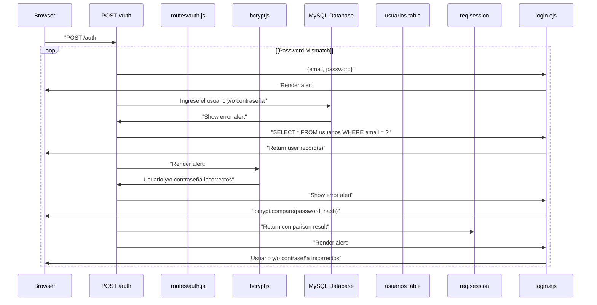
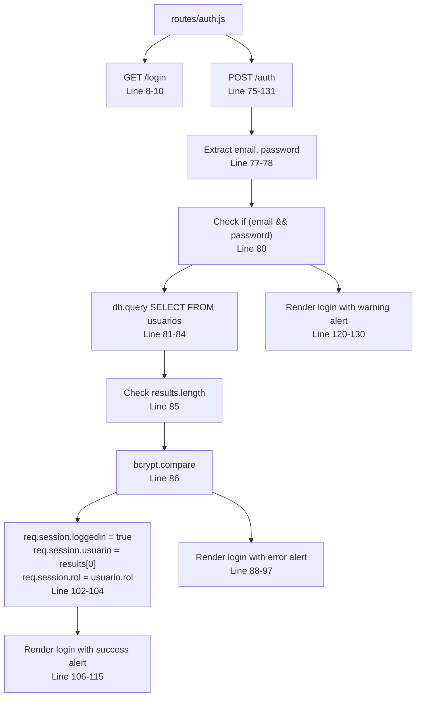
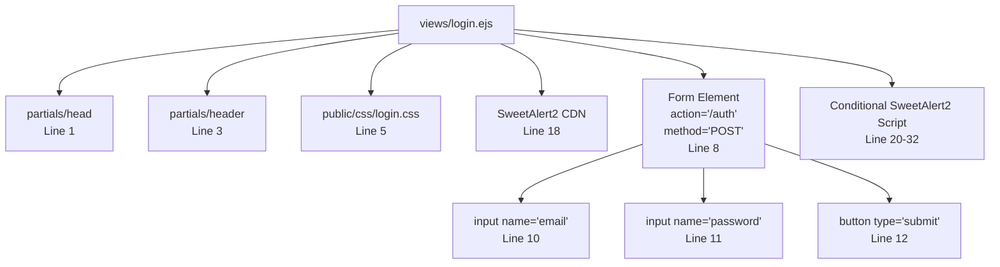

# User Login

> **Relevant source files**
> * [public/css/login.css](https://github.com/Lourdes12587/Week06/blob/ce0c3bcd/public/css/login.css)
> * [routes/auth.js](https://github.com/Lourdes12587/Week06/blob/ce0c3bcd/routes/auth.js)
> * [views/login.ejs](https://github.com/Lourdes12587/Week06/blob/ce0c3bcd/views/login.ejs)

## Purpose and Scope

This document details the user login functionality, covering the authentication process where existing users provide credentials and gain access to the system. The login process includes credential validation, password verification using bcrypt, session creation, and role-based response handling.

For information about creating new user accounts, see [User Registration](/Lourdes12587/Week06/4.1-user-registration). For details about how roles control access to protected routes, see [Role-Based Access Control](/Lourdes12587/Week06/4.3-role-based-access-control). For session storage and management, see [Session Management](/Lourdes12587/Week06/4.4-session-management).

---

## Login Form Presentation

The login form is rendered at the `/login` endpoint, providing a simple interface for credential submission.

### Route Handler

The GET `/login` route is defined in [routes/auth.js L8-L10](https://github.com/Lourdes12587/Week06/blob/ce0c3bcd/routes/auth.js#L8-L10)

 and renders the login view without any additional data:

```
GET /login → renders views/login.ejs
```

### Form Structure

The login form in [views/login.ejs L8-L13](https://github.com/Lourdes12587/Week06/blob/ce0c3bcd/views/login.ejs#L8-L13)

 contains two input fields and submits via POST to `/auth`:

| Field | Type | Name | Placeholder |
| --- | --- | --- | --- |
| Email/Username | text | `email` | "Ingrese su Usuario" |
| Password | password | `password` | "Ingrese su contraseña" |
| Submit Button | submit | - | "Ingresar" |

The form uses the `login-container` class and is wrapped in an `auth-wrapper` for consistent styling. A registration link is provided below the form at [views/login.ejs L14-L16](https://github.com/Lourdes12587/Week06/blob/ce0c3bcd/views/login.ejs#L14-L16)

**Sources:** [views/login.ejs L1-L34](https://github.com/Lourdes12587/Week06/blob/ce0c3bcd/views/login.ejs#L1-L34)

 [routes/auth.js L8-L10](https://github.com/Lourdes12587/Week06/blob/ce0c3bcd/routes/auth.js#L8-L10)

---

## Authentication Flow

### Authentication Flow Diagram



**Sources:** [routes/auth.js L75-L131](https://github.com/Lourdes12587/Week06/blob/ce0c3bcd/routes/auth.js#L75-L131)

### Request Processing

The POST `/auth` endpoint in [routes/auth.js L75-L131](https://github.com/Lourdes12587/Week06/blob/ce0c3bcd/routes/auth.js#L75-L131)

 handles authentication. The process begins by extracting credentials from the request body:

```javascript
const email = req.body.email;
const password = req.body.password;
```

**Sources:** [routes/auth.js L77-L78](https://github.com/Lourdes12587/Week06/blob/ce0c3bcd/routes/auth.js#L77-L78)

### Credential Validation

The handler first checks if both email and password are provided [routes/auth.js L80](https://github.com/Lourdes12587/Week06/blob/ce0c3bcd/routes/auth.js#L80-L80)

 If either is missing, an error alert is rendered.

### Database Query

When credentials are present, the system queries the `usuarios` table [routes/auth.js L81-L84](https://github.com/Lourdes12587/Week06/blob/ce0c3bcd/routes/auth.js#L81-L84)

:

```sql
SELECT * FROM usuarios WHERE email = ?
```

The email parameter is passed as an array to prevent SQL injection: `[email]`.

**Sources:** [routes/auth.js L81-L84](https://github.com/Lourdes12587/Week06/blob/ce0c3bcd/routes/auth.js#L81-L84)

### Password Verification

Password verification occurs in [routes/auth.js L85-L87](https://github.com/Lourdes12587/Week06/blob/ce0c3bcd/routes/auth.js#L85-L87)

 using bcrypt's asynchronous compare function:

```
await bcrypt.compare(password, results[0].password)
```

The system checks two conditions:

1. Whether any user records were returned (`results.length == 0`)
2. Whether the provided password matches the stored hash

If either check fails, authentication is denied.

**Sources:** [routes/auth.js L85-L87](https://github.com/Lourdes12587/Week06/blob/ce0c3bcd/routes/auth.js#L85-L87)

### Session Initialization

Upon successful authentication [routes/auth.js L98-L104](https://github.com/Lourdes12587/Week06/blob/ce0c3bcd/routes/auth.js#L98-L104)

 the system establishes a session by setting three session variables:

| Session Variable | Source | Purpose |
| --- | --- | --- |
| `req.session.loggedin` | `true` | Indicates authenticated state |
| `req.session.usuario` | `results[0]` | Stores complete user record |
| `req.session.rol` | `usuario.rol` | Stores user role for access control |

This session data persists across requests and is used by authentication middleware throughout the application.

**Sources:** [routes/auth.js L100-L104](https://github.com/Lourdes12587/Week06/blob/ce0c3bcd/routes/auth.js#L100-L104)

---

## Response Handling with SweetAlert2

### Alert Configuration

The login process uses SweetAlert2 for user feedback. All responses render the `login.ejs` template with an `alert` object containing these properties:

| Property | Type | Purpose |
| --- | --- | --- |
| `alert` | boolean | Triggers SweetAlert2 script execution |
| `alertTitle` | string | Alert dialog title |
| `alertMessage` | string | Alert dialog message text |
| `alertIcon` | string | Icon type (success/error/warning) |
| `showConfirmButton` | boolean | Whether to show confirm button |
| `timer` | number/false | Auto-close timer in milliseconds |
| `ruta` | string | Redirect path after alert |

**Sources:** [views/login.ejs L20-L32](https://github.com/Lourdes12587/Week06/blob/ce0c3bcd/views/login.ejs#L20-L32)

 [routes/auth.js L88-L97](https://github.com/Lourdes12587/Week06/blob/ce0c3bcd/routes/auth.js#L88-L97)

 [routes/auth.js L106-L115](https://github.com/Lourdes12587/Week06/blob/ce0c3bcd/routes/auth.js#L106-L115)

### Alert Scenarios

#### Missing Credentials

[routes/auth.js L120-L130](https://github.com/Lourdes12587/Week06/blob/ce0c3bcd/routes/auth.js#L120-L130)

 - When email or password is not provided:

* **Title:** "Advertencia"
* **Message:** "Ingrese el usuario y/o contraseña"
* **Icon:** error
* **Confirm Button:** Shown
* **Timer:** No auto-close
* **Redirect:** None (stays on login page)

#### Invalid Credentials

[routes/auth.js L88-L97](https://github.com/Lourdes12587/Week06/blob/ce0c3bcd/routes/auth.js#L88-L97)

 - When email not found or password doesn't match:

* **Title:** "Error"
* **Message:** "Usuario y/o contraseña incorrectos"
* **Icon:** error
* **Confirm Button:** Shown
* **Timer:** No auto-close
* **Redirect:** Stays on `/login`

#### Successful Authentication

[routes/auth.js L106-L115](https://github.com/Lourdes12587/Week06/blob/ce0c3bcd/routes/auth.js#L106-L115)

 - When credentials are valid:

* **Title:** "Conexion exitosa"
* **Message:** "Has iniciado sesión correctamente"
* **Icon:** success
* **Confirm Button:** Hidden
* **Timer:** 1500ms (1.5 seconds)
* **Redirect:** Root path `/`

### SweetAlert2 Implementation

The alert script in [views/login.ejs L20-L32](https://github.com/Lourdes12587/Week06/blob/ce0c3bcd/views/login.ejs#L20-L32)

 executes when the `alert` variable is defined:

```javascript
Swal.fire({
  title: '<%= alertTitle %>',
  text: '<%= alertMessage %>',
  icon: '<%= alertIcon %>',
  showConfirmButton: <%= showConfirmButton %>,
  timer: <%= timer %>
}).then(() => {
  window.location = '/<%= ruta %>'
})
```

The `.then()` callback redirects the user after the alert is dismissed or the timer expires.

**Sources:** [views/login.ejs L18-L32](https://github.com/Lourdes12587/Week06/blob/ce0c3bcd/views/login.ejs#L18-L32)

---

## Login Page Styling

The login page uses dedicated styles defined in [public/css/login.css](https://github.com/Lourdes12587/Week06/blob/ce0c3bcd/public/css/login.css)

 Key styling features include:

### Layout Structure

| Element | Class | Styling |
| --- | --- | --- |
| Page Background | `body` | Gradient background (135deg, #74ebd5 to #9face6), flexbox centering |
| Form Container | `.auth-wrapper` | White background, 2.5rem padding, 15px border-radius, box shadow |
| Login Form | `.login-container` | Flexbox column layout, full width |

### Form Elements

* **Input Fields** [public/css/login.css L35-L47](https://github.com/Lourdes12587/Week06/blob/ce0c3bcd/public/css/login.css#L35-L47)  - 0.75rem vertical padding, 1rem horizontal padding, 8px border-radius, focus state with #74ebd5 border color
* **Submit Button** [public/css/login.css L49-L62](https://github.com/Lourdes12587/Week06/blob/ce0c3bcd/public/css/login.css#L49-L62)  - Blue background (#4a6cf7), white text, hover effect darkens to #3f5cd8
* **Register Link** [public/css/login.css L74-L83](https://github.com/Lourdes12587/Week06/blob/ce0c3bcd/public/css/login.css#L74-L83)  - Blue text (#4a6cf7) matching button color, bold font weight, hover darkening effect

**Sources:** [public/css/login.css L1-L83](https://github.com/Lourdes12587/Week06/blob/ce0c3bcd/public/css/login.css#L1-L83)

---

## Code Entity Reference

### Authentication Route Handler



**Sources:** [routes/auth.js L8-L131](https://github.com/Lourdes12587/Week06/blob/ce0c3bcd/routes/auth.js#L8-L131)

### Template and View Integration



**Sources:** [views/login.ejs L1-L34](https://github.com/Lourdes12587/Week06/blob/ce0c3bcd/views/login.ejs#L1-L34)

---

## Security Considerations

### Password Comparison

The authentication process uses bcrypt's asynchronous `compare` function [routes/auth.js L86](https://github.com/Lourdes12587/Week06/blob/ce0c3bcd/routes/auth.js#L86-L86)

 rather than plain text comparison. This ensures:

* Timing-safe comparison resistant to timing attacks
* Proper handling of bcrypt's salt verification
* Asynchronous operation preventing blocking

### SQL Injection Prevention

The database query uses parameterized queries [routes/auth.js L82-L83](https://github.com/Lourdes12587/Week06/blob/ce0c3bcd/routes/auth.js#L82-L83)

:

```sql
db.query("SELECT * FROM usuarios WHERE email = ?", [email], ...)
```

The `?` placeholder with parameter array prevents SQL injection by properly escaping user input.

### Session Security

Session data is stored server-side with only a session ID cookie sent to the client. The session includes:

* Full user object access via `req.session.usuario`
* Role information in `req.session.rol` for authorization checks
* Authentication flag in `req.session.loggedin`

For detailed session configuration and security settings, see [Session Management](/Lourdes12587/Week06/4.4-session-management).

**Sources:** [routes/auth.js L75-L131](https://github.com/Lourdes12587/Week06/blob/ce0c3bcd/routes/auth.js#L75-L131)

---

## Integration Points

The login functionality integrates with several other system components:

| Component | Integration Point | Purpose |
| --- | --- | --- |
| Database | `config/db` module | Queries `usuarios` table for credential verification |
| Session | `req.session` object | Stores authentication state and user data |
| Registration | `/register` link | Allows new users to create accounts |
| Authorization | Session variables | Provides data for role-based middleware (see [Role-Based Access Control](/Lourdes12587/Week06/4.3-role-based-access-control)) |
| Home Page | Redirect on success | Returns users to root path after successful login |

**Sources:** [routes/auth.js L4](https://github.com/Lourdes12587/Week06/blob/ce0c3bcd/routes/auth.js#L4-L4)

 [routes/auth.js L102-L104](https://github.com/Lourdes12587/Week06/blob/ce0c3bcd/routes/auth.js#L102-L104)

 [views/login.ejs L15](https://github.com/Lourdes12587/Week06/blob/ce0c3bcd/views/login.ejs#L15-L15)