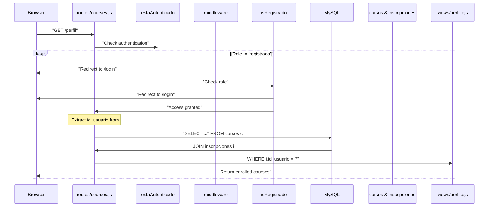
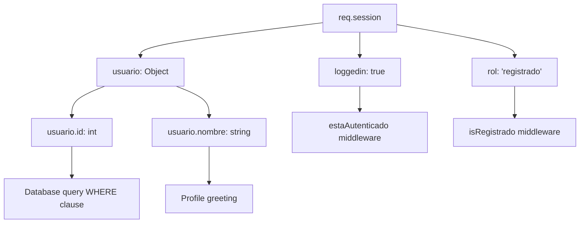
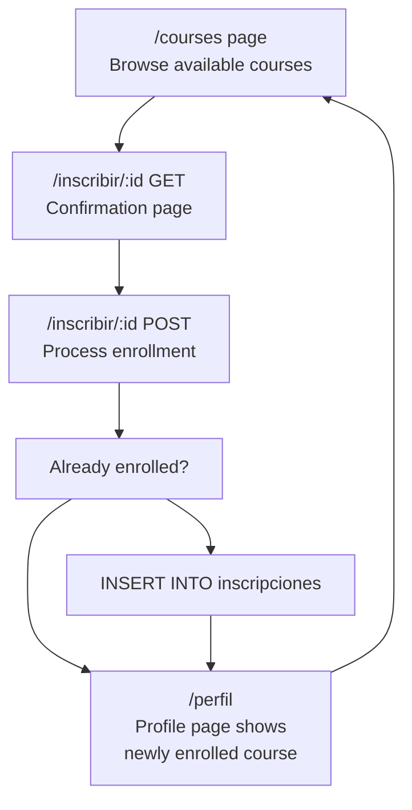

# User Profile Page

> **Relevant source files**
> * [public/css/perfil.css](https://github.com/Lourdes12587/Week06/blob/ce0c3bcd/public/css/perfil.css)
> * [routes/courses.js](https://github.com/Lourdes12587/Week06/blob/ce0c3bcd/routes/courses.js)
> * [views/perfil.ejs](https://github.com/Lourdes12587/Week06/blob/ce0c3bcd/views/perfil.ejs)

## Purpose and Scope

This document details the user profile page (`/perfil`) designed for registered users (`rol: 'registrado'`). This page displays a personalized dashboard showing all courses in which the user is currently enrolled, retrieved through a database JOIN operation between the `cursos` and `inscripciones` tables.

This page is distinct from the administrator dashboard. For information about the admin-specific profile page, see [Administrator Dashboard](/Lourdes12587/Week06/6.2-administrator-dashboard). For details on the enrollment process that populates this profile, see [Course Enrollment](/Lourdes12587/Week06/5.4-course-enrollment).

**Sources:** [routes/courses.js L152-L169](https://github.com/Lourdes12587/Week06/blob/ce0c3bcd/routes/courses.js#L152-L169)

 [views/perfil.ejs L1-L35](https://github.com/Lourdes12587/Week06/blob/ce0c3bcd/views/perfil.ejs#L1-L35)

---

## Route Configuration

### Endpoint Definition

The user profile is accessible at the `/perfil` route and requires two layers of middleware protection:

| Property | Value |
| --- | --- |
| **HTTP Method** | GET |
| **Route Path** | `/perfil` |
| **Middleware Chain** | `estaAutenticado` → `isRegistrado` |
| **Handler Location** | [routes/courses.js L152-L169](https://github.com/Lourdes12587/Week06/blob/ce0c3bcd/routes/courses.js#L152-L169) |
| **View Template** | `views/perfil.ejs` |

The route definition uses two middleware functions in sequence:

* `estaAutenticado` [routes/courses.js L8-L14](https://github.com/Lourdes12587/Week06/blob/ce0c3bcd/routes/courses.js#L8-L14)  - Verifies the user has an active session
* `isRegistrado` [routes/courses.js L26-L33](https://github.com/Lourdes12587/Week06/blob/ce0c3bcd/routes/courses.js#L26-L33)  - Ensures the user has the 'registrado' role

Users with the 'admin' role cannot access this route directly; they are redirected to `/login` by the `isRegistrado` middleware. Administrators have their own dedicated profile at `/admin/perfil`.

**Sources:** [routes/courses.js L152-L169](https://github.com/Lourdes12587/Week06/blob/ce0c3bcd/routes/courses.js#L152-L169)

 [routes/courses.js L8-L14](https://github.com/Lourdes12587/Week06/blob/ce0c3bcd/routes/courses.js#L8-L14)

 [routes/courses.js L26-L33](https://github.com/Lourdes12587/Week06/blob/ce0c3bcd/routes/courses.js#L26-L33)

---

## Request Flow Architecture

### Profile Page Access Flow



**Sources:** [routes/courses.js L152-L169](https://github.com/Lourdes12587/Week06/blob/ce0c3bcd/routes/courses.js#L152-L169)

 [routes/courses.js L8-L14](https://github.com/Lourdes12587/Week06/blob/ce0c3bcd/routes/courses.js#L8-L14)

 [routes/courses.js L26-L33](https://github.com/Lourdes12587/Week06/blob/ce0c3bcd/routes/courses.js#L26-L33)

---

## Database Query Structure

### Enrolled Courses Retrieval

The profile page executes a SQL JOIN query to fetch all courses in which the authenticated user is enrolled:

```sql
SELECT c.* 
FROM cursos c
JOIN inscripciones i ON c.id = i.id_curso
WHERE i.id_usuario = ?
```

This query is defined at [routes/courses.js L155-L160](https://github.com/Lourdes12587/Week06/blob/ce0c3bcd/routes/courses.js#L155-L160)

 and uses the user's ID from the session object (`req.session.usuario.id`).

### Query Components

| Component | Purpose | Source |
| --- | --- | --- |
| `SELECT c.*` | Retrieves all columns from the cursos table | All course fields (titulo, descripcion, categoria, visibilidad) |
| `JOIN inscripciones i` | Links courses to enrollments | Matches on `c.id = i.id_curso` |
| `WHERE i.id_usuario = ?` | Filters to current user's enrollments | Parameterized with `idUsuario` from session |

The query results are passed to the view as the `cursos` array [routes/courses.js L162](https://github.com/Lourdes12587/Week06/blob/ce0c3bcd/routes/courses.js#L162-L162)

**Sources:** [routes/courses.js L155-L160](https://github.com/Lourdes12587/Week06/blob/ce0c3bcd/routes/courses.js#L155-L160)

---

## Database Entity Relationships

### Profile Data Model

```css
#mermaid-odltm9l0ddp{font-family:ui-sans-serif,-apple-system,system-ui,Segoe UI,Helvetica;font-size:16px;fill:#333;}@keyframes edge-animation-frame{from{stroke-dashoffset:0;}}@keyframes dash{to{stroke-dashoffset:0;}}#mermaid-odltm9l0ddp .edge-animation-slow{stroke-dasharray:9,5!important;stroke-dashoffset:900;animation:dash 50s linear infinite;stroke-linecap:round;}#mermaid-odltm9l0ddp .edge-animation-fast{stroke-dasharray:9,5!important;stroke-dashoffset:900;animation:dash 20s linear infinite;stroke-linecap:round;}#mermaid-odltm9l0ddp .error-icon{fill:#dddddd;}#mermaid-odltm9l0ddp .error-text{fill:#222222;stroke:#222222;}#mermaid-odltm9l0ddp .edge-thickness-normal{stroke-width:1px;}#mermaid-odltm9l0ddp .edge-thickness-thick{stroke-width:3.5px;}#mermaid-odltm9l0ddp .edge-pattern-solid{stroke-dasharray:0;}#mermaid-odltm9l0ddp .edge-thickness-invisible{stroke-width:0;fill:none;}#mermaid-odltm9l0ddp .edge-pattern-dashed{stroke-dasharray:3;}#mermaid-odltm9l0ddp .edge-pattern-dotted{stroke-dasharray:2;}#mermaid-odltm9l0ddp .marker{fill:#999;stroke:#999;}#mermaid-odltm9l0ddp .marker.cross{stroke:#999;}#mermaid-odltm9l0ddp svg{font-family:ui-sans-serif,-apple-system,system-ui,Segoe UI,Helvetica;font-size:16px;}#mermaid-odltm9l0ddp p{margin:0;}#mermaid-odltm9l0ddp .entityBox{fill:#ffffff;stroke:#dddddd;}#mermaid-odltm9l0ddp .relationshipLabelBox{fill:#dddddd;opacity:0.7;background-color:#dddddd;}#mermaid-odltm9l0ddp .relationshipLabelBox rect{opacity:0.5;}#mermaid-odltm9l0ddp .labelBkg{background-color:rgba(221, 221, 221, 0.5);}#mermaid-odltm9l0ddp .edgeLabel .label{fill:#dddddd;font-size:14px;}#mermaid-odltm9l0ddp .label{font-family:ui-sans-serif,-apple-system,system-ui,Segoe UI,Helvetica;color:#333;}#mermaid-odltm9l0ddp .edge-pattern-dashed{stroke-dasharray:8,8;}#mermaid-odltm9l0ddp .node rect,#mermaid-odltm9l0ddp .node circle,#mermaid-odltm9l0ddp .node ellipse,#mermaid-odltm9l0ddp .node polygon{fill:#ffffff;stroke:#dddddd;stroke-width:1px;}#mermaid-odltm9l0ddp .relationshipLine{stroke:#999;stroke-width:1;fill:none;}#mermaid-odltm9l0ddp .marker{fill:none!important;stroke:#999!important;stroke-width:1;}#mermaid-odltm9l0ddp :root{--mermaid-font-family:"trebuchet ms",verdana,arial,sans-serif;}enrolls inhas enrollmentsusuariosintidPKvarcharnombrevarcharemailvarcharpasswordenumrolinscripcionesintid_usuarioFKintid_cursoFKcursosintidPKvarchartitulotextdescripcionvarcharcategoriavarcharvisibilidadnote_for_usuariosUser session provides idnote_for_inscripcionesJOIN table filters enrollmentsnote_for_cursosAll fields displayed in profile table
```

The profile page leverages the many-to-many relationship between `usuarios` and `cursos` through the `inscripciones` junction table. The JOIN query at [routes/courses.js L155-L160](https://github.com/Lourdes12587/Week06/blob/ce0c3bcd/routes/courses.js#L155-L160)

 traverses this relationship to retrieve only courses where an enrollment record exists for the authenticated user.

**Sources:** [routes/courses.js L155-L160](https://github.com/Lourdes12587/Week06/blob/ce0c3bcd/routes/courses.js#L155-L160)

---

## View Rendering

### Template Structure

The `perfil.ejs` template [views/perfil.ejs L1-L35](https://github.com/Lourdes12587/Week06/blob/ce0c3bcd/views/perfil.ejs#L1-L35)

 follows this structure:

```mermaid
flowchart TD

Include1["<%- include('partials/head') %>"]
Include2["<%- include('partials/header') %>"]
Container["Container div.container.mt-4"]
Greeting["Greeting: Hola, usuario.nombre"]
Heading["Heading: Tus cursos inscritos"]
Conditional["cursos.length === 0?"]
EmptyMsg["No estás inscrito..."]
Table[""]
TableHead["with Título, Categoría, Descripción"]
TableBody["iterating cursos.forEach"]
TableRow["for each curso"]
LinkBack["Ver todos los cursos"]

Include1 --> Include2
Include2 --> Container
Container --> Greeting
Greeting --> Heading
Heading --> Conditional
Conditional --> EmptyMsg
Conditional --> Table
Table --> TableHead
TableHead --> TableBody
TableBody --> TableRow
EmptyMsg --> LinkBack
Table --> LinkBack
```

**Sources:** [views/perfil.ejs L1-L35](https://github.com/Lourdes12587/Week06/blob/ce0c3bcd/views/perfil.ejs#L1-L35)

### Data Binding

The route handler passes the following data to the template [routes/courses.js L162-L167](https://github.com/Lourdes12587/Week06/blob/ce0c3bcd/routes/courses.js#L162-L167)

:

| Variable | Type | Source | Usage in Template |
| --- | --- | --- | --- |
| `cursos` | Array | Database query results | Iterated in table rows [views/perfil.ejs L21-L27](https://github.com/Lourdes12587/Week06/blob/ce0c3bcd/views/perfil.ejs#L21-L27) |
| `usuario` | Object | `req.session.usuario` | Displays name in greeting [views/perfil.ejs L6](https://github.com/Lourdes12587/Week06/blob/ce0c3bcd/views/perfil.ejs#L6-L6) |
| `rol` | String | `req.session.rol` | Available but not displayed |
| `msg` | String | `req.query.msg` | Optional query parameter for messages |

**Sources:** [routes/courses.js L162-L167](https://github.com/Lourdes12587/Week06/blob/ce0c3bcd/routes/courses.js#L162-L167)

 [views/perfil.ejs L6](https://github.com/Lourdes12587/Week06/blob/ce0c3bcd/views/perfil.ejs#L6-L6)

 [views/perfil.ejs L21-L27](https://github.com/Lourdes12587/Week06/blob/ce0c3bcd/views/perfil.ejs#L21-L27)

---

## User Interface Components

### Greeting Section

The profile begins with a personalized greeting that displays the user's name from the session:

```xml
<h2>Hola, <%= usuario.nombre %></h2>
<h4 class="mt-3">Tus cursos inscritos</h4>
```

This section is rendered at [views/perfil.ejs L6-L7](https://github.com/Lourdes12587/Week06/blob/ce0c3bcd/views/perfil.ejs#L6-L7)

### Empty State

When a user has no enrollments (`cursos.length === 0`), the template displays a message:

```html
<p>No estás inscrito en ningún curso todavía.</p>
```

This conditional rendering occurs at [views/perfil.ejs L9-L10](https://github.com/Lourdes12587/Week06/blob/ce0c3bcd/views/perfil.ejs#L9-L10)

### Course Table

For users with enrollments, courses are displayed in a Bootstrap-styled table:

| Column | Data Field | EJS Expression |
| --- | --- | --- |
| **Título** | Course title | `<%= curso.titulo %>` |
| **Categoría** | Course category | `<%= curso.categoria %>` |
| **Descripción** | Course description | `<%= curso.descripcion %>` |

The table structure is defined at [views/perfil.ejs L12-L29](https://github.com/Lourdes12587/Week06/blob/ce0c3bcd/views/perfil.ejs#L12-L29)

 and uses a `forEach` loop to iterate over the `cursos` array [views/perfil.ejs L21-L27](https://github.com/Lourdes12587/Week06/blob/ce0c3bcd/views/perfil.ejs#L21-L27)

### Navigation

A call-to-action button provides navigation back to the course listing:

```xml
<a href="/courses" class="btn btn-primary mt-3">Ver todos los cursos</a>
```

This link appears at [views/perfil.ejs L32](https://github.com/Lourdes12587/Week06/blob/ce0c3bcd/views/perfil.ejs#L32-L32)

 and allows users to discover additional courses for enrollment.

**Sources:** [views/perfil.ejs L6-L7](https://github.com/Lourdes12587/Week06/blob/ce0c3bcd/views/perfil.ejs#L6-L7)

 [views/perfil.ejs L9-L10](https://github.com/Lourdes12587/Week06/blob/ce0c3bcd/views/perfil.ejs#L9-L10)

 [views/perfil.ejs L12-L29](https://github.com/Lourdes12587/Week06/blob/ce0c3bcd/views/perfil.ejs#L12-L29)

 [views/perfil.ejs L32](https://github.com/Lourdes12587/Week06/blob/ce0c3bcd/views/perfil.ejs#L32-L32)

---

## Session Data Requirements

### Required Session Properties

The profile page depends on the following session properties populated during login:



The session object is established during the login process documented in [User Login](/Lourdes12587/Week06/4.2-user-login). The `usuario.id` property is critical for the database query [routes/courses.js L154](https://github.com/Lourdes12587/Week06/blob/ce0c3bcd/routes/courses.js#L154-L154)

 while `usuario.nombre` is used for the personalized greeting [views/perfil.ejs L6](https://github.com/Lourdes12587/Week06/blob/ce0c3bcd/views/perfil.ejs#L6-L6)

**Sources:** [routes/courses.js L154](https://github.com/Lourdes12587/Week06/blob/ce0c3bcd/routes/courses.js#L154-L154)

 [routes/courses.js L164](https://github.com/Lourdes12587/Week06/blob/ce0c3bcd/routes/courses.js#L164-L164)

 [views/perfil.ejs L6](https://github.com/Lourdes12587/Week06/blob/ce0c3bcd/views/perfil.ejs#L6-L6)

---

## Error Handling

### Authentication Failures

The middleware chain provides automatic redirection for authentication failures:

| Condition | Middleware | Action | Redirect Target |
| --- | --- | --- | --- |
| Session not active | `estaAutenticado` [routes/courses.js L8-L14](https://github.com/Lourdes12587/Week06/blob/ce0c3bcd/routes/courses.js#L8-L14) | Redirect | `/login` |
| Session exists but `loggedin` is false | `estaAutenticado` [routes/courses.js L8-L14](https://github.com/Lourdes12587/Week06/blob/ce0c3bcd/routes/courses.js#L8-L14) | Redirect | `/login` |
| User role is not 'registrado' | `isRegistrado` [routes/courses.js L26-L33](https://github.com/Lourdes12587/Week06/blob/ce0c3bcd/routes/courses.js#L26-L33) | Redirect | `/login` |

### Database Query Errors

The current implementation does not include explicit error handling for the database query at [routes/courses.js L161](https://github.com/Lourdes12587/Week06/blob/ce0c3bcd/routes/courses.js#L161-L161)

 If the query fails, the application will pass an undefined or error value to the view. Production implementations should add error handling:

```javascript
db.query(sql, [idUsuario], (err, results) => {
  if (err) {
    console.error(err);
    // Handle error appropriately
  }
  res.render("perfil", {
    cursos: results,
    usuario: req.session.usuario,
    rol: req.session.rol,
    msg: req.query.msg
  });
});
```

**Sources:** [routes/courses.js L161-L168](https://github.com/Lourdes12587/Week06/blob/ce0c3bcd/routes/courses.js#L161-L168)

 [routes/courses.js L8-L14](https://github.com/Lourdes12587/Week06/blob/ce0c3bcd/routes/courses.js#L8-L14)

 [routes/courses.js L26-L33](https://github.com/Lourdes12587/Week06/blob/ce0c3bcd/routes/courses.js#L26-L33)

---

## Navigation Patterns

### Post-Enrollment Redirect

The profile page serves as the destination for successful enrollments. The enrollment POST handler at [routes/courses.js L144](https://github.com/Lourdes12587/Week06/blob/ce0c3bcd/routes/courses.js#L144-L144)

 redirects to `/perfil` after inserting a new enrollment record. This pattern provides immediate visual feedback showing the newly enrolled course.

### Access Points

Users can reach the profile page through:

1. **Direct navigation** - Authenticated users with 'registrado' role can navigate directly to `/perfil`
2. **Post-enrollment redirect** - After successfully enrolling in a course [routes/courses.js L144](https://github.com/Lourdes12587/Week06/blob/ce0c3bcd/routes/courses.js#L144-L144)
3. **Duplicate enrollment redirect** - When attempting to enroll in an already-enrolled course [routes/courses.js L132](https://github.com/Lourdes12587/Week06/blob/ce0c3bcd/routes/courses.js#L132-L132)

The profile does not appear in the main navigation header but is typically accessed contextually after course-related actions.

**Sources:** [routes/courses.js L144](https://github.com/Lourdes12587/Week06/blob/ce0c3bcd/routes/courses.js#L144-L144)

 [routes/courses.js L132](https://github.com/Lourdes12587/Week06/blob/ce0c3bcd/routes/courses.js#L132-L132)

---

## Styling

### CSS File

The profile page has an associated stylesheet at `public/css/perfil.css`, though the file is currently empty [public/css/perfil.css L1](https://github.com/Lourdes12587/Week06/blob/ce0c3bcd/public/css/perfil.css#L1-L1)

 The page relies on:

* **Bootstrap classes** - `container`, `mt-4`, `mt-3`, `table`, `table-striped`, `btn`, `btn-primary`
* **Shared partials** - Common head and header styles from `views/partials/`

The table uses Bootstrap's `.table-striped` class for alternating row colors, improving readability when multiple courses are displayed.

**Sources:** [public/css/perfil.css L1](https://github.com/Lourdes12587/Week06/blob/ce0c3bcd/public/css/perfil.css#L1-L1)

 [views/perfil.ejs L12](https://github.com/Lourdes12587/Week06/blob/ce0c3bcd/views/perfil.ejs#L12-L12)

 [views/perfil.ejs L32](https://github.com/Lourdes12587/Week06/blob/ce0c3bcd/views/perfil.ejs#L32-L32)

---

## Integration with Course System

### Enrollment Workflow Integration



The profile page is the terminal destination in the enrollment workflow. After a user enrolls in a course through the POST handler at [routes/courses.js L117-L149](https://github.com/Lourdes12587/Week06/blob/ce0c3bcd/routes/courses.js#L117-L149)

 they are redirected to `/perfil` where the JOIN query immediately includes the newly enrolled course in the results.

This creates a seamless user experience where:

1. User browses courses at `/courses`
2. User confirms enrollment at `/inscribir/:id` (GET)
3. User submits enrollment at `/inscribir/:id` (POST)
4. System redirects to `/perfil` showing updated enrollment list
5. User can return to `/courses` via the button at [views/perfil.ejs L32](https://github.com/Lourdes12587/Week06/blob/ce0c3bcd/views/perfil.ejs#L32-L32)

**Sources:** [routes/courses.js L117-L149](https://github.com/Lourdes12587/Week06/blob/ce0c3bcd/routes/courses.js#L117-L149)

 [routes/courses.js L144](https://github.com/Lourdes12587/Week06/blob/ce0c3bcd/routes/courses.js#L144-L144)

 [views/perfil.ejs L32](https://github.com/Lourdes12587/Week06/blob/ce0c3bcd/views/perfil.ejs#L32-L32)