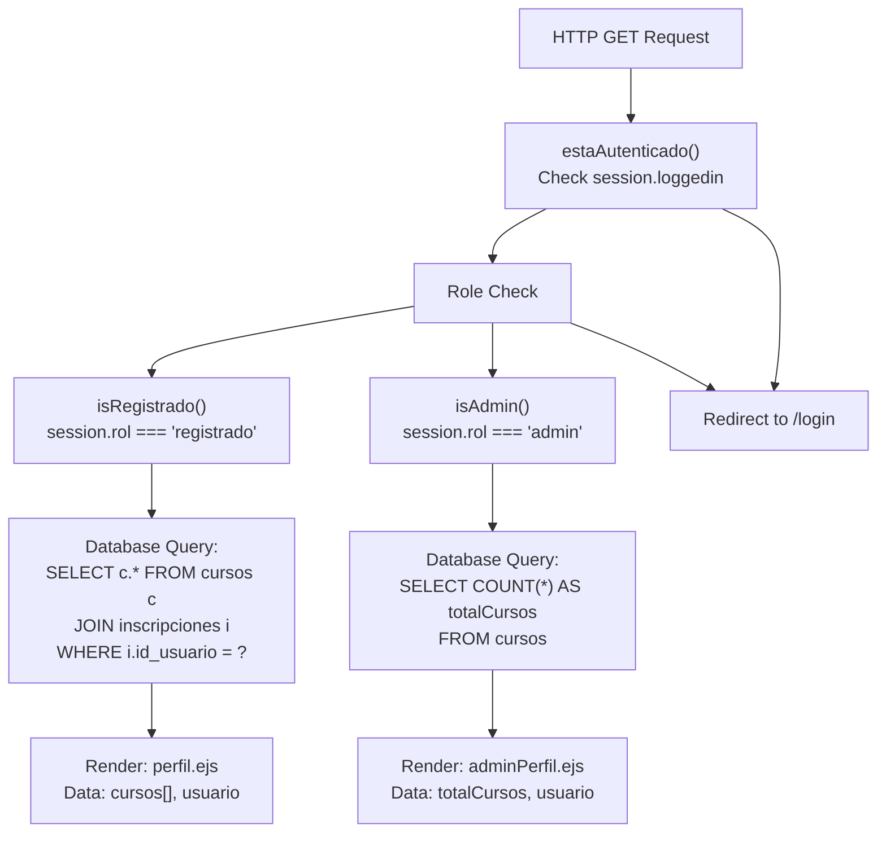
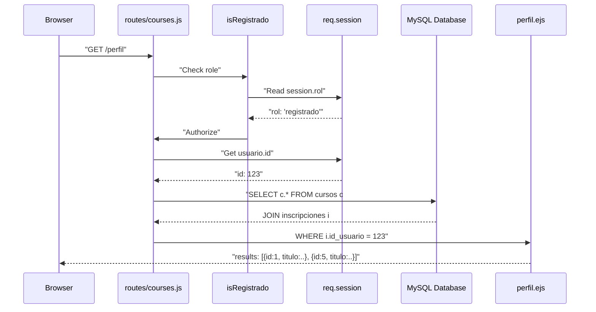
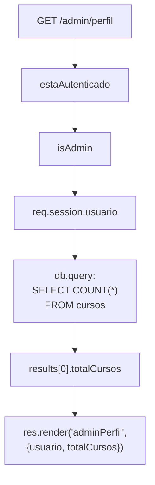
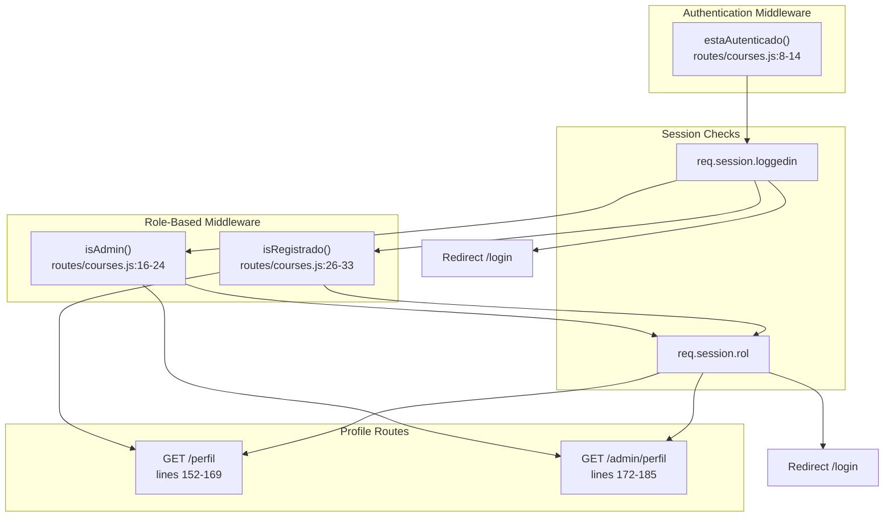
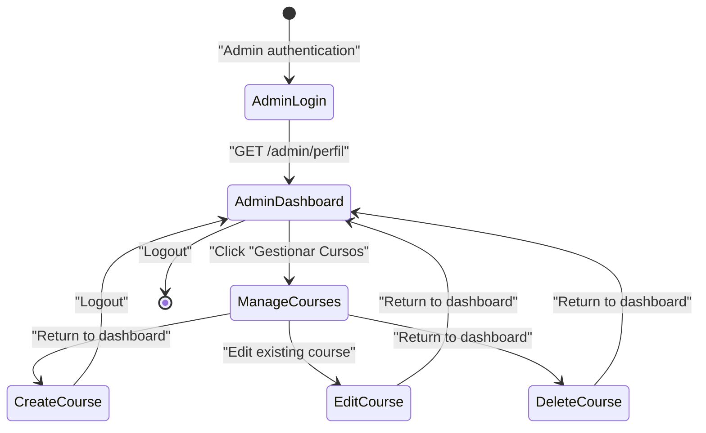

# User Profiles

> **Relevant source files**
> * [routes/courses.js](https://github.com/Lourdes12587/Week06/blob/ce0c3bcd/routes/courses.js)
> * [views/adminperfil.ejs](https://github.com/Lourdes12587/Week06/blob/ce0c3bcd/views/adminperfil.ejs)
> * [views/perfil.ejs](https://github.com/Lourdes12587/Week06/blob/ce0c3bcd/views/perfil.ejs)

## Purpose and Scope

This document describes the dual profile system implemented in the course management application. The system provides role-specific profile pages: a **user profile** for registered users displaying their enrolled courses, and an **administrator dashboard** for administrators showing system statistics and management capabilities.

The profile system is tightly integrated with the role-based access control mechanism. For information about user roles and authentication, see [Role-Based Access Control](/Lourdes12587/Week06/4.3-role-based-access-control). For details about the enrollment process that populates user profiles, see [Course Enrollment](/Lourdes12587/Week06/5.4-course-enrollment).

**Sources:** [routes/courses.js L152-L185](https://github.com/Lourdes12587/Week06/blob/ce0c3bcd/routes/courses.js#L152-L185)

---

## Profile System Architecture

The application implements two distinct profile endpoints based on user role:

| Endpoint | Role Required | Middleware | Purpose |
| --- | --- | --- | --- |
| `GET /perfil` | `registrado` | `estaAutenticado`, `isRegistrado` | Display user's enrolled courses |
| `GET /admin/perfil` | `admin` | `estaAutenticado`, `isAdmin` | Display system statistics and management links |

### Profile Route Flow



**Sources:** [routes/courses.js L8-L33](https://github.com/Lourdes12587/Week06/blob/ce0c3bcd/routes/courses.js#L8-L33)

 [routes/courses.js L152-L185](https://github.com/Lourdes12587/Week06/blob/ce0c3bcd/routes/courses.js#L152-L185)

---

## User Profile for Registered Users

The user profile at `GET /perfil` displays all courses in which the authenticated user is enrolled. This endpoint is protected by two middleware functions that verify authentication and role.

### Route Definition

The profile route is defined in [routes/courses.js L152-L169](https://github.com/Lourdes12587/Week06/blob/ce0c3bcd/routes/courses.js#L152-L169)

:

```yaml
GET /perfil
Middleware: estaAutenticado, isRegistrado
```

### Middleware Chain

| Function | Location | Purpose |
| --- | --- | --- |
| `estaAutenticado` | [routes/courses.js L8-L14](https://github.com/Lourdes12587/Week06/blob/ce0c3bcd/routes/courses.js#L8-L14) | Verifies `req.session.loggedin` is true |
| `isRegistrado` | [routes/courses.js L26-L33](https://github.com/Lourdes12587/Week06/blob/ce0c3bcd/routes/courses.js#L26-L33) | Verifies `req.session.rol === 'registrado'` |

If either middleware check fails, the user is redirected to `/login`.

### Database Query

The profile retrieves enrolled courses using a JOIN query [routes/courses.js L155-L160](https://github.com/Lourdes12587/Week06/blob/ce0c3bcd/routes/courses.js#L155-L160)

:

```sql
SELECT c.* 
FROM cursos c
JOIN inscripciones i ON c.id = i.id_curso
WHERE i.id_usuario = ?
```

This query:

* Joins the `cursos` table with `inscripciones` on course ID
* Filters by the current user's ID from `req.session.usuario.id`
* Returns all course fields for enrolled courses

### Profile Data Flow



**Sources:** [routes/courses.js L152-L169](https://github.com/Lourdes12587/Week06/blob/ce0c3bcd/routes/courses.js#L152-L169)

### View Rendering

The profile view [views/perfil.ejs](https://github.com/Lourdes12587/Week06/blob/ce0c3bcd/views/perfil.ejs)

 receives three data objects:

| Variable | Type | Description |
| --- | --- | --- |
| `cursos` | Array | List of enrolled course objects from database query |
| `usuario` | Object | Current user object from `req.session.usuario` |
| `rol` | String | User role from `req.session.rol` |

The view displays:

* User greeting with `usuario.nombre` [views/perfil.ejs L6](https://github.com/Lourdes12587/Week06/blob/ce0c3bcd/views/perfil.ejs#L6-L6)
* Empty state message if no enrollments [views/perfil.ejs L9-L10](https://github.com/Lourdes12587/Week06/blob/ce0c3bcd/views/perfil.ejs#L9-L10)
* Table of enrolled courses with columns: Título, Categoría, Descripción [views/perfil.ejs L12-L29](https://github.com/Lourdes12587/Week06/blob/ce0c3bcd/views/perfil.ejs#L12-L29)
* Link to view all courses [views/perfil.ejs L32](https://github.com/Lourdes12587/Week06/blob/ce0c3bcd/views/perfil.ejs#L32-L32)

**Sources:** [views/perfil.ejs L1-L35](https://github.com/Lourdes12587/Week06/blob/ce0c3bcd/views/perfil.ejs#L1-L35)

---

## Administrator Dashboard

The administrator dashboard at `GET /admin/perfil` provides system statistics and navigation for course management. This endpoint is restricted to users with the `admin` role.

### Route Definition

The admin profile route is defined in [routes/courses.js L172-L185](https://github.com/Lourdes12587/Week06/blob/ce0c3bcd/routes/courses.js#L172-L185)

:

```yaml
GET /admin/perfil
Middleware: estaAutenticado, isAdmin
```

### Middleware Chain

| Function | Location | Purpose |
| --- | --- | --- |
| `estaAutenticado` | [routes/courses.js L8-L14](https://github.com/Lourdes12587/Week06/blob/ce0c3bcd/routes/courses.js#L8-L14) | Verifies session is active |
| `isAdmin` | [routes/courses.js L16-L24](https://github.com/Lourdes12587/Week06/blob/ce0c3bcd/routes/courses.js#L16-L24) | Verifies `req.session.rol === 'admin'` |

Non-admin users attempting to access this route are redirected to `/login` [routes/courses.js L22](https://github.com/Lourdes12587/Week06/blob/ce0c3bcd/routes/courses.js#L22-L22)

### Statistics Query

The dashboard executes a COUNT query to retrieve system metrics [routes/courses.js L176](https://github.com/Lourdes12587/Week06/blob/ce0c3bcd/routes/courses.js#L176-L176)

:

```sql
SELECT COUNT(*) AS totalCursos FROM cursos
```

This query returns the total number of courses in the system, which is displayed on the dashboard.

### Admin Dashboard Data Flow



**Sources:** [routes/courses.js L172-L185](https://github.com/Lourdes12587/Week06/blob/ce0c3bcd/routes/courses.js#L172-L185)

### View Structure

The admin profile view [views/adminperfil.ejs](https://github.com/Lourdes12587/Week06/blob/ce0c3bcd/views/adminperfil.ejs)

 displays:

1. **Welcome Header**: Personalized greeting with `usuario.nombre` and "(Administrador)" label [views/adminperfil.ejs L6](https://github.com/Lourdes12587/Week06/blob/ce0c3bcd/views/adminperfil.ejs#L6-L6)
2. **Statistics**: Total course count from `totalCursos` variable [views/adminperfil.ejs L8](https://github.com/Lourdes12587/Week06/blob/ce0c3bcd/views/adminperfil.ejs#L8-L8)
3. **Navigation Menu**: Links to course management and home page [views/adminperfil.ejs L10-L21](https://github.com/Lourdes12587/Week06/blob/ce0c3bcd/views/adminperfil.ejs#L10-L21)

The navigation provides quick access to:

* `/courses` - Course listing and management interface
* `/` - Application home page

**Sources:** [views/adminperfil.ejs L1-L29](https://github.com/Lourdes12587/Week06/blob/ce0c3bcd/views/adminperfil.ejs#L1-L29)

---

## Access Control Implementation

Both profile endpoints implement strict access control through middleware functions. The system enforces a clear separation between user roles.

### Middleware Function Mapping



### Authorization Logic

**`estaAutenticado` Function** [routes/courses.js L8-L14](https://github.com/Lourdes12587/Week06/blob/ce0c3bcd/routes/courses.js#L8-L14)

:

* Checks if `req.session.loggedin` is truthy
* Calls `next()` if authenticated
* Redirects to `/login` if not authenticated

**`isRegistrado` Function** [routes/courses.js L26-L33](https://github.com/Lourdes12587/Week06/blob/ce0c3bcd/routes/courses.js#L26-L33)

:

* Verifies `req.session.loggedin && req.session.rol === 'registrado'`
* Calls `next()` if role matches
* Redirects to `/login` if role mismatch

**`isAdmin` Function** [routes/courses.js L16-L24](https://github.com/Lourdes12587/Week06/blob/ce0c3bcd/routes/courses.js#L16-L24)

:

* Verifies `req.session.loggedin && req.session.rol === 'admin'`
* Calls `next()` if role matches
* Redirects to `/login` if role mismatch

**Sources:** [routes/courses.js L8-L33](https://github.com/Lourdes12587/Week06/blob/ce0c3bcd/routes/courses.js#L8-L33)

---

## Profile Data Structures

### User Profile Response Data

The `GET /perfil` endpoint passes the following data structure to the view:

```yaml
{
  cursos: [
    {
      id: number,
      titulo: string,
      descripcion: string,
      categoria: string,
      visibilidad: string
    },
    // ... more courses
  ],
  usuario: {
    id: number,
    nombre: string,
    email: string,
    rol: 'registrado'
  },
  rol: 'registrado',
  msg: string | undefined  // Optional query parameter
}
```

**Sources:** [routes/courses.js L162-L167](https://github.com/Lourdes12587/Week06/blob/ce0c3bcd/routes/courses.js#L162-L167)

### Admin Profile Response Data

The `GET /admin/perfil` endpoint passes the following data structure to the view:

```python
{
  usuario: {
    id: number,
    nombre: string,
    email: string,
    rol: 'admin'
  },
  totalCursos: number  // COUNT(*) result from database
}
```

**Sources:** [routes/courses.js L183](https://github.com/Lourdes12587/Week06/blob/ce0c3bcd/routes/courses.js#L183-L183)

---

## Profile Interaction Patterns

### User Profile Workflow

```

```

After successful enrollment, users are redirected to `/perfil` [routes/courses.js L144](https://github.com/Lourdes12587/Week06/blob/ce0c3bcd/routes/courses.js#L144-L144)

 where they can view their updated course list. The profile serves as a confirmation page and central hub for managing enrolled courses.

**Sources:** [routes/courses.js L117-L149](https://github.com/Lourdes12587/Week06/blob/ce0c3bcd/routes/courses.js#L117-L149)

 [views/perfil.ejs L32](https://github.com/Lourdes12587/Week06/blob/ce0c3bcd/views/perfil.ejs#L32-L32)

### Admin Profile Workflow



The admin dashboard provides navigation to the course management interface at `/courses` [views/adminperfil.ejs L18](https://github.com/Lourdes12587/Week06/blob/ce0c3bcd/views/adminperfil.ejs#L18-L18)

 where administrators can perform CRUD operations on courses.

**Sources:** [views/adminperfil.ejs L10-L21](https://github.com/Lourdes12587/Week06/blob/ce0c3bcd/views/adminperfil.ejs#L10-L21)

---

## Error Handling

Both profile routes implement basic error handling for database operations:

### User Profile Error Handling

When the enrollment query fails in `GET /perfil` [routes/courses.js L161](https://github.com/Lourdes12587/Week06/blob/ce0c3bcd/routes/courses.js#L161-L161)

 the route handler does not explicitly handle the error, relying on implicit error handling. If the query succeeds but returns no results, the view displays an empty state message [views/perfil.ejs L9-L10](https://github.com/Lourdes12587/Week06/blob/ce0c3bcd/views/perfil.ejs#L9-L10)

### Admin Profile Error Handling

The admin profile includes explicit error handling for the statistics query [routes/courses.js L177-L180](https://github.com/Lourdes12587/Week06/blob/ce0c3bcd/routes/courses.js#L177-L180)

:

```
if (err) {
  console.error(err);
  return res.render("adminPerfil", { usuario, totalCursos: 0 });
}
```

On database error, the view is rendered with `totalCursos: 0` as a fallback value, preventing complete page failure.

**Sources:** [routes/courses.js L161-L168](https://github.com/Lourdes12587/Week06/blob/ce0c3bcd/routes/courses.js#L161-L168)

 [routes/courses.js L177-L180](https://github.com/Lourdes12587/Week06/blob/ce0c3bcd/routes/courses.js#L177-L180)

---

## Session Dependencies

Both profile endpoints depend on session data populated during the login process:

| Session Property | Set During | Used By |
| --- | --- | --- |
| `req.session.loggedin` | Login [routes/auth.js] | `estaAutenticado` middleware |
| `req.session.rol` | Login [routes/auth.js] | `isRegistrado`, `isAdmin` middleware |
| `req.session.usuario` | Login [routes/auth.js] | Profile views for user data |
| `req.session.usuario.id` | Login [routes/auth.js] | Enrollment queries |

The profile system assumes these session properties are properly initialized during authentication. For details on session initialization, see [User Login](/Lourdes12587/Week06/4.2-user-login).

**Sources:** [routes/courses.js L154](https://github.com/Lourdes12587/Week06/blob/ce0c3bcd/routes/courses.js#L154-L154)

 [routes/courses.js L164-L165](https://github.com/Lourdes12587/Week06/blob/ce0c3bcd/routes/courses.js#L164-L165)

 [routes/courses.js L173](https://github.com/Lourdes12587/Week06/blob/ce0c3bcd/routes/courses.js#L173-L173)