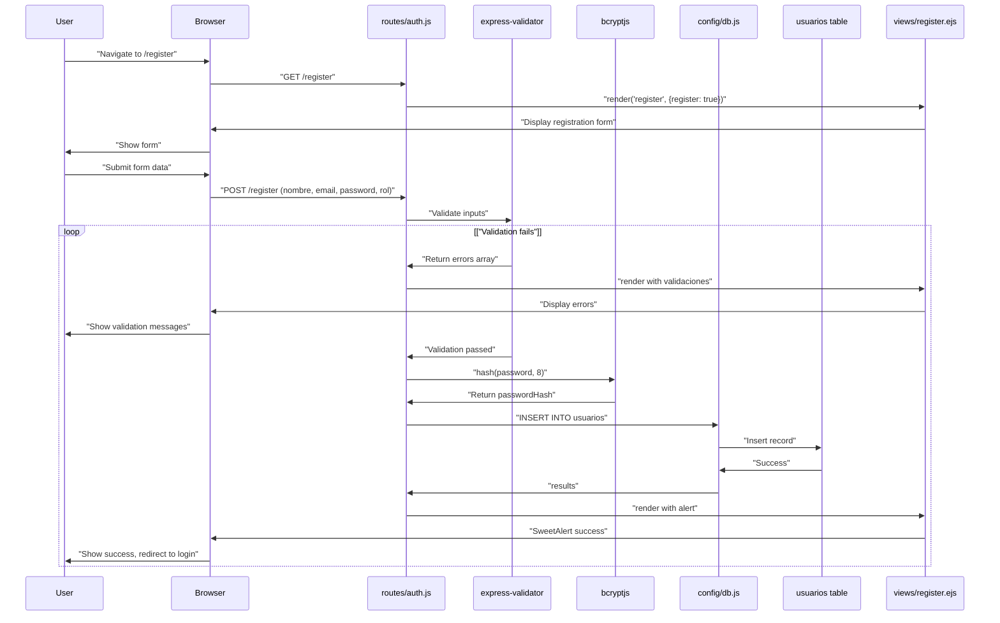
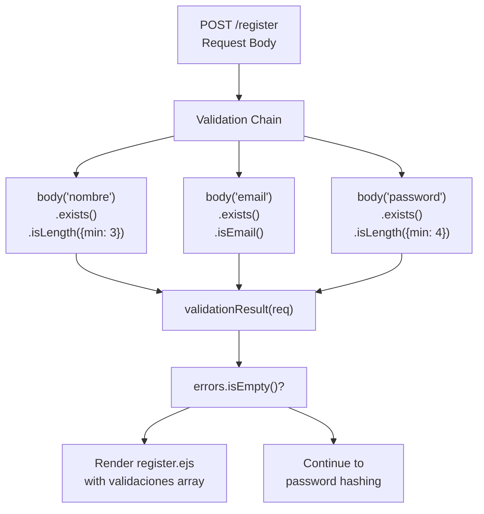
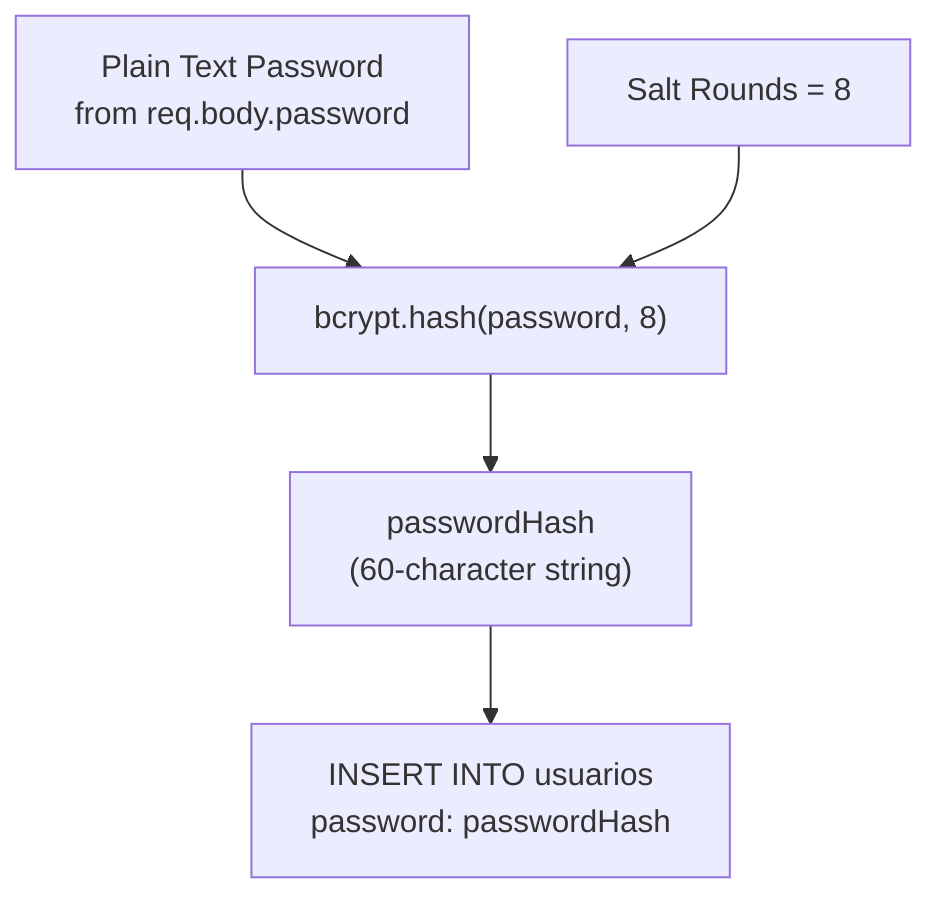
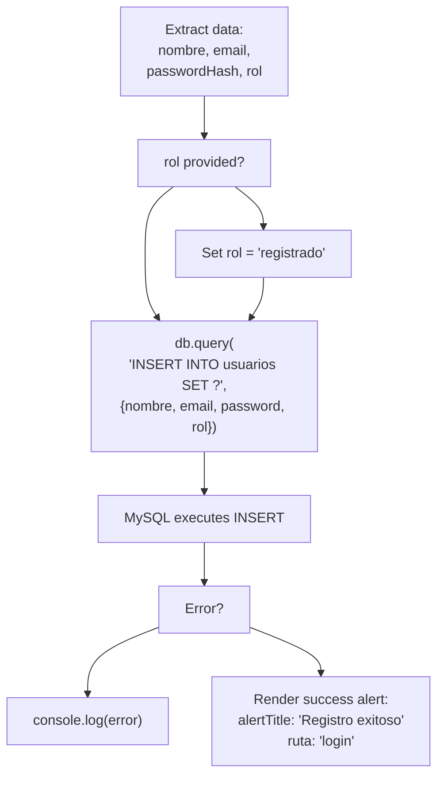
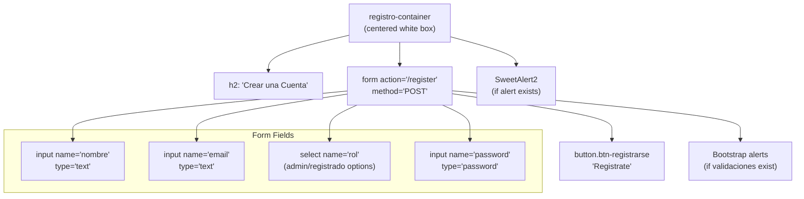

# User Registration

> **Relevant source files**
> * [public/css/register.css](https://github.com/Lourdes12587/Week06/blob/ce0c3bcd/public/css/register.css)
> * [routes/auth.js](https://github.com/Lourdes12587/Week06/blob/ce0c3bcd/routes/auth.js)
> * [views/register.ejs](https://github.com/Lourdes12587/Week06/blob/ce0c3bcd/views/register.ejs)

## Purpose and Scope

This document describes the user registration system, covering the registration workflow from form submission through account creation. It details the validation rules, password hashing process, database insertion, and role assignment mechanisms. For information about the login process after registration, see [User Login](/Lourdes12587/Week06/4.2-user-login). For details on role-based permissions, see [Role-Based Access Control](/Lourdes12587/Week06/4.3-role-based-access-control).

---

## Registration Flow Overview

The registration process follows a two-step workflow: form display and form submission with validation.

### Registration Sequence Diagram



**Sources:** [routes/auth.js L12-L72](https://github.com/Lourdes12587/Week06/blob/ce0c3bcd/routes/auth.js#L12-L72)

 [views/register.ejs L9-L71](https://github.com/Lourdes12587/Week06/blob/ce0c3bcd/views/register.ejs#L9-L71)

---

## Routes and Endpoints

The registration system exposes two HTTP endpoints in the `auth` router.

### Endpoint Specifications

| Method | Route | Purpose | Middleware | Response |
| --- | --- | --- | --- | --- |
| GET | `/register` | Display registration form | None | Renders `register.ejs` with `register: true` |
| POST | `/register` | Process registration | `express-validator` validation chain | Renders `register.ejs` with success/error feedback |

### GET /register

Displays the registration form to the user.

```javascript
router.get('/register', (req, res) => {
  res.render('register', { register: true});
});
```

[routes/auth.js L12-L14](https://github.com/Lourdes12587/Week06/blob/ce0c3bcd/routes/auth.js#L12-L14)

The `register: true` flag is passed to the view to ensure the form is displayed.

### POST /register

Processes the registration form submission with validation middleware.

**Request Body Parameters:**

| Field | Type | Required | Validation |
| --- | --- | --- | --- |
| `nombre` | String | Yes | Minimum 3 characters |
| `email` | String | Yes | Valid email format |
| `password` | String | Yes | Minimum 4 characters |
| `rol` | String | No | Defaults to `'registrado'` if not provided |

**Sources:** [routes/auth.js L8-L14](https://github.com/Lourdes12587/Week06/blob/ce0c3bcd/routes/auth.js#L8-L14)

 [routes/auth.js L17-L72](https://github.com/Lourdes12587/Week06/blob/ce0c3bcd/routes/auth.js#L17-L72)

---

## Input Validation

The registration endpoint uses `express-validator` to enforce data quality rules before processing.

### Validation Chain Architecture



### Validation Rules Implementation

The validation chain is defined as middleware before the route handler:

```

```

[routes/auth.js L17-L33](https://github.com/Lourdes12587/Week06/blob/ce0c3bcd/routes/auth.js#L17-L33)

### Error Handling

When validation fails, errors are passed to the view:

```

```

[routes/auth.js L35-L40](https://github.com/Lourdes12587/Week06/blob/ce0c3bcd/routes/auth.js#L35-L40)

The `validaciones` array contains error objects, and `valores` preserves user input for form repopulation.

**Sources:** [routes/auth.js L17-L41](https://github.com/Lourdes12587/Week06/blob/ce0c3bcd/routes/auth.js#L17-L41)

---

## Password Security

Passwords are hashed using `bcryptjs` with a salt round of 8 before storage.

### Hashing Process



### Implementation

```

```

[routes/auth.js L43-L44](https://github.com/Lourdes12587/Week06/blob/ce0c3bcd/routes/auth.js#L43-L44)

The hash function is asynchronous and returns a promise. The salt round value of 8 provides a balance between security and performance for password hashing operations.

**Sources:** [routes/auth.js L43-L44](https://github.com/Lourdes12587/Week06/blob/ce0c3bcd/routes/auth.js#L43-L44)

---

## Database Operations

Registration data is inserted into the `usuarios` table using a parameterized query to prevent SQL injection.

### Database Insertion Flow



### Insertion Query

```

```

[routes/auth.js L46-L69](https://github.com/Lourdes12587/Week06/blob/ce0c3bcd/routes/auth.js#L46-L69)

### Default Role Assignment

If the `rol` field is not provided or is empty, it defaults to `'registrado'` using the logical OR operator:

```

```

[routes/auth.js L52](https://github.com/Lourdes12587/Week06/blob/ce0c3bcd/routes/auth.js#L52-L52)

This ensures all users have at least basic registered user privileges. For details on role capabilities, see [Role-Based Access Control](/Lourdes12587/Week06/4.3-role-based-access-control).

**Sources:** [routes/auth.js L46-L72](https://github.com/Lourdes12587/Week06/blob/ce0c3bcd/routes/auth.js#L46-L72)

---

## User Interface

The registration form is rendered by `register.ejs` with conditional display logic for validation errors and success alerts.

### Form Structure



### Form Implementation

The form conditionally displays based on the `register` flag or presence of `validaciones`:

```

```

[views/register.ejs L9-L55](https://github.com/Lourdes12587/Week06/blob/ce0c3bcd/views/register.ejs#L9-L55)

### Role Selection Field

The form includes a dropdown for role selection:

```

```

[views/register.ejs L26-L32](https://github.com/Lourdes12587/Week06/blob/ce0c3bcd/views/register.ejs#L26-L32)

Note: In a production system, this field should not be exposed to public users. Role assignment should be handled server-side or restricted to admin-only workflows.

### Value Preservation

On validation failure, form fields repopulate with submitted values:

```

```

[views/register.ejs L16-L17](https://github.com/Lourdes12587/Week06/blob/ce0c3bcd/views/register.ejs#L16-L17)

**Sources:** [views/register.ejs L9-L55](https://github.com/Lourdes12587/Week06/blob/ce0c3bcd/views/register.ejs#L9-L55)

---

## Validation Error Display

Validation errors are displayed using Bootstrap dismissible alerts.

### Error Rendering Logic

```

```

[views/register.ejs L42-L52](https://github.com/Lourdes12587/Week06/blob/ce0c3bcd/views/register.ejs#L42-L52)

Each validation error from `express-validator` is rendered as a separate Bootstrap alert with the error message from the `.withMessage()` method.

**Sources:** [views/register.ejs L42-L52](https://github.com/Lourdes12587/Week06/blob/ce0c3bcd/views/register.ejs#L42-L52)

---

## Success Feedback

Upon successful registration, SweetAlert2 displays a modal and redirects to the login page.

### SweetAlert Configuration

The route handler passes alert configuration to the view:

```

```

[routes/auth.js L58-L66](https://github.com/Lourdes12587/Week06/blob/ce0c3bcd/routes/auth.js#L58-L66)

### Alert Rendering

The view conditionally renders a SweetAlert script block:

```

```

[views/register.ejs L59-L71](https://github.com/Lourdes12587/Week06/blob/ce0c3bcd/views/register.ejs#L59-L71)

The alert automatically closes after 2500ms and redirects to `/login` for the user to sign in with their new credentials.

**Sources:** [routes/auth.js L58-L66](https://github.com/Lourdes12587/Week06/blob/ce0c3bcd/routes/auth.js#L58-L66)

 [views/register.ejs L59-L71](https://github.com/Lourdes12587/Week06/blob/ce0c3bcd/views/register.ejs#L59-L71)

---

## Styling and Layout

The registration page uses a centered card layout with gradient background.

### Visual Design Specifications

| Component | Style Properties |
| --- | --- |
| Body | Gradient background: `linear-gradient(120deg, #3b82f6, #6366f1)` |
| Container | White background, 15px border radius, 400px max-width |
| Inputs | 8px border radius, focus state with blue border (`#3b82f6`) |
| Submit Button | Full width, blue background (`#3b82f6`), 8px border radius |

The CSS is defined in [public/css/register.css L1-L87](https://github.com/Lourdes12587/Week06/blob/ce0c3bcd/public/css/register.css#L1-L87)

 and provides:

* Flexbox centering for vertical and horizontal alignment
* Responsive design with max-width constraints
* Hover and focus states for interactive elements
* Consistent spacing using margin and padding utilities

**Sources:** [public/css/register.css L1-L87](https://github.com/Lourdes12587/Week06/blob/ce0c3bcd/public/css/register.css#L1-L87)

---

## Security Considerations

### Password Storage

* Passwords are never stored in plain text
* `bcryptjs` hash function with 8 salt rounds
* Hashed passwords are 60-character strings stored in the database

### SQL Injection Prevention

* Parameterized queries using `db.query("INSERT INTO usuarios SET ?", {...})`
* No direct string concatenation of user input

### Input Validation

* Server-side validation with `express-validator`
* Client-side HTML5 validation (implicit via input types)
* Error messages do not expose system internals

**Sources:** [routes/auth.js L43-L44](https://github.com/Lourdes12587/Week06/blob/ce0c3bcd/routes/auth.js#L43-L44)

 [routes/auth.js L46-L49](https://github.com/Lourdes12587/Week06/blob/ce0c3bcd/routes/auth.js#L46-L49)

---

## Integration Points

The registration system integrates with:

* **Session Management** ([Session Management](/Lourdes12587/Week06/4.4-session-management)): After registration, users must login to create a session
* **Login System** ([User Login](/Lourdes12587/Week06/4.2-user-login)): Successful registration redirects to `/login`
* **Database Layer** ([Database Architecture](/Lourdes12587/Week06/3.3-database-architecture)): Inserts into `usuarios` table
* **Role-Based Access** ([Role-Based Access Control](/Lourdes12587/Week06/4.3-role-based-access-control)): Assigns default `registrado` role

**Sources:** [routes/auth.js L12-L72](https://github.com/Lourdes12587/Week06/blob/ce0c3bcd/routes/auth.js#L12-L72)